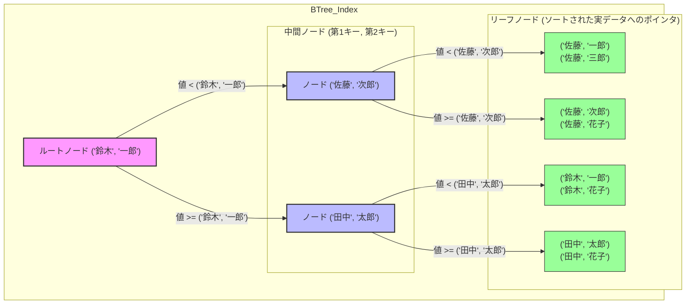

# 【実践編】PostgreSQL インデックス構築と実行計画の解析ガイド

本資料では、最適なインデックスを「作成」し、それが意図通りに動いているかを「実行計画」で確認する手法を解説します。

[参考：fujitsu パフォーマンスチューニング9つの技 ～「探し」について～](https://global.fujitsu/ja-jp/local/software/postgres/tuningrule9-search)

---

## 1. インデックスの作成方法

PostgreSQLでは、用途に合わせてアルゴリズムを指定してインデックスを作成します。

### 1-1. B-Tree インデックス（基本）
特に指定しない場合、この形式になります。
```sql
-- 基本形
CREATE INDEX idx_users_id ON users(id);

-- 複数カラムを組み合わせる場合（複合インデックス）
-- ※WHERE句で両方、または左側のカラムを指定する場合に有効
CREATE INDEX idx_users_name_age ON users(name, age);
```

### 1-2. Hash インデックス（完全一致専用）
`USING hash` を指定します。等価検索（`=`）のみが非常に高速になります。
```sql
CREATE INDEX idx_users_email_hash ON users USING hash (email);
```

### 1-3. インデックス作成時の注意点（実務Tips）
*   **CONCURRENTLY（オンライン作成）:** 通常の `CREATE INDEX` はテーブルをロックし、書き込みを止めます。本番稼働中のサービスでは、ロックを回避するために `CONCURRENTLY` オプションを推奨します。
    ```sql
    CREATE INDEX CONCURRENTLY idx_users_id ON users(id);
    ```

#### B-Tree（基本）のインデックスの種類と作り方

インデックスにはいくつかの種類があり、用途に応じて使い分けることが重要です。

| 種類 | 説明 | こんな時に使う |
| :--- | :--- | :--- |
| **単一列インデックス** | 1つの列に対して作成する最も基本的なインデックス。 | `WHERE user_id = 123` のように、特定の1列で検索する場合。 |
| **複合インデックス** | 複数の列を組み合わせて作成するインデックス。**列の順番が超重要**。 | `WHERE category = 'A' AND price > 1000` のように、複数の条件で検索する場合。 |
| **カバリングインデックス** | 取得したいデータが全てインデックスに含まれている状態。テーブル本体を見に行かずに済むため最速。 | `SELECT user_id, user_name FROM ...` のクエリで `(user_id)` に `user_name` を含めたインデックスがある場合。 |
| **関数インデックス** | 列を関数で加工した結果に対して作成するインデックス。 | `WHERE LOWER(email) = '...'` のように、検索条件で関数を使っている場合。 |


**各種インデックスの作成方法（SQL例）**

**1. 単一列インデックスの作成**
```sql
-- users テーブルの email 列にインデックスを作成
CREATE INDEX idx_users_email ON users (email);
```

**2. 複合インデックスの作成**
` (A, B)` という順でインデックスを作った場合、`WHERE A = ?` や `WHERE A = ? AND B = ?` では効きますが、`WHERE B = ?` だけでは効率的に使えません。これは「辞書で2文字目だけ分かっていても引けない」のと同じです。
```sql
-- products テーブルの category_id と price 列に複合インデックスを作成
-- category_id で絞り、次に price で絞るクエリに有効
CREATE INDEX idx_products_category_price ON products (category_id, price);
```


**【B-Treeインデックスの構造図（複合index）】**


イメージを見てもらうと分かるように、**1つ目の「苗字」でソートされ**、**その中で2つ目の「名前」でソートされてます**。
このように複合キーが別々でindexを作っているわけではない（＝セットで1つの値としてソートされたB-Treeができます。）ので、2つ目のキーだけで検索してもindexを使った検索ができません。


**3. カバリングインデックスの作成 (PostgreSQLの `INCLUDE`句)**
テーブル本体へのアクセスをなくし、`Index Only Scan` を狙います。
```sql
-- orders テーブルの user_id をキーとし、order_date と total_amount をインデックスに含める
CREATE INDEX idx_orders_user_id_cover ON orders (user_id) INCLUDE (order_date, total_amount);
```

**4. 関数インデックスの作成**
`WHERE`句で使っている関数と全く同じ式でインデックスを作成します。
```sql
-- users テーブルの email 列を小文字に変換した結果にインデックスを作成
CREATE INDEX idx_users_lower_email ON users (LOWER(email));
```


---

## 2. 実行計画（EXPLAIN）の基本

作成したインデックスが使われているか確認するには、`EXPLAIN` コマンドを使用します。

### 2-1. 魔法の呪文 `EXPLAIN ANALYZE`
単なる `EXPLAIN` は予測を表示するだけですが、`ANALYZE` をつけると**実際にクエリを実行し、正確な統計情報**を表示します。
```sql
EXPLAIN (ANALYZE, BUFFERS)
SELECT * FROM users WHERE id = 100;
```
*   **BUFFERS:** 物理的なページ読み込み数（I/O）を表示する超重要オプションです。

---

## 3. 実行計画の「読みどころ」

EXPLAINの結果は「下から上へ」読みます。注目すべきは以下の4点です。

### ① スキャン方式（Node Type）
前回の物理構造で学んだ内容がここに現れます。

| ノードの種類 | 表示される項目                    | 内容        | 評価     | 物理的な状態                       |
| ------ | :------------------------- | :-------- | :----- | :--------------------------- |
| スキャン方式 | **Seq Scan**               | 全件走査      | ⚠️     | 全ページをディスクから読み込んでいる。          |
|        | **Index Scan**             | インデックス走査  | ✅      | インデックスから住所(CTID)を得て、本体を狙い撃ち。 |
|        | **Index Only Scan**        | インデックスのみ  | 🌟     | 本体を見に行かず、インデックス内だけで完結。最強。    |
|        | **Bitmap Index Scan**      | ビットマップ走査  | 🆗     | 住所録を一度地図にして、効率よくまとめて回収。      |
| 結合方式   | **Nested Loop Join**       | 二重ループ型    | 🆗<br> | 外側一行ごとに内側スキャン。               |
|        | **Hash Join**              | ハッシュテーブル型 | 🆗<br> | 一撃検索用の地図作成後、もう片方を突き合わせ。      |
|        | **Merge Join**             | ソート＆マージ型  | 🆗<br> | お互い結合キーでソートして突き合わせ。          |
| その他    | Sort / Hash / Aggregate・・・ |           |        |                              |

#### 「結合方式（Join Methods）」

テーブルを結合（JOIN）する際、PostgreSQLはデータの規模やインデックスの有無に応じて、主に3種類のアルゴリズムから最適なものを選びます。実行計画に表示されるこれらの方式を理解することは、複雑なクエリのチューニングに不可欠です。

##### Nested Loop Join（二重ループ型）
一方のテーブル（外側）の1行ごとに、もう一方のテーブル（内側）をスキャンして一致する行を探す方式です。
*   **プラン例:** `Nested Loop  (cost=0.43..12.50 ...)`
*   **特徴:** 
    *   結合先の列に**インデックス**がある場合、爆速になります。
    *   外側のテーブルが十分に小さい場合に選ばれやすいです。
*   **物理的な挙動:** 「外側1行取得」→「内側のインデックスで住所検索」→「結合」を繰り返します。

##### Hash Join（ハッシュテーブル型）
一方のテーブルからメモリ上にハッシュテーブル（一撃検索用の地図）を作成し、もう一方のテーブルを読みながら突き合わせる方式です。
*   **プラン例:** `Hash Join  (cost=230.00..1540.00 ...)`
*   **特徴:** 
    *   **大量のデータ同士**を結合する場合に強力です。
    *   インデックスがなくても動作しますが、メモリ（work_mem）を消費します。
    *   「等価結合（`=`）」でしか使えません。
*   **物理的な挙動:** 片方のデータをメモリにガバッと載せて、もう片方をスキャンしながら「地図」で照合します。

##### Merge Join（ソート＆マージ型）
両方のテーブルを結合キーでソート（整列）し、上から順番に突き合わせていく方式です。
*   **プラン例:** `Merge Join  (cost=100.00..800.00 ...)`
*   **特徴:** 
    *   両方の列に**インデックス**があり、既にソートされている場合に最強です。
    *   巨大なデータ同士で、Hash Join用のメモリが足りない場合にも選ばれます。
*   **物理的な挙動:** 二つのソート済みリストを、指でなぞりながら一致する箇所を拾い集めるイメージです。

---
### ②推定

#### cost（コスト）
`cost=0.00..15.25` のように表示されます。
*   左側（0.00）：最初の1行を返すまでのコスト
*   右側（15.25）：全行を返すまでの推定合計コスト
*   ※単位は「ページ1枚を読み込む時間」を基準とした相対値です。
#### rows（行数）
*   プランナが予測した件数です。実際の件数と大きくズレている場合、統計情報が古くなっています（`ANALYZE` が必要）。
#### width（データのサイズ）
*   ノードが出力する行の平均サイズです。

### ③実際
#### actual time（実行時間）
*   処理にかかった時間です。
*   ノードがループして実行される場合は、loopsに実行された回数が記載され、括弧内に書かれているrows、actual timeにはその時の平均値が出力されます。
#### rows（行数）
*   実際取得した対象レコードの件数です。実際の件数と大きくズレている場合、統計情報が古くなっています（`ANALYZE` が必要）。
*   ノードがループして実行される場合は、loopsに実行された回数が記載され、括弧内に書かれているrows、actual timeにはその時の平均値が出力されます。
#### loops（繰り返し回数）
*   ノードを実行した回数です。
### ④その他
#### BUFFERS（I/Oの実態）
`Buffers: shared read=3 dirtied=1` のように表示されます。
*   **shared hit:** メモリ（共有バッファ）上で見つかったページ数（速い）
*   **shared read:** ディスクから読み込んだページ数（遅い）
*   **結論：** この数値の合計を減らすことが、パフォーマンス改善のゴールです。


---


## 4. ケーススタディ：良い計画・悪い計画

実行計画を読み解く際は、「Node Type（何をしたか）」と「Buffers（どれだけページを読んだか）」の相関に注目します。

### ケース1：【最悪】インデックスが使われない「絨毯爆撃」
`SELECT * FROM orders WHERE user_id = 5000;`

```text
Seq Scan on orders  (cost=0.00..1540.00 rows=1 width=50) (actual time=12.50..12.50 rows=1 loops=1)
  Filter: (user_id = 5000)
  Rows Removed by Filter: 99999
  Buffers: shared read=1200
```
*   **読み取り:** `Rows Removed by Filter: 99999`とactualの`rows=1`（99,999件を捨てて、1件を見つけた）という無駄の多さがわかります。
*   **物理層の視点:** 全1200ページをディスクからメモリに読み込んでいます。データ量が増えるほど、この `shared read` が増大し、システム全体が重くなります。
*   **対策:** `user_id` にインデックスを貼る必要があります。（ただ現実問題pkなので、indexはあることがほとんどだと思いますが。。。）

### ケース2：【改善】インデックスによる「ピンポイント狙い撃ち」
（ケース1にインデックスを貼った後）

```text
Index Scan using idx_orders_user_id on orders  (cost=0.43..8.45 rows=1 width=50) (actual time=0.03..0.03 rows=1 loops=1)
  Index Cond: (user_id = 5000)
  Buffers: shared hit=4
```
*   **読み取り:** `shared hit=4`。インデックスページと本体ページ合わせて、わずか4ページ（32KB）のアクセスで完了しています。
*   **物理層の視点:** メモリ（shared hit）上ですべて解決しており、ディスクI/Oが発生していません。Seq Scanに比べ、処理効率は数百倍以上に向上しています。

### ケース3：【罠】結合（JOIN）でのインデックス貼り忘れ
`SELECT * FROM users u JOIN orders o ON u.id = o.user_id WHERE u.id = 100;`

```text
Hash Join (cost=8.46..1600.00 rows=10 width=150) (actual time=15.0..15.0 rows=10 loops=1)
  Hash Cond: (o.user_id = u.id)
  -> Seq Scan on orders o (cost=0.00..1540.00 rows=100000 width=50) -- ⚠️ここがボトルネック
  -> Hash (cost=8.45..8.45 rows=1 width=100)
      -> Index Scan using idx_users_id on users u (cost=0.43..8.45 rows=1 width=100)
```
*   **読み取り:** 結合相手の `orders` テーブルが `Seq Scan` になっています。
*   **物理層の視点:** `users` はインデックスで1行に絞り込めているのに、それと結合するために `orders` の全ページ（10万行分）を読み込んでメモリ上でハッシュテーブルを作っています。
*   **対策:** `orders(user_id)` にインデックスを貼ることで、この Hash Join は効率的な **Nested Loop** に変化します。

### ケース4：【最強】テーブル本体を見ない「究極の効率化」
（カバリングインデックス：`idx_users_id_name` を使用）
`SELECT name FROM users WHERE id = 100;`

```text
Index Only Scan using idx_users_id_name on users  (cost=0.43..4.45 rows=1 width=32) (actual time=0.01..0.01 rows=1 loops=1)
  Index Cond: (id = 100)
  Heap Fetches: 0
  Buffers: shared hit=2
```
*   **読み取り:** `Index Only Scan` が記録されています。また `Heap Fetches: 0`（テーブル本体を見に行かなかった回数）が重要です。
*   **物理層の視点:** インデックスファイルの中に `name` のデータも含まれているため、テーブル本体（Heap）のページを読むためのI/Oが一切発生していません。読み取りページ数も `shared hit=2` と最小限です。


### ケーススタディのまとめ：チューニングの優先順位

1.  **Shared Read (ディスク読み込み) が多いノードを探す**
    *   ミリ秒単位の遅延はここから発生します。
2.  **Rows Removed by Filter の数を見る**
    *   数千〜数万件を捨てている場所は、インデックスで「絞り込み」ができていない証拠です。
3.  **結合の「内側（字下げが深い方）」が Seq Scan になっていないか見る**
    *   ループの回数（loops）が多い場合、ここでのSeq Scanは致命的な遅延を招きます。

---


## 5. インデックスが効かない「よくある落とし穴」

インデックスが存在していても、SQLの書き方やデータの状態によって、プランナが「インデックスを使わない（使えない）」と判断することがあります。

### ① カラムに「加工」をしている
最も多いミスです。インデックスは「生のデータ」で作成されているため、加工されると住所録と一致しなくなります。
*   ❌ **不可（インデックスが効かない）**
    ```sql
    SELECT * FROM orders WHERE DATE(created_at) = '2025-01-01';
    ```
*   ⭕ **改善案**
    ```sql
    -- カラム側はそのままに、条件側を調整する
    SELECT * FROM orders WHERE created_at >= '2025-01-01 00:00:00' AND created_at < '2025-01-02 00:00:00';
    ```
*   **物理的な理由:** インデックス（B-Tree）は `created_at` の生の値で並んでいるため、関数を通した後の値がどこにあるかは「全部計算してみるまで分からない」からです。

### ② 型が一致していない（暗黙の型変換）
カラムの型（varchar）と、検索値の型（integer）が違う場合、内部で変換処理が走り、インデックスが無視されます。
*   ❌ **不可**
    ```sql
    -- user_idが文字列(varchar)型の場合
    SELECT * FROM users WHERE user_id = 12345;
    ```
*   ⭕ **改善案**
    ```sql
    SELECT * FROM users WHERE user_id = '12345';
    ```

### ③ LIKE検索で「前方一致」になっていない
*   ⭕ **効く:** `LIKE 'ABC%'` （前方一致）
*   ❌ **効かない:** `LIKE '%ABC'` （後方・部分一致）
*   **物理的な理由:** 辞書（B-Tree）を引くとき、「あ」から始まる単語はすぐ探せますが、「あ」で終わる単語を探すには結局最初から最後まで読むしかないのと同じ理屈です。

### ④ 複合インデックスの「順番」を無視している
`CREATE INDEX idx_test ON table(A, B)` と作った場合、**Aを指定せずにBだけで検索してもインデックスは効きません。**
*   ⭕ **効く:** `WHERE A = 10` / `WHERE A = 10 AND B = 20`
*   ❌ **効かない:** `WHERE B = 20`
*   **物理的な理由:** 複合インデックスは「まずAで並べ、同じAの中でさらにBで並べる」という構造だからです。苗字（A）がない状態で名前（B）だけを電話帳から探すようなものです。

### ⑤ データの「選択性（カーディナリティ）」が低い
これはバグではなく、プランナの**「賢い判断」**によるものです。
*   **例:** `gender` カラム（男/女のみ）で、全レコードの半分が「男」の場合。
*   **挙動:** `WHERE gender = '男'` で検索しても、プランナは `Seq Scan` を選びます。
*   **物理的な理由:** インデックスを読んで「半分（数万件）の住所」を特定し、そこからバラバラのページを数万回読みに行くより、最初から全部のページを順番に（シーケンシャルに）ガバッと読み込んだ方が、ディスクI/Oのトータルコストが安いと判断されるためです。

### ⑥ 統計情報が古い
大量のデータを `INSERT` や `UPDATE` した直後は、プランナが「まだデータは少ない」と勘違いしていることがあります。
*   ❌ **状態:** `EXPLAIN` の予測行数 (`rows`) と実際の行数が大きく乖離している。
*   ⭕ **改善案:** `ANALYZE テーブル名;` を実行して、プランナに最新の「住所録の状態」を教え直します。


---

## 6. チューニングのチェックリスト

実行計画を見て「遅い」と感じたら、以下を確認してください。

1.  **インデックスの貼り忘れはないか？**（`Seq Scan` になっていないか）
2.  **インデックスが効かない書き方をしていないか？**
    *   ❌ `WHERE UPPER(name) = 'ALICE'` （関数を使うとインデックスは無効）
    *   ❌ `WHERE age + 1 > 20` （計算式も無効）
    *   ⭕ `WHERE name = UPPER('alice')` （右辺で計算する）
3.  **複合インデックスの順番は正しいか？**
    *   B-Treeの特性上、`WHERE` 句で指定する順番とインデックスのカラム順が一致している必要があります。
4.  **統計情報は最新か？**
    *   大量にデータを入れた後は `ANALYZE テーブル名;` を実行し、プランナに最新の情報を教える必要があります。
