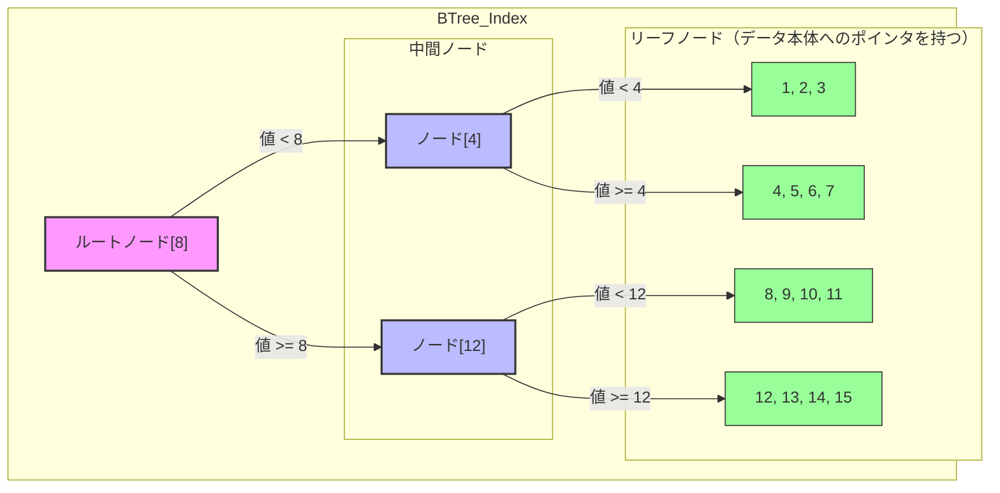
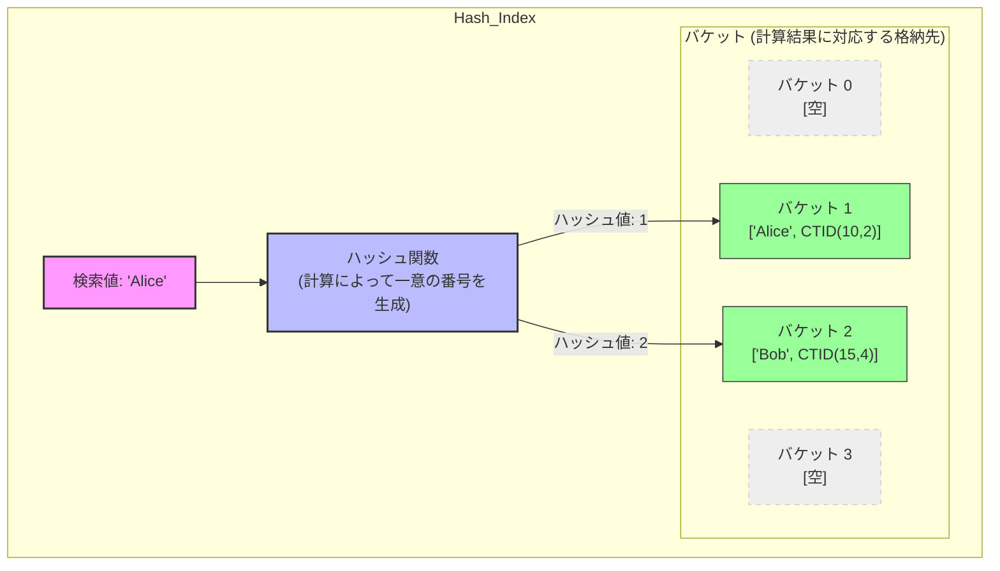
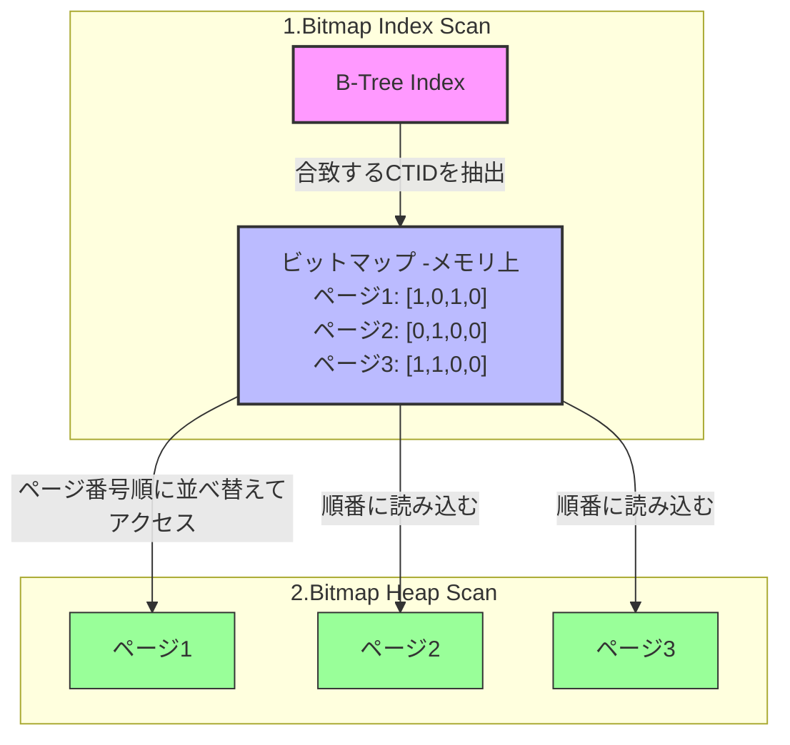

# PostgreSQLインデックスと実行計画の深層
## 〜なぜインデックスは速いのか？ 物理構造とアルゴリズムから理解する〜

データベースのパフォーマンス改善において、インデックスの作成は最も効果的な手段の一つです。しかし、「なぜ張ると速くなるのか？」を物理層レベルで説明できる人は意外と多くありません。
ここでは、PostgreSQLの内部アーキテクチャに踏み込み、データの「読み込み」と「書き込み」の仕組みから、インデックスの正体を解き明かします。

[参考：fujitsu PostgreSQLのアーキテクチャー概要](https://global.fujitsu/ja-jp/local/software/postgres/architecture-overview)

---

## 1. 物理層の現実：DBの敵は「ディスクI/O」である

インデックスの価値を理解するには、まずコンピュータの物理的な制約を知る必要があります。

### 1-1. 速度の圧倒的な格差（5大装置の視点）
CPUが計算を行う際、データをメモリ（共有バッファ）から読み込むのと、ストレージ（HDD/SSD）から読み込むのでは、速度に天と地ほどの差があります。

![[00_SQL研修/01_講義資料/99_画像置き場/Pasted image 20251219104602.png]]
主記憶装置：メモリ
補助記憶装置：HDD、SSD

*   **メモリ（Shared Buffer）:** ナノ秒単位（1秒間に数億回アクセス可能）
*   **ディスク（ストレージ）:** ミリ秒〜マイクロ秒単位（メモリより**1万倍〜10万倍遅い**）

PostgreSQLのパフォーマンスチューニングとは、極論すれば「**いかに遅いディスクI/Oを減らし、速いメモリ上のデータだけで処理を完結させるか**」という戦いです。

### 1-2. データの最小単位「ページ（ブロック）」
PostgreSQLは、データを1行単位でバラバラに管理しているわけではありません。**「ページ」**（またはブロック）と呼ばれる固定長（デフォルト8KB）の箱に詰めて管理しています。


![[00_SQL研修/01_講義資料/99_画像置き場/Pasted image 20251219175608.png]]
**全体の概要図**
- クライアントからpostgreSQLサーバーにSQLが飛んできます。
- サーバーはSQLを解析、実行し、ディスク上のテーブルデータからデータを取得します。
- 取得した結果をクライアントに返します。


![[00_SQL研修/01_講義資料/99_画像置き場/Pasted image 20251219104814.png]]
**ディスク読み（書き）のイメージ図**
- ファイル（折り目が付いた四角）に、複数のブロック（グレーや白のタイル）でテーブルデータは構成されます。
- ブロック単位でメモリ（共有バッファ）にロードし、ロードされたブロックはページと呼ばれます。
- 共有バッファに読み込まれたページを基にSQLの結果セットが作られます。

共有バッファのサイズは設定で変えられます。
```SQL
-- 現在の共有バッファのサイズを確認
SHOW shared_buffers;
```

![[00_SQL研修/01_講義資料/99_画像置き場/Pasted image 20251219110003.png|900]]
**データファイルのイメージ図（テーブル）**
- 1つのファイル（薄グレー）に複数のブロック（前の図ではタイルだった）で構成される。
- ファイルでは、テーブルデータとindexが保管されている。

*   **ページ（ブロック）:** ディスクとメモリ間を移動する最小単位。
*   **タプル（アイテム）:** ページの中に格納された個々の行データ。

たとえ1行のデータを読みたくても、PostgreSQLは必ずその行が含まれる「**8KBのページ丸ごと**」をメモリにロードします。

---

## 2. インデックスとは何か？（定義と実態）

ここで、本題である「インデックス」の定義を整理します。

### 2-1. インデックスの定義
インデックスとは、**「特定の列の値」と「その値を持つ行の物理的な居場所」をセットにして、<font color="#ff0000">検索しやすい順序で並べ替えた別表</font>（索引）**のことです。

*   **現実世界の例:** 本の巻末にある「索引」です。単語（値）とページ番号（住所）が五十音順に並んでいるため、本編を1ページ目からめくる必要がなくなります。
*   **物理的な実態:** テーブル本体とは別に作成される**「物理的なファイル」**です。テーブルと同じく、インデックス自体もディスク上にページ単位で保存されます。


### 2-2. ポインタとしての「CTID」
インデックスには、データ本体の「住所」として**CTID**という情報が記録されています。
*   **CTIDの内容:** `(ブロック番号, オフセット番号)`
*   **役割:** これがあれば、「〇番目のページの、〇行目」へ直接アクセス（ランダムアクセス）することが可能になります。

---

## 3. なぜ「インデックスなし」は遅いのか（Full Table Scan）

インデックスがない状態で `SELECT * FROM users WHERE id = 50000;` を実行すると、PostgreSQLは**シーケンシャルスキャン（全件走査）**を選択します。

1.  **しらみつぶしの読み込み:** テーブルを構成する全ページを、先頭から順番にディスクからメモリへ読み込みます。
2.  **CPUの浪費:** 読み込んだページ内の全タプルを一つずつチェックします。
3.  **メモリの圧迫:** 目的の1行以外の大半のデータがメモリを占有し、他のキャッシュを追い出してしまいます。

データ量が数百万件、数千万件となると、この「全件ディスク読み込み」が致命的なボトルネックとなります。

---

## 4. 解決策：インデックスの仕組みと「CTID」

インデックスは、いわば「**本の索引**」です。本編（テーブル）とは別に、検索に特化した小さな名簿を作成します。

### 4-1. CTID（物理的な住所）
インデックスの各レコードは、「検索対象の値（例: id=50000）」と、その実データがテーブルのどこにあるかを示す「**CTID**」というポインタを持っています。

*   **CTIDの構造:** `(ブロック番号, オフセット番号)`
    *   例: `(550, 2)` → 「550番目のページの、2番目のデータ」

### 4-2. ピンポイント爆撃（Random Access）
インデックスを使えば、PostgreSQLは「どのページに目的のデータがあるか」を事前に知ることができます。
そのページだけをディスクからメモリへ直接読み込む（ランダムアクセス）ことで、**読み込むページ数を数万分の1に削減**できるのです。

---

## 5. アルゴリズム別：なぜその構造だと速いのか？

PostgreSQLがサポートする主要なインデックスアルゴリズムの「速さの正体」を深掘りします。

### 5-1. B-Treeインデックス（万能・標準）
ほとんどのケースで使用される「バランス木」構造です。

*   **構造:**
    *   **Root/Branchノード:** 検索範囲の案内板（「100以下は左、101以上は右」）。
    *   **Leafノード:** 実際のキー値とCTIDのペアが、ソートされた状態で並ぶ。
*   **速さの秘密（$O(\log N)$）:**
    *   木が常に左右対称に「バランス」を保つよう自動調整されます。
    *   1億件のデータがあっても、木の深さは通常4〜5層程度です。
    *   **結論:** 1億件から1件を探すのに、たった5ページ程度の読み込みで完了します。
*   **得意:** 等価検索、範囲検索（`<`, `>`, `BETWEEN`）、ソート（`ORDER BY`）。




**検索時の物理的な挙動（ディスクI/Oの視点）**
`SELECT * FROM users WHERE id = 10;` を実行した時の動き：

1.  **比較と判断:** CPUが「ルートノード（最初のページ）」を読み込み、値 `10` がどの枝にあるか比較して、次に読み込むべき中間ページの番号を特定します。（読み込み1回目）
2.  **階層の追跡:** 特定された「中間ノード（ページ）」をディスクから読み込み、さらに範囲を絞り込んで、目的のデータが眠る「リーフページ」の番号を特定します。（読み込み2回目）
	1.  **リーフ読み込み:** 最終的な「リーフページ」をディスクからメモリ（共有バッファ）へ読み込みます。ここには `id = 10` に対応する**CTID**（物理住所）が格納されています。（読み込み3回目）
3.  **取得:** 判明したCTID（例：50番目のページの3行目）を元に、テーブル本体（ヒープ領域）のページをピンポイントで読みに行きます。（読み込み4回目）


![[Pasted image 20251222135832.png|900]]
**データファイルのイメージ図（index）**
- 例えばリーフページは図でいえば横一列に8kb単位で保存されます。


### 5-2. Hashインデックス（等価検索特化）
「計算」によって場所を特定する手法です。

*   **構造:** 検索値を「ハッシュ関数」に通し、一意のバケット（箱）番号を算出します。
*   **速さの秘密（$O(1)$）:**
    *   木を辿る必要すらありません。値を入力すれば「場所はここだ！」と一撃で決まります。
    *   理論上、データ量が増えても速度が低下しません。
*   **弱点:** データの大小関係がバラバラになるため、**「〜より大きい」といった範囲検索やソートには一切使えません。**



**検索時の物理的な挙動（ディスクI/Oの視点）**

`SELECT * FROM users WHERE name = 'Alice';` を実行した時の動き：

1.  **計算:** CPUが `'Alice'` をハッシュ関数にかけ、「バケット番号：1」を算出します。
2.  **特定:** PostgreSQLは、メタページの情報から「バケット1は、インデックスファイルの〇番目のページにある」と即座に特定します。
3.  **読み込み:** ディスク上の**そのページ（バケット1）だけ**を狙い撃ちしてメモリ（共有バッファ）に読み込みます。（読み込み1回目）
4.  **取得:** 読み込んだページ内から 'Alice' のCTIDを見つけ、次にテーブル本体のページを読みに行きます。（読み込み2回目）


---

## 6. 実行計画（Execution Plan）：プランナはどう判断しているか？

インデックスを作っても、PostgreSQLが必ず使うとは限りません。ここで「**プランナ（オプティマイザ）**」が登場します。

![[00_SQL研修/01_講義資料/99_画像置き場/Pasted image 20251219105625.png]]

![[00_SQL研修/01_講義資料/99_画像置き場/Pasted image 20251219104916.png|100]]
### 6-1. コストベースの意思決定
PostgreSQLは、統計情報（テーブルのサイズ、データのバラつきなど）を元に、いくつかの実行パターンをシミュレーションし、最も「コスト（予測処理時間）」が低いものを選びます。

*   **インデックスを使う判断:** 「インデックスページを数枚読み、必要なデータページだけを飛んで読むコスト」の方が、「全ページを順番に読むコスト」より低い場合。
*   **あえて使わない判断（Seq Scan）:** 
    *   テーブル自体が極端に小さい場合。
    *   `WHERE` 条件に合致するデータが全体の大部分（例：8割以上）を占める場合。
    *   ※この場合、バラバラのページをランダムアクセスするより、先頭から一気に読み込んだ方が速いと判断されます。

### 6-2. 実行計画の確認
`EXPLAIN ANALYZE` コマンドを使うことで、プランナの判断理由を覗き見ることができます。
*   `Seq Scan`: 絨毯爆撃。
*   `Index Scan`: インデックスを使ってデータを探しに行った。
*   `Index Only Scan`: インデックスの中に必要なデータが全てあったので、テーブル本体を見に行かなかった（最強に速い）。
*   `Bitmap Index Scan`: 複数のページにまたがるデータを効率よく整理してから読みに行った。

**`Bitmap Index Scan`についての補足**


**検索時の物理的な挙動（ディスクI/Oの視点）**
`SELECT * FROM users WHERE age = 20;` のように、該当する行が複数（例えば数百〜数千行）ある時の動き：

1.  **一括抽出 (Bitmap Index Scan):** インデックスをスキャンし、条件に合う全ての行のCTID（住所）をリストアップします。
2.  **地図の作成:** 取得した住所をそのまま使わず、メモリ上に**「どのページのデータが必要か」を示すビットマップ（地図）**を作成します。
3.  **並べ替え:** 住所を「ページ番号順」に並べ替えます。これにより、バラバラの場所にあるデータをランダムに読みに行くのではなく、**ディスクの端から順番に読み進められる**ようになります。
4.  **実データの回収 (Bitmap Heap Scan):** 地図に従って、必要なページだけをディスクからメモリ（共有バッファ）へ「一筆書き」のように効率よく読み込みます。

ランダムアクセスすると、一度読んだ

---

## 7. トレードオフ：インデックスの代償

インデックスは「読書を速くする」代わりに、「執筆を遅く」します。

1.  **書き込み負荷の増加（Write Overhead）:**
    *   前述の「書き込みアーキテクチャ」を思い出してください。`INSERT` や `UPDATE` の際、テーブル本体だけでなく、関連する**全てのインデックスページも更新**しなければなりません。
    *   インデックスが多いほど、WALの生成量が増え、チェックポイントの負荷も上がります。
2.  **ストレージ容量の消費:**
    *   インデックスも物理的なファイルです。貼りすぎるとDB全体のサイズが数倍に膨れ上がります。
3.  **メンテナンスの必要性:**
    *   データの更新を繰り返すと、インデックス内に隙間ができ（断片化）、検索効率が落ちます。定期的な `VACUUM` や `REINDEX` の検討が必要になります。

---

## 結論：最適なインデックス設計とは

1.  **物理構造を意識する:** 「このクエリはディスクI/Oを何ページ分発生させているか？」を考える。
2.  **実行計画を対話する:** `EXPLAIN` を使い、プランナが自分の意図通りに動いているか確認する。
3.  **バランスを取る:** 検索速度の向上と、書き込み負荷・容量の増加を天秤にかける。

インデックスは魔法の杖ではありません。PostgreSQLの物理的なアーキテクチャを理解して初めて、その真の力を引き出すことができるのです。