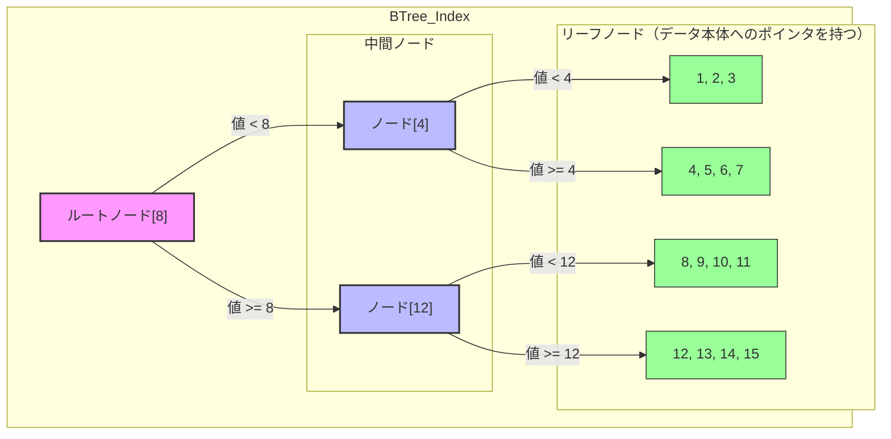
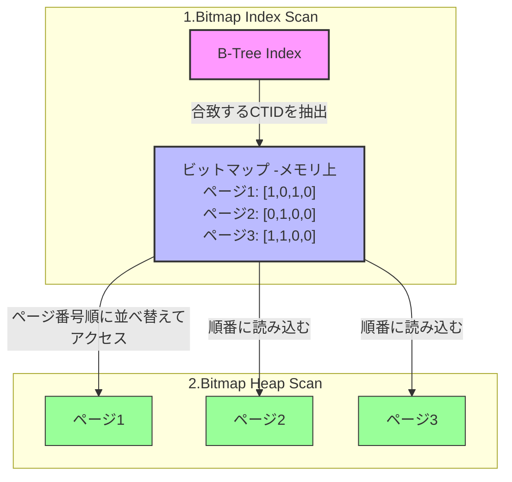

# インデックスと実行計画（導入編）
## 〜なぜインデックスは速いのか？ 物理構造から理解する〜

データベースのパフォーマンス改善において、インデックスの作成は最も効果的な手段の一つです。しかし「なぜ張ると速くなるのか？」を物理層レベルで説明できる人は意外と多くありません。

ここでは PostgreSQL の内部アーキテクチャに踏み込み、**データがディスクとメモリの間をどう動くのか**という視点から、インデックスの正体を解き明かします。

[参考：fujitsu PostgreSQLのアーキテクチャー概要](https://global.fujitsu/ja-jp/local/software/postgres/architecture-overview)

> **この資料の前提**
> - PostgreSQL 17 で動作確認しています。掲載しているページ数・実行時間は**すべて実測値**です。
> - 使用するテーブルは [[17_indexと実行計画で使用するテーブル|17_indexと実行計画で使用するテーブル]] で作成します（`customers` 10万件 / `orders` 100万件）。
> - `INCLUDE` 句（カバリングインデックス）は PostgreSQL 11 以降、`REINDEX CONCURRENTLY` は 12 以降でないと使えません。

---

## 1. 物理層の現実：DBの敵は「ディスクI/O」である

インデックスの価値を理解するには、まずコンピュータの物理的な制約を知る必要があります。

### 1-1. 速度の圧倒的な格差

> 

CPUが計算を行う際、データを**メモリ**（共有バッファ）から読み込むのと、**ストレージ**（HDD/SSD）から読み込むのでは、速度に天と地ほどの差があります。

*   **メモリ（Shared Buffer）:** ナノ秒単位（1秒間に数億回アクセス可能）
*   **SSD:** マイクロ秒単位（メモリより**約1,000倍遅い**）
*   **HDD:** ミリ秒単位（メモリより**約10万倍遅い**）

> **用語の整理**：補助記憶装置（SSD / HDD）の総称は本来「ストレージ」ですが、この資料では**慣例に従って「ディスク」と呼びます**。`EXPLAIN` の出力自体が `Sort Method: external merge  Disk: 8080kB` のように `Disk` と表示するので、用語をそちらに合わせておく方が読み替えの手間がありません。

PostgreSQLのパフォーマンスチューニングとは、極論すれば「**いかに遅いディスクI/Oを減らし、速いメモリ上のデータだけで処理を完結させるか**」という戦いです。

### 1-2. データの最小単位「ページ（ブロック）」

**PostgreSQLは、データを1行ずつ読み書きしません。8KB（正確には8KiB）の箱にまとめて読み書きします。** この箱を「ページ」（またはブロック）と呼びます。

![[17-1_全体像_データの通り道.excalidraw]]
> claudeへ
> osのキャッシュも図に欲しい
> 共有バッファが複数プロセスから参照されることを表現したい
> ファイルが複数あることを表現したい
> 邪魔にならない程度で、ページが一枚共有バッファに乗ることがわかるような表現をしたい（コピーされる感じ？）

**データの通り道**
- クライアントから PostgreSQL サーバーに SQL が飛んできます。
- サーバープロセスは、必要なデータが**共有バッファ（メモリ）にあるか**を探します。
- **無ければディスクから読みます。このとき8KBのページ単位で読み、共有バッファに載せます。**
- 共有バッファ上のページから結果セットを作り、クライアントに返します。

**遅いのはディスクとの往復だけです。** だからチューニングの目標は「**ディスクを読む回数（ページ数）を減らすこと**」の一点に集約されます。

**「1つのファイルの中に、たくさんのブロックが入っている」**という関係です。ただし1つ例外があり、**1ファイルは1GBが上限**です。テーブルが1GBを超えると、PostgreSQLは自動でファイルを分割していきます。

| | 個数の関係 |
| :--- | :--- |
| 1テーブル | → **1個以上**のファイル（1GBごとに分割される） |
| 1ファイル | → **最大131,072ページ**（1GB ÷ 8KB） |
| 1ページ | → **複数のタプル**（行） |

> **用語の整理**：**「ページ」と「ブロック」は同じもの**で、どちらも同じ8KBの箱を指します。PostgreSQLの公式ドキュメントでも `EXPLAIN` の出力でも両方の言葉が出てきます（`relpages` / `block_size` / `Heap Blocks` など）。**同じものだと思って読んでください。** この資料では原則「ページ」で通します。

### 1-3.【手を動かす】実ファイルを確認する

「テーブルとインデックスは別ファイル」という話は、実際にパスを見れば確かめられます。

```sql
-- テーブルとインデックスの実ファイルパス
SELECT 'orders'      AS obj, pg_relation_filepath('orders')      AS path
UNION ALL SELECT 'orders_pkey', pg_relation_filepath('orders_pkey')
UNION ALL SELECT 'customers',   pg_relation_filepath('customers');

-- 1ページのサイズと、実サイズから計算したページ数
SELECT current_setting('block_size')                                  AS ページサイズ,
       pg_relation_size('orders')                                     AS 実バイト数,
       pg_relation_size('orders') / current_setting('block_size')::int AS ページ数;
```

```text
     obj     |       path
-------------+------------------
 orders      | base/60822/60828
 orders_pkey | base/60822/60831     ← テーブルとは別のファイル！
 customers   | base/60822/60823

 ページサイズ | 実バイト数 | ページ数
--------------+------------+----------
 8192         |   59432960 |     7255
```

**`orders`（60828）と `orders_pkey`（60831）が別ファイル**になっています。インデックスを張ると、テーブルとは独立したファイルが1つ増えるということです。

そして `59,432,960 ÷ 8,192 = 7,255`。**この後 §1-4 で見る `relpages` と完全に一致**します。「8KBの箱がぴったり7,255個並んだファイル」が `orders` の実体です。

共有バッファのサイズは設定で変えられます。

```SQL
-- 現在の共有バッファのサイズを確認
SHOW shared_buffers;
```

![[17-1_ページの内部構造.excalidraw]]

**8KBページの中身**
- 先頭に**ページヘッダ**があり、続いて**アイテムポインタ**が前から積まれます。
- 実際の**行データは後ろから詰められ**、真ん中に空き領域が残ります。
- **ポインタの並び順と行の並び順は一致しません。** だからページ内で行を並べ替えても、実データを動かさずポインタだけ書き換えれば済みます。
- 空き領域が尽きたら、新しいページが使われます。

そして**1つのファイルは、この8KBページがぎっしり並んだもの**です。テーブルデータとインデックスは、**それぞれ別のファイル**として保存されます（どちらも中身は同じ8KBページの集まりです）。

*   **ページ（ブロック）:** ディスクとメモリ間を移動する最小単位。
*   **タプル（アイテム）:** ページの中に格納された個々の行データ。

**ここが本質です。** たとえ1行だけ読みたくても、PostgreSQLはその行が含まれる**8KBのページを丸ごと**メモリにロードします。だから性能の話は最終的に「**何ページ読んだか**」に還元されます。

以降ずっと、この「ページ数」を数えていきます。

### 1-4.【手を動かす】自分のテーブルのページ数を見る

ページ数は `pg_class` というシステムカタログに記録されています。**まず自分の目で確認してください。**

```sql
SELECT relname,
       relpages                        AS ページ数,
       reltuples::bigint               AS 行数,
       round(reltuples / relpages)     AS 1ページあたり行数,
       pg_size_pretty(pg_relation_size(oid)) AS サイズ
FROM pg_class
WHERE relname IN ('customers', 'orders')
ORDER BY relname;
```

```text
  relname  | ページ数 |  行数   | 1ページあたり行数 |  サイズ
-----------+----------+---------+-------------------+---------
 customers |     1235 |  100000 |                81 | 9880 kB
 orders    |     7255 | 1000000 |               138 | 57 MB
```

**この3つの数字を覚えてください。**

*   `customers` = **1,235ページ**、1ページに**81行**
*   `orders` = **7,255ページ**、1ページに**138行**

「1行だけ欲しくても81行分（8KB）を丸ごと読む」という無駄が、ここに数字として現れています。そして実行計画に出てくる `Buffers` の数字がこの `relpages` と一致していたら、それは**全ページ読んだ＝全件走査**という判断ができます。

---

## 2. インデックスとは何か？（定義と実態）

### 2-1. インデックスの定義

インデックスとは、**「特定の列の値」と「その値を持つ行の物理的な居場所」をセットにして、<font color="#ff0000">検索しやすい順序で並べ替えた別表</font>（索引）**のことです。

*   **現実世界の例:** 本の巻末にある「索引」です。単語（値）とページ番号（住所）が五十音順に並んでいるため、本編を1ページ目からめくる必要がなくなります。
*   **物理的な実態:** テーブル本体とは別に作成される**独立したファイル**です。テーブルと同じく、インデックス自体もディスク上にページ単位で保存されます。

### 2-2. ポインタとしての「CTID」

索引に書かれている「ページ番号」に相当するのが **CTID** です。

*   **CTIDの内容:** `(ブロック番号, オフセット番号)`
    *   例: `(550, 2)` → 「550番目のページの、2番目のデータ」
*   **役割:** これがあれば「〇番目のページの、〇行目」へ直接アクセス（ランダムアクセス）できます。

つまりインデックスの中身は、ざっくり言えば「**値 → CTID**」のペアが、値の順番に並んでいるだけのものです。

### 2-3. 【手を動かす】CTIDを実際に見る

CTIDは隠し列として**どのテーブルにも最初から存在します**。`SELECT` すれば見られます。

```sql
SELECT ctid, customer_id, city FROM customers ORDER BY customer_id LIMIT 5;
```

```text
 ctid  | customer_id |  city
-------+-------------+--------
 (0,1) |           1 | City_1
 (0,2) |           2 | City_2
 (0,3) |           3 | City_3
 (0,4) |           4 | City_4
 (0,5) |           5 | City_5
```

`(0,1)` は「**0番ページの1行目**」という意味です。連番で挿入したので、先頭の5件が同じ0番ページに固まって入っていることが分かります。1ページに80行あまり入るので、少し進むと次のページに切り替わります。

```sql
SELECT ctid, customer_id FROM customers WHERE customer_id BETWEEN 81 AND 84 ORDER BY customer_id;
```

```text
  ctid  | customer_id
--------+-------------
 (0,81) |          81
 (0,82) |          82
 (1,1)  |          83      ← ここでページが変わった
 (1,2)  |          84
```

**0番ページには82行入り、83行目から1番ページに移った**ことが目で見えます。これが「8KBの箱に詰めていく」ということです。

この `ctid` が、これから何度も出てくる「住所」の正体です。

---

## 3. インデックスがないとどうなるか（Seq Scan）

インデックスがない状態で、10万件の顧客から特定の都市の顧客（200件）を探します。

```sql
SELECT * FROM customers WHERE city = 'City_123';
```

PostgreSQLは**シーケンシャルスキャン（Seq Scan、全件走査）**を選択します。

1.  **しらみつぶしの読み込み:** テーブルを構成する全ページを、先頭から順番に読み込みます。
2.  **CPUの浪費:** 読み込んだページ内の全タプルを一つずつチェックし、条件に合わないものを捨てます。
3.  **メモリの圧迫:** 目的の行以外の大半のデータが共有バッファを占有し、他のキャッシュを追い出してしまいます。

実測してみます。

```sql
EXPLAIN (ANALYZE, BUFFERS) SELECT * FROM customers WHERE city = 'City_123';
```

```text
 Seq Scan on customers  (cost=0.00..2485.00 rows=200 width=69)
                        (actual time=0.016..10.227 rows=200 loops=1)
   Filter: (city = 'City_123'::text)
   Rows Removed by Filter: 99800
   Buffers: shared hit=1235
 Execution Time: 10.247 ms
```

注目すべき数字は2つです。

*   **`Buffers: shared hit=1235`** — §1-4 で確認した `customers` の総ページ数（1,235）と**完全に一致**しています。全ページ読んだ証拠です。
*   **`Rows Removed by Filter: 99800`** — 200件を得るために99,800件を読んで捨てています。

データ量が数百万件、数千万件となると、この「全件読み込み」が致命的なボトルネックになります。

---

## 4. インデックスがあるとどうなるか

インデックスを使えば、PostgreSQLは「**どのページに目的のデータがあるか**」を事前に知ることができます。そのページだけを狙って読み込むことで、読み込むページ数を劇的に減らせます。

同じテーブルから、主キーで1件だけ取り出した場合の実測がこれです。

```sql
EXPLAIN (ANALYZE, BUFFERS) SELECT * FROM customers WHERE customer_id = 50000;
```

```text
 Index Scan using customers_pkey on customers  (cost=0.29..8.31 rows=1 width=69)
                                               (actual time=0.005..0.006 rows=1 loops=1)
   Index Cond: (customer_id = 50000)
   Buffers: shared hit=3
 Execution Time: 0.011 ms
```

**`Buffers: shared hit=3`。たった3ページ、0.011ms。**

全件走査の1,235ページに対し、**約1/400**。実行時間は約930倍の差です。これがインデックスの威力です。

なぜ「3ページ」で済むのか。その答えがB-Treeの構造にあります。

---

## 5. B-Treeインデックスの構造

PostgreSQLには何種類かのインデックスがありますが、**実務で使うのはほぼB-Tree（バランス木）です。** まずこれだけを確実に理解してください。`CREATE INDEX` で何も指定しなければB-Treeが作られます。

### 5-1. 構造と「$O(\log N)$」の意味

*   **Root / Branch ノード:** 検索範囲の案内板（「8未満は左、8以上は右」）。
*   **Leaf ノード:** 実際のキー値とCTIDのペアが、**ソートされた状態で**並ぶ。



木は常にバランスを保つよう自動調整されるため、**データが増えても深さはほとんど増えません**。1億件あっても木の深さは通常4〜5層です。

これが $O(\log N)$ の意味です。件数が10倍になっても、読むページ数は1枚増える程度しか変わりません。

### 5-2. 検索時の物理的な挙動（ディスクI/Oの視点）

`SELECT * FROM customers WHERE customer_id = 50000;` を実行したときの動きを、ページ単位で追います。

1.  **ルートノード（1ページ目）:** 値 `50000` がどの枝にあるか比較し、次に読むべき中間ページの番号を特定。
2.  **中間ノード（2ページ目）:** さらに範囲を絞り込み、目的のデータが眠るリーフページの番号を特定。
3.  **リーフノード（3ページ目）:** ここに `customer_id = 50000` に対応する **CTID** が格納されている。
4.  **テーブル本体:** 判明したCTIDを元に、ヒープ領域のページをピンポイントで読みに行く。

実測では合計 **3ページ**でした。

**「木の深さ ＋ 本体1ページ」で終わる。** これがB-Treeの強さです。

### 5-3.【手を動かす】木の深さを実際に見る

「木の深さは4〜5層」という説明を、実際に確認できます。`pageinspect` 拡張の `bt_metap()` がインデックスのメタ情報を見せてくれます。

```sql
CREATE EXTENSION IF NOT EXISTS pageinspect;   -- ※実行には管理者権限が必要

SELECT 'customers_pkey' AS idx, level FROM bt_metap('customers_pkey')
UNION ALL
SELECT 'orders_pkey',           level FROM bt_metap('orders_pkey');
```

```text
      idx       | level
----------------+-------
 customers_pkey |     1
 orders_pkey    |     2
```

`level` はルートノードの階層で、**リーフが0段目**です。つまり実際の深さは `level + 1` 段。

| インデックス | 行数 | 木の深さ | 1行取るのに読むページ数 |
| :--- | ---: | :--- | :--- |
| `customers_pkey` | 10万 | **2段**（ルート＋リーフ） | 2（索引）＋ 1（本体）＝ **3** |
| `orders_pkey` | 100万 | **3段**（ルート＋中間＋リーフ） | 3（索引）＋ 1（本体）＝ **4** |

**行数が10倍になっても、深さは1段しか増えていません。** そして `customers` の「索引2＋本体1＝3ページ」は、§4で実測した `Buffers: shared hit=3` と完全に一致します。理屈と実測が噛み合っているのが確認できます。

> `pageinspect` の作成には管理者権限が必要なので、権限がない場合は講師のデモを見てください。以降の内容は `pageinspect` なしでも進められます。

![[17-1_Btreeインデックスの構造.excalidraw]]

**図の読み方**
- 上から**ルート → インターナル → リーフ**と辿り、リーフに載っている**行の位置（TID）**を使ってテーブル本体を読みます。**辿ったページ数＝読んだページ数**です。
- **リーフ同士は左右に繋がっています。** 範囲検索（`BETWEEN`・不等号）が速いのはこのためで、一度リーフに降りたら**あとは横に辿るだけ**で済みます（→ §5-4）。
- 右側のとおり、インデックスファイルの中身も**同じ8KBページの集まり**です。テーブルと違うのは中身の並べ方だけです。

### 5-4. B-Treeが得意なこと・苦手なこと

リーフノードが**ソート済み**であることが、得意分野をそのまま決めています。

| 用途 | 使える？ | 理由 |
| :--- | :---: | :--- |
| 等価検索 `= ` | ⭕ | 木を辿って一点に到達できる |
| 範囲検索 `<` `>` `BETWEEN` | ⭕ | ソート済みなので、始点を見つけたら横に読み進めるだけ |
| ソート `ORDER BY` | ⭕ | インデックス順に読めば、それがソート結果になる |
| 最大・最小 `MAX` `MIN` | ⭕ | 木の左端／右端を見るだけ |
| `IS NULL` | ⭕ | PostgreSQLはNULLもインデックスに格納する |
| 前方一致 `LIKE 'ABC%'` | △ | 条件付きで使える（→ 17-2 の落とし穴） |
| 部分一致 `LIKE '%ABC%'` | ❌ | 「〜で終わる」は辞書を引けないのと同じ |

**【手を動かす】「木の端を見るだけ」を確かめる**

`MAX` / `MIN` が本当に端を見るだけなのか、実行計画に現れます。

```sql
CREATE INDEX idx_orders_order_date ON orders (order_date);
ANALYZE orders;

EXPLAIN (ANALYZE, BUFFERS) SELECT MIN(order_date) FROM orders;
EXPLAIN (ANALYZE, BUFFERS) SELECT MAX(order_date) FROM orders;
```

```text
-- MIN：木の左端へ降りて1件取ったら終わり
Result  (actual time=2.001..2.002 rows=1 loops=1)
  ->  Limit  (actual time=1.991..1.993 rows=1 loops=1)
        ->  Index Only Scan using idx_orders_order_date on orders
              Index Cond: (order_date IS NOT NULL)
              Buffers: shared hit=1 read=3
Execution Time: 2.138 ms

-- MAX：同じインデックスを「逆から」辿る
Result  (actual time=0.908..0.909 rows=1 loops=1)
  ->  Limit
        ->  Index Only Scan Backward using idx_orders_order_date on orders
              Buffers: shared hit=2 read=2
Execution Time: 0.933 ms
```

**100万行から最小値・最大値を求めるのに、たった4ページ。**

*   `Limit` が付いているのがポイントです。**1件見つけた時点で打ち切っている**ので、`Index Only Scan` の推定行数が1,000,000でも実際は `rows=1` で終わっています。
*   `MAX` は **`Index Scan Backward`**（インデックスを逆から辿る）になります。
*   インデックスがなければ、`orders` の全7,255ページを読んで集計することになります。

---

## 6. 4つのスキャン方式

同じ「インデックスを使う」でも、PostgreSQLは**該当行の数と散らばり方**に応じて読み方を変えます。実行計画に出てくる名前は、この読み方の名前です。

**まず全体像です。**

| 方式 | ひとことで言うと | 本体（ヒープ）を読む？ |
| :--- | :--- | :---: |
| **Seq Scan** | 索引を使わず先頭から全部読む | 全ページ読む |
| **Index Scan** | 索引で住所を引いて、1件ずつ本体を取りに行く | 1件ごとに読む |
| **Bitmap Index Scan**<br>＋ Bitmap Heap Scan | 住所を全部集めて地図を作り、ページ順にまとめて読む | 必要なページを1回ずつ |
| **Index Only Scan** | 索引の中に答えが全部あるので本体を見ない | **読まない** |

以下、それぞれを詳しく見ます。

### 6-1. Seq Scan（全件走査）

先頭のページから最後のページまで、順番に全部読みます。

*   **遅いとは限りません。** ページを順番に読むためディスクの先読み（read-ahead）が効き、1ページあたりのコストはランダムアクセスより**4分の1**として計算されます。
*   該当行が多いなら、これが最速です。「全部読むなら、素直に全部読んだ方が速い」からです。
*   **危険信号は `Rows Removed by Filter`。** 読んだ大半を捨てているなら、インデックスの出番です。

### 6-2. Index Scan（1件ずつ狙い撃ち）

インデックスからCTIDを1件取り出し、そのページを読み、また次のCTIDを取り出す──を繰り返します。

*   該当行が**少ない**ときに最速です。実測では主キー1件で3ページ。
*   **弱点は、該当行が増えたとき。** CTIDは「値の順」に並んでいますが、対応するページ番号はバラバラです。1,000件該当すれば、最悪1,000回の別ページへのランダムアクセスが発生します。
*   さらに、**同じページを何度も読んでしまう**ことがあります。同一ページに該当行が3つあれば、そのページに3回アクセスしにいくのです。

この弱点を解決するのが、次のBitmapです。

### 6-3. Bitmap Index Scan ＋ Bitmap Heap Scan（地図を作ってまとめ読み）

**該当行が「多くて、しかも散らばっている」ときの折衷案です。** 実行計画では必ず2つのノードがペアで現れます。

考え方はシンプルで、**「1件ずつ取りに行くのをやめて、先に買い物リストを作る」**というものです。



**フェーズ1：Bitmap Index Scan（地図を作る）**

1.  インデックスを走査し、条件に合う行のCTIDを**すべて**リストアップします。
2.  取得した住所をそのまま使わず、メモリ上に「**どのページの、何行目が必要か**」を示すビットマップ（地図）を作ります。
3.  この段階では、**テーブル本体をまだ1ページも読んでいません。**

**フェーズ2：Bitmap Heap Scan（地図に従って回収する）**

4.  地図を**ページ番号順**に見ていき、必要なページだけを順番に読みます。

この「ページ番号順」がキモです。バラバラの場所を行ったり来たりせず、ディスクの端から一筆書きで読み進められます。さらに、**各ページを最大1回しか読みません**。

#### なぜ「散らばっているとき」に選ばれるのか

`Index Scan` には弱点が2つあります。どちらも「**インデックスは値の順、テーブルは物理の順**」というズレから生まれます。

1.  **飛び回るので1ページが高くつく。** バラバラの場所を読むランダムアクセスは、順番に読むより4倍高いものとして計算されます（`random_page_cost`）。
2.  **同じページを何度も読んでしまう。** 1件ずつ取りに行くので、同じページに該当行が複数あっても、それがインデックス上で離れていれば、**そのページに何度も戻る**ことになります。

そして重要なのは、**この2つはデータが散らばっているほど悪化する**ということです。つまり──

> **`Index Scan` の値段は、データの散らばり具合（`correlation`）に左右される。**
> **`Bitmap Heap Scan` の値段は、散らばり具合に左右されない。**

Bitmap は必ずページ番号順に、各ページ1回ずつ読むので、並び順が良いか悪いかが関係ないのです。

だからプランナの判断はこうなります。

| 状況 | 選ばれる方式 |
| :--- | :--- |
| 該当が少ない、または並びが揃っている | `Index Scan` が最安 |
| **散らばっているので Index Scan は高くつきそう。<br>でも全件読むほどではない** | **→ 次善の策として `Bitmap Heap Scan`** |
| 該当が大部分 | `Seq Scan` が最安 |

Bitmap を「折衷案」と呼んだのはこの意味です。**Index Scan が散らばりで値上がりしたときの受け皿**になっています。

**実測で確認します。** `city = 'City_123'`（該当200件、物理的に散在）の場合：

| 方式 | 読んだページ数 | 実行時間 |
| :--- | ---: | ---: |
| Seq Scan（インデックスなし） | 1,235 | 10.2 ms |
| **Bitmap Heap Scan** | **202** | **0.20 ms** |

### 6-4.【手を動かす】「散らばっている」を目で見る

なぜ Index Scan ではなく Bitmap が選ばれたのか。**`ctid` を見れば一目で分かります。**

```sql
SELECT ctid, customer_id FROM customers WHERE city = 'City_123' ORDER BY ctid LIMIT 6;
```

```text
  ctid   | customer_id
---------+-------------
 (1,41)  |         123
 (7,55)  |         623
 (13,69) |        1123
 (20,2)  |        1623
 (26,16) |        2123
 (32,30) |        2623
```

ページ番号が 1 → 7 → 13 → 20 → 26 → 32 と、**6ページ前後ずつ飛んでいます**。1件読むたびに別のページへ移動しなければなりません。

では、この200件は何ページに散っているのか。数えてみます。

```sql
-- 該当行数と、それが使っているページ数を数える
SELECT COUNT(*)                                        AS 該当行数,
       COUNT(DISTINCT (ctid::text::point)[0]::int)     AS 使用ページ数
FROM customers WHERE city = 'City_123';

-- 比較：連番の主キー範囲で同じ200件を取ると？
SELECT COUNT(*)                                        AS 該当行数,
       COUNT(DISTINCT (ctid::text::point)[0]::int)     AS 使用ページ数
FROM customers WHERE customer_id BETWEEN 1 AND 200;
```

```text
 該当行数 | 使用ページ数
----------+--------------
      200 |          200      ← city指定：1行につき1ページ！

 該当行数 | 使用ページ数
----------+--------------
      200 |            3      ← 主キー範囲：3ページに収まる
```

**同じ200件なのに、200ページ対3ページ。** 66倍の差です。

これが「データの散らばり方（correlation）」の正体です。`city` は値が循環するよう挿入したので全ページに散り、`customer_id` は連番なので固まっています。**取得する行数が同じでも、散らばっていれば読むページ数は激増する。** だからPostgreSQLは、散らばっているときは Bitmap でページ順に整えてから読むのです。

**おまけ：「同じページに何度も戻る」を実測する**

`orders` から `customer_id` が 2〜139 の注文（1,380行）を取ります。この1,380行は、実は**たった20ページ**に収まっています。ところが `customer_id` の順に辿ると、ページ番号はこう動きます。

```text
 customer_id |    ctid    | page
-------------+------------+------
           2 | (0,1)      |    0
           2 | (735,41)   |  735
           2 | (1470,81)  | 1470
             ...                     （customer 2 で 0 → 6617 まで前進）
           3 | (0,2)      |    0     ← ★ ページ0に戻ってきた
           3 | (735,42)   |  735
           3 | (1470,82)  | 1470     ← 以降ずっと同じ20ページを往復
```

同じ20ページを、`customer_id` が変わるたびに往復しています。両方の方式を強制して読んだページ数を比べると：

| 方式 | 読んだページ数（`Buffers`） | 実際に存在するページ数 |
| :--- | ---: | ---: |
| `Index Scan`（強制） | **1,384** | 20 |
| `Bitmap Heap Scan` | **24** | 20（`Heap Blocks: exact=20`） |

**1,384 対 24。** Index Scan は1ページを平均69回も読み直しています。Bitmap は「必要なページの集合」を先に作るので、20ページを1回ずつ読んで終わりです。

> ※ ただし今回の実測は全部 `shared hit`（メモリ）だったため、実行時間の差は2倍程度でした。**この往復が実際のディスク読みに変わる本番環境で、はじめて数十倍の差として現れます。**

> **補足：`Recheck Cond` と lossy**
> 地図が大きすぎて `work_mem` に収まらないと、PostgreSQLは精度を落として「ページ単位」の粗い地図に切り替えます（`Heap Blocks: lossy=N`）。この場合はページ内の全行を読み直して条件を再確認する必要があり、それが `Recheck Cond` です。`lossy` が出たら `work_mem` 不足のサインです。

### 6-5. Index Only Scan（本体を見ない）

**インデックスの中に必要な列が全部含まれている場合、テーブル本体を一切読みません。** 最速の形です。

ただし一つ条件があります。インデックスには「その行が今のトランザクションから見えるか」という**可視性の情報がありません**。そこでPostgreSQLは **Visibility Map（VM）** という小さなファイルで「このページの全行は誰から見ても可視」かを確認します。

*   VMで確認できたページ → 本体を読まない
*   確認できなかったページ → 本体を読んで確認する ＝ これが **`Heap Fetches`**

**`VACUUM` を実行するとVMが更新されます。** 逆に更新が多くVACUUMが追いついていないテーブルでは `Heap Fetches` が増え、Index Only Scan の旨みが消えます。

### 6-6. 使い分けの早見表

| 該当行の割合 | 選ばれやすい方式 | 決め手 |
| :--- | :--- | :--- |
| ごく少数（〜1%） | Index Scan / Index Only Scan | ランダムアクセスが少数で収まる |
| 中程度 | Bitmap Heap Scan | ページを1回ずつ、順番に読める |
| 大部分 | Seq Scan | どうせ全ページ読むなら余計な手間が無駄 |

「中程度」と「大部分」の境目は、次章で実測します。

---

## 7. 実行計画（Execution Plan）：プランナはどう判断しているか？

**インデックスを作っても、PostgreSQLが必ず使うとは限りません。** ここで「**プランナ（オプティマイザ）**」が登場します。

![[17-1_SQLが実行されるまでの4段階.excalidraw]]

SQL は**4つの段階**を通ります。プランナは3段目です。

| 段階 | やること |
| :--- | :--- |
| ① パーサー | SQL文の構文を解析する |
| ② リライター | ビューの展開など、内部的な書き換えを行う |
| ③ **プランナー** | **統計情報**を見てコストを計算し、**実行計画**を1つ選ぶ |
| ④ エグゼキューター | 選ばれた実行計画のとおりに実行する |

**注目すべきは「プランナーが見ているのは統計情報だけで、実データではない」ことです。** だから統計情報が古いと、プランナは平気で間違えます（→ [[17-3_運用_チューニングの進め方|17-3]] §3-1）。

そして `EXPLAIN` は**③で作られた計画を見せるコマンド**、`EXPLAIN ANALYZE` は**④まで実際に走らせて実測値も出すコマンド**です。この対応関係が分かっていると、次章の出力がぐっと読みやすくなります。

### 7-1. コストベースの意思決定

PostgreSQLは統計情報（テーブルのサイズ、値のバラつきなど）を元に、複数の実行パターンのコストを計算し、**最も安いものを選びます**。

*   **インデックスを使う判断:** 「インデックスページを数枚読み、必要なデータページだけを飛んで読むコスト」が「全ページを順番に読むコスト」より安いとき。
*   **あえて使わない判断（Seq Scan）:** テーブルが極端に小さいとき、または `WHERE` 条件に合致するデータが全体の大部分を占めるとき。

### 7-2. 「大部分」とは何割なのか（実測）

`orders`（100万件）で、該当行の割合を少しずつ増やしながら計画の変化を測りました。

| 条件 | Seq Scan に切り替わる境界 |
| :--- | :--- |
| 素の `Index Scan` ／ 物理配置がバラバラ | **約1%** |
| `Bitmap Heap Scan` が使える ／ 物理配置がバラバラ | **約45〜50%** |
| `Index Scan` ／ 物理配置がインデックス順と一致 | **約55%** |

**切り替わる瞬間は目で見られます。** `orders.customer_id`（correlation ≒ 0.1）で、条件を少しずつ広げていきます。

```sql
EXPLAIN SELECT * FROM orders WHERE customer_id <= 45000;   -- 45%
EXPLAIN SELECT * FROM orders WHERE customer_id <= 50000;   -- 50%
```

```text
-- 45%：まだインデックスを使う
Bitmap Heap Scan on orders  (cost=5599.87..18505.58 rows=452057 width=25)
  ->  Bitmap Index Scan on idx_orders_customer_id  (cost=0.00..5486.85 rows=452057 width=0)

-- 50%：全件走査に切り替わった
Seq Scan on orders  (cost=0.00..19755.00 rows=500332 width=25)
```

コストを見比べると理由が分かります。**Bitmap の 18,505 が、Seq Scan の 19,755 を超えた瞬間に乗り換えた**だけです。プランナは常にこの比較をしているに過ぎません。

同じテーブル・同じ件数なのに、境界が50倍も違います。**決め手は「インデックスの順番と、テーブルの物理的な格納順がどれだけ一致しているか」**です。これは `pg_stats.correlation` で確認できます。

```sql
SELECT tablename, attname, correlation
FROM pg_stats WHERE tablename = 'orders';
```

*   `correlation` が **1.0 に近い**（連番で挿入した `order_id` や `order_date`）
    → インデックスを辿ると自然にページ順に読める。ランダムアクセスの罰則がほぼないので、半分を超えてもインデックスが使われる。
*   `correlation` が **0 に近い**（値が循環する `customer_id`）
    → 該当行が全ページに散る。Bitmapで「1ページを1回だけ」に整えないと、早々に見捨てられる。

世間でよく言われる「5〜10%が境界」という目安は、表の1行目（素の `Index Scan`）を想定したものです。**目安の数字は環境とデータの並び方で動く**と理解してください。**大事なのは数字を覚えることではなく、`EXPLAIN` で実際に確かめる習慣です。**

### 7-3. 実行計画の確認

`EXPLAIN` コマンドで、プランナの判断を覗き見ることができます。

```sql
-- 予測だけを見る（クエリは実行されない）
EXPLAIN SELECT * FROM customers WHERE city = 'City_123';

-- 実際に実行して、実測値も見る
EXPLAIN (ANALYZE, BUFFERS) SELECT * FROM customers WHERE city = 'City_123';
```

読み方の詳細は **17-2** で扱います。ここでは「スキャン方式の名前が出てくる」ことだけ押さえてください。

---

## 8. トレードオフ：インデックスの代償

インデックスは「読むのを速くする」代わりに、「書くのを遅く」します。

1.  **書き込み負荷の増加（Write Overhead）:**
    *   `INSERT` や `UPDATE` の際、テーブル本体（ヒープ）だけでなく、関連する**すべてのインデックスファイルも更新**しなければなりません。インデックスが3本あれば、1回のINSERTで4つのファイルに書き込むことになります。
    *   さらにPostgreSQLは、更新内容を必ず**WAL（先行書き込みログ）**にも記録します（→ [[15-1_導入_トランザクションとACID|15-1 トランザクションとACID]] §3-2 の Durability）。インデックスが多いほどWALの生成量が増え、チェックポイントの負荷も上がります。

    **【手を動かす】書き込みがどれだけ遅くなるか測る**

    `EXPLAIN` に `WAL` オプションを付けると、WALの生成量まで見られます。**同じ5万行のINSERT**を、インデックスなしのテーブルと3本張ったテーブルで比べます。

    ```sql
    -- インデックスなし
    CREATE TABLE wal_test_noidx (id INT, val TEXT, created_at TIMESTAMP);
    EXPLAIN (ANALYZE, BUFFERS, WAL) INSERT INTO wal_test_noidx
      SELECT gs, md5(gs::text), NOW() FROM generate_series(1,50000) gs;

    -- インデックス3本
    CREATE TABLE wal_test_idx (id INT, val TEXT, created_at TIMESTAMP);
    CREATE INDEX ON wal_test_idx (id);
    CREATE INDEX ON wal_test_idx (val);
    CREATE INDEX ON wal_test_idx (created_at);
    EXPLAIN (ANALYZE, BUFFERS, WAL) INSERT INTO wal_test_idx
      SELECT gs, md5(gs::text), NOW() FROM generate_series(1,50000) gs;
    ```

    ```text
    -- インデックスなし
    Insert on wal_test_noidx  (actual time=178.206..178.207 rows=0 loops=1)
      Buffers: shared hit=50932 dirtied=469 written=471
      WAL: records=50000 bytes=5150000
    Execution Time: 179.243 ms

    -- インデックス3本
    Insert on wal_test_idx  (actual time=1356.244..1356.245 rows=0 loops=1)
      Buffers: shared hit=382668 read=3 dirtied=1124 written=1123
      WAL: records=200999 bytes=18330542
    Execution Time: 1356.952 ms
    ```

    | | index 0本 | index 3本 | 倍率 |
    | :--- | ---: | ---: | ---: |
    | WAL レコード数 | 50,000 | **200,999** | **約4倍** |
    | WAL バイト数 | 5.1 MB | **17.5 MB** | 約3.6倍 |
    | 触ったページ数 | 50,932 | **382,668** | 約7.5倍 |
    | 実行時間 | 179 ms | **1,357 ms** | **約7.6倍** |

    **WALレコード数が `50,000 → 200,999`、ちょうど4倍**になっている点に注目してください。**1行あたり「本体1件 ＋ インデックス3件 ＝ 4件」**の記録が必要だった、ということが数字で見えています。

    結果として、**同じINSERTが7.6倍遅くなりました。** これがインデックスの代償です。「とりあえず張っておく」が書き込み性能を確実に削ります。

    ```sql
    -- 後片付け
    DROP TABLE wal_test_noidx; DROP TABLE wal_test_idx;
    ```
2.  **ディスク容量の消費:**
    *   インデックスも物理的なファイルです。列の組み合わせを増やしていくと、インデックスの合計がテーブル本体を追い越すことも珍しくありません。

    **【手を動かす】** テーブル本体とインデックスのサイズを比べてみてください。
    ```sql
    SELECT relname,
           pg_size_pretty(pg_table_size(oid))   AS テーブル本体,
           pg_size_pretty(pg_indexes_size(oid)) AS index合計
    FROM pg_class WHERE relname IN ('customers','orders') ORDER BY relname;

    -- どのindexがどれだけ使われているか（idx_scan = 0 は使われていないindex）
    SELECT indexrelname, pg_size_pretty(pg_relation_size(indexrelid)) AS size, idx_scan
    FROM pg_stat_user_indexes ORDER BY pg_relation_size(indexrelid) DESC;
    ```
    ```text
      relname  | テーブル本体 | index合計
    -----------+--------------+-----------
     customers | 9912 kB      | 2208 kB
     orders    | 57 MB        | 52 MB        ← indexを3本張った時点でほぼ本体と同サイズ
    ```
    `idx_scan` が `0` のインデックスは、**容量と書き込み負荷だけを食っている使われていないインデックス**です。実務ではこれを定期的に棚卸しします。
3.  **メンテナンスの必要性:**
    *   更新を繰り返すとインデックス内に隙間ができ（断片化）、検索効率が落ちます。定期的な `VACUUM` や `REINDEX` の検討が必要です。
    *   前述の通り、`Index Only Scan` を効かせるにも `VACUUM` が必要です。

---

## まとめ

1.  **すべては「何ページ読んだか」に還元される。** メモリとディスクの速度差が1,000〜10万倍だから、ページ数を減らすことがそのまま速さになる。
2.  **インデックスは「値 → CTID」の並べ替えた別表**であり、テーブルとは別の物理ファイル。
3.  **読み方は4種類**（Seq / Index / Bitmap / Index Only）。該当行の数と散らばり方で使い分けられる。
4.  **プランナはコストで選ぶ**ので、インデックスを作っても使われないことがある。境界を決めるのは選択率と `correlation`。
5.  **代償は書き込み負荷と容量。** 貼れば速くなる魔法の杖ではない。

インデックスの真の力は、PostgreSQLの物理的なアーキテクチャを理解して初めて引き出せます。次の **17-2** では、実際にインデックスを作り、`EXPLAIN` を読んで検証する手順に進みます。
