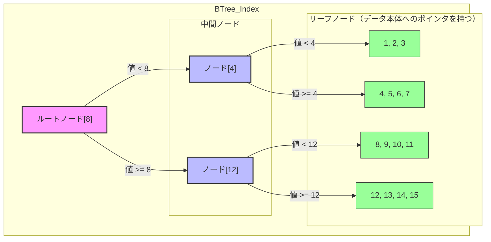

### 【1年目エンジニア向け】SQLを速くする！PostgreSQLのインデックスと実行計画入門

#### はじめに：なぜこれが重要なのか？

SQLの基本を学んだ次に待っているのが「**SQLが遅い**」という壁です。特に実務では大量のデータを扱うため、パフォーマンスは非常に重要になります。この問題を解決し、効率的なデータベース操作を行うための必須知識が「**インデックス**」と「**実行計画**」です。

*   **インデックス**: 巨大なデータの中から、目的のデータを高速に見つけ出すための「**索引**」。
*   **実行計画**: あなたが書いたSQLを、データベースがどのような手順で実行するかを示した「**手順書**」。

これらを理解することで、"なぜ遅いのか"を論理的に分析し、改善できるようになります。

---

### 第1部：インデックス - データベースを高速化する「索引」

#### 1-1. インデックスとは？

インデックスは、テーブルの全データを先頭から順に探す「**フルスキャン（シーケンシャルスキャン）**」を防ぎ、目的のデータへ直接アクセスするための仕組みです。

*   **例えるなら**: 厚い技術書の特定の情報を探すとき
    *   **インデックスなし（フルスキャン）**: 1ページ目から順に読んでいく。非常に時間がかかる。
    *   **インデックスあり**: 巻末の索引でキーワードを探し、指定されたページに直接飛ぶ。圧倒的に速い。

#### 1-2. なぜ速くなるの？（B-Tree構造の基本）

ここでは、`users`テーブルに`user_id`という連番のIDがあり、この`user_id`列にインデックスが作成されていると仮定します。

**探したいデータ:** `WHERE user_id = 11`


##### 1. インデックスがない場合：フルスキャン (Sequential Scan)

データベースは、`users`テーブルのデータを先頭から1行ずつ順番にチェックしていきます。

1.  `user_id = 1` か？ → 違う
2.  `user_id = 2` か？ → 違う
3.  `user_id = 3` か？ → 違う
    ...
4. `user_id = 10` か？ → 違う
5. **`user_id = 11` か？ → 発見！**

この方法では、目的のデータを見つけるまでに**11回のデータアクセス**が必要でした。データがテーブルの最後の方にあれば、ほぼ全ての行を読むことになります。


##### 2. インデックスがある場合：B-Tree検索 (Index Scan)

`user_id`列にインデックスを作成すると、データベース内部に以下のような**ソート済みの階層構造（B-Tree）**が作られます。

**【B-Treeインデックスの構造図】**



このB-Treeを使って `user_id = 11` を探す場合、データベースは以下の手順で検索します。

**【検索ステップ】**

1.  **Step 1: ルートノードから開始**
    *   ルートノードの値は `[8]` です。
    *   探している `11` は `8` よりも大きいので、**右の分岐**に進みます。
    *   **アクセス回数: 1**

2.  **Step 2: 中間ノードへ**
    *   `[12]` が格納されている中間ノードに到着します。
    *   探している `11` は `12` よりも小さいので、**左の分岐**に進みます。
    *   **アクセス回数: 2**

3.  **Step 3: リーフノードで発見**
    *   `[8, 9, 10, 11]` が格納されているリーフノードに到着します。
    *   このノード内を探して `11` を発見します。リーフノードには、`user_id = 11` のデータがテーブル本体のどこに保存されているかの**位置情報（ポインタ）**が格納されています。
    *   **アクセス回数: 3**

4.  **Step 4: データ本体へアクセス**
    *   取得した位置情報を元に、テーブル本体へ直接アクセスし、目的の行データを取得します。


##### 結論：なぜインデックスが速いのか？

| 検索方法 | データアクセス回数 (user_id=11の場合) |
| :--- | :--- |
| **フルスキャン** | **11回** |
| **B-Treeインデックス** | **3回** (+ テーブル本体への1回) |

この例では数回の差ですが、実務で扱うデータが**数百万件、数千万件**になると、その差は決定的になります。

*   **フルスキャン**: データ量に比例してアクセス回数が増え、どんどん遅くなります。
*   **B-Treeインデックス**: データ量が爆発的に増えても、B-Treeの**階層が少し増えるだけ**です。そのため、常に数回〜十数回のアクセスで目的のデータにたどり着くことができ、検索速度がほとんど落ちません。

これが、インデックスがフルスキャンよりも圧倒的に高速な理由です。


#### 1-3. 実務で使うインデックスの種類と作り方

インデックスにはいくつかの種類があり、用途に応じて使い分けることが重要です。

| 種類 | 説明 | こんな時に使う |
| :--- | :--- | :--- |
| **単一列インデックス** | 1つの列に対して作成する最も基本的なインデックス。 | `WHERE user_id = 123` のように、特定の1列で検索する場合。 |
| **複合インデックス** | 複数の列を組み合わせて作成するインデックス。**列の順番が超重要**。 | `WHERE category = 'A' AND price > 1000` のように、複数の条件で検索する場合。 |
| **カバリングインデックス** | 取得したいデータが全てインデックスに含まれている状態。テーブル本体を見に行かずに済むため最速。 | `SELECT user_id, user_name FROM ...` のクエリで `(user_id)` に `user_name` を含めたインデックスがある場合。 |
| **関数インデックス** | 列を関数で加工した結果に対して作成するインデックス。 | `WHERE LOWER(email) = '...'` のように、検索条件で関数を使っている場合。 |


**各種インデックスの作成方法（SQL例）**

**1. 単一列インデックスの作成**
```sql
-- users テーブルの email 列にインデックスを作成
CREATE INDEX idx_users_email ON users (email);
```

**2. 複合インデックスの作成**
` (A, B)` という順でインデックスを作った場合、`WHERE A = ?` や `WHERE A = ? AND B = ?` では効きますが、`WHERE B = ?` だけでは効率的に使えません。これは「辞書で2文字目だけ分かっていても引けない」のと同じです。
```sql
-- products テーブルの category_id と price 列に複合インデックスを作成
-- category_id で絞り、次に price で絞るクエリに有効
CREATE INDEX idx_products_category_price ON products (category_id, price);
```

**3. カバリングインデックスの作成 (PostgreSQLの `INCLUDE`句)**
テーブル本体へのアクセスをなくし、`Index Only Scan` を狙います。
```sql
-- orders テーブルの user_id をキーとし、order_date と total_amount をインデックスに含める
CREATE INDEX idx_orders_user_id_cover ON orders (user_id) INCLUDE (order_date, total_amount);
```

**4. 関数インデックスの作成**
`WHERE`句で使っている関数と全く同じ式でインデックスを作成します。
```sql
-- users テーブルの email 列を小文字に変換した結果にインデックスを作成
CREATE INDEX idx_users_lower_email ON users (LOWER(email));
```

---

#### 1-4. 【重要】インデックスが効かない！よくある落とし穴

1.  **`LIKE`検索で、検索語の先頭に`%`を使っている**
    *   **例**: `WHERE name LIKE '%田中%'`
    *   **なぜ？**: B-Treeは先頭の文字からソートされているため、途中や末尾の文字では索引を引けません。
2.  **インデックスを付けた列に関数を適用している**
    *   **例**: `WHERE LOWER(email) = 'test@example.com'`
    *   **なぜ？**: インデックスは元の`email`の値で作成されているため、`LOWER()`で加工された値とは一致せず、使えません。
    *   **対策**: このような場合は**関数インデックス**を作成することで解決できます。

#### 1-5. インデックスのデメリット（増やしすぎはNG）

*   **書き込み性能の低下**: `INSERT`, `UPDATE`, `DELETE` のたびにインデックスも更新する必要があるため、処理が遅くなります。
*   **ストレージ容量の消費**: インデックスもデータなので、ディスク容量を使います。

**「遅いクエリを見つけたら、EXPLAINで確認し、本当に必要なインデックスだけを作る」**のが鉄則です。


### 第2部：実行計画 - SQLの「手順書」を読んでみよう

#### 2-1. `EXPLAIN ANALYZE` でSQLの健康診断

PostgreSQLで実行計画を確認するには`EXPLAIN`コマンドを使います。
*   `EXPLAIN SELECT ...`: **推定**の実行計画を表示します（クエリは実行されない）。
*   `EXPLAIN ANALYZE SELECT ...`: **実際にクエリを実行**し、その結果（実測値）を含んだ実行計画を表示します。

**実務では、まず `EXPLAIN ANALYZE` を使って、実際の実行時間や処理行数を確認することが非常に重要です。**

#### 2-2. 実行計画の最重要チェックポイント

`EXPLAIN ANALYZE`の結果で特に注目すべきは「データへのアクセス方法」と「テーブルの結合方法」です。

**① データへのアクセス方法**

| キーワード               | 説明                                | 評価                                              |
| :------------------ | :-------------------------------- | :---------------------------------------------- |
| **Seq Scan**        | シーケンシャルスキャン。テーブルを全件スキャンする。        | △ 大量のデータを取得するなら効率的だが、少量の場合はインデックスが効いていない可能性が高い。 |
| **Index Scan**      | インデックスを使ってデータを絞り込み、テーブル本体にアクセスする。 | ○ 狙い通り。効率的な検索ができている。                            |
| **Index Only Scan** | インデックスの情報だけで完結し、テーブル本体へのアクセスがない。  | ◎ 最も高速なアクセス方法の一つ。                               |

**② テーブルの結合方法 (JOIN方式)**
データベースは、テーブルを結合する際に状況に応じて最適なアルゴリズムを選択します。

| JOIN方式 | どんな時に選ばれるか？ | 実行計画でのキーワード |
| :--- | :--- | :--- |
| **ネステッドループ結合**<br>(Nested Loop) | ・片方のテーブルが非常に小さい場合。<br>・内部テーブルの結合キーにインデックスがあり、高速にアクセスできる場合。 | `Nested Loop` |
| **ハッシュ結合**<br>(Hash Join) | ・巨大なテーブル同士の結合。<br>・結合キーにインデックスがない場合でも高速に動作する。<br>・等価結合 (`=`) で使われる。 | `Hash Join` |
| **マージ結合**<br>(Merge Join) | ・両方のテーブルが結合キーでソート済みの場合に非常に高速。<br>・等価結合だけでなく、範囲結合 (`>`,`<`)でも使われる。 | `Merge Join` |

---

### 【結論】1年目のエンジニアが実務でやるべきこと

#### Step 1: 遅いクエリを見つけ、`EXPLAIN ANALYZE` を実行する

まず、遅いSQLを特定します。次に、そのSQLの先頭に `EXPLAIN ANALYZE` を付けて実行し、「**実際の実行計画**」と「**実際の実行時間 (actual time)**」を把握します。

#### Step 2: 実行計画を3つのポイントで分析する

1.  **【最重要】インデックスは使われているか？ (`Seq Scan` になっていないか？)**
    *   少数の行を取得したいクエリで `Seq Scan` が発生している場合、それがボトルネックである可能性が高いです。インデックスの追加や、クエリの書き方の見直し（関数インデックスなど）を検討します。
    *   **注意**: 取得するデータが多い場合は `Seq Scan` の方が速いこともあります。必ずしも悪ではありません。

2.  **【ボトルネック特定】実行時間 (actual time) が極端に長い処理はどこか？**
    *   実行計画の各行の `actual time` を見て、特に時間がかかっている箇所を特定します。非効率なテーブルスキャンやJOINが原因であることが多いです。

3.  **【DBの勘違い？】推定行数 (rows) と実行行数 (actual rows) はかけ離れていないか？**
    *   `rows=10` (推定) なのに `actual rows=500000` (実際) のように、推定と実際が大きく乖離している場合、データベースの**統計情報**が古くなっている可能性があります。

#### Step 3: 改善策を試し、効果を検証する

分析結果を元に、改善策を実施します。

*   **インデックスの追加・修正**: `CREATE INDEX`で適切なインデックスを作成します。
*   **統計情報の更新**: 統計情報が古いと判断した場合、以下のコマンドで最新化します。これにより、データベースがより現実に即した実行計画を立てられるようになります。
    ```sql
    -- 特定のテーブルの統計情報を更新
    ANALYZE テーブル名;
    ```
*   **SQLの書き換え**: より効率的なSQLに修正します。

改善策を実施したら、**必ずもう一度 `EXPLAIN ANALYZE` を実行し**、実行時間が短くなったか、実行計画が意図通りに変わったかを確認します。このサイクルを回すことが、パフォーマンスチューニングの基本です。