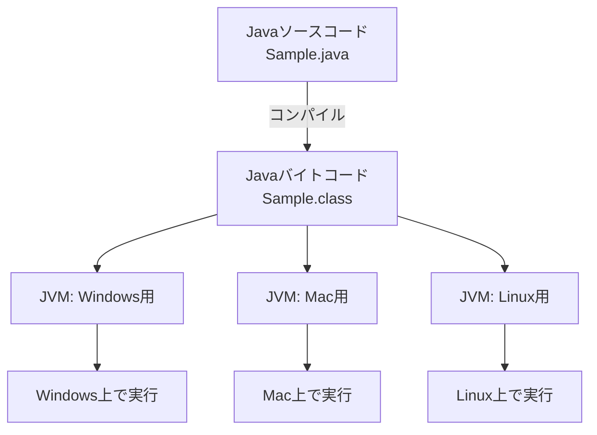
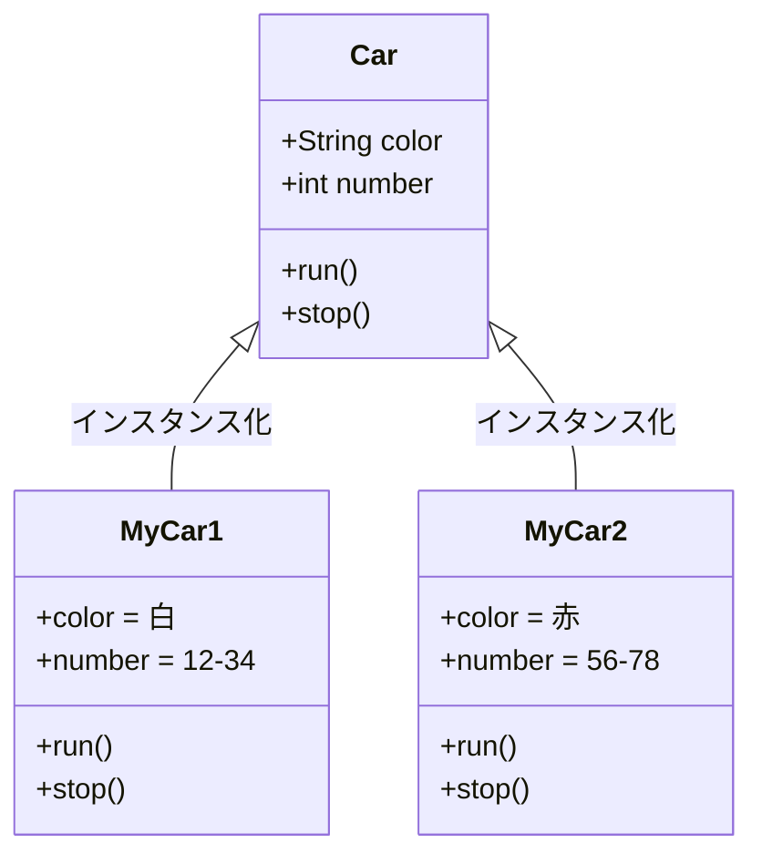
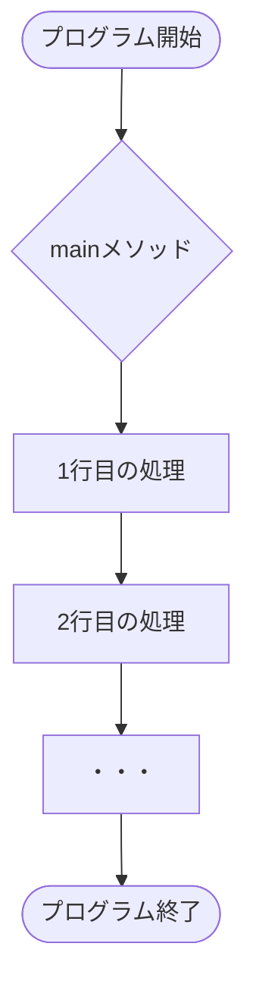
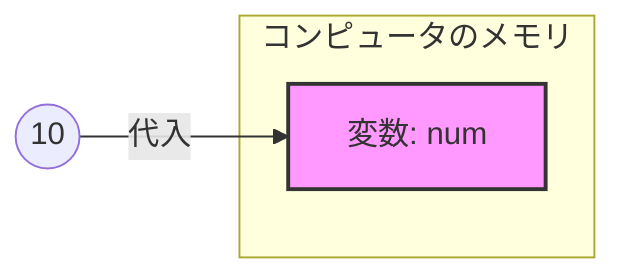
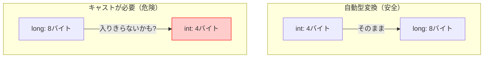
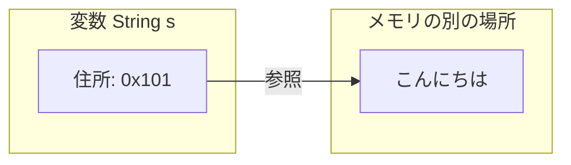
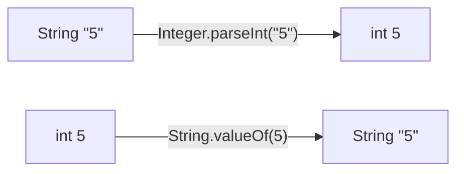

# Lesson 1 - 始めの一歩

## プログラムとは
- **コンピュータへの「指示書」**：コンピュータにやってほしい仕事を順番に書いたものです。
- 研修では「Java」という言語を使って、この指示書の書き方を学びます。

## Javaの特徴

### 1. OSに依存しない（どこでも動く）
- 通常、コンピュータは「機械語」しか理解できません。
- Javaは一度、プログラムを「**Javaバイトコード**」という共通の形式に翻訳（**コンパイル**）されます。
- **Java仮想マシン**（JVM）が、その環境（Windows, Mac, Linuxなど）に合わせた機械語に翻訳しながら実行します。
- **「Write Once, Run Anywhere**（一度書けば、どこでも動く）」が合言葉です。



> javaファイルとclassファイルを見せ、コンパイルの概念を教える。
> 研修の開発環境では、リアルタイムで差分を取り込んでコンパイルされます。

### 2. オブジェクト指向
- **オブジェクト**（＝モノ）を組み立ててプログラムを作る考え方です。
- **クラス（設計図）**：モノの特徴や動きを定義したもの。
- **インスタンス（実体）**：設計図から作られた実際のモノ。
- **例：車**
    - データ（属性）：ナンバー、色、ガソリン量
    - 操作（振る舞い）：走る、止まる、曲がる
- **メリット**：大規模な開発でも、部品ごとに分担して作りやすく、修正もしやすくなります。
    - ※今は「複雑なものを整理して作るための仕組み」という理解でOKです。



## 開発環境（VS Code）について
- 本研修では **Visual Studio Code (VS Code)** を使用します。
- 本来は軽量なエディタですが、拡張機能を入れることで「IDE（統合開発環境）」と同じように強力なサポート（エラーの自動検知や入力補完）が受けられます。

## プログラムを書く際の絶対ルール
1. **大文字・小文字を厳格に区別する**：`Main` と `main` は別物です。
2. **括弧の種類を区別する**：`()`と`{}`と`[]`は別物です。
3. **半角・全角を区別する**：コード内に**全角スペース**が混じるとエラーになります。
4. **文末にはセミコロン `;`**：日本語の「。」と同じ役割です。
5. **基本的に英語**。

### ケアレスミスを防ぐには？
- VS Codeで「**<font color="#ff0000">赤い波線</font>**」が出たら、そこにマウスを当ててエラー内容を確認しましょう。
- 「コンパイルエラー（翻訳失敗）」は、実行する前にVS Codeが教えてくれます。

> セミコロン忘れたりした場合のコンパイルエラーを見せる。
> 一緒にエラーを読んでみる。（分からなければ、翻訳して読んでみる。）エラー文を読む習慣を付けさせる。

---

# Lesson 2 - Javaの基本

## Javaの構造
Javaは以下の3つの階層で管理されます。
1. **プロジェクト**：作成するアプリ全体の入れ物。
2. **パッケージ**：フォルダのようなもの。関連するプログラムをまとめます。
3. **クラス**：プログラム本体。

> vscodeでプロジェクトの作り方から見せる。
> package文が必要なことを伝え、ただ自動で作られるので最初のうちは意識しなくていいことを伝える。

### クラス作成のルール
- **ファイル名とクラス名は一致させる**（例：`Sample1.java` の中は `public class Sample1`）。
- **クラス名は必ず「大文字」から始める**。＝**パスカルケース**で書くこと！（例：`SampleService`）

## mainメソッド：すべての始まり
```java
public static void main(String[] args) {
    // ここに処理を書く
}
```
- プログラムを実行すると、この `main` の中身が**上から順番に**実行されます（順次構造）。



> mainメソッドがプログラムの入口であることを伝える。
> mainメソッドのブロックの中に処理を書いていくことを伝える。
> 処理は一行ずつ上から順番に実行されることを伝える。
## クラスライブラリ（便利な部品集）
- Javaには、最初から「画面に文字を出す」「計算する」「日付を扱う」といった便利な部品が大量に用意されています。
- **すべてを覚える必要はありません。** 必要に応じて検索したり、補完機能を使います。

> systemoutを使って見せる。
> ここでは他の人が作ったプログラム（ライブラリ）を呼び出して使っていることを伝える。
> importで使うライブラリを宣言する必要があることを伝え、だだ方法としてはクイックフィックスを利用できることを伝える。

### 【デモ】VS Codeの強力な補完機能
- `main` と打って `Enter` ⇒ `public static void main...` が自動入力される。
- `sysout` と打って `Enter` ⇒ `System.out.println();` が自動入力される。
- **Ctrl + Space**：候補を表示する魔法のショートカット。

> vscodeで補完機能を見せる。

---

# Lesson 3 - 変数

## 変数とは
- 「**値を入れておくための箱**」です。
- 実際には、コンピュータの**メモリ**（記憶装置）に値を保存します。


> 実際にはpcのメモリに場所が確保され、そこに値が記憶されることを伝える。
## 変数のルール
1. **データ型を決める**：箱の「大きさ」や「種類」を決めます。
2. **名前をつける**：後で呼び出せるように名前（変数名）をつけます。
    - **ルール**：小文字で始める（例：`schoolName`, `userAge`）。2つ目の単語の頭を大文字にする（**キャメルケース**）。
    - **命名**：箱に何が入ってるか分かりやすい名前にする。
3. **目的**：
	- 値に名前を付けて管理しやすくなります。（`int price = 100`とすれば、それが値段を表していることが分かります。）
	- 何度も使いまわすことができます。
## 基本的な型（プリミティブ型）
| 型 | 入れるもの | 例 |
| :--- | :--- | :--- |
| `int` | 整数 | `10`, `-500` |
| `double` | 小数 | `3.14`, `-0.1` |
| `boolean` | 真偽（Yes/No） | `true`, `false` |
| `long` | 大きな整数 | `10000000000L` |

> 変数定義はメモリに宣言した大きさの場所を確保する作業であることを伝える。
## 変数の使い方

```java
int num;       // 1. 宣言（箱を用意する）
num = 10;      // 2. 代入（箱に値を入れる）

int price = 500; // 3. 初期化（1と2を同時にやる）←基本的にこちらをで書く習慣を付けましょう！
```

> 「＝」は数学とは違いプログラムでは代入の意味になることを伝える。
> 変数定義と代入という二つの処理があることを伝える。
> その２つの処理は１行で書くように習慣づけてもらう。

### 型の不一致（エラー）
```java
int number = 3.14; // エラー！ 整数用の箱に小数は入りません。
```
- これを**コンパイルエラー**と言います。翻訳の段階で「無理です」と怒られます。今回は型の不一致の例でしたが、他の原因でも翻訳できないものはすべてコンパイルエラーになります。


### リテラル
プログラムの中で変数に代入する「**値そのもの（書き方）**」のことです。
人間からしたら同じ数字でも`10`と書くのと`"10"`と書くのでは、プログラムは違うものだと認識します。

| 種類      | 例               | 補足                     |
| :------ | :-------------- | :--------------------- |
| **整数**  | `10`, `100L`    | `L`をつけるとlong型          |
| **小数**  | `3.14`, `0.1f`  | `f`をつけるとfloat型         |
| **文字**  | `'あ'`, `'A'`    | シングルクォートで1文字           |
| **文字列** | `"Java"`        | ダブルクォートで囲む             |
| **真偽**  | `true`, `false` | 小文字で書く                 |
| **空**   | `null`          | 参照型変数の初期値などに使用（後で紹介する） |

> vscodeで文字に色が付いてることで、視覚的にプログラムがリテラルを違うものとして認識していることを見せる。

### 変数の再代入
何か値を持ってる変数を別の変数に代入することができます。

```java
int num1 = 10;
int num2 = num1; // num1の10を取り出して、それをnum2に代入している。
```


## 入力処理
```java
import java.io.*; // 1. 必要な部品をインポート

public class Sample {
    // 2. 「throws IOException」を付ける（エラーへの備え）
    public static void main(String[] args) throws IOException {
        
        // 3. 入力のための「準備」
        BufferedReader br = new BufferedReader(new InputStreamReader(System.in));

        System.out.println("文字列を入力してください：");

        // 4. キーボードから一行読み込む
        String str = br.readLine();

        System.out.println(str + " と入力されました。");
    }
}
```
- **おまじない**: `throws IOException` がないと、入力エラーが起きたときに対応できず、コンパイルエラーになります。
- **VS Codeの使い方**: `Alt + Shift + O` を押すと、一番上の `import` 文を自動で整理してくれます。
- **readLine()**: この命令は必ず **String型（文字列）** として値を読み込みます。

> vscodeでおまじないの出し方を教える。
> 簡単に`br`には文字を読み取るモノを代入し、`br.readLine();`で一行読むという処理を実行させていることを伝える。
> `br.readLine();`が実行されるとコンソールから入力待ちになることを伝える。
> 複数回入力したい場合は、`br.readLine();`を何度も実行すればいいことを伝える。

---

# Lesson 4 - 式と演算子

## 算術演算子
- `+` (足し算), `-` (引き算), `*` (掛け算), `/` (割り算), `%` (余り)
- `num =  num + 1;`は、`num += 1;`のように、より簡潔に計算と代入を書くことができます。
- 文字列に `+` を使うと、文字の連結になります（例：`"Java" + 17` → `"Java17"`）。
- インクリメントとデクリメントを使って、簡潔に書けます（例：`num++`、`num--`）。

> 数値リテラル同士で計算してみせる。
> 文字リテラルと数値リテラルの足し算が文字連結になってしまうことを見せる。
> 
> 今度は変数を使って計算してみせる。
> インクリメントを見せる。


## 型変換（キャスト）
サイズが違う型同士で値を移動させるときに必要です。

### 1. 自動型変換（小さい方 → 大きい方）
```java
int a = 10;
long b = a; // OK! 小さなコップの水を大きなバケツに移すイメージ
```

### 2. 強制型変換：キャスト（大きい方 → 小さい方）
```java
long c = 10L;
int d = (int)c; // (型名) を付けて、無理やり入れる
```
- **注意**：大きなバケツの水を小さなコップに移すようなものなので、溢れてデータが壊れるリスクがあります。それを承知の上で「プログラマの責任で」行うのがキャストです。




## 参照型（Stringなど）
- 基本型（intなど）は「値そのもの」を箱に入れます。
- **参照型**（先頭が大文字の型）は、データの「**メモリ上の住所**（参照先）」を箱に入れます。



> ここでは、型には基本型と参照型があること、基本型は8種類で、参照型は無限にあることを伝える。
> Stringは参照型であることを伝える。

### 型の変換（String ⇔ 数値）
Stringは参照型なので、`(int)` のようなキャストは使えません。専用の命令を使います。

- **String ⇒ int**
  ```java
  String s = "100";
  int n = Integer.parseInt(s);
  ```
- **int ⇒ String**
  ```java
  int n = 100;
  String s = String.valueOf(n); // または Integer.toString(n)
  ```




> 文字列から数値はキャストできないことを伝える。
> 代わりに、ライブラリにある変換処理を使う方法を伝える。

---

> 課題について
> 課題の提出方法について


---

### 講師向け：
- **実演（デモ）のタイミング**：
    - `sysout` の補完を最初に見せると、受講生は「全部打たなくていいんだ！」と心理的ハードルが下がります。
    - エラー（全角スペース混入やセミコロン忘れ）をわざと起こして、VS Codeの赤い線の見せ方、マウスホバーでのメッセージ確認を実演してください。
- **質問の投げかけ**：
    - 「この変数に小数を代入したらどうなると思いますか？」
    - 「`"10" + "20"` の結果は何になるでしょうか？（答え："1020"）」
    など、こまめにクイズを挟むと飽き防止になります。