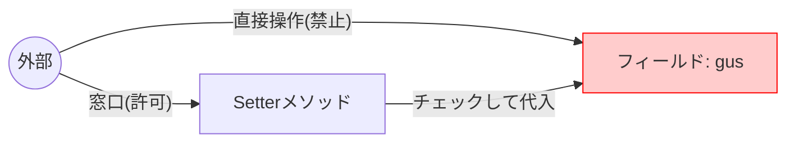
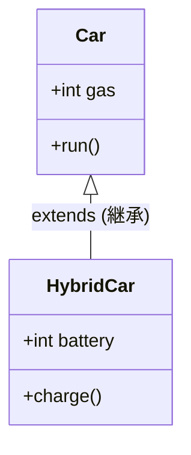
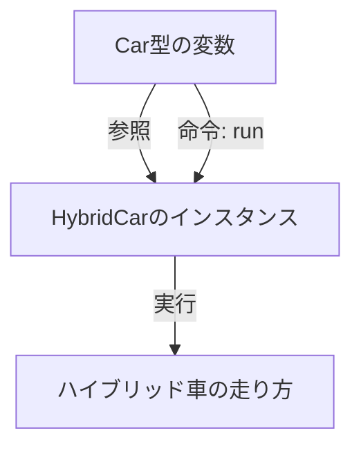

# Lesson 11 - 継承とオブジェクト指向の三原則

## 1. オブジェクト指向の再確認
オブジェクト指向とは、**「データ」と「操作（メソッド）」をセットにした部品**（オブジェクト）を組み合わせてプログラムを作る手法です。

なぜこんなことをするのか？
それは、**「後で直しやすい（メンテナンス性が高い）」**プログラムにするためです。

---

## 2. カプセル化（データの保護）
詳細な中身を隠し、決められた窓口（メソッド）からしか操作させない仕組みです。

### なぜフィールドを `private` にするのか？
もしフィールドが `public` だと、外から勝手にあり得ない値を入れられてしまうリスクがあります。



- **フィールド（インスタンス変数）**: 必ず **`private`** で作成しましょう。
- **static変数（クラス変数）**: 研修では原則**禁止**とします。どこからでも書き換えられてしまい、バグの原因（何が入っているか追えなくなる）になりやすいためです。

> ※やさしいJava確認補佐資料「修飾子」の資料

---

## 3. 継承（機能の引き継ぎ）
すでにあるクラスの機能を引き継いで、新しいクラスを作る仕組みです。これを **「差分プログラミング」** と呼びます。

- **スーパークラス（親クラス）**: 元となるクラス。
- **サブクラス（子クラス）**: 引き継いで作る新しいクラス（キーワード: **`extends`**）。



### 継承のポイント
- 親クラスのフィールドやメソッドをそのまま使える。
- 子クラス独自の機能（メソッドやフィールド）を追加できる。
- **オーバーライド**: 親クラスにあるメソッドを、子クラスで**上書き**して作り直すこと。

---

## 4. オーバーライド と オーバーロード
名前が似ていますが、全く別物です。

| 特徴 | オーバーライド | オーバーロード |
| :--- | :--- | :--- |
| **関係** | **親クラス vs 子クラス** | **同じクラス内** |
| **仕組み** | 親のメソッドを「上書き」する | 引数が違う「同名メソッド」を複数作る |
| **目的** | 機能を変更するため | 利便性を高めるため |

### オーバーロードの身近な例
`System.out.println()` は、引数に `int` を入れても `String` を入れても動きます。これは、引数ごとに多くの `println` メソッドが用意（オーバーロード）されているからです。

---

## 5. ポリモーフィズム（多態性）
「同じ命令を送っても、相手（インスタンス）によって振る舞いが変わる」という性質です。

### ポイント：変数の型 と インスタンスの型
Javaでは、**「親の型」の変数に、「子のインスタンス」を代入する**ことができます。

```java
// 車（親）の型で、ハイブリッド車（子）を扱う
Car myCar = new HybridCar(); 
myCar.run(); // 実行されるのは、HybridCarで書き換えた(オーバーライドした)run
```



### なぜこれが便利なのか？（コレクションの例）
例えば `Map` というインターフェース（共通のルール）があります。
- `HashMap`（速い）
- `LinkedHashMap`（順番を保持する）

これらはどちらも `Map` という型で受け取ることができます。使う側は、中身がどちらであっても「`Map` としてのルール（putやget）」を知っていれば、同じように扱えます。

---

## 6. インターフェースと抽象クラス
これらは「設計図」のさらに元となる **「規約（ルール）」** です。
「このメソッドを必ず実装しなさい」という強制力を持たせることで、プログラムの統一感を保ちます。

- **抽象クラス**: 「だいたいこんな感じ。細かいところは子クラスでやって」という未完成の設計図。
	- クラスを作成する側のため（再利用性）
- **インターフェース**: 「この機能（メソッド）は必ず持っていてね」というルール。
	- インタフェースは使う側のため（窓口）

> ※やさしいJava確認補佐資料「インターフェイス」の資料

---


### 1. `extends` によるコードの削減
1. `Car` クラス（親）を作り、`run()` メソッドを定義する。
2. `ElectricCar` クラス（子）を作り、最初は中身を空っぽ（`extends Car` のみ）にする。
3. `Main` クラスで `HybridCar` を `new` し、何も書いていないはずの `run()` が呼べることを確認させる。

### 2. `@Override` アノテーションの効果
1. 子クラスで `run()` を書き換える際、あえてスペルミス（`runn()` など）をする。
2. その上に `@Override` と書く。
3. VS Codeが「それはオーバーライドになっていませんよ！」とエラーを出してくれる様子を見せ、アノテーションの重要性を伝えてください。

### 3. ポリモーフィズムのメリット体験
1. `Car` 型の配列（または `List<Car>`）を作る。
2. その中に、普通の `Car` インスタンスと `HybridCar` インスタンスを混ぜて入れる。
3. 拡張for文で一気に `run()` を呼び、インスタンスごとに違うメッセージが出る様子を見せる。
   - 「使う側は `Car` として扱っているのに、中身に合わせて動きが変わる」というポリモーフィズムの便利さを視覚的に伝えます。

### 4. VS Codeの「実装への移動」
`Map` インターフェースのメソッド（`put` など）を `Ctrl + クリック` して定義に飛び、その後、実際の実装クラス（`HashMap`）へジャンプする様子を見せ、Javaのライブラリがどのようにポリモーフィズムを活用しているかを紹介してください。