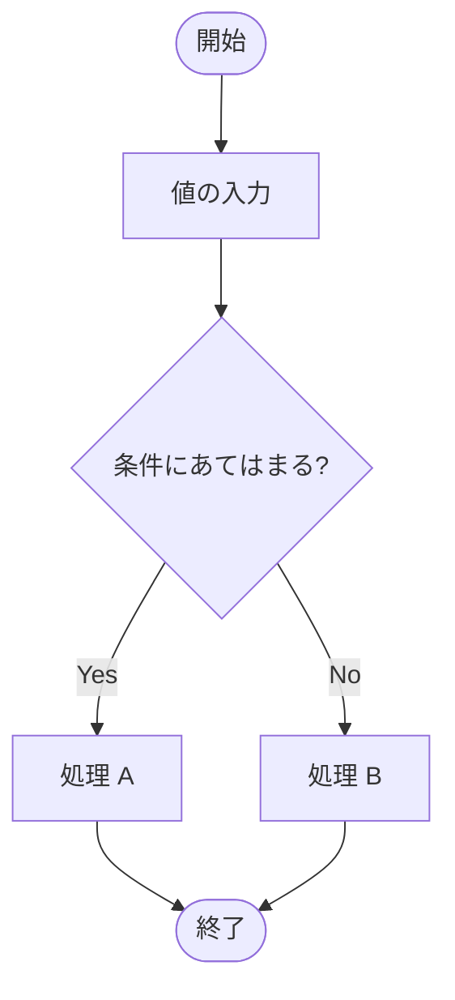
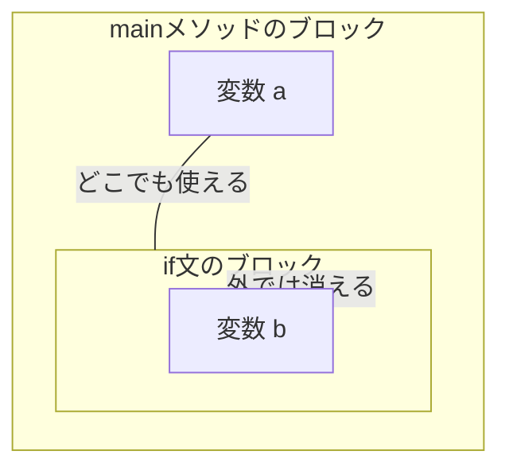

# Lesson5 - フロー制御（条件分岐）

プログラムは通常、上から下へ一行ずつ実行されます（これを**順次構造**と呼びます）。
しかし、特定の条件によって処理を変えたり、スキップしたりすることができます。これが「条件分岐」です。



---

## 1. 関係演算子
二つの値を比較するための記号です。比較した結果は、**true（真）** または **false（偽）** という値になります。

- `>` , `<` : より大きい、より小さい
- `>=` , `<=` : 以上、以下
- `==` : 等しい（※ `=` は代入なので注意！）
- `!=` : 等しくない

### クイズ
次の結果は何型で、何が出力されるでしょうか？
```java
int score = 40;
int border = 60;
boolean result = score >= border;
System.out.println(result);
```
- <font color="#ff0000"><mark style="background:#000000">**答え**: `boolean`型、出力は `false`。</mark></font>

> **講師向けデモ**: 
> 演算子の計算（+ や -）は数値が返るが、関係演算子を使うと結果が `boolean`（true/false）で出てくることを実演します。

---

## 2. if文の基本構造

### if-else文
条件に一致したとき（true）と、しなかったとき（false）で処理を分けます。

```java
if (score >= border) {
    System.out.println("合格"); // trueのとき
} else {
    System.out.println("不合格"); // falseのとき
}
```

#### 初心者への注意点
1.  **中括弧 `{ }` は省略しない**: 命令が1行だけでも必ず書きましょう。
2.  **ブロック**を意識する（`{ }` で囲まれた範囲）。
3.  **インデント（字下げ）を揃える**: VS Codeでは `Shift + Alt + F` で整列。

`else if` を使えば複数条件を指定可能です。
```java
if (score >= 80) {
    System.out.println("A");
} else if (score >= 60) {
    System.out.println("B");
} else {
    System.out.println("C");
}
```

> **講師向けデモ**: 
> `if` の `( )` の中には、最終的に `boolean`（true/false）が入らなければならないことを伝えます。

---

## 3. switch文 と switch式
「ある変数の値が何か」によって処理を分岐させる方法です。Javaには従来の「switch**文**」と、新しい「switch**式**」の2通りの書き方があります。

### ① 従来の「switch文」
値を比較して、一致する `case` のラベルへジャンプします。

```java
int num = 2;
switch (num) {
    case 1:
        System.out.println("1です");
        break; // 必須！
    case 2:
        System.out.println("2です");
        break;
    case 10:
    case 11:
    case 12:
        System.out.println("10以上です");
        break;
    default:
        System.out.println("それ以外です");
        break;
}
```
- **注意点**: `break` を忘れると、下のケースまで実行されてしまいます（フォールスルー）。

### ② 新しい「switch式」（Java 12/14〜）
最近の現場でよく使われる、より安全でスッキリした書き方です。**「矢印（->）」**を使います。

```java
int num = 2;
// 結果を変数に代入できる！
String message = switch (num) {
    case 1 -> "1です";
    case 2 -> "2です";
    default -> "それ以外です"; // switch式ではdefaultがほぼ必須
};
System.out.println(message);
```

#### switch式のメリット
1.  **breakがいらない**: 自動的にそのケースだけで終わるため、書き忘れによるバグが起きません。
2.  **値を返せる**: 分岐した結果を変数にそのまま代入できます。
3.  **書き漏らしを防げる**: 全てのパターンを網羅していないとエラーになるため、安全です。

### if文 と switch の使い分け
- **if文**: 「80点以上」のような**範囲**や、`&&` や `||` を使った複雑な条件に向いています。
- **switch**: 「月（1〜12）」や「曜日」のように、**特定の値との一致**で分ける時に向いています。

---

## 4. ブロックとスコープ
変数が「生きている範囲」のことを**スコープ**と呼びます。Javaでは `{ }`（ブロック）の中で作った変数は、その外側では使えません。



- **鉄則**: 変数の寿命（スコープ）は短いほど良いプログラムとされます。

> **講師向けデモ**: 
> VS Codeでブロックの外側から内部の変数にアクセスしようとして、コンパイルエラー（「変数が見つかりません」）が出る様子を見せます。
> if文をネストさせた書き方も紹介する。

---

## 5. 三項演算子（条件演算子）
`if-else` を一行で書く方法です。

```java
System.out.println(score >= border ? "合格" : "不合格");
```
- **現場の声**: 便利ですが、複雑な条件で使うと読みづらくなるため、簡単な代入以外では禁止している現場もあります。

---

## 6. 参照型の比較（超重要）
数値（intなど）と文字列（String）では比較の方法が違います。

- **基本データ型 (`int` など)**: `==` で値を比較
- **参照型 (`String` など)**: `equals()` メソッドで中身を比較

**VS Codeデモ案**:
```java
String s1 = "abc";
String s2 = new String("abc");
System.out.println(s1 == s2);      // false (正確には住所が違う)
System.out.println(s1.equals(s2)); // true (中身は同じ)
```

> **講師向けデモ**: 
> 1. `equals()` を使わないと、見た目上同じ文字でも `false` になる場合があることを実演。
> 2. 安全な書き方として、`"abc".equals(str)`（定数を左に書く）を紹介します。これにより `str` が `null` の場合でもエラー（ヌルポ）を防げます。
> **ここでは、基礎型の比較は関係演算子で、文字列型の比較はeqalsメソッドでと覚えてもらうだけで大丈夫！**

---

## 7. 論理演算子（かつ・または）
複数の条件を組み合わせます。

- `&&` (AND): かつ（両方trueならtrue）
- `||` (OR): または（どちらかtrueならtrue）
- `!` (NOT): 〜ではない（true/falseを反転）

### 短絡評価（ショートサーキット）
Javaは無駄な計算をしません。
- `A && B` : Aが `false` なら、Bは見ずに `false` と確定。
- `A || B` : Aが `true` なら、Bは見ずに `true` と確定。

---

## 8. 優先順位と括弧 `( )`
`&&` は `||` よりも優先的に計算されます。意図しない動きを防ぐため、**「または」を先に計算したい場合は必ず括弧**を付けましょう。

### 実例：試験の合否判定
**条件：中間か期末どちらかが80点以上、かつレポートを提出(0点以外)していること**

```java
int midTerm = 90;
int finalTerm = 40;
int report = 0;

// ❌ 意図しない判定（「期末80以上かつレポート提出」 または 「中間80以上」）
if (midTerm >= 80 || finalTerm >= 80 && report != 0) { ... }

// ✅ 正しい判定（括弧で「試験」をひとまとめにする）
if ((midTerm >= 80 || finalTerm >= 80) && report != 0) { ... }
```

---

## 9. ド・モルガンの法則（条件の反転）
「AでもBでもCでもない」という条件を書きたい時、2通りの書き方があります。

1.  **「Aではない」かつ「Bではない」かつ「Cではない」**
    ```java
    if (!"a".equals(s) && !"b".equals(s) && !"c".equals(s))
    ```
2.  **「A、B、Cのどれか」ではない**（こちらの方が直感的でミスが少ない）
    ```java
    if (!("a".equals(s) || "b".equals(s) || "c".equals(s)))
    ```

---

### 講師向け：

1.  **switch文のbreak忘れデモ**
    `break` をわざと抜いて、下のケースの処理まで動いてしまう（フォールスルー）様子を見せると、`break` の必要性が一発で伝わります。
2.  **if文のネスト（入れ子）**
    `else if` を使わずに `if` の中に `if` を書くパターンを見せ、「読みづらさ」を実感させてから `else if` や論理演算子を紹介すると、ありがたみが伝わります。
3.  **Stringの比較でのヌルポ（NullPointerException）注意**
    `"abc".equals(str)` と書くのと `str.equals("abc")` とでは、`str` が空っぽ（null）の時に挙動が違うことを実演します。
4.  **デバッガの活用**
    VS Codeのデバッグ機能（F5）を使い、ステップ実行で一行ずつ処理がジャンプする様子を見せると、条件分岐の理解が劇的に進みます。