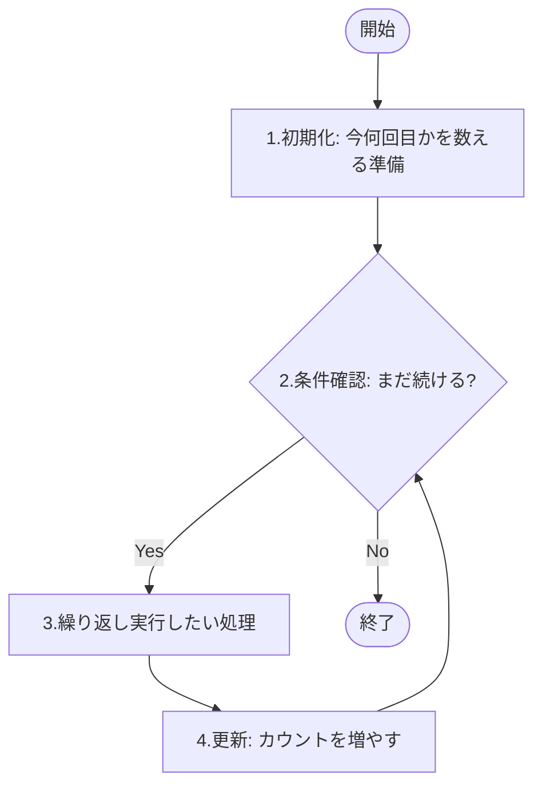
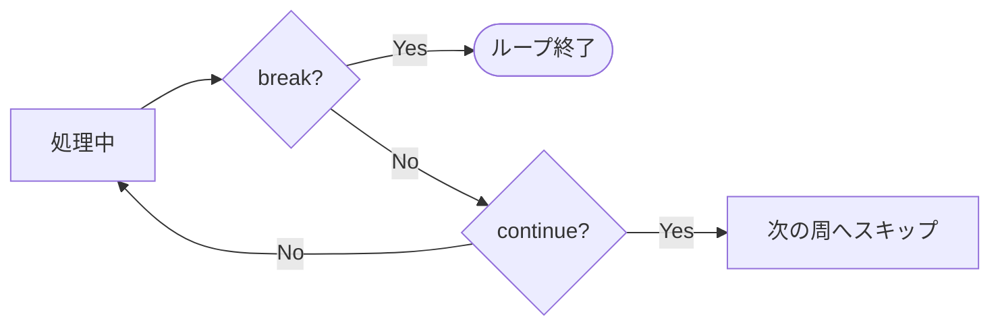

# Lesson 6 - フロー制御（繰り返し）

## 1. 繰り返し処理のイメージ
例えば、「こんにちは」と10回表示したいとき、10行書くのは大変です。繰り返し文を使うと、数行で済み、回数の変更も簡単になります。



---

## 2. for文
決まった回数を繰り返すのに最適な書き方です。

### 構文
```java
for (初期化の式; 反復条件の式; 変化の式) {
    // 繰り返したい処理
}
```

### 例：0から9まで表示する
```java
for (int i = 0; i < 10; i++) {
    System.out.println(i);
}
```

- **初期化 (`int i = 0`)**: 最初に一度だけ実行。カウンタ変数 `i` を用意します。
- **反復条件 (`i < 10`)**: ループの前に毎回チェック。`false` になったら終了します。
- **変化の式 (`i++`)**: 処理が終わるたびに実行。`i` を1ずつ増やします。

#### カウンタ変数の名前について
慣習として `i` (indexの頭文字) が使われます。ループが重なる場合は `j`, `k` とアルファベット順に使っていくのが一般的です。

> ブロックとスコープの復習として、別のループではiを使いまわせることを確認する。

---

## 3. while文 と do-while文
条件が満たされている間、ずっと繰り返す書き方です。

### while文（前判定）
「まず条件を確認」してから実行します。一度も実行されないこともあります。

```java
int i = 0;
while (i < 10) {
    System.out.println(i);
    i++;
}
```

### do-while文（後判定）
「まず一度実行」してから条件を確認します。最低でも必ず1回は実行されます。

```java
int i = 0;
do {
    System.out.println(i);
    i++;
} while (i < 10);
```

> 無限ループになった際の抜け方について説明する。

---

## 4. ループの使い分け
どれを使っても同じ処理は書けますが、「**目的**」によって使い分けるときれいです。

| 構文 | よく使うシーン |
| :--- | :--- |
| **for文** | **回数が決まっている**とき（例：10回繰り返す、配列の要素を全部見る） |
| **while文** | **回数が決まっていない**とき（例：ファイルが空になるまで読み込む、正しい値が入力されるまで待つ） |
| **do-while文** | **最低1回は動かしたい**とき（例：メニュー画面を表示し、その後の入力で継続か決める） |

---

## 5. ループの制御（break と continue）
ループの途中で動きを変える命令です。

- **break**: ループを完全に**脱出**します。
- **continue**: 今の回を飛ばして、**次の回**（更新式）へ進みます。




---

> デバッグの仕方を実演
>
> ネストしたループ文の挙動を実演
> 
> 課題に関して、print文とprintln文の違いを見せる。

---

### 講師向け：

### 1. 無限ループの止め方
`while(true)` などでわざと無限ループを発生させ、ターミナルで **`Ctrl + C`** を押して強制終了させる方法を教えてあげてください。未経験者は「止まらなくなった！」とパニックになりやすいため、対処法を知ると安心します。

### 2. VS Codeのショートカット（スニペット）
- `fori` と入力して `Enter` を押すと、`for (int i = 0; i < ...)` の形が自動で入力されるデモを見せてください。効率的なコーディングを実感できます。

### 3. デバッガでカウンタ変数を追う
- `for` 文の中にブレークポイント（行番号の左の赤い点）を置き、`F5` でデバッグ実行してください。
- `i` の値が `0 → 1 → 2...` と変化していく様子を「変数」パネルで見せると、ループの仕組みが視覚的に一発で理解されます。

### 4. ネスト（多重ループ）の注意点
```java
for (int i = 1; i <= 9; i++) {
    for (int j = 1; j <= 9; j++) {
        System.out.print(i * j + " ");
    }
    System.out.println();
}
```
九九の表などを見せ、「外側のループが1回回る間に、内側が全部回る」という感覚を伝えてください。


