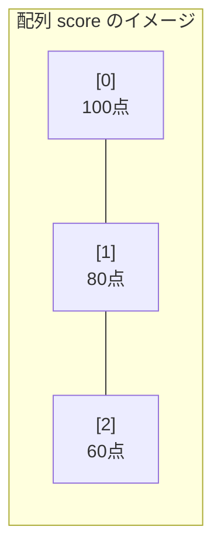
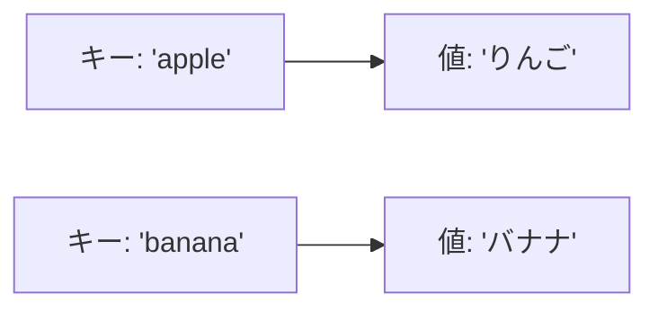
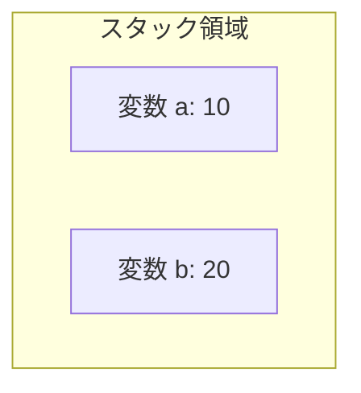
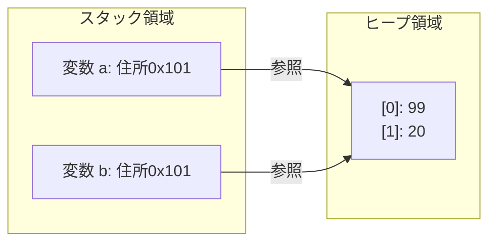

# Lesson 7 - 配列とコレクション

## 1. 配列とは
同じデータ型の変数を一列に並べて、ひとまとめに管理する仕組みです。
「3人分の点数」や「1週間分の気温」などを扱うのに便利です。

### 配列の構造
配列の各部屋には **「インデックス（添字）」** という番号が割り振られます。
**注意：番号は「0」から始まります。**



---

## 2. 配列の使い方

### 配列の宣言と初期化
配列は **「参照型」** です。使うには `new` を使ってメモリ上に「箱」を作る必要があります。

```java
// 1. 長さ3の箱を作る
int[] scores = new int[3]; 

// 2. 値を代入する
scores[0] = 100;
scores[1] = 80;
scores[2] = 60;
```

#### もう一つの書き方（一括初期化）
最初から入れる値が決まっている場合は、以下のように短く書けます。
```java
int[] scores = {100, 80, 60};
```

### 注意点
- **固定長**: 一度 `new int[3]` と決めたら、後から長さを「4」に変えることはできません。
- **インデックス**: 長さが3の場合、使えるのは `0, 1, 2` です。`score[3]` にアクセスするとエラー（例外）でプログラムが止まります。また、インデックスは0から始まります。
- **参照型**: 配列は参照型です。

> 実際に注意点に関してvscodeで挙動を見せる。
> この段階ではnewに関しては書き方だけ伝える。

---

## 3. 配列とループ（for文）

配列の全データを処理するには、`for` 文が最適です。
配列の長さは `配列名.length` で取得できます。

### 基本のfor文
```java
for (int i = 0; i < scores.length; i++) {
    System.out.println(i + "番目の値は " + scores[i]);
}
```

> カウンタ変数 `i` を使うと、「一つ先の要素（i+1）」を参照したり、特定の番号だけ処理したりできる利点があります。

### 拡張for文
「何番目か」という情報（カウンタ変数 `i`）を使わない場合は、もっとシンプルに書けます。
```java
for (int s : scores) {
    System.out.println("値は " + s);
}
```
- **メリット**: インデックスの数え間違い（0からか1からか等）によるバグが起きません。

## 4. ラッパークラスとオートボクシング

コレクションを学ぶ前に、重要な「基本データ型の包み方」について学びます。

### ラッパークラス
後述するコレクション（Listなど）には、**参照型（クラス）しか入れることができない**というルールがあります。そのため、基本データ型を「包んで（ラップして）」参照型として扱うためのクラスが用意されています。

| 基本データ型 | ラッパークラス |
| :--- | :--- |
| `int` | **`Integer`** |
| `double` | **`Double`** |
| `boolean` | **`Boolean`** |
| `char` | **`Character`** |

### オートボクシング
Javaには、基本型と参照型を自動で変換してくれる機能があります。

```java
Integer numObj = 10; // 自動でintをIntegerに変換（オートボクシング）
int num = numObj;    // 自動でIntegerをintに変換（アンボクシング）
```
この機能のおかげで、私たちはあまり型変換を意識せずにコレクションを扱えます。


---

## 5. コレクション（List, Set, Map）

配列は「長さが変えられない」という不便な点があります。実務では、より柔軟な **「コレクション」** をよく使います。


### 代表的なコレクション
| 種類       | 特徴                 | イメージ         |
| :------- | :----------------- | :----------- |
| **List** | 順番通りに並べる。重複OK。     | 出席簿、行列       |
| **Set**  | 重複を許さない。順番は保証されない。 | 全く同じものが入らない袋 |
| **Map**  | 「キー」と「値」をセットで管理する。 | 辞書           |

### ジェネリクス
`List<String>` のように、`< >` を使って「何を入れるための箱か」を指定する仕組みです。これによって、違う型のデータが混ざるのを防ぎ、安全にプログラムを書けます。**ただし、参照型しか指定できません。**

### ① List（リスト）
順番通りに並べて管理します。重複OK。
```java
// List<ラッパークラス> 変数名 = new ArrayList<>();
List<Integer> numbers = new ArrayList<>();
numbers.add(100);
numbers.add(80);
```

### ② Set（セット）
**重複を許さない**「集合」です。同じ値を入れようとしても無視されます。
```java
Set<String> colors = new HashSet<>();
colors.add("Red");
colors.add("Blue");
colors.add("Red"); // これは無視される
```

### ③ Map（マップ）
「キー（Key）」と「値（Value）」をペアで管理します。
```java
Map<String, String> fruitMap = new HashMap<>();
fruitMap.put("apple", "りんご");
fruitMap.put("banaan", "バナナ");
```




---

### 例題で挙動を確認

**ArrayList：**
【質問】何が出力されるか
```java
List<String> list = new ArrayList<>();
list.add("あ");
list.add("い");
list.add("う");
System.out.println(list.get(1));
```
答え：<span style="background:#000000">い</span>

**インデックスを使用したループ**
```java
List<String> list = new ArrayList<>();
list.add("あ");
list.add("い");
list.add("う");
for (int i = 0; i < list.size();i++) {
    System.out.println(list.get(i));
}
```

**拡張for文**
```java
List<String> list = new ArrayList<>();
list.add("あ");
list.add("い");
list.add("う");
for (String str: list) {
    System.out.println(str);
}
```


**HashMap：**
【質問】何が出力されるか
```java
Map<String, String> map = new HashMap<>();
map.put("01", "北海道");
map.put("02", "青森");
map.put("03", "秋田");
System.out.println(map.get("01"));
```
答え：<span style="background:#000000">北海道</span>

**拡張for文**
```java
Map<String, String> map = new HashMap<>();
map.put("01", "北海道");
map.put("02", "青森");
map.put("03", "秋田");
for (Map.Entry<String, String> param : map.entrySet()) {
    System.out.println(param.getKey());
    System.out.println(param.getValue());
}
```

> **命名規則**: 
> - 配列やListの変数名は、複数を表すようにしましょう（例：`scores`, `userList`）。
> - Mapの場合は用途がわかる名前（例：`idToNameMap`）にすると読みやすくなります。

---

## 6. 参照型と基本データ型の正体（メモリの仕組み）

これまで学習してきた変数には、大きく分けて「基本データ型（プリミティブ型）」と「参照型」の2種類がありました。この2つは、コンピュータのメモリ上での「値の持ち方」が決定的に違います。

### メモリの2つの領域
Javaのプログラムが動くとき、メモリは大きく2つの場所に分かれます。
1.  **スタック領域**：変数（箱）そのものが置かれる場所。
2.  **ヒープ領域**：`new` で作られた実体（データの塊）が置かれる場所。

### 基本データ型（値そのものが入る）
`int` や `double` など。スタック領域にある箱の中に、**数値そのもの**が入っています。

```java
int a = 10;
int b = a; // 値をコピー（aの中身をbに複製）
b = 20;    // bを書き換えてもaは10のまま
```

下記のように箱に直接、値が入ってます。



### 参照型（住所が入る）
配列、List、Stringなど。変数という箱の中にはデータそのものではなく、ヒープ領域にあるデータの **「住所（参照値）」** が入っています。

```java
int[] a = {10, 20};
int[] b = a; // 住所をコピー（aと同じ場所を指すようになる）
b[0] = 99;   // b経由で中身を書き換えると...
System.out.println(a[0]); // 99 と出力される！（aも変わってしまう）
```

箱には、住所が入っていて、実態はヒープ領域にあるインスタンスです。



> 値コピーと参照コピー.htmlで説明（参照型と基礎型の違い）

#### nullとは？

参照型の変数に住所が入ってない状態です。

#### なぜ String は `equals()` なのか？（伏線回収）

Lesson 5で学んだ「Stringの比較に `==` を使ってはいけない理由」はここにあります。Stringは参照型なので、、、

- **`==` 演算子**：箱の中身（**住所**）が同じかどうかを比較している。
- **`equals()` メソッド**：住所の先にいって、**データの中身**が同じかどうかを比較している。

```java
String s1 = new String("Java"); // 住所0x500
String s2 = new String("Java"); // 住所0x600

System.out.println(s1 == s2);      // false（住所が違うから）
System.out.println(s1.equals(s2)); // true（中身はどちらも "Java" だから）
```


---

### 例題で挙動を確認


**基礎データ型：**
何が出力されるでしょうか？
```java
int a = 1;
int b = a;
b = 5;
System.out.println(a);
```
答え：<span style="background:#000000">1</span>

**参照型：**
何が出力されるでしょうか？
```java
int[] c = new int[] {1, 2, 3};
int[] d = c;
d[2] = 5;
System.out.println(c[2]);
```
答え：<span style="background:#000000">5</span>


---

### 講師向け：

### 1. 配列の「範囲外エラー」を見せる
わざと `score[3]`（存在しない4番目の部屋）にアクセスし、ターミナルに赤い文字で `ArrayIndexOutOfBoundsException` が出る様子を見せてください。
「初心者が最もよく見るエラーの一つ」として紹介すると印象に残ります。

### 2. `length` の自動補完
`score.` と打った後に、入力候補に `length` が出てくる様子を見せます。
自分で 3 と書かずに、Javaに数えさせるようにしましょう。

### 3. Listの便利さをチラ見せする
配列では `System.out.println(score)` としても中身が見えませんが、`ArrayList` なら中身が綺麗に表示されることを見せると、コレクションの便利さが伝わりやすくなります。
```java
List<String> list = new ArrayList<>();
list.add("Java");
list.add("Python");
System.out.println(list); // [Java, Python] と表示される
```

### 4. `Alt + Shift + O` の再確認
`List` や `ArrayList` を使うには `import java.util.*;` が必要です。赤い波線が出た瞬間にショートカットキーで一気に解決するデモを見せ、開発効率の上げ方を伝授してください。


```
ジェネリクス、オートボクシング、ラッパークラス、変数名を複数形やlistなどにするなど
```