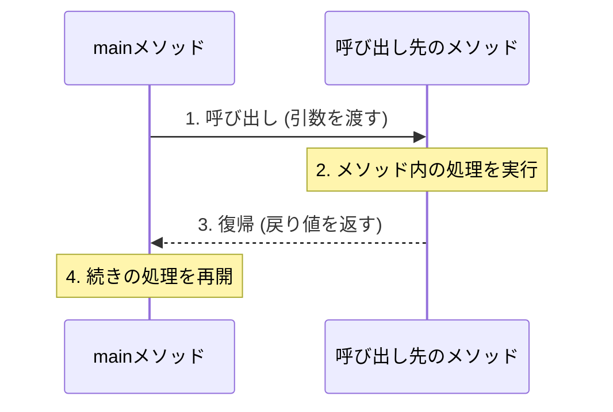
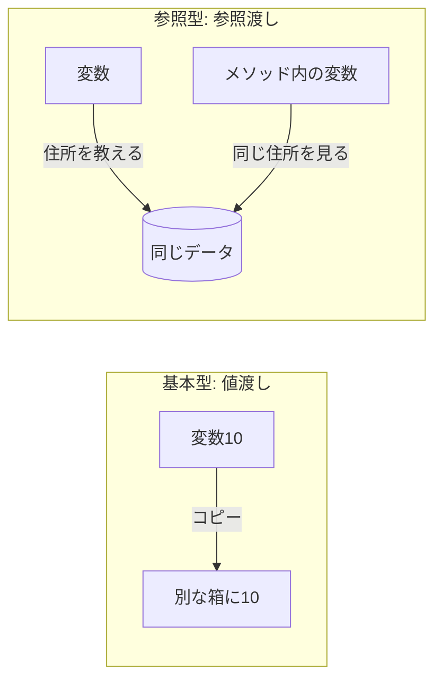

# Lesson 8 - メソッド

## 1. メソッドとは
クラスの中に記述する「特定の機能を持つ処理のまとまり」のことです。

- **再利用性**: 一度作れば、何度でも呼び出せる。
- **見やすさ**: `main` メソッドがスッキリし、何をしているか分かりやすくなる。

> **見やすさに**ついては次回さらに掘り下げます。

---

## 2. メソッドの構造
メソッドは以下のパーツで構成されます。

```java
修飾子 戻り値の型 メソッド名 (引数) {
    // 処理
    return 戻り値; 
}
```

- **メソッド名**: 
	- **小文字**から始め、**キャメルケース**で定義する。
	- 処理内容がわかる名前にする（例: `calculateTax`）。また、動詞＋目的語のような形で書くとメソッドだと分かりやすい。
- **修飾子**: 今日は `private static` を付けるおまじないだと思ってOKです。

> アクセス修飾子はprivateとpublicだけ補足を入れる。privateを付けるとクラスの外から呼べないが、publicを付けるとクラスの外から呼べること。
> メソッドの中にメソッドが書けないことを説明する。

---

## 3. 処理の流れ（呼び出しと復帰）
メソッドが呼ばれると、プログラムの実行場所が一時的に移動します。



> デバッグでスタックフレームの動きを見せる。
> 特に呼び出し元は呼び出し先の処理が終わるまでブロッキングされるところを見せる。

---

## 4. 引数（ひきすう）：メソッドに渡すデータ
メソッドに「材料」を渡す仕組みです。

- **実引数**: 呼び出す側が渡す「実際の値」。
- **仮引数**: メソッド側で値を受け取るための「変数名（**型が必要**）」。

### 【重要】引数の3大ルール
呼び出したいメソッドを特定するためには、以下の3つを必ず一致させる必要があります。
1. **型**（int型ならint型）
2. **数**（2つ渡すなら、2つで受ける）
3. **順番**（名前, 年齢の順なら、その通りに書く）

> メソッド名と引数のシグネチャでメソッドを呼び分けていることを強調する。
> 引数を入れ替えると警告が出ることを見せる（＝呼び出せない）。

「メソッド名」と「引数の型・個数・順序の組み合わせ」を**シグネチャ**と呼び、一意にメソッドを識別するために使われます。

```java
private static 戻り値の型 test (int num, String str) {
    // 処理
    return 戻り値; 
}
```
上記を呼びたければ、メソッド名と引数の型/数/順番を一致させる。
```java
int num = 1;
String str = "hello";

test(num, str);
//test(str, num); // 呼べない
//test(num); // 呼べない
```


```java
private static 戻り値の型 test () {
    // 処理
    return 戻り値; 
}
```
引数を必要としないメソッドを呼ぶ場合も括弧は付ける。
```java
test();
```


---

## 5. 戻り値（もどりち）：メソッドから返る結果
処理した「結果」を呼び出し元に返します。

- **戻り値がある場合**: `int` や `String` など、返すデータの型を指定します。`return` キーワードを必ず使います。
- **戻り値がない場合**: **`void`**（空っぽという意味）を指定します。`return` は不要です。

```java
private static int add (int num1, int num2) {
    return num1 + num2; 
}
```
上記のようにint型の戻り値を返すものを受け取る場合は、呼び出した結果を格納する変数を用意する。
```java
// 戻り値を「受け取って」変数に代入する例
int result = add(10, 20); 
```

> 戻り値の受け取り方を説明する。
> voidの例を見せる。その際にreturnがいらないことを強調する。


---

次に進む前に、基礎型と参照型の違いについて、深堀します。

> 値コピーと参照コピー.htmlで再び復習
## 6. 値渡しと参照渡しの違い
ここは未経験者が混乱しやすいポイントです。

- **基本データ型 (intなど) は「値コピー」**: メソッド内で値を書き換えても、呼び出し元の変数は変わりません（値渡し）。
- **参照型 (配列・Stringなど) は「住所のコピー」**: メソッド内で中身を書き換えると、呼び出し元のデータも変わります（参照渡し）。




> 参照渡し_配列の例.htmlで説明

### 補足：不変オブジェクト

> ※やさしいJava確認補佐資料「String」の資料 
> 参照渡し_不変の例.htmlで説明（参照渡し_配列の例.htmlと比較）

---
## 7. メソッドの具体的な活用パターン
「何をメソッドにすればいいのか？」という疑問に応える、よく使われる4つのパターンです。

### パターンA：共通の見た目を作る（void型）
同じような表示を何度も行う場合、メソッドにまとめると表示内容の変更が一瞬で終わります。

```java
// 区切り線を引くメソッド
private static void printLine() {
    System.out.println("---------------------------------");
}

public static void main(String[] args) {
    printLine();
    System.out.println("      システムメニュー      ");
    printLine();
}
```
**利点**: 「線を太くしたい（`===`）」と思った時、1箇所の修正ですべての線が変わります。

> 何度も再利用する処理をひとまとめにできること。

### パターンB：判定だけを行う（boolean型）
`if` 文の条件式が長くなるのを防ぎ、コードを「日本語（英語）の文章」のように読めるようにします。

```java
// 成人かどうかを判定するメソッド
private static boolean isAdult(int age) {
    return age >= 20;
}

public static void main(String[] args) {
    int myAge = 25;
    if (isAdult(myAge)) {
        System.out.println("お酒を販売できます。");
    }
}
```
**利点**: `if (age >= 20)` と書くより、`if (isAdult(age))` と書くほうが「何を確認しているか」が一目で分かります。

### パターンC：複雑な計算を隠す（計算型）
公式や計算ルールをメソッドの中に隠すことで、`main` メソッドをスッキリさせます。

```java
// 税込み価格を計算するメソッド
private static int calculateTax(int price) {
    double taxRate = 1.1;
    return (int)(price * taxRate);
}
```
**利点**: 消費税が10%から変わったとしても、`main` メソッドを触る必要はありません。

### パターンD：データの加工（String型）
受け取った値を、表示しやすい形に加工して返します。

```java
// 名前を「様」付けに加工するメソッド
private static String formatName(String name) {
    return name + " 様";
}
```

---

## 8. メソッドを作る時の「コツ」

### ① 1つのメソッドには「1つの仕事」だけ
「計算して、表示して、保存する」という巨大なメソッドを作ってはいけません。
- `calculate(...)`
- `display(...)`
のように、役割を分けると使い回し（再利用）がしやすくなります。

### ② return後の処理は実行されない（早期リターン）
`return` が実行された瞬間、そのメソッドは終了して呼び出し元に戻ります。これを利用して、無駄な処理を省くことができます。

```java
private static void checkAge(int age) {
    if (age < 0) {
        System.out.println("エラー：年齢がマイナスです");
        return; // ここで終了。以下の処理はされない。
    }
    System.out.println("年齢は" + age + "歳です");
}
```

> voidはreturnが必須ではないが、

---


下記も組み込みたい。

デバッガで「ステップイン」
- メソッドを呼び出している行で停止させ、**`F11` (ステップイン)** を押します。
- 黄色の矢印が `main` からメソッドの中へジャンプする様子を見せてください。
- 「処理がどこに飛んでいるか」を視覚的に理解させるのに非常に効果的です。

voidとreturnの比較
- `void` のメソッドで `return 10;` と書いてエラーが出る様子。
- `int` 型のメソッドで `return` を書き忘れてエラーが出る様子。
- エラーメッセージを一緒に読み、「戻り値の型が一致していない」ことを確認させてください。

引数の名前は違っていい
```java
int x = 100;
display(x); // 実引数

static void display(int num) { // 仮引数。名前が「num」に変わっても中身は100
    System.out.println(num);
}
```
「実引数の名前と仮引数の名前が同じである必要はない（型さえ合えばいい）」ことを強調すると、初心者の混乱を防げます。