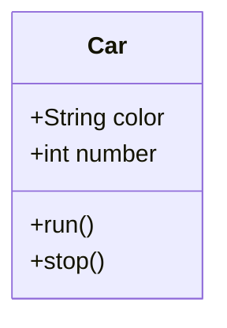
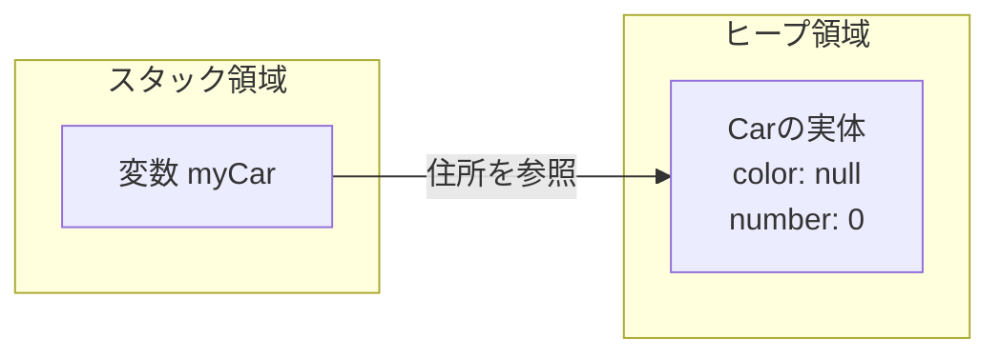

# Lesson 9～10 - クラスとオブジェクト

## 1. クラスとは
クラスとは、「**データ**（属性）」と「**操作**（振る舞い）」をひとまとめにした「**設計図**」のことです。



```java
class クラス名 {
    型名 フィールド名;  // クラスの中、メソッドの外だと思ってください。

    戻り値の型 メソッド名 (引数) {
        …
    }
}
```
- **フィールド**: クラス内で保持するデータ（クラスの直下、メソッドの外で定義）。
- **メソッド**: そのデータを使って行う処理。

> vscodeでクラス名を変更する方法を見せる。

---


## 2. クラスの使い方（インスタンス化）
設計図（クラス）から実体（インスタンス）を作ることを **「newする/インスタンス化する/オブジェクトを生成する」** と言います。

```java
// クラス名 変数名 = new クラス名();
Car myCar = new Car();
```

### メモリのイメージ（参照型）
変数 `myCar` の中には、実体そのものではなく、実体がどこにあるかという **「住所（参照）」** が入ります。



> vscodeのデバッガを使ってインスタンス化されたクラスを見せる
> ※やさしいJava確認補佐資料「null」の資料 
> ※やさしいJava確認補佐資料「static(2)」の資料

---

## 3. アクセス修飾子
設計図のパーツを「どこまで公開するか」を決めます。

| 修飾子 | 範囲 | イメージ |
| :--- | :--- | :--- |
| **public** | どこからでもOK | 公園（誰でも入れる） |
| **private** | **自分のクラス内のみ** | 自宅（家族しか入れない） |

- **鉄則**: フィールド（データ）は原則 **private** にして、勝手に書き換えられないように守ります。これを「カプセル化」と呼びます。

> パッケージプライベートとprotectedにも軽く触れる。

---


## 4. getter と setter
フィールドを `private` にすると、外部（Mainクラスなど）から読み書きできません。そこで、専用の窓口メソッドを作ります。

- **getter**: データを「取得」するメソッド（例：`getColor`）
- **setter**: データを「設定」するメソッド（例：`setColor`）

```java
public class Car {
    private String color;

    // setter: 外から色を受け取ってフィールドに入れる
    public void setColor(String color) {
        this.color = color; // this.color は「このクラスのフィールド」を指す
    }

    // getter: フィールドの色を外に返す
    public String getColor() {
        return this.color;
    }
}
```
**VS Code**: フィールドを右クリック ➜ ソースアクション ➜ Generate Getters and Setters... で自動作成できます。

---

## 5. コンストラクタ
インスタンスを `new` した瞬間に自動で実行される「初期化専用のメソッド」です。
このコンストラクタを使ってのみ、インスタンスは生成されます。
フィールドの値を初期化する目的で使用します。
### ルール
1. 名前は **クラス名と全く同じ** にする。
2. **戻り値（voidなど）を書かない**。

```java
public class Car {
    private String color;

    // 引数ありコンストラクタ
    public Car(String color) {
        this.color = color;
        System.out.println("車を生成しました。色は" + color + "です。");
    }
}
```

### デフォルトコンストラクタ
コンストラクタが設定されてないクラスでは、デフォルトで引数なしのコンストラクタが設定されます。何かコンストラクタが定義されていた場合はデフォルトコンストラクタは作られません。

---

## 6. クラスの記述順序（標準的なルール）
バラバラに書くと読みづらいため、以下の順番で書くのが一般的です。

1. **フィールド**（データ）
2. **コンストラクタ**（初期化）
3. **メソッド**（操作）

---

## 7. コメントの重要性
プログラムは「書く時間」より「他人が読む時間」の方が長いです。

- **Javadoc形式 (`/** ... */`)**: クラスやメソッドの説明に使う。VS Codeでマウスを当てた時に説明が表示されるようになります。
- **単一行コメント (`//`)**: 処理の意図（なぜそうしたか）を書く。

```java
/**
 * 車を管理するクラスです。
 * @author 研修担当
 */
public class Car {
    // 車体の色
    private String color;

    /**
     * 車を走らせるメソッドです。
     */
    public void run() {
        // 時速60キロで走る処理
        System.out.println("走行中...");
    }
}
```

---

### 講師向け：

Lesson 8でメソッドを教えた際、「おまじないで `static` を付けてください」と伝えていたと思います。今回のLesson 9〜10を終えた後、受講生にこう伝えてみてください。

> **「前回までは、インスタンス（newした実体）を使わずに、mainから直接呼べる staticメソッド だけを扱っていました。しかし、本来のJavaは今回学んだように、new して実体を作り、その実体に対して命令を送る（インスタンスメソッド）のが基本の姿です。」**

### 次回予告としての比較
- **staticメソッド**: 「クラス（設計図）」に直接備わっている機能。誰でも共通。
- **インスタンスメソッド**: `new` された「個別のモノ」が持つ機能。そのモノのデータによって結果が変わる。

この対比を次の資料（static(2)）で見せることで、受講生の頭の中の `static` の謎が解けるはずです。

---

### VS Codeでのデモンストレーション案
1. **シンボルの名前変更**: `Car` クラスの名前を右クリックから変更し、別ファイルの `Main.java` 内の記述も一斉に変わる様子を見せる。
2. **自動生成**: Getter/Setterを自力で書く大変さを見せてから、VS Codeの自動生成機能を使い、「一瞬で終わる」様子を見せる。
3. **デバッグ実行**: `new` した直後の変数の上にマウスを置き、中に「ID（参照先）」が入っている様子を確認させる。