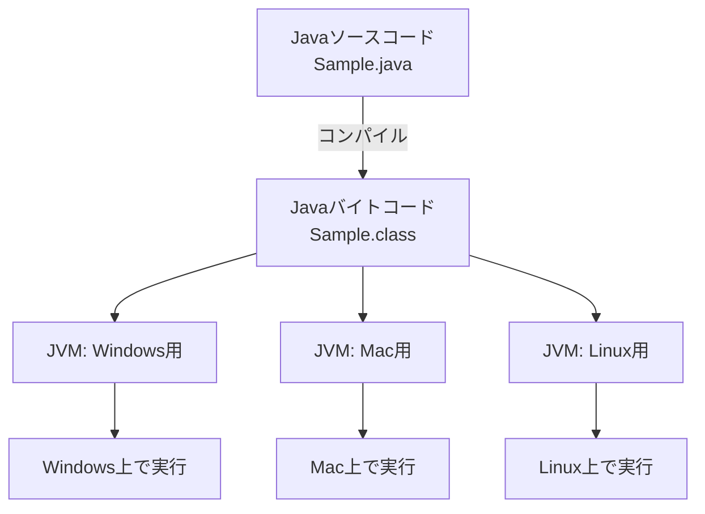
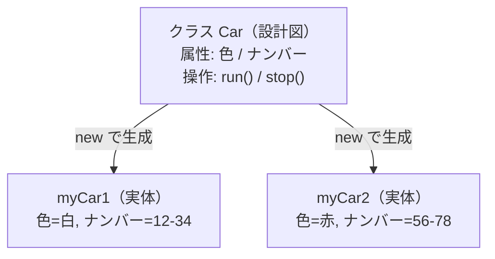
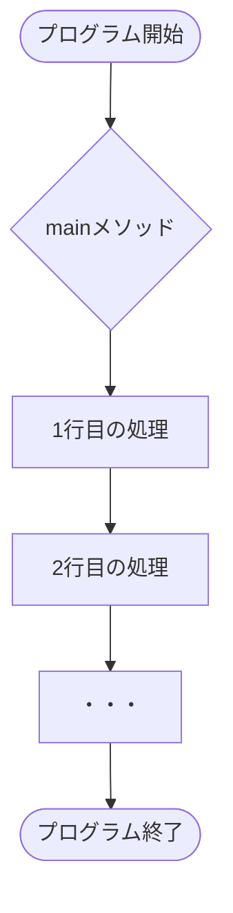
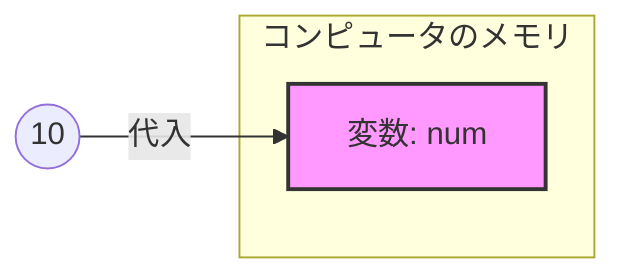
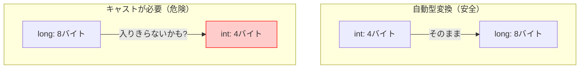
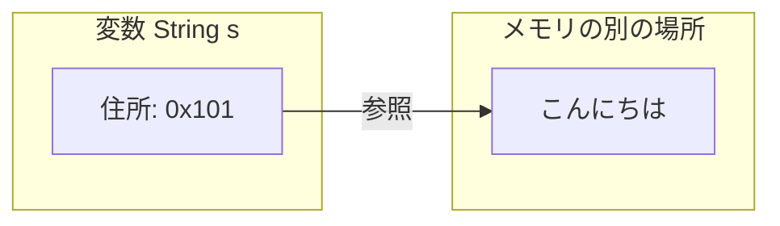
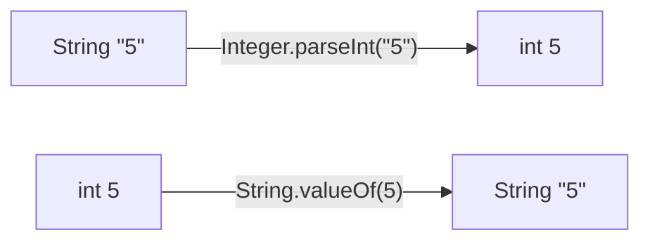

# Lesson 1 - 始めの一歩

## プログラムとは

- **コンピュータへの「指示書」**：コンピュータにやってほしい仕事を順番に書いたものです。
- 研修では「Java」という言語を使って、この指示書の書き方を学びます。

## Javaの特徴

### 1. OSに依存しない（どこでも動く）

- 通常、コンピュータは「機械語」しか理解できません。
- Javaは一度、プログラムを「**Javaバイトコード**」という共通の形式に翻訳（**コンパイル**）します。
- **Java仮想マシン**（JVM）が、その環境（Windows, Mac, Linuxなど）に合わせた機械語に翻訳しながら実行します。



> [!NOTE]
> 💡 例え話：「**Write Once, Run Anywhere**（一度書けば、どこでも動く）」がJavaの合言葉です。

<details><summary>🎤 進行メモ</summary>

- `Sample.java` と `Sample.class` の両方を見せ、コンパイルの概念を教える。
- 研修の開発環境では、リアルタイムで差分を取り込んでコンパイルされることを伝える。

</details>

### 2. オブジェクト指向

- **オブジェクト**（＝モノ）を組み立ててプログラムを作る考え方です。
- **クラス（設計図）**：モノの特徴や動きを定義したもの。
- **インスタンス（実体）**：設計図から作られた実際のモノ。
- **例：車**
    - データ（属性）：ナンバー、色、ガソリン量
    - 操作（振る舞い）：走る、止まる、曲がる
- **メリット**：大規模な開発でも、部品ごとに分担して作りやすく、修正もしやすくなります。



> [!NOTE]
> 今は「複雑なものを整理して作るための仕組み」という雰囲気の理解でOKです。本格的な内容は **Lesson 9 以降** で扱います。

<details><summary>🎤 進行メモ</summary>

- ここでは用語（クラス／インスタンス）を覚えさせるより、「設計図から実体をいくつも作れる」イメージだけ持たせる。
- 1つの設計図（Car）から、色やナンバーの違う車を何台も作れる、という点を強調。

</details>

## 開発環境（VS Code）について

- 本研修では **Visual Studio Code (VS Code)** を使用します。
- 本来は軽量なエディタですが、拡張機能を入れることで「IDE（統合開発環境）」と同じように強力なサポート（エラーの自動検知や入力補完）が受けられます。

## プログラムを書く際の絶対ルール

1. **大文字・小文字を厳格に区別する**：`Main` と `main` は別物です。
2. **括弧の種類を区別する**：`()` と `{}` と `[]` は別物です。
3. **半角・全角を区別する**：コード内に**全角スペース**が混じるとエラーになります。
4. **文末にはセミコロン `;`**：日本語の「。」と同じ役割です。
5. **基本的に英語**で書きます。

### ケアレスミスを防ぐには？

- 「コンパイルエラー（翻訳失敗）」は、実行する前にVS Codeが教えてくれます。

> [!TIP]
> ⌨️ **エディタ操作**：VS Codeで「**赤い波線**」が出たら、そこにマウスを当てる（ホバーする）とエラー内容が表示されます。まずはこれを読む習慣をつけましょう。

<details><summary>🎤 進行メモ</summary>

- セミコロン忘れや全角スペース混入のコンパイルエラーをわざと起こして見せる。
- 一緒にエラー文を読んでみる（分からなければ翻訳して読む）。エラー文を読む習慣を付けさせる。

</details>

### ✅ Lesson 1 まとめ

- Javaは「コンパイル → JVMが実行」で、OSに依存せず動く。
- オブジェクト指向は「設計図（クラス）から実体（インスタンス）を作る」考え方（詳細は後述）。
- 大文字小文字・全角半角・セミコロンに注意。赤い波線はホバーして読む。

---

# Lesson 2 - Javaの基本

## Javaの構造

Javaは以下の3つの階層で管理されます。

1. **プロジェクト**：作成するアプリ全体の入れ物。
2. **パッケージ**：フォルダのようなもの。関連するプログラムをまとめます。
3. **クラス**：プログラム本体。

<details><summary>🎤 進行メモ</summary>

- VS Codeでプロジェクトの作り方から見せる。
- `package` 文が必要なことを伝えるが、自動で作られるので最初のうちは意識しなくてよいと伝える。

</details>

### クラス作成のルール

- **ファイル名とクラス名は一致させる**（例：`Sample1.java` の中は `public class Sample1`）。
- **クラス名は必ず「大文字」から始める**＝**パスカルケース**で書く（例：`SampleService`）。

## mainメソッド：すべての始まり

```java
public static void main(String[] args) {
    // ここに処理を書く
}
```

- プログラムを実行すると、この `main` の中身が**上から順番に**実行されます（順次構造）。



<details><summary>🎤 進行メモ</summary>

- `main` メソッドがプログラムの入口であることを伝える。
- `main` のブロック `{ }` の中に処理を書いていくこと、処理は一行ずつ上から順番に実行されることを伝える。

</details>

## クラスライブラリ（便利な部品集）

- Javaには、最初から「画面に文字を出す」「計算する」「日付を扱う」といった便利な部品が大量に用意されています。
- **すべてを覚える必要はありません。** 必要に応じて検索したり、補完機能を使います。

<details><summary>🎤 進行メモ</summary>

- `System.out.println` を使って見せる。他の人が作ったプログラム（ライブラリ）を呼び出して使っていることを伝える。
- `import` で使うライブラリを宣言する必要があることを伝え、方法としてはクイックフィックスを利用できることを伝える。

</details>

### 【デモ】VS Codeの強力な補完機能

> [!TIP]
> ⌨️ **エディタ操作**
> - `main` と打って `Enter` ⇒ `public static void main...` が自動入力される。
> - `sysout` と打って `Enter` ⇒ `System.out.println();` が自動入力される。
> - **Ctrl + Space**：いつでも候補を表示する魔法のショートカット。

### ✅ Lesson 2 まとめ

- 構造は「プロジェクト ＞ パッケージ ＞ クラス」。ファイル名＝クラス名（パスカルケース）。
- `main` メソッドが入口。中身は上から順に実行。
- ライブラリは覚えず、補完（`sysout`, `Ctrl+Space`）とクイックフィックスを活用。

---

# Lesson 3 - 変数

## 変数とは

- 「**値を入れておくための箱**」です。
- 実際には、コンピュータの**メモリ**（記憶装置）に値を保存します。



<details><summary>🎤 進行メモ</summary>

実際にはPCのメモリに場所が確保され、そこに値が記憶されることを伝える。

</details>

## 変数のルール

1. **データ型を決める**：箱の「大きさ」や「種類」を決めます。
2. **名前をつける**：後で呼び出せるように名前（変数名）をつけます。
    - **ルール**：小文字で始める。2つ目以降の単語の頭を大文字にする（**キャメルケース**）。例：`schoolName`, `userAge`
    - **命名**：箱に何が入っているか分かりやすい名前にする。
3. **目的**：
    - 値に名前を付けて管理しやすくなります（`int price = 100` とすれば、それが値段を表すと分かる）。
    - 何度も使いまわすことができます。

## 基本的な型（プリミティブ型）

| 型 | 入れるもの | 例 |
| :--- | :--- | :--- |
| `int` | 整数 | `10`, `-500` |
| `double` | 小数 | `3.14`, `-0.1` |
| `boolean` | 真偽（Yes/No） | `true`, `false` |
| `long` | 大きな整数 | `10000000000L` |

<details><summary>🎤 進行メモ</summary>

変数定義は、宣言した型の大きさのぶんだけメモリに場所を確保する作業であることを伝える。

</details>

## リテラル

プログラムの中で変数に代入する「**値そのもの（書き方）**」のことです。
人間からしたら同じ数字でも、`10` と書くのと `"10"` と書くのではプログラムは違うものだと認識します。

| 種類 | 例 | 補足 |
| :--- | :--- | :--- |
| **整数** | `10`, `100L` | `L` をつけると long型 |
| **小数** | `3.14`, `0.1f` | `f` をつけると float型 |
| **文字** | `'あ'`, `'A'` | シングルクォートで1文字 |
| **文字列** | `"Java"` | ダブルクォートで囲む |
| **真偽** | `true`, `false` | 小文字で書く |
| **空** | `null` | 参照型変数の初期値などに使用（Lesson 4 で紹介） |

<details><summary>🎤 進行メモ</summary>

VS Codeで文字に色が付いていることで、プログラムがリテラルを種類ごとに違うものとして認識していることを視覚的に見せる。

</details>

## 変数の使い方（宣言・代入・初期化）

```java
int num;          // 1. 宣言（箱を用意する）
num = 10;         // 2. 代入（箱に値を入れる）

int price = 500;  // 3. 初期化（1と2を同時に）←基本的にこちらで書く習慣を！
```

> [!IMPORTANT]
> `=` は数学の「等しい」ではなく、プログラムでは「**代入**（右の値を左の箱に入れる）」という意味です。

<details><summary>🎤 進行メモ</summary>

- 変数定義と代入という二つの処理があることを伝える。
- その２つは原則1行で書くように習慣づけてもらう。

</details>

### 変数の再代入

すでに値を持っている変数を、別の変数に代入することができます。

```java
int num1 = 10;
int num2 = num1; // num1の10を取り出して、それをnum2に代入している
```

### 型の不一致（コンパイルエラー）

```java
int number = 3.14; // エラー！ 整数用の箱に小数は入りません
```

- これを**コンパイルエラー**と言います。翻訳の段階で「無理です」と怒られます。
- 今回は型の不一致の例でしたが、他の原因でも翻訳できないものはすべてコンパイルエラーになります。

## 入力処理

```java
import java.io.*; // 1. 必要な部品をインポート

public class Sample {
    // 2. 「throws IOException」を付ける（エラーへの備え）
    public static void main(String[] args) throws IOException {

        // 3. 入力のための「準備」
        BufferedReader br = new BufferedReader(new InputStreamReader(System.in));

        System.out.println("文字列を入力してください：");

        // 4. キーボードから一行読み込む
        String str = br.readLine();

        System.out.println(str + " と入力されました。");
    }
}
```

- **おまじない**：`throws IOException` がないと、入力エラーが起きたときに対応できず、コンパイルエラーになります。
- **readLine()**：この命令は必ず **String型（文字列）** として値を読み込みます。

> [!TIP]
> ⌨️ **エディタ操作**：`Alt + Shift + O` を押すと、一番上の `import` 文を自動で整理してくれます。

<details><summary>🎤 進行メモ</summary>

- VS Codeで「おまじない（`throws IOException`）」の出し方を教える。
- `br` には文字を読み取るモノを代入し、`br.readLine();` で一行読む処理を実行していることを伝える。
- `br.readLine();` が実行されるとコンソールが入力待ちになることを伝える。
- 複数回入力したい場合は `br.readLine();` を何度も実行すればよいことを伝える。

</details>

### ✅ Lesson 3 まとめ

- 変数は「型 ＋ 名前」を持つ値の箱。宣言・代入は1行（初期化）で書く。
- プリミティブ型（int / double / boolean / long）とリテラルの書き方を区別する。
- `=` は代入。型が合わないとコンパイルエラー。
- 入力は `BufferedReader` ＋ `readLine()`（戻り値はString）。

---

# Lesson 4 - 式と演算子

## 算術演算子

- `+`（足し算）, `-`（引き算）, `*`（掛け算）, `/`（割り算）, `%`（余り）
- `num = num + 1;` は `num += 1;` のように、計算と代入を簡潔に書けます。
- 文字列に `+` を使うと、文字の連結になります（例：`"Java" + 17` → `"Java17"`）。
- インクリメント／デクリメントで簡潔に書けます（例：`num++`, `num--`）。

> [!WARNING]
> **つまずき注意：整数同士の割り算は切り捨て**
> `int` 同士の割り算は、小数点以下が切り捨てられます。
> ```java
> int a = 5 / 2;      // → 2（2.5にはならない！）
> double b = 5 / 2;   // → 2.0（先にintで計算されてから代入されるため）
> double c = 5.0 / 2; // → 2.5（片方でも小数にすればOK）
> ```

> [!WARNING]
> **つまずき注意：小数の誤差**
> `double` は内部的に2進数で値を持つため、`0.1 + 0.2` が `0.3` ちょうどにならないなど、わずかな誤差が出ます。金額など正確さが必要な場面では `double` を避ける、という考え方があります（詳しくは実務で）。

### 演算子の優先順位

- 数学と同じく `*` `/` `%` は `+` `-` より先に計算されます。
- 迷ったら、または意図を明確にしたいときは **括弧 `( )`** で囲みましょう。
    ```java
    int x = 1 + 2 * 3;   // → 7（2*3が先）
    int y = (1 + 2) * 3; // → 9（括弧が先）
    ```

<details><summary>🎤 進行メモ</summary>

- 数値リテラル同士で計算してみせる。
- 文字リテラルと数値リテラルの足し算が文字連結になることを見せる。
- 変数を使った計算、インクリメントを見せる。
- `5 / 2` の結果を予想させてから実行（切り捨てに驚かせる）。

</details>

## 型変換（キャスト）

サイズが違う型同士で値を移動させるときに必要です。

### 1. 自動型変換（小さい方 → 大きい方）

```java
int a = 10;
long b = a; // OK! 小さなコップの水を大きなバケツに移すイメージ
```

### 2. 強制型変換：キャスト（大きい方 → 小さい方）

```java
long c = 10L;
int d = (int)c; // (型名) を付けて、無理やり入れる
```

> [!WARNING]
> **つまずき注意**：大きなバケツの水を小さなコップに移すようなものなので、溢れてデータが壊れるリスクがあります。それを承知の上で「プログラマの責任で」行うのがキャストです。



## 参照型（Stringなど）

- 基本型（int など）は「値そのもの」を箱に入れます。
- **参照型**（先頭が大文字の型）は、データの「**メモリ上の住所**（参照先）」を箱に入れます。



<details><summary>🎤 進行メモ</summary>

- 型には基本型と参照型があること、基本型は8種類、参照型は無限にあることを伝える。
- `String` は参照型であることを伝える（`null` の話ともここでつながる）。

</details>

### 型の変換（String ⇔ 数値）

`String` は参照型なので、`(int)` のようなキャストは使えません。専用の命令を使います。

- **String ⇒ int**
  ```java
  String s = "100";
  int n = Integer.parseInt(s);
  ```
- **int ⇒ String**
  ```java
  int n = 100;
  String s = String.valueOf(n); // または Integer.toString(n)
  ```



<details><summary>🎤 進行メモ</summary>

- 文字列から数値はキャストできないことを伝える。
- 代わりに、ライブラリにある変換処理（`Integer.parseInt` 等）を使う方法を伝える。

</details>

## 課題について

<details><summary>🎤 進行メモ</summary>

- ここで今回の課題と、課題の提出方法について説明する。
- 提出期限・コミット／プッシュの方法を具体的に伝える。

</details>

### ✅ Lesson 4 まとめ

- 算術演算子の注意：**整数同士の割り算は切り捨て**、小数には誤差、優先順位は括弧で明確に。
- 型変換：小→大は自動、大→小はキャスト（データ破損に注意）。
- 参照型（String等）は「住所」を持つ。String⇔数値は専用メソッド（`parseInt` / `valueOf`）。

---

## 📌 Lesson 1〜4 到達チェックリスト

- [ ] Javaが「コンパイル → JVM実行」で動く仕組みを説明できる
- [ ] クラス名・mainメソッド・セミコロンなど基本ルールを守って書ける
- [ ] 変数を「型 ＋ 名前」で宣言・初期化できる
- [ ] プリミティブ型とリテラルの種類を区別できる
- [ ] 算術演算子を使え、整数の割り算の切り捨てを理解している
- [ ] 自動型変換とキャストの違いを説明できる
- [ ] 基本型と参照型（String）の違いをイメージできる
- [ ] キーボード入力（BufferedReader）と String⇔数値変換ができる
