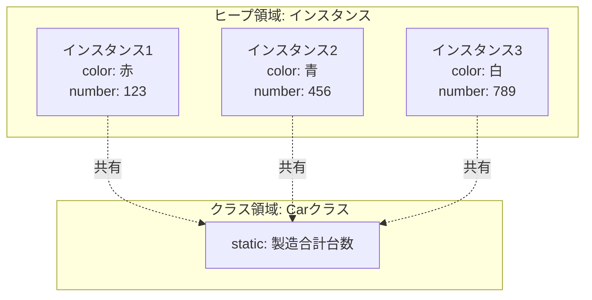
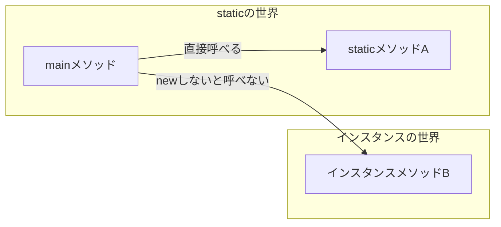
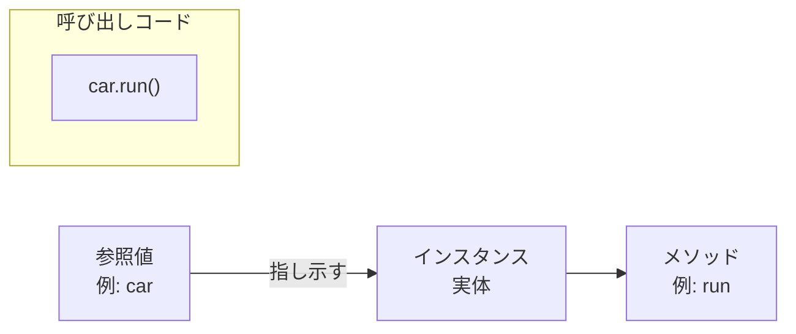

# Lesson 10 補足 - static とインスタンス

これまでの課題では、メソッドにすべて `static` を付けていました。しかし、「クラス」の本来の使い方は `new` して使うものです。
ここでは、`static`（静的）と `インスタンス`（動的）の違いを明確にします。

## 1. イメージの違い

一番の違いは、データが **「クラス（設計図）にあるか」** か **「インスタンス（作られたモノ）にあるか」** です。

- **インスタンスメンバー**（staticなし）:
    - **「個体**」ごとの情報。
    - `new` するたびに新しい箱が作られる（例：車の色、ナンバー）。
- **staticメンバー**（staticあり）:
    - 「**クラス全体**」で共有する情報。
    - プログラム開始時に1つだけ作られる（例：製造された車の合計台数）。



---

## 2. staticフィールド（静的変数）

すべてのインスタンスで共通して持ちたい値に使用します。

```java
public class Car {
    private String color;        // インスタンス変数（車ごとに違う）
    public static int count = 0; // static変数（すべての車で共通）

    public Car(String color) {
        this.color = color;
        count++; // 新しい車ができるたびに、共有のカウンターを増やす
    }
}
```

- **呼び出し方**: `クラス名.変数名`（例：`Car.count`）
- インスタンスを10個作っても、`count` という箱は世界に1つだけです。

---

## 3. staticメソッド（静的メソッド）

「個別のデータ」を使わずに処理を行うメソッドです。

- **staticメソッド**: 引数でもらったデータだけで計算する、あるいは共有データ（static変数）だけを使う。
- **インスタンスメソッド**: そのインスタンスのフィールド（`this.color`など）を使って処理する。

| 種類         | 呼び出し方          | 例                                   |
| :--------- | :------------- | :---------------------------------- |
| **static** | `クラス名.メソッド名()` | `Math.sqrt()`, `Integer.parseInt()` |
| **インスタンス** | `参照値.メソッド名()`  | `car.getColor()`, `br.readLine()`   |

---

## 4. なぜ Lesson 8 までは static だったのか？

答えは簡単です。**「`new` をしていなかったから」** です。

Javaのプログラムが動き出す `main` メソッドは `static` です。
`static` な場所（main）から、同じクラス内のメソッドを呼び出すためには、呼び出される側も `static` でなければならないというルールがあります。



---

## 5. static から インスタンス は参照できない！

これが初心者が最もよく遭遇するコンパイルエラーの原因です。

```java
public class Sample {
    int score = 100; // staticなし

    public static void main(String[] args) {
        // エラー！
        // staticなmainからは、誰のscoreかわからないのでアクセスできない
        System.out.println(score); 

        // 解決策：newして自分自身をインスタンス化すればアクセスできる
        Sample s = new Sample();
        System.out.println(s.score); 
    }
}
```

---

## 講師向け：

### 1. static変数の「共有」を証明する
1. `Car` クラスに `static int count` を作り、コンストラクタで `count++` する。
2. `Main` で `Car` を3回 `new` する。
3. `System.out.println(Car.count)` を実行し、「3」と表示されるのを見せる。
   - 「それぞれの車（インスタンス）が別々の count を持っているのではなく、全員で1つの count を見ている」ことを強調してください。

### 2. VS Codeの表示の違い
VS Codeのエディタ上で、`static` なメソッドやフィールドは**イタリック（斜体）**で表示されることが多いです（テーマによりますが、標準のJava拡張機能では判別可能です）。
「斜め文字になっていたら、それはクラス共通のものだよ」と教えると、コードを読む時のヒントになります。

### 3. 「クラス名.」での呼び出しを推奨
`static` 変数も、実は `car1.count` のようにインスタンス経由で呼べてしまいます。
しかし、これは「誰のデータか」を誤解させるため、Javaでは**推奨されません**（警告が出ます）。
必ず `Car.count` と「クラス名」で呼ぶ習慣を付けるよう指導してください。

---
# Lesson 10 補足 - メソッド呼び出しの法則

インスタンスメソッドを呼び出すとき、Javaの世界には一つの絶対的なルールがあります。
それは、**「どのインスタンス（実体）のメソッドなのか、必ず参照値（住所）を指定する」**ということです。

## 1. 原則： 参照値 . メソッド名 ( )

インスタンスメソッドは、`new` で作られた実体の中にあるため、呼び出すには必ず「どの実体か」を示す参照値が必要です。



---

## 2. ケース別の呼び出し方

呼び出し元が「どこか」によって書き方が変わるように見えますが、実はどちらも**「参照値.」**で動いています。

### A. 外から呼ぶ場合（別のクラスから）
作成したインスタンスを格納している**変数名**がそのまま参照値となります。

```java
Car car = new Car();
car.run(); // 「car」という参照値を使ってメソッドを呼ぶ
```

### B. 内から呼ぶ場合（同じクラスの別のメソッドから）
同じクラス内のメソッドを呼ぶとき、自分自身の参照値を指す **`this`** が自動的に使われています。

```java
public class Car {
    public void run() {
        System.out.println("走行中");
        this.stop(); // 「this（自分自身）」という参照値を使ってメソッドを呼ぶ
    }

    public void stop() {
        System.out.println("停止");
    }
}
```

- **ポイント**: `this.` は省略可能ですが、コンピュータの内部では必ず「自分自身の参照値.メソッド名」として処理されています。

---

## 3. なぜ static から インスタンスメソッド は呼べないのか？

「参照値が必要」というルールで考えると、理由がハッキリします。

```java
public class Sample {
    public void hello() { ... } // インスタンスメソッド

    public static void main(String[] args) {
        // ❌ エラー！
        hello(); 
    }
}
```

- **理由**: `static` なメソッド（main）は `new` しなくても動く世界です。そのため、自分自身を指す参照値（`this`）が存在しません。
- **解決策**: 「参照値」を用意してあげれば呼べるようになります。
  ```java
  Sample s = new Sample(); // 実体を作って参照値「s」を用意
  s.hello();              // 参照値があれば呼べる！
  ```

---

## 4. まとめ：呼び出し方のチェック表

メソッドを呼びたいときは、まず「そのメソッドに `static` が付いているか」を確認しましょう。

| メソッドの種類 | 呼び出しに必要なもの | 書き方の正体 |
| :--- | :--- | :--- |
| **staticメソッド** | **クラス名** | `Math.sqrt()` |
| **インスタンスメソッド** | **参照値** | `car.run()` または `this.run()` |
