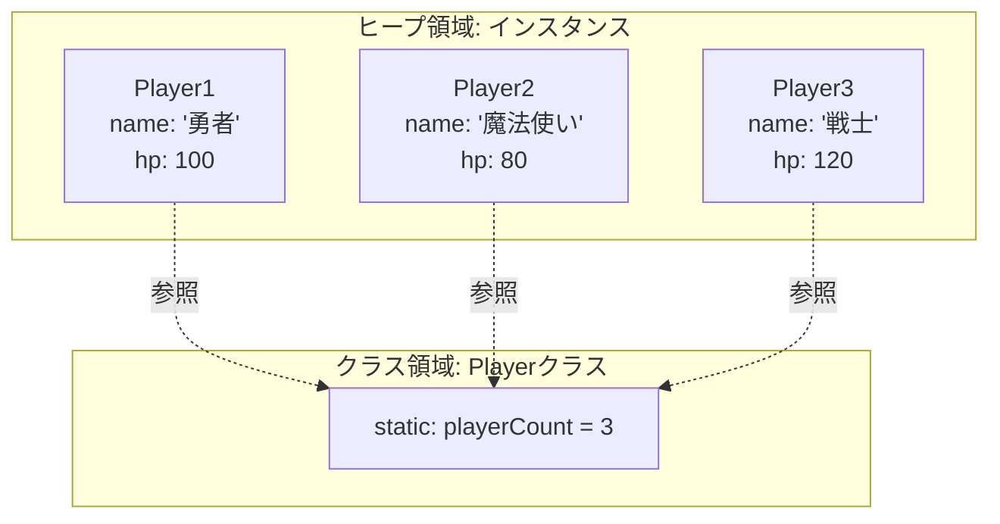

# static と インスタンス の比較

Javaには「個別のモノ（インスタンス）」が持つデータと、「その種類（クラス）全体」で共有するデータの2種類があります。これをRPGのキャラクターを例に比較してみましょう。

## 1. データの比較（フィールド）

| 種類       | インスタンスメンバ（staticなし）    | staticメンバ（staticあり） |
| :------- | :--------------------- | :------------------ |
| **イメージ** | **プレイヤーごとの情報**         | **ゲーム全体で共通の情報**     |
| **実例**   | `name` (名前), `hp` (体力) | `playerCount` (総人数) |
| **メモリ**  | `new` するたびに新しい実体が作られる  | プログラムに1つだけでいい       |

```java
public class Player {
    // インスタンス変数（プレイヤーごとに違う）
    public String name;
    public int hp;

    // static変数（全員で共有する1つのデータ）
	public static int playerCount = 0;

    public Player(String name, int hp) {
        this.name = name;
        this.hp = hp;
        playerCount++; // 新しいプレイヤーが増えるたびに共有のカウンターを増やす
    }
}
```

```java
public class Main {
	public void main(String... args){
		Player p1 = new Player("魔法使い", 80);
		player p2 = new Player("戦士", 120);
		
		p1.hp;
		Player.playerCount;
		・・・
	}
}
```




### インスタンス変数はインスタンス生成しないとアクセスできない

```java
public class Student {
    int score = 100; // staticなし

    public static void main(String[] args) {
        // エラー！
        // staticなmainからは、誰のscoreかわからないのでアクセスできない
        System.out.println(score); 

        // 解決策：newして自分自身をインスタンス化すればアクセスできる
        Student s = new Sample();
        System.out.println(s.score); 
    }
}
```

---

## 2. 操作の比較（メソッド）

呼び出し方の「本質」は、**「誰のメソッドか」を明確に指定すること**です。

| 種類             | 本質的な呼び出し方           | 特徴                          |
| :------------- | :------------------ | :-------------------------- |
| **インスタンスメソッド** | **参照値（住所）.メソッド名()** | 個別のデータ（`this.hp`など）を使って処理する |
| **staticメソッド** | **クラス名.メソッド名()**    | 個別のデータは使わない。共通データや引数のみで処理する |


```java
public class Player {
    // インスタンス変数（プレイヤーごとに違う）
    private String name;
    private int hp;

    // static変数（全員で共有する1つのデータ）
    private static int playerCount = 0;

    public Player(String name, int hp) {
        this.name = name;
        this.hp = hp;
        playerCount++; // 新しいプレイヤーが増えるたびに共有のカウンターを増やす
    }
    
    // staticメソッド
    // プレイヤーの総数を表示する
    public static void showPlayerNum(){
	    System.out.plint(playerCount);
    }
    
    // インスタンスメソッド
    // プレイヤーがダメージを受ける
    public void takeDamage(int damage){
	    this.hp -= damage;
    }
}
```

```java
public class Main {
	public void main(String... args){
		Player p1 = new Player("魔法使い", 80);
		player p2 = new Player("戦士", 120);
		
		// staticメソッドを呼ぶ際は、「クラス名.メソッド名」とし、インスタンスを指定する必要はない！
		Player.showPlayerNum();
		
		// インスタンスメソッドを呼ぶ際は「参照値.メソッド名」とし、どのインスタンスのメソッドを呼ぶのか指定する必要がある。
		p1.takeDamage(30);
		p2.takeDamage(10);
	}
}
```

---

## 3. 【全網羅】メソッド呼び出しの法則

あくまで、インスタンスメソッドは参照値.メソッド名だし、staticメソッドはクラス名.メソッド名だが、呼び出す箇所によって多少呼び方が揺れます。
「どこからどこを呼ぶか」によって、書き方のルールが決まっています。

### ① インスタンスメソッド内からの呼び出し
インスタンスメソッド（staticなし）の中では、自分自身を指す「**this**」が使えます。

```java
public class Player {
    private String name;

    // インスタンスメソッド
    public void attack() {
        // A. インスタンス -> インスタンス
        this.showEffect(); // 本質: 参照値.メソッド名()
        showEffect();      // 省略: 同じクラスなら this. は省略可なので、こちらを推奨★

        // B. インスタンス -> static
        Player.printSystemTime(); // 本質: クラス名.メソッド名()
        printSystemTime();        // 省略: 同じクラスなら クラス名. は省略可なので、こちらを推奨★
    }

	// インスタンスメソッド
    public void showEffect() {
	    System.out.println("エフェクト表示");
	}
	
	// staticメソッド
    public static void printSystemTime() {
	    System.out.println("現在時刻表示");
	}
}
```

### ② staticメソッド（mainなど）からの呼び出し
staticメソッドの中には「自分自身（this）」という概念がありません。そのため、インスタンスメソッドを呼ぶには必ず **`new` した住所**が必要です。

```java
public class Player {
    public static void main(String[] args) {
        // C. static -> static
        Player.printSystemTime(); // 本質: クラス名.メソッド名()
        printSystemTime();        // 省略: 同じクラスなら クラス名. は省略可

        // D. static -> インスタンス
        // attack();              // エラー！誰の攻撃かわからない
        Player p = new Player("戦士");
        p.attack();               // 参照値があれば呼べる！
    }
}
```

### 呼び出し法則のまとめ表

| 呼び出し元 ↓\呼び出し先→ | **インスタンス**                 | **static**               |
| :------------- | :------------------------- | :----------------------- |
| **インスタンスから**   | `参照値.呼ぶ()` （同じインスタンスなら省略可） | `クラス名.呼ぶ()` （同じクラスなら省略可） |
| **staticから**   | **`参照値.呼ぶ()` （newが必須）**    | `クラス名.呼ぶ()` （同じクラスなら省略可） |

---

## 4. なぜ「省略」できるのか？

Javaのコンパイラ（翻訳機）は、同じクラス内であれば「あ、これは自分のところのメソッドだな」と自動的に補ってくれます。

- `attack()` と書くと、同じクラスに static がなければ `this.attack()` と解釈される。
- `printSystemTime()` と書くと、同じクラスに static があれば `Player.printSystemTime()` と解釈される。

**ベストプラクティス：**
- フィールド（変数）に関しては、ローカル変数との区別を明確にするため、あえて省略せずに **`this.name`** や **`Player.playerCount`** と書くのが現場で好まれる「型」です。
- 逆にメソッド呼び出しは、同じクラス内なら省略して書くのが一般的です。

---

## 5. まとめ：static と インスタンス の使い分け基準

- **インスタンス（staticなし）にするべき時：**
    - そのデータがモノによって変わる時（名前、HP、所持金）。
    - そのメソッドが「個人のデータ」を読み書きする時。
- **static（staticあり）にするべき時：**
    - そのデータが全体で1つだけの時（消費税率、ゲームのタイトル、生成した合計数）。
    - そのメソッドが引数だけで完結し、個人のデータを見ない時（数学計算 `Math.sqrt` など）。

> **講師メモ：**
> インスタンスメンバは、インスタンスが無いとアクセスできず、staticメンバはインスタンス生成なしにアクセスできることを強調する

