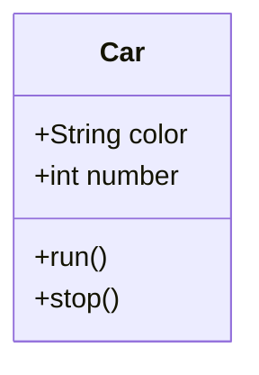
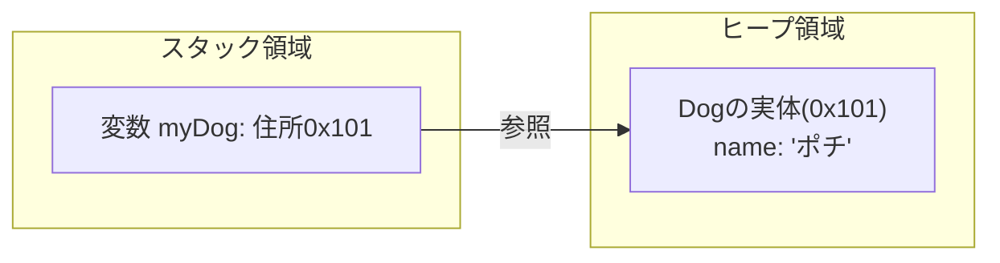
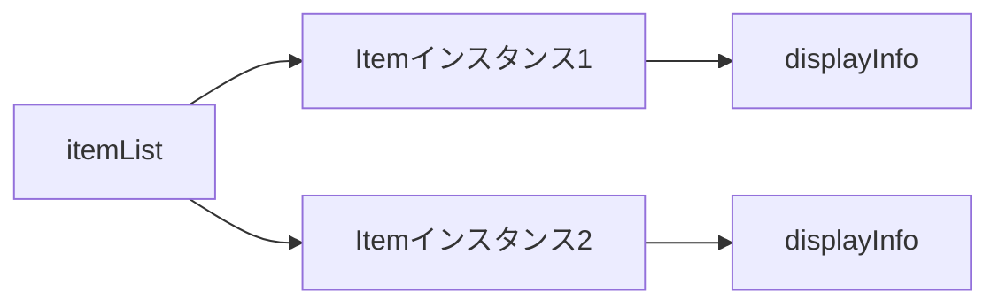

# Lesson 9～10 - クラスとインスタンス

## 1. クラスとは
クラスとは、「**データ**（属性）」と「**操作**（振る舞い）」をひとまとめにした「**設計図**」のことです。
現実世界の「モノ」をプログラムの中で表現するために使います。



### クラスの基本構造
クラスの中には、大きく分けて2つの要素を書きます。

1.  **フィールド**: クラスが保持する「データ」です。クラスの直下、メソッドの外で定義します。
2.  **メソッド**: そのデータを使って行う「処理（操作）」です。

```java
public class Car {
    // 1. フィールド（データ）
    String color;
    int number;

    // 2. メソッド（操作）
    void run() {
        System.out.println(color + "色の車が走ります。");
    }
}
```

> **講師メモ**: 
> - フィールドは「状態（State）」、メソッドは「振る舞い（Behavior）」と呼ぶことも伝えてください。
> - VS Codeでクラス名を変更する際は、ファイル名も連動して変える必要があることを実演します。
> - 今までのMainもクラスであったことを補足します。

---

## 2. クラスの使い方（定義・生成・利用）
設計図を作ってから、実際にモノを動かすまでの3ステップを「型」として覚えましょう。

### STEP 1：クラスを「定義」する
まずは設計図を作ります（例：犬クラス）。
```java
public class Dog {
    String name;
    
    void bark() {
        System.out.println(name + "：ワンワン！");
    }
}
```

### STEP 2：インスタンスを「生成」する（new）
設計図から実体（モノ）を作ります。これを **「newする/インスタンス化する/オブジェクトを生成する」** と呼びます。
```java
// クラス名 変数名 = new クラス名();
Dog myDog = new Dog();
```

> ここでmyDogは何型の変数か答えさせる。

### STEP 3：メソッドを「呼び出す」
作ったモノに対して、ドット（`.`）を使って命令を出します。
```java
myDog.name = "ポチ"; // フィールドに値を入れる
myDog.bark();       // メソッドを呼び出す -> 「ポチ：ワンワン！」
```

> やさしいjavaとは違い、一般的には１つのファイルにつき、１つのクラスを書くということを強調する。

---

## 3. メモリのイメージと「参照型」の正体
変数 `myDog` の中には、実体そのものではなく、実体がどこにあるかという **「住所（参照）」** が入っています。

**ここで伏線回収：**
「参照型」とは、実は「**クラスを元に作られたインスタンスの住所を格納する型**」のことだったのです。



> **講師メモ**: 
> - デバッガで `new` した直後の変数にID（参照先）が入っている様子を見せてください。
> - 別の変数に代入（`Dog yourDog = myDog;`）すると、同じ住所を指すことになる点も復習します。

---

## 4. アクセス修飾子と「カプセル化」
設計図のパーツを「どこまで公開するか」を決めます。

| 修飾子 | 範囲 | 説明 |
| :--- | :--- | :--- |
| **`public`** | どこからでもOK | すべて公開。クラスや主要なメソッドに。 |
| **`protected`** | 同じパッケージ + 継承先 | 親子関係があれば別フォルダからでもOK。 |
| **（なし）** | **同じパッケージ内のみ** | 「パッケージプライベート」。同じフォルダ内限定。 |
| **`private`** | **自分のクラス内のみ** | **最優先で使う。** 外部から隠したいデータに。 |

### なぜ `private` にするのか？（カプセル化）
フィールドを `public` にすると、外部から勝手に不正な値（例：年齢に-10を入れる等）を書き込まれるリスクがあります。
データを守るために、フィールドは原則 **`private`** にし、決められた窓口経由でしか操作させないようにします。これを **「カプセル化」** と呼びます。

> 実際にアクセスできない例を見せる。

---

## 5. getter と setter
`private` にしたフィールドを安全に読み書きするための「専用窓口」です。

- **getter**: データを「取得」するメソッド（`get + フィールド名`）
- **setter**: データを「設定」するメソッド（`set + フィールド名`）

```java
public class Car {
    private String color;

    // setter
    public void setColor(String color) {
        // this.color は「このクラスのフィールド」を指す
        this.color = color; 
    }

    // getter
    public String getColor() {
        return this.color;
    }
}
```

### 【重要】 `this` キーワード
`this.color = color;` のように、フィールド名と引数名が同じ場合、`this.` を付けることで「クラスのフィールド（自分自身）」であることを明示します。

> **講師メモ**: 
> - VS Codeの「右クリック ➜ ソースアクション ➜ Generate Getters and Setters...」で自動作成する様子を見せてください。

---

## 6. コンストラクタ
インスタンスを `new` した瞬間に自動実行される **「初期化専用のメソッド」** です。

1.  名前は **クラス名と全く同じ**。
2.  **戻り値（voidなど）を書かない**。

```java
public class Car {
    private String color;

    // コンストラクタ
    public Car(String color) {
        this.color = color;
        System.out.println(color + "色の車を生成しました。");
    }
}
```

### デフォルトコンストラクタ
コンストラクタを1つも書かなかった場合、Javaが自動的に「引数なしの空のコンストラクタ」を作ってくれます。自分で1つでも書くと、これは作られなくなります。

> 常にインスタンスはコンストラクタを経由して作られる。
> コンストラクタは複数定義できることを補足する。
---

## 7. クラスの記述順序とコメント
実務では、以下の順番で書くのが一般的です。

1.  **フィールド**
2.  **コンストラクタ**（初期化）
3.  **メソッド**（getter/setter や その他の振る舞い）

### コメント
プログラムは「書く時間」より「他人に読まれる時間」の方が圧倒的に長いです。

- **Javadoc形式 (`/** ... */`)**: クラスやメソッドの上に書きます。VS Codeでそのメソッドを使おうとした時に、ツールチップとして説明が表示されるようになります。
- **単一行コメント (`//`)**: 処理の中で「なぜそうしたか」を書きます。

```java
/**
 * 車を管理するクラスです。
 */
public class Car {
    /** 車体の色 */
    private String color;

    /**
     * 車を走行させます。
     */
    public void run() {
        System.out.println("走行中...");
    }
}
```

> `/**` と入力し、Enterキーを押すことでクラスコメントやメソッドコメントのひな形ができることを見せる。

### 方針
- クラスとメソッドには必ずコメントを付けること。（自動生成したgetter/setterには付けなくてよいです。）
- 処理に関する単一行コメントは必要と感じた個所だけ。

---

## 8. static と インスタンス の対比
前回までは、メソッドにすべて `static` を付けていました。今回の学習を経て、その違いを整理しましょう。

- **`static` メソッド**: 「クラス（設計図）」に直接備わっている機能。`new` しなくても使える。
- **インスタンスメソッド**: `new` した「個別のモノ」が持つ機能。そのモノのデータによって動きが変わる。

---

# Lesson 9～10 - クラスとオブジェクト（実践編）

## 9. 実務でよく使う「クラス」の活用パターン

### データを「ひとまとめ」にする（データ型）
商品名と価格をバラバラに管理せず、「商品（Item）」という一つの塊として扱います。商品がどんなデータを持っていて、どんな振る舞いを持ってるかで考えるといいです。

```java
public class Item {
    private String name;
    private int price;

    public Item(String name, int price) {
        this.name = name;
        this.price = price;
    }

    public void displayInfo() {
        int taxPrice = (int)(this.price * 1.1);
        System.out.println(this.name + "：" + taxPrice + "円（税込）");
    }
}
```

### クラスを「List」に入れて一括管理する
実務で最も多く登場するパターンです。

```java
List<Item> itemList = new ArrayList<>();

itemList.add(new Item("消しゴム", 100));
itemList.add(new Item("ノート", 200));

for (Item item : itemList) {
    item.displayInfo(); // ループで全商品を処理
}
```



> **定義へのジャンプ**: 
> `Main.java` で `item.displayInfo()` の部分を `Ctrl + 左クリック` すると、即座に `Item.java` の定義場所にジャンプできます。

---

## 10. クラスを設計する時の考え方（ベストプラクティス）

1.  **クラス名は「単数形」にする**: 設計図は1つ分なので `Item`。リスト変数は `itemList` と複数形にするといいでしょう。
2.  **フィールドには余計なものを入れない**: 商品クラスに「注文客の名前」を入れない。役割が違うものはクラスを分けるといいでしょう。迷ったら使う側の気持ちを考えてみましょう。商品というオブジェクトにまさか顧客の名前が入ってると思わないですよね。。。直感に反する管理方法は可読性を下げます。
3.  **「自分のデータは自分で処理する」**:
    `price` というデータを持つクラスが、`税込み計算` メソッドを持つべきです。呼び出し側（Main）に計算式を書かせないことで、修正に強いプログラムになります。受動的な振る舞いを持つことは一見直感に反しますが、オブジェクト指向では能動/受動は関係なく、そのデータをどのクラスが管理するかに焦点を当てます。今回は価格は商品というオブジェクトが持つので、それを使った税込み計算処理は商品クラスが持つべきでしょう。

---

> **課題への取り組み方**
> - **STEP 1**: まず、どんな「フィールド」と「メソッド」が必要か整理してクラスを作る。
> - **STEP 2**: フィールドを `private` にし、コンストラクタと Getter/Setter を用意する。
> - **STEP 3**: `Main` 側で `new` して、メソッドを呼び出す。