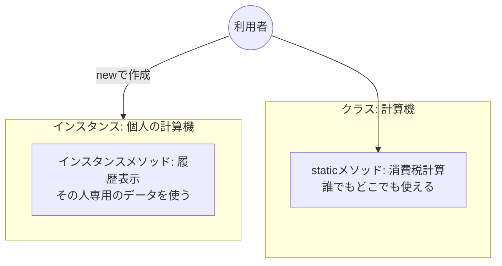
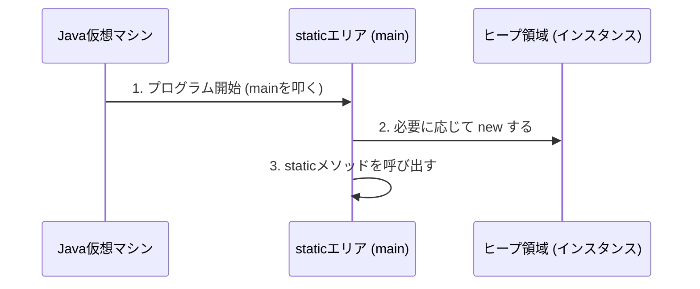

# Lesson 8 補足 - staticメソッド

## 1. staticメソッドとは
一言で言うと、**「インスタンス（モノ）を作らなくても、すぐに使えるメソッド**」のことです。

これまでの練習で、`main` メソッドの中から他のメソッドを呼び出すとき、メソッド名に `static` を付けていたのは、`main` 自体が `static` だからです。

### 比較イメージ
- **staticメソッド**: クラス（設計図）に備わっている共通機能。
- **インスタンスメソッド**: インスタンス（実体）を作って初めて使える機能。



---

## 2. staticメソッドの呼び出し方

同じクラス内であればメソッド名だけで呼べますが、本来は **「クラス名.メソッド名()」** で呼び出します。

```java
// Mathクラスのsqrt（平方根）メソッドを呼ぶ例
double result = Math.sqrt(16.0); 
```

- `new Math()` としなくても、いきなり `Math.sqrt()` と書けます。これが `static` の最大の特徴です。

---

## 3. なぜ main メソッドは static なのか？

プログラムが起動する時、まだインスタンス（モノ）は一つも作られていません。
**「モノがない状態でも、最初に動かせる場所」**が必要なため、`main` メソッドは必ず `static` である必要があります。



---

## 4. staticメソッドの注意点（重要）

`static` メソッドは非常に便利ですが、大きな制限があります。

### 「static」から「non-static」は呼べない
`static` なメソッドの中から、`static` が付いていない変数やメソッドを直接使うことはできません。

```java
public class Sample {
    int score = 100; // staticがついていない変数

    public static void main(String[] args) {
        // ❌ エラー！ staticな場所から、staticでないscoreは見えない
        System.out.println(score); 
    }
}
```


---

## 5. どんな時に static にするのか？

そのメソッドが、**「個別のデータに依存しないとき」**に `static` にします。

- **staticにする例**:
    - `Integer.parseInt()` : 文字列を数値に変えるだけ。誰がやっても結果のルールは同じ。
    - `Math.random()` : ランダムな数字を出すだけ。
- **staticにしない例**:
    - `getName()` : 「誰の」名前かという個別のデータが必要な場合。

---

## 💡 講師の方へ：VS Codeでのデモンストレーション案

### 1. staticをわざと外してみる
1. `main` メソッドと同じクラスに、`static` を付けないメソッド `hello()` を作る。
2. `main` の中から `hello();` と呼び出す。
3. **VS Codeが赤波線を出す**様子を見せる。
   - エラー内容：`Non-static method 'hello()' cannot be referenced from a static context`
   - 「staticな文脈から、staticじゃないものは参照できません」というエラーの読み方を教えてください。

### 2. クラス名による呼び出し
1. 別のファイル（例：`Utility.java`）を作成し、そこに `public static void printLine()` を作る。
2. `Main.java` から `Utility.printLine();` と呼び出す。
3. 「他のファイルにある機能でも、`new` しなくても名前を指定すれば呼べる」という利便性を見せてください。

### 3. Java標準ライブラリの static を探す
- `Math.max(10, 20)` や `System.currentTimeMillis()` などを実際に叩いて見せます。
- VS Codeで `Math` の上にカーソルを置き、定義（F12）にジャンプして、Java自身のコードにも `static` と書いてあることを確認させると、「自分たちもJava標準と同じ書き方をしているんだ」という納得感に繋がります。