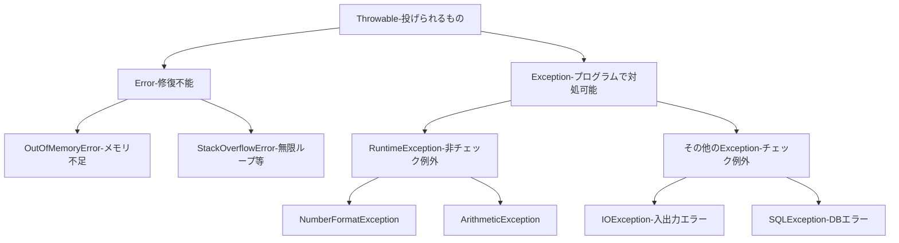

# Lesson 14 - 例外処理（Exception Handling）

プログラムを実行していると、必ず「思い通りにいかない事態」が発生します。Javaではこれを「**例外**（Exception）」という仕組みで管理します。
## 1. エラーの捉え方
エラーを大きく2つの種類に分けて考えます。ここを混同すると、ユーザーに不親切なシステムになってしまいます。

### ① 業務エラー（想定内のエラー）
ユーザーの操作ミスなど、**あらかじめ起こることが予想される**エラーです。
*   **バリデーションエラー**: 「必須項目が空」「メールアドレスの形式が変」など。
*   **関連チェックエラー**: 「そのユーザーIDは既に使われている」など。
*   **⇒対応**: 画面に「〜を入力してください」と赤い文字でメッセージを出し、**処理を安全に止めてユーザーに再操作を促します。**

### ② システムエラー（想定外のエラー）
プログラムのバグや、サーバー・ネットワークの故障など、**起きてはいけない**エラーです。
*   **例**: データベースに接続できない、計算で0除算をした、メモリ不足。
*   **⇒対応**: ユーザーには「システムトラブルが発生しました。管理者に連絡してください」と表示し、**開発者はログを見て原因を調査・修正します。**

---

## 2. 例外が発生するとどうなるか？（実験）

まずは、あえて例外が発生するプログラムを動かしてみましょう。

```java
import java.util.Scanner;

public class Main {
    public static void main(String[] args) {
        Scanner sc = new Scanner(System.in);
        
        System.out.println("数値を2つ入力してください");
        String input1 = sc.next();
        String input2 = sc.next();

        // 自作の計算メソッドを呼び出す
        calculate(input1, input2);
        
        System.out.println("--- プログラムを正常に終了します ---");
    }

    private static void calculate(String input1, String input2) {
        // 文字列を数値に変換
        int num1 = Integer.parseInt(input1);
        int num2 = Integer.parseInt(input2);

        // 割り算
        int answer = num1 / num2;
        System.out.println("結果：" + answer);
    }
}
```

### 実験結果
1.  **正常**: `10` と `2` を入力 → `結果：5` と表示され、正常終了。
2.  **失敗1**: `a` と `5` を入力 → `NumberFormatException`（数字じゃない）
3.  **失敗2**: `10` と `0` を入力 → `ArithmeticException`（0で割れない）

### 例外の性質：処理の「スロー（投げる）」
例外が発生すると、Javaはそこで**処理を中断**し、呼び出し元へ**例外を投げ**（**スロー**）ます。
`calculate`の中で例外が起きると、それ以降の処理（割り算など）は飛ばされ、`main`に戻ります。`main`でも受け取らなければ、最終的にJVM（Java実行環境）が受け取り、プログラムを強制終了させます。

### スタックトレースの読み方
コンソールに出る赤い文字（スタックトレース）は、**「エラーの履歴書」**です。
*   **何が起きたか**: `java.lang.NumberFormatException`
*   **どこで起きたか**: 下から上へ読みます。自分の書いたクラスの行番号（例: `Main.java:18`）を真っ先に探しましょう。

---

## 3. 例外をキャッチする（try-catch）

強制終了させずに、エラーを自力でハンドリングするには `try-catch` 文を使います。

```java
try {
    // 例外が起きるかもしれない処理
    calculate(input1, input2);
    System.out.println("計算に成功しました"); // 例外が起きるとここは飛ばされる
} catch (NumberFormatException e) {
    // 特定の例外が起きた時の避難場所
    System.out.println("【エラー】数字を入力してください。");
} catch (ArithmeticException e) {
    // 複数の例外を個別にキャッチできる
    System.out.println("【エラー】0で割ることはできません。");
} finally {
    // 例外が起きても起きなくても、最後に必ず実行したい処理（任意）
    System.out.println("計算処理を終了します。");
}
```

### ※「例外の握りつぶし」は厳禁！
実務で絶対にやってはいけないのが、**catchの中身を空にすること**です。
```java
} catch (Exception e) {
    // 何も書かない
}
```
これをすると、エラーが起きたこと自体が闇に葬られ、**「動かないのに原因が全くわからない」**という最悪の状況になります。最低でも `e.printStackTrace();` でログを出すか、適切にユーザーへ通知しましょう。

---

## 4. 例外の種類と構造（クラス階層）

Javaの例外はすべてクラスであり、以下のような親子関係になっています。



### チェック例外 vs 非チェック例外

| 種類 | 特徴 | 例 | 対処法 |
| :--- | :--- | :--- | :--- |
| **非チェック例外**<br>(RuntimeExceptionの仲間) | プログラムの不備で起きるもの。コンパイル時はチェックされない。 | `NullPointerException`<br>`ArithmeticException` | 基本はバグなので、if文等で起きないように書く。 |
| **チェック例外**<br>(Exceptionの直下) | 外部環境（ファイルやDB）の影響で起きるもの。**対処が強制される。** | `IOException`<br>`SQLException` | **必ず try-catch するか throws する**必要がある。書かないとコンパイルエラー。 |

---

## 5. 例外を丸投げする（throws）

「このメソッドでは対処せず、呼び出し元に任せるよ」という宣言が `throws` です。

```java
// 呼び出し元（main）に「IOExceptionが起きるかもよ」と警告する
private static void readFile() throws IOException {
    // 何らかのファイル読み込み処理（チェック例外が発生する）
    throw new IOException("ファイルが見つかりません");
}
```

### 現場での使い分け基準
*   **`try-catch` するべき時**: その場でエラーリカバリ（やり直しや、代替処理）ができる場合。
*   **`throws` するべき時**: そのメソッド単体では解決できず、呼び出し元（画面に近い側）でエラーメッセージを出してほしい場合。

> **注意**: `main` メソッドに `throws Exception` を書くのは、実務では「エラーを誰も処理せずに投げ捨てた」ことを意味します（学習用のサンプルコード以外では避けるべきです）。

---

## 6. まとめ：実務的な例外処理の心得

1.  **赤い文字（スタックトレース）を怖がらない**: どこで何が起きたか教えてくれる親切な案内板です。
2.  **適切な型でキャッチする**: 何でも `catch (Exception e)` で受けるのではなく、可能な限り具体的なクラス名（`NumberFormatException`など）で受けましょう。
3.  **マルチキャッチを利用する**: 似たような対処でいい場合は `catch (AException | BException e)` と書けます。
4.  **原因を消さない**: catchした例外はログに出すか、新しい例外に包んで投げ直し、原因を追跡可能に保ちましょう。