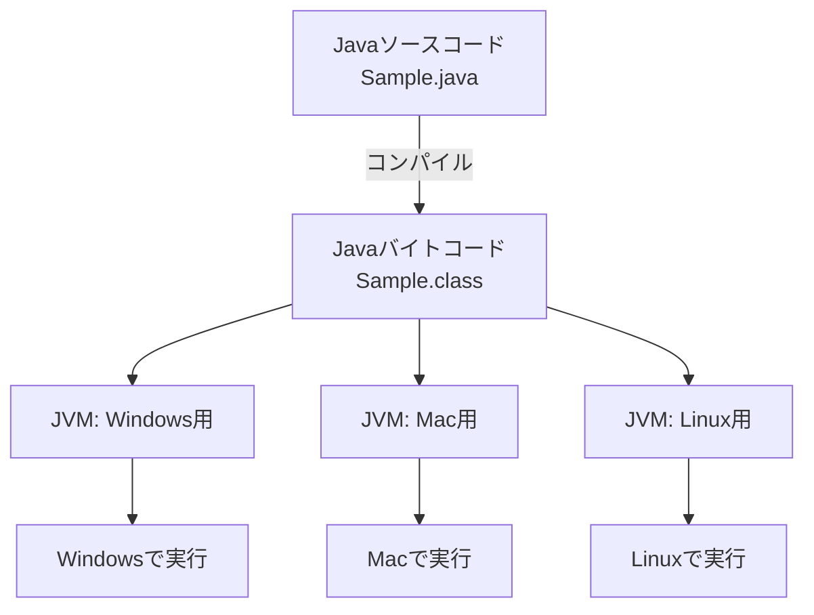
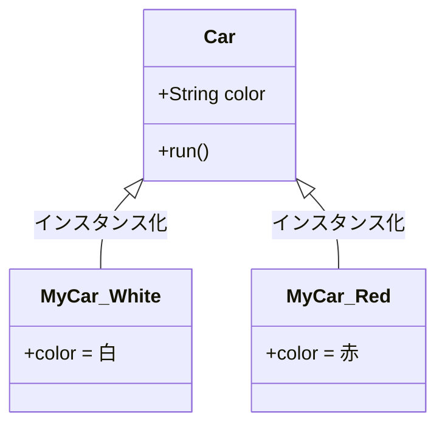
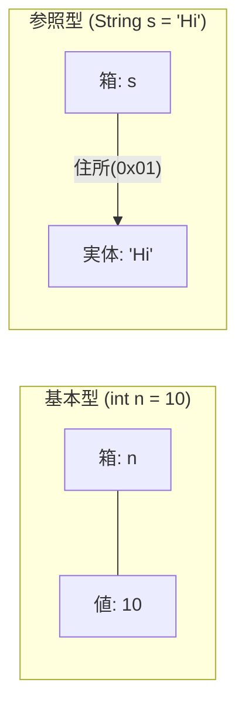
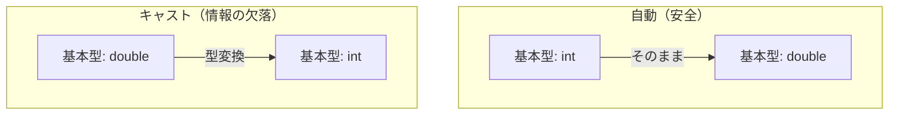

# Lesson 1 - 始めの一歩

## 1. プログラムとは
- **コンピュータへの「指示書」**：コンピュータにやってほしい仕事を順番に書いたものです。
- **プログラミング言語**：人間とコンピュータの橋渡しをするための言葉です。この研修では「Java」を学びます。

## 2. コンピュータが理解できる言葉
コンピュータは人間の言葉もJavaも直接は理解できません。

- **ソースコード**：人間がJavaで書いたテキストファイルのことです（拡張子は `.java`）。
- **機械語**：「0」と「1」の羅列でできた、コンピュータが唯一理解できる言葉です。
- **コンパイル（翻訳）**：ソースコードを、コンピュータが理解しやすい形式に変換する作業です。
- **Javaバイトコード**：コンパイルによって作られる中間データです（拡張子は `.class`）。
- **Java仮想マシン（JVM）**：Javaバイトコードを読み取り、実行する「仮想の機械」です。

**Javaの強み：「Write Once, Run Anywhere（一度書けば、どこでも動く）」**
JVMが各OS（Windows, Mac等）の違いを吸収するため、同じプログラムがどこでも動きます。



> **講師メモ：**
> - javaファイルとclassファイルの実物を見せてください。
> - classファイルをテキストエディタで開き、「人間には読めないがコンピュータが読める形」であることを示します。
> - 今の環境（VS Code）では保存時にリアルタイムで裏側でコンパイルが走っていることを伝えます。

## 3. Javaの土台：オブジェクト指向
Javaは「**オブジェクト指向**」という、部品を組み立てて作る手法に基づいています。

- **クラス（設計図）**：モノの「特徴（データ）」や「動き（操作）」を定義したもの。
- **インスタンス（実体）**：設計図から実際に作り出されたモノ。
- **オブジェクト（モノ）**：インスタンスのこと。

**例：車**
- **クラス（設計図）**：車には「色」というデータがあり、「走る」という操作ができると定義。
- **インスタンス（実体）**：設計図から作られた「白い車」「赤い車」など。



## 4. プログラムを書く際の絶対ルール
1. **大文字・小文字を区別する**：`Main` と `main` は別物です。
2. **括弧（かっこ）はペアで使う**：`()` や `{}` は必ず開きと閉じをセットにします。
3. **半角・全角を区別する**：コード内に**全角スペース**が1つでも混じるとエラーになります。
4. **文末にはセミコロン `;`**：命令の終わりに必ず打ちます。
5. **基本は英語**：プログラミング言語自体が英語ベースで作られているためです。

### ケアレスミスへの対処
- **赤い波線**：VS Codeが検知した「文法間違い」です。
- **コンパイルエラー**：翻訳に失敗し、実行できない状態です。

> **講師メモ：**
> - 赤い波線にマウスを当ててエラーメッセージを確認するデモをします。

---

# Lesson 2 - Javaの基本

## 1. プログラムの管理構造
Javaは以下の3つの階層で管理されます。

1. **プロジェクト**：アプリ全体の「入れ物」。
2. **パッケージ**：プログラムを分類する「フォルダ」。関連するプログラムをまとめます。
3. **クラス**：プログラムの「本体（1つのファイル）」。

### クラス名のルール
- ファイル名とクラス名は一致させます。
- 最初は「**大文字**」から始める**パスカルケース**を使います（例：`SampleApp`）。

## 2. すべての始まり「mainメソッド」
プログラムを実行した際に、最初に呼び出されます。

```java
public class Sample {
    // ここがmainメソッド。この中身が上から順に実行される
    public static void main(String[] args) {
        System.out.println("Java学習中"); 
    }
}
```
- **順次構造**：プログラムは上から1行ずつ順番に実行されます。

## 3. クラスライブラリ（便利な部品集）
Javaには最初から便利な部品が用意されています。これを「呼び出して使う」のが基本です。

- **メソッド**：ライブラリの中にある具体的な「処理」のこと。
- **引数（ひきすう）**：メソッドに渡すデータ。入力のことです。
- **戻り値（もどりち）**：メソッドを実行した結果、返ってくる値。出力のことです。
- **import（インポート）**：標準以外の部品を使う際に冒頭で「宣言」すること。

### 【デモ】VS Codeの強力な補完
- `main` + Enter ⇒ メソッドの雛形を作成
- `sysout` + Enter ⇒ `System.out.println();` を作成
- **Ctrl + Space**：入力候補を表示

> **講師メモ：**
> - `System.out.println();` も、Systemという部品の中にあるoutという出口のprintlnメソッドを呼んでいる、と「部品の呼び出し」であることを意識させます。
> - 「既存の部品をいかに組み合わせて使うか」が大切だと伝えます。

---

# Lesson 3 - 変数

## 1. 変数とは
値を一時的に保存しておくための「**名前付きの箱**」です。コンピュータの**メモリ**（記憶装置）に場所を確保します。

### 変数の基本操作
- **宣言**：箱を用意すること。
- **代入**：箱の中に値を入れること。`=`記号を使います。
- **初期化**：宣言と同時に値を代入すること。

```java
int score;       // 宣言
score = 100;     // 代入

int price = 500; // 初期化（★この書き方が推奨パターン）
```
- **注意**：`=` は「右の値を左に入れる」という意味です。

## 2. データ型の分類（重要！）
Javaには「基本型」と「参照型」という、仕組みが全く異なる2つの型があります。

### ① 基本型（プリミティブ型）
箱の中に「**値そのもの**」を直接入れるタイプです。

| 型 | 入れるもの | 例 |
| :--- | :--- | :--- |
| `int` | 整数（±21億まで） | `10`, `-50` |
| `long` | 大きな整数 | `100000000L`（末尾にLが必要） |
| `double` | 小数 | `3.14`, `-0.5` |
| `boolean` | 真偽（YesかNoか） | `true`, `false` |

### ② 参照型（リファレンス型）
箱の中に「**実体のメモリ上の住所**」を入れるタイプです。実体そのものは別の場所にあります。

| 型 | 入れるもの | 特徴 |
| :--- | :--- | :--- |
| **`String`** | 文字列 | `"こんにちは"` などの文字の並び |



> **講師メモ：**
> - 「基本型は箱の中に値がある」「参照型は箱の中に住所が書いてある」という違いを強調してください。
> - 見分け方：型名が「小文字から始まれば基本型」「大文字から始まれば参照型」です。

## 3. リテラル（値の書き方）
プログラム内に直接書く値の表現方法です。
- **整数**：`100`
- **小数**：`3.14`
- **文字列**：`"Java"`（ダブルクォートで囲む）
- **文字**：`'A'`（シングルクォートで囲む。1文字専用。char型）
- **真偽値**：`true`, `false`
- **null（ヌル）**：参照型で「どこも指していない（空っぽ）」を表す特別な値。

## 4. 命名ルール
- **変数名**：小文字から始める**キャメルケース**（例：`userName`, `totalPrice`）。
- **意味のある名前**：`a` や `x` ではなく、中身がわかる名前にします。

## 5. 入力処理パターン
キーボードからの入力を受け取る定番の「型」です。

```java
import java.io.*; // 入力用のライブラリを読み込む

public class InputSample {
    public static void main(String[] args) throws IOException { // 入力エラーへの備え
        // 入力準備（BufferedReaderという道具を用意する）
        BufferedReader br = new BufferedReader(new InputStreamReader(System.in));

        System.out.println("値を入力してください：");
        // readLine()は「String(参照型)」として入力を受け取る
        String str = br.readLine();

        System.out.println(str + " と入力されました。");
    }
}
```

---

# Lesson 4 - 式と演算子

## 1. 算術演算子
- `+`, `-`, `*`, `/`, `%`（余り）
- **文字列の連結**：`"No." + 1` は `"No.1"` になります（参照型Stringの特殊な動作）。

### 重要な落とし穴：整数の割り算
- `5 / 2` の結果は **`2`** です（小数点以下が切り捨てられます）。
- Javaでは「整数同士の計算結果は整数」というルールがあります。
- `2.5` を得たい場合は、`5.0 / 2.0` のように小数（double型）で計算します。

## 2. 便利な演算記号
- **代入演算子**：`a += 10;` （`a = a + 10;` と同じ。今の値に足す）
- **増減演算子**：`a++;`（1増やす：インクリメント）、`a--;`（1減らす：デクリメント）

## 3. 型変換（キャスト）
異なるデータ型の間で値を移す操作です。

### 自動型変換（安全）
- 小さい型（int）から大きい型（double）へ移すとき。
- 例：`double d = 10;` （結果は10.0）

### 強制型変換：キャスト（危険）
- 大きい型から小さい型へ移すとき。
- 例：`int i = (int)3.9;` （小数点以下が削られ `3` になる）
- **注意**：`(int)` のように型名を指定して強制的に変換します。



## 4. 参照型の変換パターン
参照型（String）は基本型と根本的に仕組みが違うため、`(int)` によるキャストはできません。専用の変換方法を使います。

### String（文字列）⇔ 数値の変換
入力された文字（String）を計算（int）に使いたい時に必須です。

- **String ⇒ int（数値化）**
  ```java
  String s = "100";
  int n = Integer.parseInt(s); // Integerクラスの力を借りる
  ```
- **int ⇒ String（文字化）**
  ```java
  int n = 100;
  String s = String.valueOf(n);
  ```

> **講師メモ：**
> - 文字列から数値に変えるときはキャスト `(int)` ではなく `Integer.parseInt` という「メソッドの呼び出し」が必要であることを説明してください。
