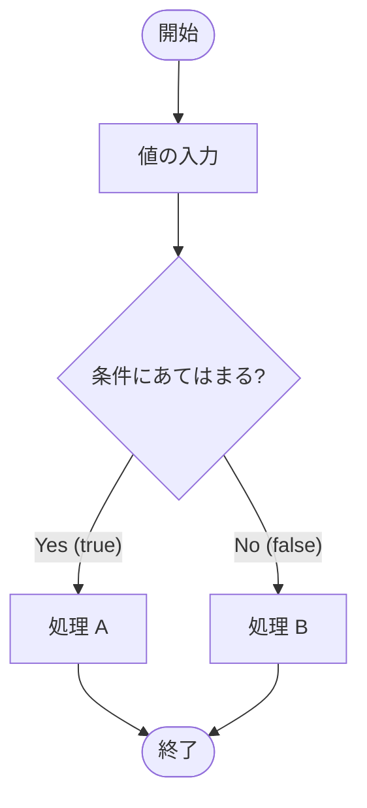

# Lesson 5 - フロー制御（条件分岐）

## 1. プログラムの流れを変える「分岐」
プログラムは通常、上から下へ一行ずつ実行されます。これを**順次構造（じゅんじこうぞう）**と呼びます。
しかし、現実の仕事では「もし〜なら、この処理をする」という判断が必要です。これを**条件分岐（じょうけんぶんき）**と呼びます。



---

## 2. 関係演算子と boolean型
条件分岐の「判断基準」を作るために、二つの値を比較する記号（**関係演算子**）を使います。
比較した結果は、Lesson 3で学んだ **`boolean`型（true または false）** になります。

| 記号 | 意味 | 例 |
| :--- | :--- | :--- |
| `==` | 等しい | `a == 10` |
| `!=` | 等しくない | `a != 10` |
| `>` | より大きい | `a > 10` |
| `<` | より小さい | `a < 10` |
| `>=` | 以上 | `a >= 10` |
| `<=` | 以下 | `a <= 10` |

### 【重要】代入（=）と比較（\==）の違い
初心者が最も間違えやすいのが `=` の数です。
- `a = 10` ： a という箱に 10 を入れる（代入）
- `a == 10` ： a と 10 は同じか？（比較）

### クイズ
次のプログラムを実行すると、何が出力されるでしょうか？
```java
int score = 2;
int border = 3;
boolean result = (score >= border);
System.out.println(result);
```
> **答え**: `false`。
> `2 >= 3` は成立しないため、結果は偽（false）となります。

> **講師メモ**: 
> - 数値の計算（1+1）の結果は「数値」だが、関係演算の結果は「boolean（真か偽か）」という特別な型になることを実演してください。

---

## 3. if文：もしも〜なら
最も基本的な分岐のパターンです。

### 基本構造（if - else）
```java
if (score >= border) {
    // 条件が true のときに実行される
    System.out.println("合格です！");
} else {
    // 条件が false のときに実行される
    System.out.println("不合格です。");
}
```

### 複数の条件（else if）
```java
if (score >= 80) {
    System.out.println("評価：A");
} else if (score >= 60) {
    System.out.println("評価：B");
} else {
    System.out.println("評価：C");
}
```

### 現場で守るべき「型（ベストプラクティス）」
1.  **中括弧 `{ }` は省略しない**: 命令が1行だけでも必ず書くのが好ましいです。
2.  **インデント（字下げ）を揃える**: `{ }` の中身は必ずスペースで下げます。
    - VS Codeのショートカット：`Shift + Alt + F` で一瞬で整列できます。
3.  **条件式は boolean であること**: `if ( )` の中身は、最終的に true か false になる式を書きます。

---

## 4. switch文 と switch式：値による分岐
「もし変数の値が 1 なら、2 なら…」のように、**特定の値との一致**を調べるときは `switch` が便利です。

### ① 従来の「switch文」
古い書き方ですが、他人のコードを読むために知っておく必要があります。

```java
int num = 2;
switch (num) {
    case 1:
        System.out.println("1です");
        break; // 必須！
    case 2:
    case 3: // 複数case書ける
        System.out.println("2です");
        break; // 忘れると下の default も実行されてしまう
    default:
        System.out.println("それ以外です");
        break;
}
```

### ② 新しい「switch式」（現代の推奨パターン）
Java 14から導入された、より安全でスッキリした書き方です。**矢印（`->`）**を使います。

```java
int num = 2;
// 結果を変数にそのまま代入できる！
String message = switch (num) {
    case 1 -> "1です";
    case 2 -> "2です";
    case 10, 11, 12 -> "10〜12のどれかです";
    default -> "それ以外です"; // 漏れがないよう default が必須
};
System.out.println(message);
```

#### なぜ「switch式」を使うのか（メリット）
1.  **breakが不要**: 自動的に終わるため、「書き忘れによるバグ」が物理的に起きません。
2.  **値を返せる**: 分岐結果を直接変数に入れられるので、コードが短くなります。

### if文 と switch の使い分けパターン
- **if文**: 「80点以上」のような**範囲**や、複雑な条件（A かつ B など）のときに使います。
- **switch**: 「月（1〜12）」や「信号の色（赤青黄）」のように、**決まった値との比較**のときに使います。

---

## 5. ブロックとスコープ（変数の寿命）
`{ }` で囲まれた範囲を **ブロック** と呼びます。ここで重要なルールがあります。
**「ブロックの中で作った変数は、そのブロックの外では使えない」** というルールです。これを変数の**スコープ**と呼びます。

```java
public static void main(String[] args) {
    int mainNum = 100;

    if (mainNum > 50) {
        int ifNum = 200; // ifブロックの中で作成
        System.out.println(mainNum); // OK
    }

    System.out.println(ifNum); // エラー！ifNumはifのブロックの外では死んでいる
}
```


> **講師メモ**: 
> - VS Codeでわざと外側からアクセスし、コンパイルエラー（「変数が見つかりません」）が出るのを見せてください。
> - 「変数の寿命（スコープ）は短いほど、バグが少ない良いプログラムである」と伝えてください。

---

## 6. 三項演算子（さんこうえんざんし）
`if-else` を一行で書くためのショートカットです。

```java
// 条件 ? trueの時の値 : falseの時の値
String result = (score >= 80) ? "合格" : "不合格";
```
- **現場の判断**: 非常にシンプルに値を決めるときだけ使います。複雑な条件で使うと「読みづらい」と怒られることもあるため、注意が必要です。

---

## 7. 参照型の比較（超重要）
ここが Java で最も間違いやすいポイントです。
**「数値（基本型）」と「文字列（参照型）」では、比較の書き方が違います。**

- **数値（intなど）**: `==` で比較する
- **文字列（String）**: **`equals()`** メソッドで比較する

```java
String s1 = "abc";
String s2 = br.readLine(); // コンソールから "abc" と入力

if (s1 == s2) {
    // ここは通りません（住所を比較しているため）
}

if (s1.equals(s2)) {
    // ここを通ります（中身を比較しているため）
}
```

### ベストプラクティス：安全な equals の書き方
```java
if ("abc".equals(s2)) { ... }
```
このように「決まっている文字列（定数）」を左側に書くと、もし `s2` が空っぽ（null）だったとしてもエラーが起きにくいため、安全な書き方とされています。

> **講師メモ**: 
> - **「基本型は記号(\==)で、文字列はメソッド(equals)で」**と、理屈抜きでパターンとして覚えさせてください。

---

## 8. 論理演算子（かつ・または）
複数の条件を組み合わせます。

- `&&` (AND): **「かつ」**。両方が true なら true。
- `||` (OR): **「または」**。どちらかが true なら true。
- `!` (NOT): **「〜ではない」**。true/false を反転させる。

### 短絡評価（ショートサーキット）
Javaは賢いので、結果が決まった瞬間に計算をやめます。
- `A && B` ：A が false なら、B は見ずに即座に false と確定。
- `A || B` ：A が true なら、B は見ずに即座に true と確定。

---

## 9. 優先順位と括弧 `( )`
計算と同じように、条件式にも優先順位があります。実は `&&` は `||` よりも先に計算されます。
**勘違いによるバグを防ぐため、複数の条件を組み合わせる時は必ず括弧 `( )` を使いましょう。**

### 実例：どちらが正しい？
「中間か期末どちらかが80点以上、かつレポートを提出(0点以外)していること」
```java
// 間違い（期末80以上 かつ レポート提出） または （中間80以上） という意味になる
if (midTerm >= 80 || finalTerm >= 80 && report != 0)

// 正解（括弧で囲んだ部分がひとまとめに判定される）
if ((midTerm >= 80 || finalTerm >= 80) && report != 0)
```

---

## 10. ド・モルガンの法則（読みやすい条件式）
「AでもBでもCでもない」という否定の条件を書きたい時、以下の2通りの書き方ができます。

1.  **直訳**: `if (!"a".equals(s) && !"b".equals(s))` （aではない、かつ、bではない）
2.  **整理**: `if (!("a".equals(s) || "b".equals(s)))` （「aまたはb」ではない）

**ベストプラクティス**: 
人間にとって読みやすいのは **2** です。「対象グループ（aまたはb）を括弧でまとめ、それを `!` で反転させる」という書き方の方が、条件が増えたときにミスが少なくなります。

---

> **課題へのヒント**
> - 文字列の比較には `equals` を使っていますか？
> - スコープ（変数の寿命）を意識して、適切な場所で変数を宣言していますか？