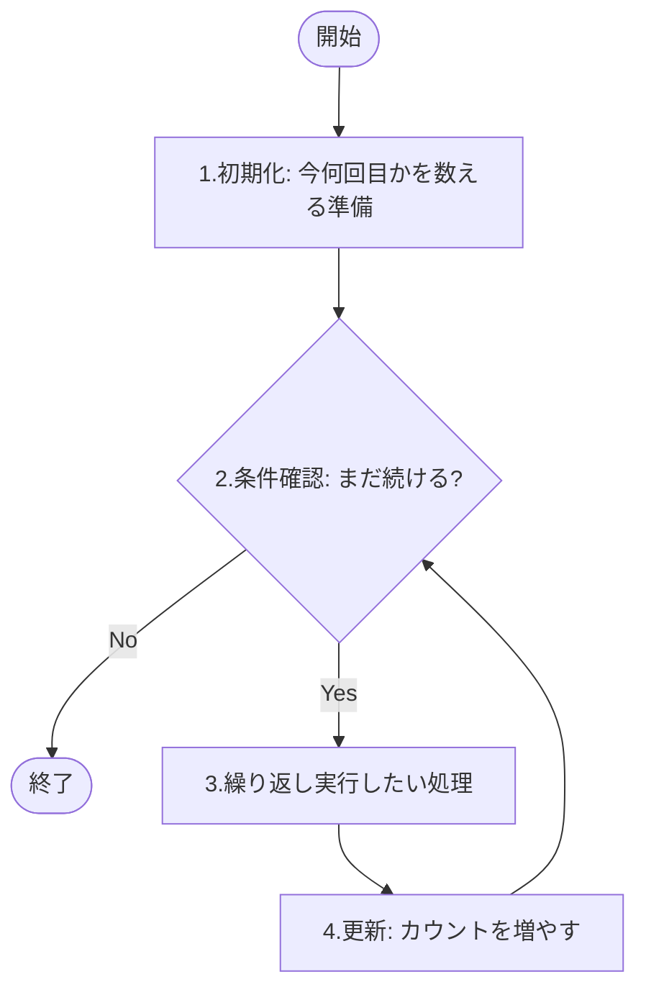
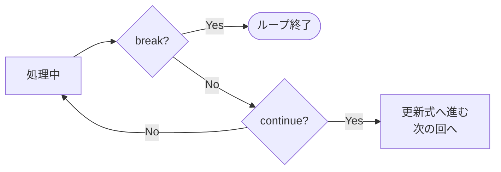

# Lesson 6 - フロー制御（繰り返し）

## 1. 繰り返し処理（ループ）のイメージ
同じ処理を何度も手書きするのは大変ですし、間違い（バグ）の元になります。
例えば「こんにちは」を10回表示したいとき、繰り返し文を使えば、回数を「10」から「100」に変えるのも一瞬です。

繰り返し処理には、必ず以下の**4つの要素**が含まれます。

1.  **初期化**：今何回目かを数えるための準備（カウンタの用意）。
2.  **反復条件**：まだ続けるか、もうやめるかの判定。
3.  **繰り返し実行したい処理**：本体。
4.  **更新**：1回分終わったことを記録する（カウンタを増やす）。



---

## 2. for文（回数指定ループ）
「10回繰り返す」「データが5個あるから5回実行する」のように、**回数があらかじめ決まっている**場合に最適な道具です。

### 構文
```java
for (初期化の式; 反復条件の式; 変化の式) {
    // 繰り返したい処理
}
```

### 具体例：0から9まで表示する
```java
for (int i = 0; i < 10; i++) {
    System.out.println(i + "回目です");
}
```

#### 各パーツの動き
- **初期化 (`int i = 0`)**：
  最初に1度だけ実行されます。`i` という名前の「カウンタ変数（箱）」を0で用意します。
- **反復条件 (`i < 10`)**：
  ループの**前**に毎回チェックされます。この条件が `true` である間は繰り返します。
- **変化の式 (`i++`)**：
  処理（ブロックの中身）が1回終わるたびに実行され、`i` を1増やします。

#### 【重要】カウンタ変数のルール
- **名前の慣習**：カウンタには `i` (indexの頭文字) を使うのが世界共通のルールです。ループが重なる場合は `j`, `k` とアルファベット順に使います。
- **スコープ（寿命）の復習**：`for` の中で宣言した変数 `i` は、その `for` 文が終わると消滅します。そのため、次の `for` 文でまた `i` という名前を使うことができます。

> **講師メモ**: 
> - 実行順序（1→2→3→4→2...）を指で追いながら実演してください。特に「更新式は処理の『後』に動く」という点が勘違いされやすいポイントです。

---

## 3. while文 と do-while文（条件指定ループ）
「特定の条件を満たしている間はずっと続ける」という場合に使う道具です。

### ① while文（前判定）
「まず条件を確認」してから実行します。条件が最初から `false` の場合、一度も実行されません。

```java
int i = 0;
while (i < 10) {
    System.out.println(i);
    i++; // これを忘れると「無限ループ」になります！
}
```

### ② do-while文（後判定）
「まず一度実行」してから条件を確認します。**最低でも必ず1回は実行される**のが特徴です。

```java
int i = 0;
do {
    System.out.println(i);
    i++;
} while (i < 10); // 最後にセミコロンが必要
```

### 無限ループと強制終了
条件がいつまでも `false` にならないと、プログラムは永遠に止まりません（無限ループ）。
もし止まらなくなったら、コンソール（ターミナル）で **`Ctrl + C`** を押して強制終了させましょう。

> **講師メモ**: 
> - `while` 文の中で `i++` を書き忘れて無限ループになる様子をわざと見せ、強制終了の方法を教えてください。

---

## 4. ループの使い分けパターン
どの構文を使っても同じことは書けますが、意図に合わせて使い分けましょう。

| 道具（構文） | 選択する基準（パターン） | よくある例 |
| :--- | :--- | :--- |
| **for文** | **回数が決まっている**とき | 10回表示する、配列の要素を全て処理する |
| **while文** | **回数が決まっていない**とき | 正解が入力されるまで繰り返す、ファイルの中身がなくなるまで読む |
| **do-while文** | **最低1回は動かしたい**とき | メニュー画面を出して、その後の入力で継続か決める |

---

## 5. ループの制御（break と continue）
繰り返しを途中で中断したり、スキップしたりするための「脱出ボタン」です。

- **break（中断）**：
  ループをその場で**完全に終了**し、外側へ脱出します。
- **continue（スキップ）**：
  今の回（周）の処理だけを中断し、**次の回（更新式）へジャンプ**します。



**具体例：**
```java
for (int i = 1; i <= 5; i++) {
    if (i == 3) {
        continue; // 3のときだけ表示を飛ばす
    }
    System.out.println(i);
}
// 出力：1, 2, 4, 5
```

---

## 6. よく使う「繰り返し」の定番パターン
文法を覚えたら、次は「どんな時にどう使うか」のパターンを覚えましょう。これらは定石です。

### パターンA：合計
「全部でいくらか？」「条件に合うものはいくつあるか？」を調べる時に使います。
**ポイント：合計を入れる箱（変数）をループの「外」に用意すること！**

```java
int total = 0; // 合計を入れる箱。ループの外で作る！

for (int i = 1; i <= 10; i++) {
    total += i; // 今の数字を足していく
}

System.out.println("1から10までの合計は " + total);
```

> **講師メモ**: 
> - 初心者はよく `int total = 0;` をループの中に書いてしまい、毎回リセットされるミスをします。

---

### パターンB：入力チェック
「正しい値が入力されるまで、何度でもやり直させる」時に使います。
**ポイント：無限ループ (`while(true)`) と `break` を組み合わせるのが最も一般的です。**

```java
BufferedReader br = new BufferedReader(new InputStreamReader(System.in));

while (true) { // 成功するまでずっと繰り返す
    System.out.print("1〜10の数字を入力してください：");
    int input = Integer.parseInt(br.readLine());

    if (input >= 1 && input <= 10) {
        System.out.println("正しく入力されました。");
        break; // 正しい値なので、無限ループを脱出！
    }
    System.out.println("値が正しくありません。やり直し！");
}
```

> **講師メモ**: 
> - `while(true)` という「あえて無限ループを作る」パターンを紹介します。

---

### パターンC：フラグ
「たくさんのデータの中に、一つでも目的のものがあるか？」を調べるとします。
**ポイント：見つかったかどうかを記録する `boolean` 型の変数（フラグ）を使います。**

```java
// 例：入力された5個の数字の中に、ラッキーセブン(7)があるか調べる
boolean found = false; // 見つかったかどうかを記録する「旗（フラグ）」

for (int i = 0; i < 5; i++) {
    System.out.print("数字を入力：");
    int num = Integer.parseInt(br.readLine());

    if (num == 7) {
        found = true; // 旗を立てる
        break;        // 見つかったので、これ以上繰り返す必要なし！
    }
}

if (found) {
    System.out.println("ラッキーセブンがありました！");
} else {
    System.out.println("残念ながらありませんでした。");
}
```

> **講師メモ**: 
> - `boolean` 型の変数を「旗（フラグ）」に見立てる考え方は非常に重要です。
> - 「見つかった瞬間に `break` する」ことが、コンピュータの無駄な計算を省く（効率化）に繋がることを説明してください。

---

### パターンD：2次元の表
九九の表や、座標のような「縦と横」のデータを扱う時に使います。
**ポイント：外側のループが「行（たて）」、内側のループが「列（よこ）」を担当します。**

```java
for (int i = 1; i <= 9; i++) {
    for (int j = 1; j <= 9; j++) {
        System.out.print(”〇”); // 横に並べる
    }
    System.out.println(); // 一段終わるごとに改行する
}
```

> **講師メモ**: 
> - `System.out.print`（改行なし）と `System.out.println`（改行あり）をどう組み合わせれば表になるのか、実際の動きを見せながら解説してください。

---

## 7. 実践テクニック：デバッグで見える化する

**「ステップ実行」**：
    VS Codeのデバッグ機能でプログラムを一時停止し、1行ずつ進めていく。

> **講師メモ**: 
> - ステップ実行中に「変数の値が書き換わる瞬間」を見せてください。
> - 「頭の中でプログラムを動かそうとせず、ツールの力を使って事実を確認する」ことが大事です。

---

> **課題へのヒント**
> - 今回の課題では「横に並べるか、縦に並べるか」で `print` と `println` の使い分けが必要になります。