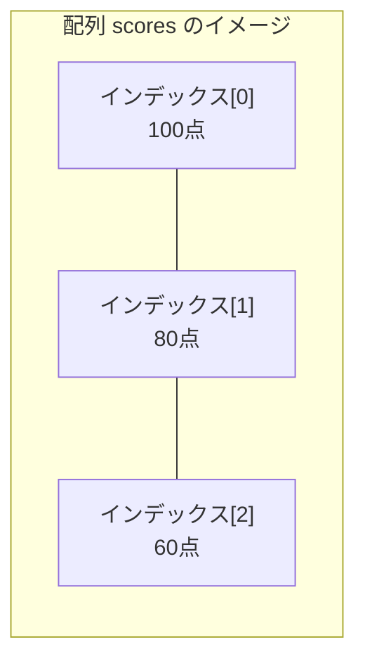
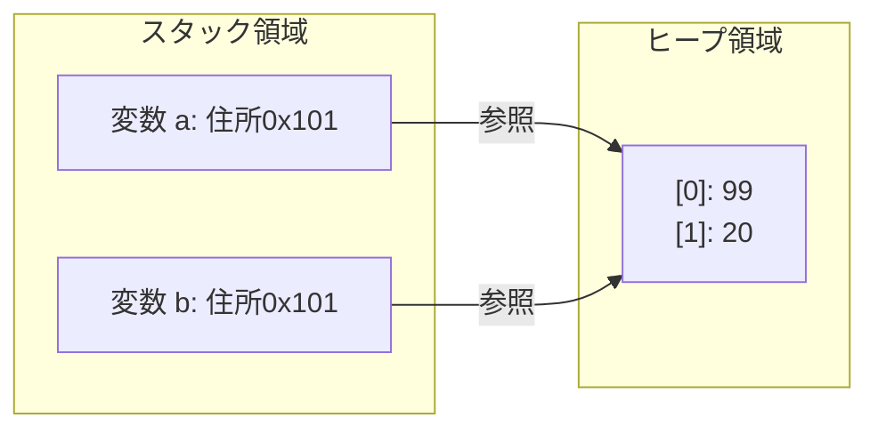

# Lesson 7 - 配列とコレクション

## 1. 配列（Array）とは
同じデータ型の変数を一列に並べて、ひとまとめに管理する仕組みです。

### 配列の構造
配列の各部屋には **「インデックス（添字）」** という番号が割り振られます。
**注意：番号は必ず「0」から始まります。**



### 配列のルール
- **固定長**：一度「長さ3」と決めたら、後から「4」に増やすことはできません。
- **参照型**：配列そのものは実体（インスタンス）であり、変数にはその「住所」が入ります。

---

## 2. 配列の使い方

### 配列の宣言と初期化
配列は「参照型」なので、使うには `new` を使ってメモリ上に「箱」を作る必要があります。

```java
// 1. 長さ3の整数配列を作る（中身は0で初期化される）
int[] scores = new int[3]; 

// 2. 値を代入する
scores[0] = 100;
scores[1] = 80;
scores[2] = 60;

// 【パターン】一括初期化（入れる値が決まっている場合）
int[] scores2 = {100, 80, 60};
```

### 注意：初心者が遭遇するエラー
- **IndexOutOfBoundsException**: `new int[3]` なのに `scores[3]` にアクセスしようとすると発生します（使えるのは 0, 1, 2 だけ）。

> **講師メモ**: 
> - VS Codeでわざと範囲外のインデックスを指定し、プログラムが強制終了する様子を見せてください。

---

## 3. 配列とループ（for文）
配列の全データを処理するには、`for` 文が最適です。配列の長さは `配列名.length` で取得できます。

### パターンA：基本のfor文（インデックスが必要な時）
```java
for (int i = 0; i < scores.length; i++) {
    System.out.println(i + "番目の値は " + scores[i]);
}
```

> カウンタ変数 `i` を使うと、「一つ先の要素（i+1）」を参照したり、特定の番号だけ処理したりできる利点があります。
### パターンB：拡張for文（全データを順番に見るだけの時）
「何番目か」という情報（カウンタ変数 `i`）を使わない場合は、もっとシンプルに書けます。
```java
for (int s : scores) {
    System.out.println("値は " + s);
}
```
- **メリット**: 「0から数える」「length未満まで」といった指定が不要なため、数え間違いのバグが起きません。

---

## 4. ラッパークラスとオートボクシング
次に学ぶ「コレクション」を扱うために、避けて通れない知識です。

### ラッパークラス
後述するコレクション（Listなど）には、**「参照型（クラス）」しか入れることができない**というルールがあります。そのため、基本データ型を「包んで（ラップして）」クラスとして扱うための道具が用意されています。

| 基本データ型 | ラッパークラス（参照型） |
| :--- | :--- |
| `int` | **`Integer`** |
| `double` | **`Double`** |
| `boolean` | **`Boolean`** |
| `char` | **`Character`** |

### オートボクシング
Javaが「基本型」と「ラッパークラス」を自動で変換してくれる機能です。

```java
Integer numObj = 10; // 自動で int → Integer に変換（オートボクシング）
int num = numObj;    // 自動で Integer → int に変換（アンボクシング）
```

---

## 5. コレクション（List, Set, Map）
配列の「長さが変えられない」という不便さを解消した、より柔軟な道具です。

### ジェネリクス
`List<String>` のように、`< >` を使って「何を入れる箱か」を指定する仕組みです。
- **ルール**: `< >` の中には **参照型** しか書けません。
  -  `List<int>` ⇒これはコンパイラー
  - `List<Integer>` ⇒ラッパークラスを使う！

### ① List（リスト）：順番に並べる
```java
// 命名：
// 複数形(names)や、末尾にList(nameList)を付けて何を格納してる変数かわかるようにしましょう！
List<String> nameList = new ArrayList<>();
nameList.add("田中");
nameList.add("佐藤");

System.out.println(nameList.get(0)); // 田中
System.out.println(nameList.size()); // 2（配列のlengthに相当）
```

### ② Set（セット）：重複を許さない
```java
Set<String> colorSet = new HashSet<>();
colorSet.add("Red");
colorSet.add("Blue");
colorSet.add("Red"); // 重複しているので無視される

System.out.println(colorSet.size()); // 2
```

### ③ Map（マップ）：ペアで管理する
「キー（Key）」と「値（Value）」をセットで管理します。
```java
// キーが社員番号(String)、値が名前(String)のマップ
Map<String, String> userMap = new HashMap<>();
userMap.put("101", "田中");
userMap.put("102", "佐藤");

System.out.println(userMap.get("101")); // 田中
```

### 命名規則
- **配列・List**: 複数を表す名前にする。
  - 例: `scores`, `userList`, `studentNames`
- **Map**: 「何から何を引くか」がわかる名前にする。
  - 例: `idToNameMap`, `configSettings`

---

## 6. 参照型と基本データ型の正体（メモリの仕組み）
Javaには **「スタック」** と **「ヒープ」** という2つのメモリ領域があります。

### 基本データ型（値そのものが入る）
`int` など。スタック領域にある箱の中に、**数値そのもの**が入っています。
```java
int a = 10;
int b = a; // 値が複製される
b = 20;    // bを変えてもaは10のまま
```

### 参照型（住所が入る）
配列、List、Stringなど。変数の中には、ヒープ領域にあるデータの **「住所（参照値）」** が入っています。
```java
int[] a = {10, 20};
int[] b = a; // 「住所」がコピーされる（aとbは同じ場所を指す）
b[0] = 99;   // b経由で中身を書き換えると...
System.out.println(a[0]); // 99 と出力される！
```



> メモリの動きを見せる。

#### null（ヌル）とは
参照型の変数に「住所が入っていない（どこも指していない）」状態のことです。

#### なぜ String は `equals()` なのか？（伏線回収）
- **`==` 演算子**: 箱の中の **「住所」** が同じかを比較している。
- **`equals()`**: 住所の先にある **「データ本体」** が同じかを比較している。
※Stringは参照型なので、別の住所に同じ文字列がある可能性があるため `equals()` が必須なのです。

---

## 7. 例題で挙動を確認

### クイズ1：基本データ型
何が出力されるでしょうか？
```java
int x = 1;
int y = x;
y = 5;
System.out.println(x);
```
> **答え**: `1` （xの箱の中身は変わらない）

### クイズ2：参照型（配列）
何が出力されるでしょうか？
```java
int[] arr1 = {1, 2, 3};
int[] arr2 = arr1;
arr2[2] = 5;
System.out.println(arr1[2]);
```
> **答え**: `5` （arr1とarr2は同じ実体を見ているため）

### クイズ3：Listの操作
```java
List<String> list = new ArrayList<>();
list.add("A");
list.add("B");
list.add("C");
System.out.println(list.get(1));
```
> **答え**: `B` （インデックスは0から始まるため）

---
### ループを使った全件処理
#### Listの全件処理
**インデックスを使用したループ**
```java
List<String> list = new ArrayList<>();
list.add("あ");
list.add("い");
list.add("う");
for (int i = 0; i < list.size();i++) {
    System.out.println(list.get(i));
}
```

**拡張for文**
```java
List<String> list = new ArrayList<>();
list.add("あ");
list.add("い");
list.add("う");
for (String str: list) {
    System.out.println(str);
}
```

#### Mapの全件処理
Mapの中身をすべて表示したい時は、このパターンを使いましょう。
```java
Map<String, String> map = new HashMap<>();
map.put("01", "北海道");
map.put("02", "青森");

for (Map.Entry<String, String> entry : map.entrySet()) {
    System.out.println("キー:" + entry.getKey() + ", 値:" + entry.getValue());
}
```

> **講師メモ**: 
> - `Map.Entry` は少し複雑に見えるので、今は「Mapを全件処理するための決まった型」として紹介してください。