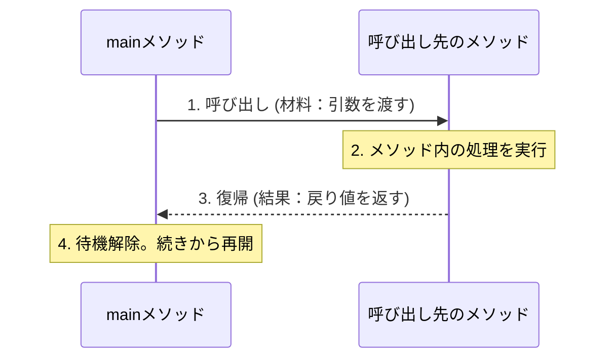
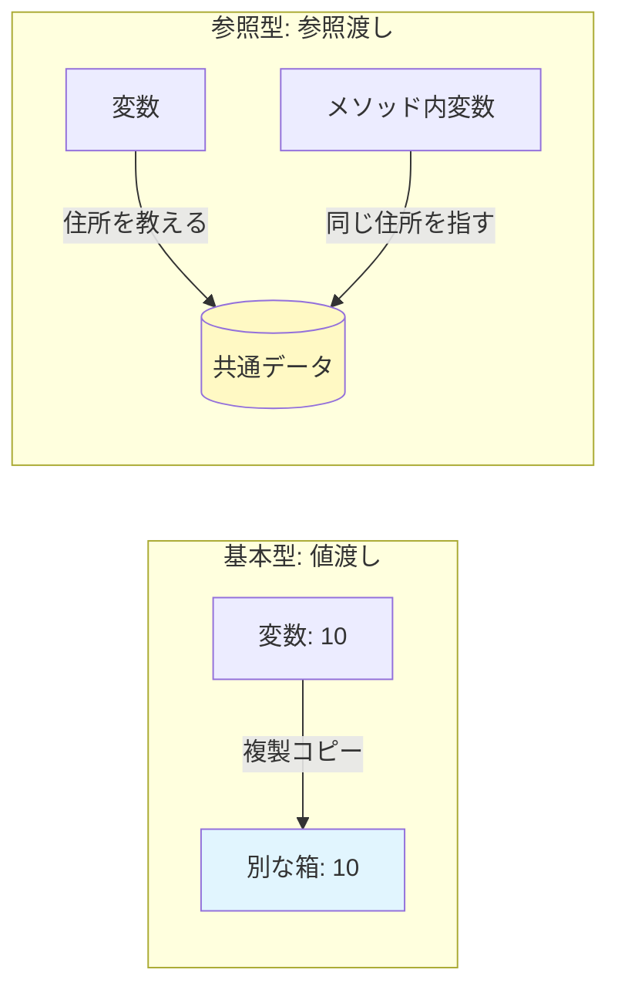

# Lesson 8 - メソッド

## 1. メソッドとは
クラスの中に記述する「特定の機能を持つ処理のまとまり」のことです。

- **再利用性**: 一度作れば、何度でも呼び出して使うことができます。
- **保守性**: 同じ処理を1箇所にまとめることで、修正が必要になった時にその場所だけを直せば済むようになります。
- **可読性（＝読みやすさ）**: `main` メソッドがスッキリし、プログラム全体が「何をしているか」読みやすくなります。
> 可読性については別資料で補足

---

## 2. メソッドの構造
メソッドは以下のパーツで構成されます。

```java
修飾子 戻り値の型 メソッド名 (引数) {
    // ここに処理を書く
    return 戻り値; 
}
```

### パーツの役割
- **アクセス修飾子**: 誰がこのメソッドを使っていいかを決めます。
    - **`public`**: クラスの外からでも自由に呼び出せます。
    - **`private`**: 同じクラスの中からしか呼び出せません（自分専用）。⇒今日はこちらを使います。
- **`static`**: インスタンス化せずに使える「共有の道具」であることを表します。⇒今日はすべてに付けます。
- **メソッド名**: 
	- **小文字**から始め、**キャメルケース**で書きます。
	- 処理内容がわかる「動詞 （+ 目的語）」にしましょう（例: `calculateTax`, `displayResult`）。
- **注意点**: メソッドの中に、別のメソッドを書くことはできません。

---

## 3. 処理の流れ（呼び出しと復帰）
メソッドが呼ばれると、プログラムの実行場所が一時的にジャンプします。呼び出した側は、呼ばれた先の処理が終わるまで**待機**（**ブロッキング**）します。



### 【デバッグ】ステップイン
VS Codeのデバッガで、メソッドの中身を追跡する方法です。
- メソッドを呼び出している行で停止させ、**`F11` (ステップイン)** を押します。
- 黄色の矢印が `main` からメソッドの中へジャンプする様子を自分の目で確認しましょう。

> デバッグで呼び出し元の処理が、呼び出し先が処理を終了するまで停止する様子を見せる。

---

## 4. 引数（ひきすう）：メソッドに渡すデータ
メソッドに処理の「入力」を渡す仕組みです。

- **実引数（じつひきすう）**: 呼び出す側が渡す「実際の値」。
- **仮引数（かりひきすう）**: メソッド側で値を受け取るための「変数」。**型**を必ず指定します。

### 引数の3大ルール
呼び出したいメソッドを特定するためには、以下の3つを必ず一致させる必要があります。
1. **型**（int型ならint型）
2. **数**（2つ渡すなら、2つで受ける）
3. **順番**（名前、年齢の順なら、その通りに渡す）

この「メソッド名 + 引数の型・数・順序」のセットを**シグネチャ**と呼び、Javaはこのシグネチャが完全に一致するメソッドを探して実行します。

> シグネチャが一致しないとメソッドが定義されてないというエラーが出ることを見せる。

### 引数の名前は違っていい
ここが初心者が混乱するポイントの一つですが、**実引数と仮引数の名前は違って構いません。**
```java
int x = 100;
display(x); // 実引数

private static void display(int num) { // 仮引数。名前が「num」に変わっても中身は100
    System.out.println(num);
}
```
「型」と「値」さえ合っていれば、名前は呼び出し先での「呼び名」にすぎません。

---

## 5. 戻り値（もどりち）：メソッドから返る結果
処理した「結果」を呼び出し元に返します。

- **戻り値がある場合**: `int` や `String` など、返すデータの型を指定します。**`return`** キーワードで値を返します。
- **戻り値がない場合**: **`void`**（空っぽという意味）を指定します。`return` は基本的に不要です。

### よくある間違い
- `void` のメソッドで `return 10;` と書くとエラー（何も返さない約束なのに返している）。
- `int` 型のメソッドで `return` を書き忘れるとエラー（返す約束なのに返していない）。

```java
private static int add (int num1, int num2) {
	int result = num1 + num2; 
    return result;
}
```
上記のようにint型の戻り値を返すものを受け取る場合は、呼び出した結果を格納する変数を用意する。
```java
// 戻り値を「受け取って」変数に代入する例
int result = add(10, 20); 
```

> 戻り値の受け取り方を実演する。
> 受け取らなかった場合も見せる。

---

## 6. 値渡しと参照渡しの違い（メモリの仕組み）
引数に「何を渡しているか」は、基本型と参照型で決定的に違います。

> まずは値コピーと参照コピー.htmlで基本型を参照型の違いを復習

- **基本データ型 (intなど) は「値渡し」**: 
  中身を「コピー」して渡します。メソッド内で値を書き換えても、呼び出し元の変数は変わりません。
- **参照型 (配列など) は「参照渡し」**: 
  「住所」を渡します。メソッド内で中身を書き換えると、呼び出し元のデータも変わってしまいます。



> 参照渡し_配列の例.htmlで説明
### 【例外】Stringは「不変（immutable）」
Stringは参照型ですが、中身が書き換えられない（不変）という性質を持っています。そのため、メソッド内で文字列を加工しても、呼び出し元の文字列が変わることはありません。配列とは動きが異なるので注意しましょう。

> 参照渡し_不変の例.htmlで説明（参照渡し_配列の例.htmlと比較

---

## 7. メソッドの具体的な活用例
「何をメソッドに切り出せばいいか？」の例です。

### 例1：共通の見た目を作る
同じ表示や定型処理をまとめます。
```java
public static void main(String[] args) {
    printLine();
    System.out.println("      システムメニュー      ");
    printLine();
}

private static void printLine() {
    System.out.println("---------------------------------");
}
```
**利点**: 線を `===` に変えたい時、一箇所の修正ですべての表示が変わります。複数回呼ぶ処理などをまとめることで、再利用性や保守性が上がります。

### 例2：判定だけを行う
`if` 文の条件式を「読みやすい名前」に置き換えることでまるで文章を読むようにコードが読めます。
```java
public static void main(String[] args) {
    int myAge = 25;
    if (isAdult(myAge)) {
        System.out.println("お酒を販売できます。");
    }
}

// 呼び出し：if (isAdult(userAge)) と書けるので読みやすい！
private static boolean isAdult(int age) {
    return age >= 20;
}
```
**利点**: `if (age >= 20)` と書くより、`if (isAdult(age))` と書くほうが「何を確認しているか」が一目で分かります。本質的にやりたいことを文章にできるため、可読性が上がります。

> booleanを返すメソッド名は、is○○とかhas○○がよく使われたり、ほかのメソッドと命名が違うことを説明する。
### 例3：複雑な計算を隠す
計算ルールをメソッドに閉じ込めます。
```java
// 税込み価格を計算するメソッド
private static int calculateTax(int price) {
    double taxRate = 1.1;
    return (int)(price * taxRate);
}
```
**利点**: 消費税が10%から変わったとしても、`main` メソッドを触る必要はありません。
### 例4：データの加工
表示用にデータを整えます。
```java
private static String formatName(String name) {
    return name + " 様";
}
```
**利点**: 何度も使われそうなものをメソッド化。

---

## 8. メソッドを作る時の「コツ」

### ① まずはmainメソッドに処理を書き、必要に応じてメソッドに切り出す
はじめのうちは、最初からメソッドを作ることはせずに、今まで通りmainメソッドにすべて書きましょう。
何度も同じ処理を書いていたり、複雑な処理すぎて全体の見通しが悪くなった段階でメソッドに切り出すことを考えましょう。
切り出す際は、**入力**（＝引数）に何が必要で、**出力**（＝戻り値）はどうするべきか考えましょう。
### ② 1つのメソッドには「1つの仕事」
「計算して、表示して、保存する」という巨大なメソッドを作ってはいけません。
仕事ごとに分けることで、部品としての再利用性が高まります。
### ③ return後の処理は実行されない（早期リターン）
`return` が実行された瞬間、そのメソッドは終了します。これを「エラーチェック」などに使うと便利です。

```java
private static void checkAge(int age) {
    if (age < 0) {
        System.out.println("エラー：値が不正です");
        return; // ここで強制終了！
    }
    // ここから下は age が 0 以上の時しか実行されない
    System.out.println("受付完了");
}
```

> voidの時は、returnでメソッドを抜けられることを説明。

---

> **課題へのヒント**
> - 今回の課題では、似たような処理を「メソッド」として切り出す練習をします。
> - 引数の「型・数・順番」が、呼び出し側と定義側でピッタリ合っているか、VS Codeの警告が出ていないか確認しましょう。
> - 配列をメソッドに渡した時、中身を書き換えると呼び出し元にどう影響するか、メモリのイメージを思い出してください。


---

# 参照渡しの理解度チェック

## 【質問1】実行するとどうなるか

```java
public static void main(String... args) {
    int a = 0;
    calculate(a);
    System.out.println(a);
}

private static void calculate(int b) {
    b = b + 1;
}
```

<details>
<summary>【答え】クリックして表示</summary>

```
0
```

⇒では、1と出力させるためにはどうすればよいか。

</details>

## 【質問2】実行するとどうなるか

```java
public static void main(String... args) {
    StringBuilder sb = new StringBuilder("あ");
    calculate(sb);
    System.out.println(sb.toString());
}

private static void calculate(StringBuilder builder) {
    builder.append("い");
}
```

<details>
<summary>【答え】クリックして表示</summary>

```
あい
```

</details>

## 【質問3】実行するとどうなるか

```java
public static void main(String... args) {
    String str = "あ";
    calculate(str);
    System.out.println(str);
}

private static void calculate(String str) {
    str = str + "い";
}
```

<details>
<summary>【答え】クリックして表示</summary>

```
あ
```

⇒String型は、immutable（イミュータブル：不変）オブジェクト  
　内部状態の書き換えを行うことができない。

</details>

## 【質問4】不要なメモリを使わないためには、どうすればよいか

```java
public static void main(String... args) {
    String a = "";
    for (int i = 0; i < 10; i++) {
        a += "A";
    }
    System.out.println(a);
}
```

<details>
<summary>【答え】クリックして表示</summary>

```java
public static void main(String... args) {
    StringBuilder sb = new StringBuilder();
    for (int i = 0; i < 10; i++) {
        sb.append("A");
    }
    System.out.println(sb.toString());
}
```

</details>
