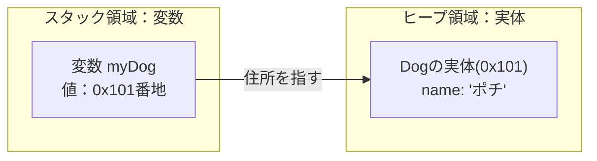

# Lesson 9～10 - クラスとオブジェクト（実体）

## 1. クラスとは：自分専用の「新しい型」を作る
クラスとは、「**データ**（属性）」と「**操作**（振る舞い）」をひとまとめにした「**設計図**」のことです。
現実世界の「モノ」をプログラムの中で表現するために使います。

また、これまで `int`（整数）や `double`（小数）といった、Javaに最初から用意されている型を使ってきました。
クラスを作るとは、「**Javaの世界に、新しいデータ型を自分で作り出すこと**」を意味します。
そして、今まで使ってきた**参照型は他の人が作ったクラス**だったのです。

クラス（設計図）には、その型が持つべき2つの要素を書きます。
1.  **フィールド**: その型が持つ「データ（状態）」
2.  **メソッド**: その型ができる「操作（振る舞い）」

```java
// 「Car型」という新しい型を定義する
public class Car {
    // 1. フィールド
    String color;
    int number;

    // 2. メソッド
    void run() {
        System.out.println(color + "色の車が走ります。");
    }
}
```

---

## 2. クラスの使い方：宣言・生成・代入
「型」を決めたら、実際にメモリの中に「モノ（実体）」を作って利用します。

### STEP 1：クラスを「定義」する
まずは設計図を作ります（例：犬クラス）。
```java
public class Dog {
    String name;
    
    void bark() {
        System.out.println(name + "：ワンワン！");
    }
}
```

### STEP 2：インスタンスを「生成」する（new）
設計図から実体（モノ）を作ります。これを **「newする/インスタンス化する/オブジェクトを生成する」** と呼びます。
```java
// 型名  変数名 = new クラス名();
Dog myDog = new Dog();
```

この一行では、非常に重要なことが2つ起きています。

1.  **左辺 (`Dog myDog`)**: 
    「Dog型の住所」を入れるための専用の箱（変数）を用意します。
    　**int型の箱に整数しか入らないように、Dog型の箱には Dogの住所 しか入りません。**
2.  **右辺 (`new Dog()`)**: 
    メモリ上の広い場所（ヒープ領域）に、Dogの実体を誕生させます。`new` は「**実体を作って、その住所を返す**」という命令です。`Dog()`はコンストラクタです。

### 住所を使った操作
変数に入っている「住所」をドット（`.`）を使って辿り、実体の中身を操作します。
```java
myDog.name = "ポチ"; // 住所を辿って、その先の名前を書き換える
myDog.bark();       // 住所を辿って、その先のメソッドを実行する
```

> やさしいjavaとは違い、１つのファイルにつき、１つのクラスを書くということを強調する。

---

## 3. 参照型の正体
なぜクラスのことを「参照型」と呼ぶのでしょうか。それは、**変数の中に実体そのものではなく、実体の「住所（参照）」が入っているから**です。



> **講師メモ**: 
> - デバッガで `new` した変数の中身（ID）を見せ、「これがメモリ上の住所のようなものだよ」と伝える。

---

## 4. アクセス修飾子とカプセル化：データを守る

### アクセス修飾子
クラスのパーツを「どこまで公開するか」を決めます。

| 修飾子 | 範囲 | 説明 |
| :--- | :--- | :--- |
| **`public`** | どこからでもOK | すべて公開。クラスや主要なメソッドに。 |
| **`protected`** | 同じパッケージ + 継承先 | 親子関係があれば別フォルダからでもOK。 |
| **（なし）** | **同じパッケージ内のみ** | 「パッケージプライベート」。同じフォルダ内限定。 |
| **`private`** | **自分のクラス内のみ** | **最優先で使う。** 外部から隠したいデータに。 |

実体のフィールドをどこからでも触れる（`public`）状態にするのは危険です。
「名前を空っぽにされる」「年齢にマイナスを入れられる」といった不正を防ぐため、データには鍵をかけます。

*   **`private`**: 自分のクラス以外からは見えない（基本はこちらを使う）
*   **`public`**: どこからでも見える（メソッドなど、窓口になるものに使う）

> 実際にアクセスできないエラーを見せる。
### getter と setter
鍵をかけたデータにアクセスするための「専用窓口」です。
```java
public class Car {
    private String color; // privateにして鍵をかける

    // 設定用（値をチェックすることもできる）
    public void setColor(String color) {
        this.color = color; 
    }

    // 取得用
    public String getColor() {
        return color;
    }
}
```

### 【重要】 `this` キーワード
`this.color = color;` のように、フィールド名と引数名が同じ場合、`this.` を付けることで「クラスのフィールド（自分自身）」であることを明示します。

> **講師メモ**: 
> - VS Codeの「右クリック ➜ ソースアクション ➜ Generate Getters and Setters...」で自動作成する様子を見せてください。


---

## 5. コンストラクタ：生成時の初期設定
インスタンスを `new` した瞬間に、一度だけ自動で実行される「**初期化専用のメソッド**」です。
「名前のない犬」や「色のない車」が生まれないように、誕生時に必ずデータをセットさせます。

1.  名前は **クラス名と全く同じ**。
2.  **戻り値（voidなど）を書かない**。

```java
public class Dog {
    private String name;

    // コンストラクタ（戻り値を書かない、クラス名と同じ名前にする）
    public Dog(String name) {
        this.name = name;
    }
}

// 呼び出し側
Dog dog = new Dog("ポチ"); // 誕生と同時に名前が決まる
```

### デフォルトコンストラクタ
コンストラクタを1つも書かなかった場合、Javaが自動的に「引数なしの空のコンストラクタ」を作ってくれます。自分で1つでも書くと、これは作られなくなります。

> 常にインスタンスはコンストラクタを経由して作られる。
> コンストラクタは複数定義できることを補足する。⇒オーバーロードを教える際でもいいかも。。。

---

## 6. クラス（型）を引数で渡す
クラスを型として定義すると、「**複数のデータをひとまとめにしてメソッドに渡す**」ことができるようになります。
※正確には複数のデータを持った実体への参照値を渡してます。

### バラバラに渡す場合（面倒・・・）
```java
void printInfo(String name, int price, String category, int stock) {
 ... 
}
```

### クラス（型）で渡す場合（可読性が高い）
「商品（Item）」という型を渡せば、その中にある情報はすべて付いてきます。

```java
// Item型の住所を1つ受け取るだけ！
public void printInfo(Item item) {
    System.out.println("商品名：" + item.getName());
    System.out.println("価格：" + item.getPrice());
}
```

**例え話：**
買い物に行くときに、1円玉、10円玉…とバラバラに手渡すのではなく、「財布」ごと渡すようなものです。これで買ってきてという感じです。渡された人は、財布の中から必要な情報を自由に取り出すことができます。

---

## 7. 活用例：Listとクラス
頻繁に使われるのが、自作した型を `List` で管理するパターンです。

```java
// Item型の住所をたくさん入れられるリスト
List<Item> itemList = new ArrayList<>();

itemList.add(new Item("消しゴム", 100));
itemList.add(new Item("ノート", 200));

for (Item item : itemList) {
    // itemには、ループごとに各インスタンスの「住所」が入る
    item.displayInfo(); 
}
```

**定義へのジャンプ**: 
クラス作成したことでファイルが分かれて移動が面倒くさいですよね。
例えば、`Main.java` で `item.displayInfo()` の部分を `Ctrl + 左クリック` すると、即座に `Item.java` の定義場所にジャンプできます。

---

## 8. 考え方：自分のことは自分でやる
クラスを作成するときは、「**そのデータを持っているクラス自身が、そのデータを使った処理も担当する**」のが美しいです。

*   **悪い例**: `Main` クラスで商品の税込価格を計算する。
*   **良い例**: `Item` クラスの中に `getTaxIncludedPrice()` メソッドを作る。

**なぜ？**: 消費税率が変わったとき、`Main` に計算式を書いていると、おそらくいろいろな場所に同じような記述がされることになってるかと思います。そのため、あちこち修正して回る必要があります。`Item` クラスの中に計算式があれば、そこ一箇所を直すだけで全てのプログラムが正しく動きます。


---
## クラスの記述順序とコメント
### 記述順序
以下の順番で書くのが一般的です。

1.  **フィールド**
2.  **コンストラクタ**（初期化）
3.  **メソッド**（getter/setter や その他の振る舞い）

### コメント
プログラムは「書く時間」より「他人に読まれる時間」の方が圧倒的に長いです。

- **Javadoc形式 (`/** ... */`)**: クラスやメソッドの上に書きます。VS Codeでそのメソッドを使おうとした時に、ツールチップとして説明が表示されるようになります。
- **単一行コメント (`//`)**: 処理の中で「なぜそうしたか」を書きます。

```java
/**
 * 車を管理するクラスです。
 */
public class Car {
    /** 車体の色 */
    private String color;

    /**
     * 車を走行させます。
     */
    public void run() {
        System.out.println("走行中...");
    }
}
```

> `/**` と入力し、Enterキーを押すことでクラスコメントやメソッドコメントのひな形ができることを見せる。

### 方針
- クラスとメソッドには必ずコメントを付けること。（※自動生成したgetter/setterには付けなくてよいです。）
- 処理に関する単一行コメントは必要と感じた個所だけ。