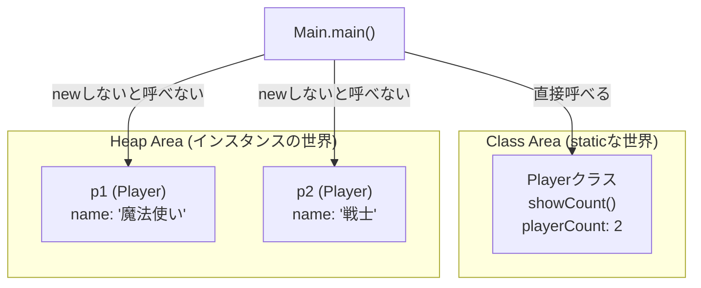

# staticメンバ と インスタンスメンバ

Javaのクラスには、「**個別のモノ（インスタンス）が持つもの**」と「**クラスそのものが持つもの**」の2種類があります。
まずは、Javaという言語における書き方とアクセスのルールを確認しましょう。

### フィールド（変数）の定義

| 種類           | 書き方                       | 意味                  |
| :----------- | :------------------------ | :------------------ |
| **インスタンス変数** | `String name;`            | インスタンスごとに作られる「個別の箱」 |
| **static変数** | `static int playerCount;` | クラスに1つだけ作られる「共有の箱」  |

### メソッドの定義とアクセスルール

| 種類 | 呼び出し方（基本） | 特徴 |
| :--- | :--- | :--- |
| **インスタンスメソッド** | `変数名.メソッド名()` | `this`（自分自身）を使える |
| **staticメソッド** | `クラス名.メソッド名()` | `this` を使えない |


## 1. 文法とアクセスのルール

まずは、プログラム上での書き方と、呼び出し方のルールを確認しましょう。

### フィールドとメソッドの定義
`static`がついているかいないかで、呼び出し方が決まります。

```java
public class Player {
    // インスタンスフィールド（staticなし）
    private String name;

    // staticフィールド（staticあり）
    private static int playerCount = 0;

	// コンストラクタ
    public Player(String name) {
        this.name = name;
        playerCount++; // インスタンスが作られるたびに加算
    }

    // インスタンスメソッド（staticなし）
    public void hello() {
        System.out.println("私は " + this.name + " です。"); // 自身が持つインスタンスフィールドにアクセス可能
        // System.out.println("現在のプレイヤー数は " + playerCount + " です。"); // staticフィールドにアクセス可能
    }

    // staticメソッド（staticあり）
    public static void showCount() {
        System.out.println("現在のプレイヤー数は " + playerCount + " です。"); // staticフィールドにアクセス可能
    }
}
```

### mainメソッドからの呼び出し方
`main`メソッド自体が`static`なので、呼び出し方に大きな違いが出ます。

```java
public class Main {
    public static void main(String[] args) {
        // --- staticメンバの呼び出し ---
        // 「クラス名.メソッド名」で直接呼べる（newしなくていい）
        Player.showCount(); 

        // --- インスタンスメンバの呼び出し ---
        // 「newした変数名（参照値）.メソッド名」で呼ぶ
        Player p1 = new Player("魔法使い");
        p1.hello(); 
        
        Player p2 = new Player("戦士");
        p2.hello();

        // 2人増えたのでもう一度確認
        Player.showCount(); 
    }
}
```

### 【図解】アクセスのルール
`static`（共通エリア）からは、`new`して住所を特定しない限り、個別のインスタンスの中身は見えません。



---

## 2. 実践：どう使い分ければよいか？

文法がわかったら、次は「どちらで作るべきか」の判断基準です。

### ① インスタンスメンバにすべきケース
「**モノ（オブジェクト）によって中身が違う**」場合です。

*   **データ（フィールド）：** 名前、HP、所持金、装備など。
*   **操作（メソッド）：** 自分のHPを減らす、自分のステータスを表示するなど、自分のデータを参照/更新する処理など。

```java
// インスタンスメソッドの例
public void takeDamage(int damage) {
    this.hp -= damage; // 「自分の」HPを操作する
}
```

### ② staticメンバにすべきケース
「**個別のモノには関係ない、共通の決まり事や道具**」の場合です。引数だけで処理できるものや、入力を必要としない処理など。

*   **データ（フィールド）：** 消費税率、ゲームのタイトル、最大レベル制限など。
*   **操作（メソッド）：** サイコロを振る、計算をする、文字を加工するなど。

```java
// staticメソッドの例（便利な道具箱のイメージ）
public class GameUtil {

    // 引数だけで完結し、インスタンスのデータ（this.xxx）を使わない
    public static int rollDice() {
        return (int)(Math.random() * 6) + 1;
    }
}

// 呼び出し（わざわざ new GameUtil() しなくてよい）
int result = GameUtil.rollDice();
```

> ただし、〇〇Utilのような如何にも汎用的なクラスを作るのは設計の観点からはNGです。ちゃんと目的別に作るのが本来は正しいです。

---

## 3. 判断のチェックリスト

新しい変数やメソッドを作るとき、どちらにするか迷ったらこの質問に答えてみてください。

1.  **「それはモノ（インスタンス）によって違うデータか？」**
    *   YES → **インスタンス変数**
    *   NO（全員共通） → **static変数**
2.  **「その処理に `this.変数名` は必要か？」**
    *   YES → **インスタンスメソッド**
    *   NO（渡された引数だけで計算できる） → **staticメソッド**

**初心者のためのガイド：**
Javaは「モノ（オブジェクト）」を主役にする言語です。
そのため、**迷ったらまずは「インスタンスメンバ（staticなし）」で作ってください。**
プログラムを書いていく中で、「これは特定の誰かのデータじゃなくて、ただの計算ツールだな」と気づいた時だけ `static` に変えるのが、失敗の少ないやり方かもしれません。

