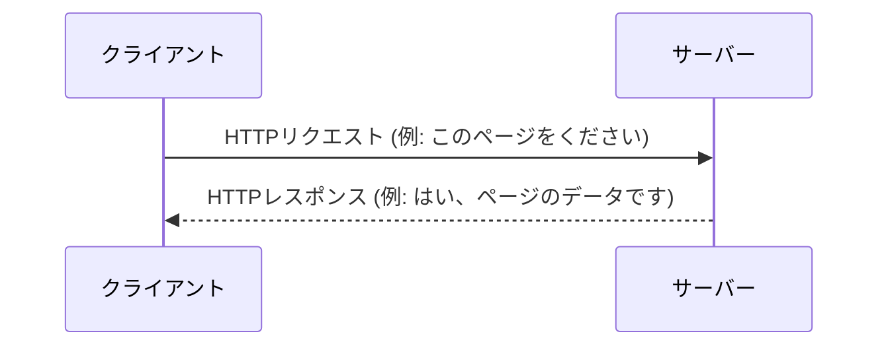
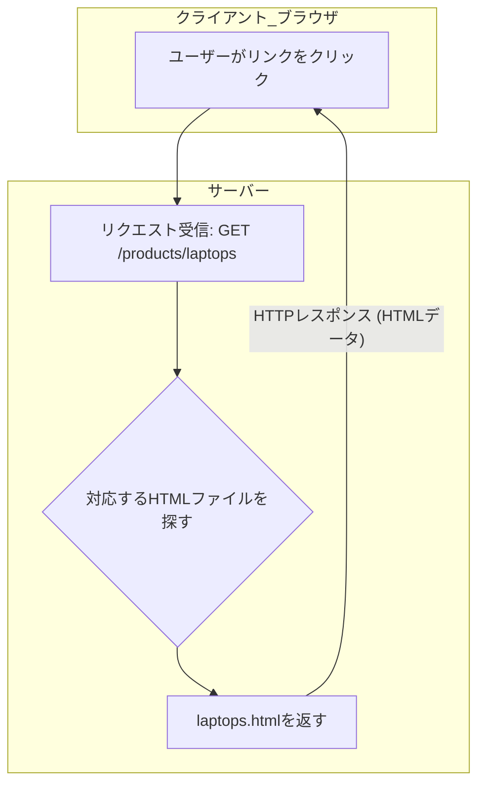
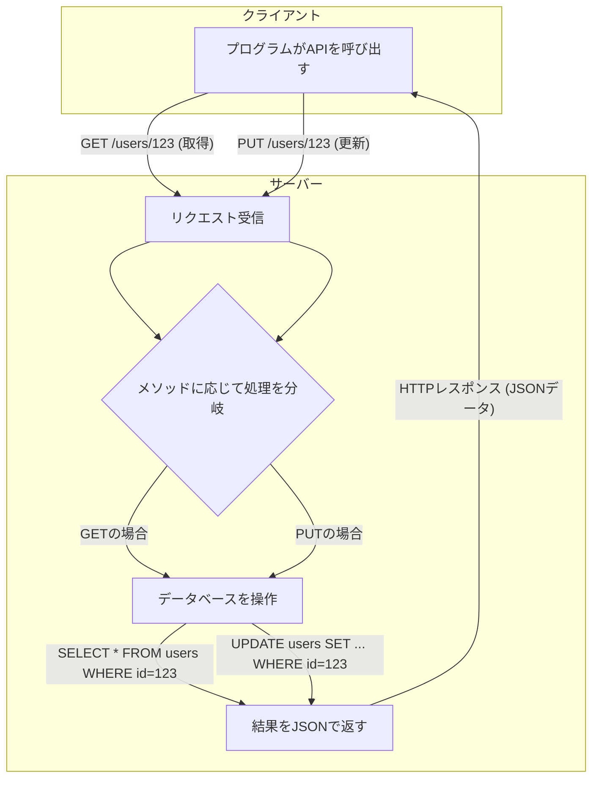

# **HTTPプロトコルとパス

## **1\. HTTPプロトコルとは**

**HTTP (Hypertext Transfer Protocol)** は、**クライアント**（Webブラウザやアプリなど）と**サーバー**の間で情報をやり取りするための通信規約（ルール）です。

この通信は、クライアントがサーバーに「これをください」という**リクエスト**（要求）を送り、サーバーが「はい、どうぞ」と**レスポンス**（応答）を返すという、非常にシンプルなやり取りで成り立っています。

#### **【図解】クライアントとサーバーの基本的なやり取り**



## **2\. HTTPリクエストの構成要素**

HTTPリクエストは、主に以下の3つの部分から構成されます。この構造は、手紙に例えると「宛先や要件」「差出人の情報」「本文」のような関係になります。

#### **【図解】HTTPリクエストの構造**

```
+------------------------------------------------+
| リクエスト行 (Request Line)                     |  ← どんな方法で(GET)、何を(/users/123)、どのバージョンで(HTTP/1.1)
+------------------------------------------------+
| ヘッダー (Headers)                              |  ← どのサーバー宛か(Host)、どんなソフトを使っているか(User-Agent)など
+------------------------------------------------+
| (空行)                                         |  ← ヘッダーとボディの区切り
+------------------------------------------------+
| ボディ (Body) ※メソッドによってはない場合もある |  ← 送信したいデータ本体 (例: JSON形式のデータ)
+------------------------------------------------+
```

### **2-1. リクエスト行**

リクエスト行は、サーバーに対する「要求」そのものを表し、**メソッド**、**URI**、**HTTPバージョン**の3つの要素で構成されます。

-   **メソッド (Method)**: サーバーに「何をしてほしいか」を伝える動詞です。
    -   `GET`: データの**取得**
    -   `POST`: 新しいデータの**作成**
    -   `PUT`: 既存データの**更新**
    -   `DELETE`: データの**削除**

-   **URI (Uniform Resource Identifier)**: URL は URI の一種です。URI がリソースを識別するための「識別子」の総称であるのに対し、URL はその中でもリソースの「場所（住所）」を指し示すものです。普段私たちがブラウザで使うものはほとんど URL であり、URI と呼ばれることも多いです。

#### **【図解】URL (URI) の構造**

URLは以下の要素で構成されており、それぞれが特定の意味を持っています。

```
 https  ://  example.com  :443  /users/123  ?limit=10&page=2  #profile
 ~~~~~~    ~~~~~~~~~~~~~  ~~~~  ~~~~~~~~~~  ~~~~~~~~~~~~~~~~  ~~~~~~~~
   |             |          |        |             |             |
①スキーム ②ホスト名      ③ポート   ④パス          ⑤クエリ        ⑥フラグメント
```

1.  **スキーム (Scheme)**: `https` や `http` など、通信のプロトコル（ルール）を示します。
2.  **ホスト名 (Host)**: サーバーの場所を示すドメイン名やIPアドレスです。
    -   **DNSの仕組み**: 人間が覚えやすい `example.com` (ドメイン名) を、コンピュータが通信に使う `192.0.2.1` (IPアドレス) に変換する仕組みが **DNS (Domain Name System)** です。
        ```mermaid
        graph TD
            A[あなた] -- "example.comにアクセス" --> B{ブラウザ};
            B -- "example.comのIPアドレスは？" --> C[DNSサーバー];
            C -- "192.0.2.1だよ" --> B;
            B -- "192.0.2.1のサーバーにアクセス" --> D[Webサーバー];
        ```
3.  **ポート番号 (Port)**: サーバーのどの「窓口」に接続するかを指定します。通常は省略されます（`http`は80番、`https`は443番がデフォルト）。
4.  **パス (Path)**: ホスト名以下の `/` から始まる部分で、サーバー上のリソースの具体的な場所を示します。
    -   <span style="color: red; ">**パスパラメータ**</span>: パスの一部を可変にすることで、特定のリソースを指定します。
        -   **例**: `/users/123` の `123` の部分。「IDが123のユーザー」という特定のリソースを指します。
5.  <span style="color: red; ">**クエリパラメータ**</span>: `?` 以降の `key=value` の形式で、並び替えや絞り込みなど、リソースに対する追加の条件を指定します。
6.  **（フラグメント (Fragment)）**: `#` 以降の部分で、ページ内の特定の位置を示します。この情報はサーバーには送信されません。

### **2-2. ヘッダー (Headers)**

リクエストに関する付加情報を `キー: 値` の形式で格納します。

#### **【具体例】リクエストヘッダー**

```
Host: example.com
User-Agent: Mozilla/5.0 (Windows NT 10.0; Win64; x64) AppleWebKit/537.36 (KHTML, like Gecko) Chrome/91.0.4472.124 Safari/537.36
Accept: application/json
Authorization: Bearer <token>
```

-   `Host`: リクエスト先のホスト名
-   `User-Agent`: リクエストを行っているクライアント（ブラウザなど）の情報
-   `Accept`: クライアントが受け取りたいデータの形式
-   `Authorization`: 認証情報

### **2-3. ボディ (Body)**

`POST` や `PUT` など、サーバーにデータを送信する際に使われる部分です。

-   <span style="color: red; ">**ボディパラメータ**</span>: リクエストボディに含まれるデータそのものです。JSON形式が最も一般的です。

#### **【具体例】`POST /users` のリクエスト全体**

新しいユーザーを作成する際の、リクエストの完全な例です。

```http
POST /users HTTP/1.1
Host: api.example.com
Content-Type: application/json

{
  "name": "山田 太郎",
  "email": "yamada.taro@example.com",
  "password": "password123"
}
```

## **3\. HTTPレスポンスの構成要素**

サーバーはリクエストに対して必ずレスポンスを返します。レスポンスもリクエストと似た構造を持っています。

#### **【図解】HTTPレスポンスの構造**

```
+------------------------------------------------+
| ステータス行 (Status Line)                      |  ← 処理結果がどうだったか (HTTP/1.1 200 OK)
+------------------------------------------------+
| ヘッダー (Headers)                              |  ← データの種類(Content-Type)、サイズ(Content-Length)など
+------------------------------------------------+
| (空行)                                         |  ← ヘッダーとボディの区切り
+------------------------------------------------+
| ボディ (Body)                                  |  ← 要求されたデータ本体 (例: HTMLやJSON)
+------------------------------------------------+
```

-   **ステータスコード (Status Code)**: 3桁の数字で、リクエストの処理結果を示します。
    -   **2xx (成功) 😊**: `200 OK` (成功), `201 Created` (作成成功)
    -   **3xx (リダイレクト) ➡️**: `301 Moved Permanently` (恒久的な移動)
    -   **4xx (クライアントエラー) 🤔**: `400 Bad Request` (リクエスト不正), `404 Not Found` (リソースが見つからない)
    -   **5xx (サーバーエラー) 😨**: `500 Internal Server Error` (サーバー内部エラー)

-   **ヘッダー (Headers)**: レスポンスに関する付加情報です。
-   **ボディ (Body)**: クライアントが要求したデータ本体です。WebサイトならHTML、APIならJSONなどが返されます。

#### **【具体例】`GET /users/123` への成功レスポンス**

IDが123のユーザー情報を取得するリクエストに対する、サーバーからの応答例です。

```http
HTTP/1.1 200 OK
Content-Type: application/json
Content-Length: 54

{
 "id": 123,
 "name": "山田 太郎",
 "email": "yamada.taro@example.com"
}
```

## **補足：データ形式**

### csv 形式
```
ID, Name, Country
111, Mike, USA
222, Nancy, Canada
```

- Comma-Separated Values の略
- excel とかで開けるやつ
### json 形式

```
[
  {
    "ID": "111",
    "Name": "Mike",
    "Country": "USA"
  },
  {
    "ID": "222",
    "Name": "Nancy",
    "Country": "Canada"
  }
]
```

- JavaScript Object Notation の略
- javascript のオブジェクトの書き方

⇒これを使います

### xml 形式

```xml
<?xml version='1.0' encoding='utf-8'>
<root>
    <employee>
        <employ>
            <ID>111</ID>
            <Name>Mike</Name>
            <Country>USA</Country>
        </employ>
        <employ>
            <ID>222</ID>
            <Name>Nancy</Name>
            <Country>Canada</Country>
        </employ>
    </employee>
</root>
```

- Extensible Markup Language の略
- html に似ていて，タグでデータを囲み，入れ子構造にすることが可能

## **4\. WebページのパスとREST APIのパスの違い**※工事中

どちらもサーバー上のリソースを指定しますが、その **「目的」** と **「設計思想」** が大きく異なります。

### **(1) Webページのパス (ドキュメント指向)**

主に人間が見るための**ドキュメント (HTML)** の場所を示します。パスがそのままページの階層構造を表していることが多いです。

-   **目的**: ユーザーに特定の**Webページ**を見せること。
-   **例**: `https://example.com/products/electronics/laptops`
    -   これは「productsカテゴリの中のelectronicsサブカテゴリにあるlaptopsの**ページ**をください」という意味合いになります。

#### **【図解】Webページのリクエストの流れ**



### **(2) REST APIのパス (リソース指向)**

プログラムが扱う**リソース (データ)** の場所を示します。パスは「名詞」、HTTPメソッドは「動詞」の役割を果たし、組み合わせることでデータの操作を表現します。

-   **目的**: プログラムが**データ**を操作 (取得、作成、更新、削除) すること。
-   **例**: `https://api.example.com/users/123`
    -   これは「usersというリソースの中の、IDが123の**データ**」そのものを指します。

#### **【図解】REST APIのリクエストの流れ**



以下の表のように、同じパス (`/users`) でもHTTPメソッドを変えることで、異なる操作を実現します。

| HTTPメソッド | パス         | 意味                                     |
| :----------- | :----------- | :--------------------------------------- |
| `GET`        | `/users`     | 全てのユーザー**データ**を**取得**する   |
| `GET`        | `/users/123` | IDが123のユーザー**データ**を**取得**する |
| `POST`       | `/users`     | 新しいユーザー**データ**を**作成**する   |
| `PUT`        | `/users/123` | IDが123のユーザー**データ**を**更新**する |
| `DELETE`     | `/users/123` | IDが123のユーザー**データ**を**削除**する |

### **まとめ**

-   **Webページのパス**: 「どの**ページ**を見たいか」を示す。
-   **REST APIのパス**: 「どの**データ**を、どう操作したいか」を示す。

Web API開発では、この **「リソース指向」** の考え方を理解することが非常に重要です。