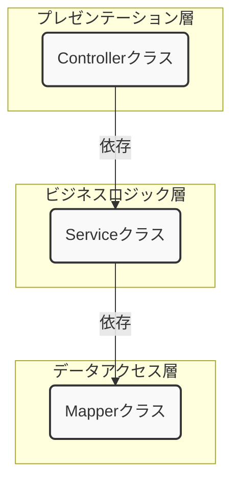

Spring BootとMyBatisを使ってWeb APIを開発するハンズオンを行いますが、その前に、なぜそのような作り方をするのか、という設計思想について学んでいきましょう。
この設計思想を理解することが、単に「動くプログラム」から「保守しやすく、変更に強いプログラム」を作るための第一歩となります。

### 1. 基本的な登場人物（クラス）の紹介

まず、今回作成するWeb APIで登場する主要なクラスの役割分担を説明します。

*   **Controller**: APIのエンドポイント（URL）を定義し、外部からのリクエスト（要求）を受け取る窓口です。クライアントから送られてきたデータを後述の`Form`で受け取り、ビジネスロジックを担当する`Service`を呼び出します。処理結果をクライアントに返す（レスポンス）のも彼の仕事です。
*   **Service**: アプリケーションの核となるビジネスロジック（業務処理）を担当します。例えば、「ユーザー情報を登録する」という処理であれば、関連するデータのチェックや、データベースへの保存指示などを行います。複数の`Mapper`を組み合わせて複雑な処理を実装することもあります。
*   **Mapper (Repository)**: データベースとのやり取り（SQLの実行）を専門に行うインターフェースです。MyBatisがこのインターフェースを元に、データベースアクセスのための具体的な処理を自動で実装してくれます。
*   **Form (DTO)**: クライアントから送られてくるリクエストのパラメータを格納するための専用クラスです。入力値のチェック（バリデーション）ルールを定義することもできます。
*   **Entity**: データベースのテーブル構造と一対一に対応するクラスです。`Service`や`Mapper`は主にこの`Entity`を使ってデータのやり取りを行います。

**ポイント：なぜ`Form`と`Entity`を分けるのか？**

Controllerでリクエストを受け取る際に、直接`Entity`を使わず、一度`Form`という専用のクラスを挟みます。これは、クライアントが要求するデータ構造と、データベースが持つデータ構造が必ずしも一致しないためです。例えば、パスワードのようにリクエストでは受け取るが、データベースの情報を返す際には含めたくない項目がある場合に、明確に役割を分離できます。
これにより、APIの仕様変更（例：画面から受け取る値が新しく増えた）がデータベースの構造に、データベースの構造変更（例：テーブルの列が増えた）がAPIの仕様に直接影響しづらくなります。

### 2. なぜクラスを分けるのか？ - 変更に強いシステムを目指して

もし、これら全ての処理を1つのクラスに書いたらどうなるでしょうか？

*   コードが非常に長くなり、どこに何が書かれているか分からなくなる。
*   少しの仕様変更でも、修正箇所が広範囲に及び、バグを生みやすくなる。
*   同じような処理を別の場所でも使いたくても、再利用が難しい。
*   テストが非常に困難になる。
⇒詳しくはオブジェクト指向プログラミングにおける**SOLID原則**を勉強してみてください。

このような問題を解決し、「変更に強いシステム」を作るための設計手法が**レイヤードアーキテクチャ**です。

#### レイヤードアーキテクチャとは

システムを役割ごとに「層（Layer）」に分割して、それぞれの層が持つ責任を明確にする考え方です。 今回の構成は、このアーキテクチャに基づいています。

*   **プレゼンテーション層 (Controller)**: ユーザー（や外部システム）とのやり取りを担当。
*   **ビジネスロジック層 (Service)**: アプリケーションのコアとなる業務処理を担当。
*   **データアクセス層 (Mapper)**: データベースとのやり取りを担当。





このように役割を分離（**責務の分離**）することで、各クラスは自分の仕事に集中できます。その結果、コードの見通しが良くなり、修正の影響範囲を限定でき、変更に強い構造になるのです。

### 3. クラス間の「つながり」を考える - 結合度

クラスを分けただけでは、まだ不十分です。次に、クラス同士の「つながり方」について考える必要があります。このつながりの強さを**結合度**と呼びます。

例えば、`Service`クラスが`Mapper`クラスを以下のように直接生成していたらどうでしょう。

```java
// 悪い例：Serviceクラス内で直接Mapperをnewしている
public class UserServiceImpl implements UserService {
    private UserMapper userMapper = new UserMapperImpl(); // ← 密な結合！

    public User findById(Integer id) {
        return userMapper.findById(id);
    }
}
```

このコードは、`UserServiceImpl`が`UserMapperImpl`という**具体的な実装クラス**を名指しで知ってしまっています。これを「**結合度が高い**（密結合）」状態と呼びます。

密結合には以下のような問題があります。

*   **差し替えが困難**: もしテストのために、データベースに接続しない偽物の`Mapper`（モック）を使いたくなっても、`UserServiceImpl`のコードを書き換えない限り差し替えられません。
*   **修正の影響を受けやすい**: `UserMapperImpl`の作り方が変わったら（例えば、コンストラクタに引数が必要になったら）、`UserServiceImpl`も修正が必要になります。

この問題を解決し、「**結合度を低く**（疎結合）」保つことが、変更への強さをさらに高める鍵となります。

### 4. 解決策「依存性注入（DI）」の登場

疎結合を実現するための強力な手法が**依存性注入**（Dependency Injection, DI）です。

DIを一言でいうと、「**クラスが必要とするオブジェクト（依存オブジェクト）を、自分自身で生成するのではなく、外部から与えてもらう**」という考え方です。

先ほどの例をDIを使って書き換えてみましょう。

```java
// 良い例：DIを使う
public class UserServiceImpl implements UserService {
    private final UserMapper userMapper; // インターフェース型で宣言

    // コンストラクタで外部からインスタンスを受け取る（注入してもらう）
    public UserServiceImpl(UserMapper userMapper) {
        this.userMapper = userMapper;
    }

    public User findById(Integer id) {
        return userMapper.findById(id);
    }
}
```

ポイントは以下の通りです。

*   `Service`は`Mapper`の**インターフェース**にのみ依存し、具体的な実装クラスを知らない。
*   `Mapper`のインスタンスは、`new`するのではなく、コンストラクタを通して**外部から渡されて**います。

これにより、`Service`は「`UserMapper`インターフェースの機能さえ満たしていれば、どんなクラスが来ても構わない」という状態になります。テスト時には本物の`Mapper`の代わりにテスト用のモックを簡単に渡す（注入する）ことができ、非常に柔軟な構造になります。

### 5. Spring BootにおけるDIの実現方法

「では、その『外部から与える』というのは、一体誰がやってくれるのか？」

その役割を担うのが、Spring Frameworkの**DIコンテナ**です。 Spring Bootでは、簡単な設定（アノテーション）だけで、このDIの仕組みを利用できます。

1.  **Beanとして登録する**: Springに管理してほしいクラスに`@Service`や`@Mapper`といったアノテーションを付けます。これにより、DIコンテナがこれらのクラスのインスタンスを生成・管理してくれます（このインスタンスを**Bean**と呼びます）。

    ```java
    @Service // このクラスはServiceですよ、とSpringに教える
    public class UserServiceImpl implements UserService { ... }

    @Mapper // このインターフェースはMapperですよ、とMyBatis(とSpring)に教える
    public interface UserMapper { ... }
    ```

2.  **注入してもらう**: 使いたいクラスのコンストラクタに、必要なインスタンスを引数として定義します。Springがその型に合うBeanを自動的に探し出し、インスタンス生成時に渡してくれます（**コンストラクタインジェクション**）。

    ```java
    @RestController
    public class UserController {
        private final UserService userService;

        // SpringがUserService型のBean（UserServiceImplのインスタンス）を自動で渡してくれる
        public UserController(UserService userService) {
            this.userService = userService;
        }
        // ...
    }

    @Service
    public class UserServiceImpl implements UserService {
        private final UserMapper userMapper;

        // SpringがUserMapper型のBeanを自動で渡してくれる
        public UserServiceImpl(UserMapper userMapper) {
            this.userMapper = userMapper;
        }
        // ...
    }
    ```

たったこれだけで、先ほど説明したDIが実現できます。私たちは面倒なインスタンス管理をSpringに任せ、ビジネスロジックの開発に集中できるのです。

#### まとめ

*   **変更に強いシステム**を作るには、**レイヤードアーキテクチャ**に基づきクラスの**責務を分離**することが重要です。
*   分離したクラス同士は、具体的な実装に依存しない**疎結合**な関係を目指します。
*   疎結合を実現する強力な手法が**依存性注入（DI）**です。
*   Spring Bootを使えば、`@Service`などのアノテーションを付けるだけで、DIの仕組みを簡単に利用できます。

この「責務の分離」と「DI」は、モダンなアプリケーション開発における非常に重要な考え方です。これからのハンズオンで、この設計のメリットをぜひ体感してみてください。