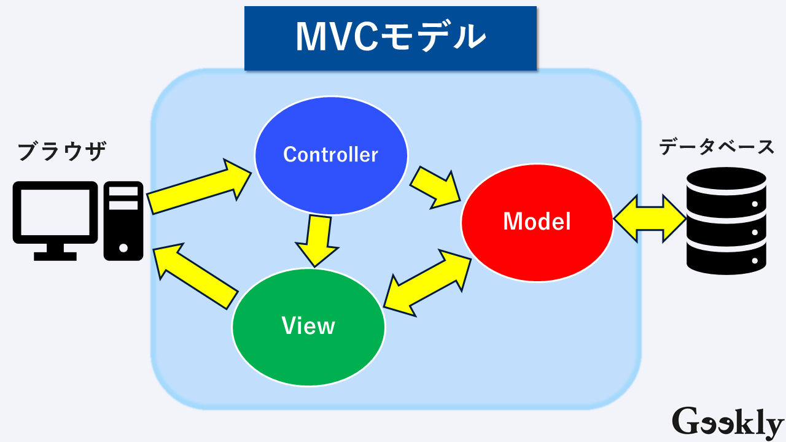

# **MVC（Model-View-Controller）パターン**

## **1\. MVC とは？**

**MVC**は、「アプリケーションの責任を 3 つに分けて整理しよう」という設計パターンです。アプリケーションを「**Model**」「**View**」「**Controller**」という 3 つの役割に分割することで、コードの管理や再利用を容易にし、開発効率を高めることを目的としています。

 
参照元：https://www.geekly.co.jp/column/cat-technology/1911_040/

### **なぜ MVC が必要なのか？**

大規模なアプリケーションでは、すべての処理を一つのファイルに書くと、コードが複雑になり、どこに何が書かれているのか分からなくなってしまいます。MVC は、役割ごとにコードを整理することで、チームでの開発や、将来の機能追加・変更をスムーズに行えるようにします。

## **2\. 3 つの役割**

### **(1) Model（モデル）**

アプリケーションの\*\*「データ」**と**「ビジネスロジック」\*\*を扱う部分です。データベースとのやり取りや、データの計算・加工など、アプリケーションの中核となる処理を担当します。

- **役割**:
  - データベースからユーザー情報を取得・保存する
  - データの計算や検証などの処理
- **ポイント**:
  - UI や画面の表示には関わらない
  - 「データの本体と操作方法」の部分
  - どの View にデータを渡すか、という知識も持たない

### **(2) View（ビュー）**

ユーザーに表示される\*\*「見た目」\*\*を担当する部分です。HTML や CSS などを生成し、Model から受け取ったデータを分かりやすく表示します。

- **役割**:
  - 画面表示（ユーザーに見せる部分）
  - ユーザーからの入力を受け取る
- **ポイント**:
  - データをどう見せるかに専念
  - ビジネスロジックは含めない
  - Model から渡されたデータを表示するだけ

### **(3) Controller（コントローラー）**

Model と View の\*\*「橋渡し役」**です。ユーザーからのリクエストを受け取り、どの Model を呼び出してどのようなデータを処理し、どの View を使って表示するかを制御します。アプリケーション全体の**「司令塔」\*\*のような役割を果たします。

- **役割**:
  - ユーザーの操作を受け取る
  - Model に処理を依頼
  - View に結果を渡す
- **ポイント**:
  - 「命令する役」
  - ユーザーの操作に応じてアプリの流れを制御

## **3\. Web サイトにおける MVC の例**

### **(1) サーバーサイドレンダリング（SSR）方式**

昔ながらの Web サイトの多くは、この方式で構築されています。

1. **リクエスト**: ユーザーが/products にアクセス。
2. **Controller**: リクエストを受け取り、**Model**に「商品リストをください」と指示。
3. **Model**: データベースから商品リストを取得。
4. **Controller**: Model からデータを受け取り、**View**に「このデータを使って商品一覧 HTML を生成して」と指示。
5. **View**: データをもとに HTML ファイルを生成。
6. **レスポンス**: 生成された HTML をブラウザに返す。

### **(2) Web API を利用するクライアントサイドレンダリング（CSR）方式**

SPA（Single Page Application）など、現代の多くの Web アプリケーションは、この方式を採用しています。

1. **初期表示**: ユーザーが Web サイトにアクセスすると、サーバーはまず\*\*最小限の HTML（骨組み）\*\*を返します。
2. **Web API リクエスト**: ブラウザ上の JavaScript が、Web API (/api/products)に**非同期**でリクエストを送信。
3. **Controller**: API リクエストを受け取り、**Model**に「商品リストをください」と指示。
4. **Model**: データベースから商品リストを取得。
5. **Controller**: Model からデータを受け取り、**JSON 形式**に変換してレスポンスを返す。
6. **ブラウザ**: 受け取った JSON データを JavaScript で加工し、**HTML の要素を動的に生成・更新**してページに表示。

この方式では、**Controller と Model が「Web API」として機能**し、View（ブラウザ上の JavaScript）がその API を呼び出してデータを取得・表示します。これにより、フロントエンドとバックエンドの役割がより明確に分離され、それぞれの開発を並行して進められるようになります。

## **4\. まとめ**

MVC は「クラスを分ける」というより、役割ごとにコードを分けて責任を明確にする設計思想です。

- **Model**: データやロジック
- **View**: 表示
- **Controller**: 操作の受け口

この\*\*「関心の分離」\*\*という考え方は、Web API を理解する上でも非常に重要になります。
