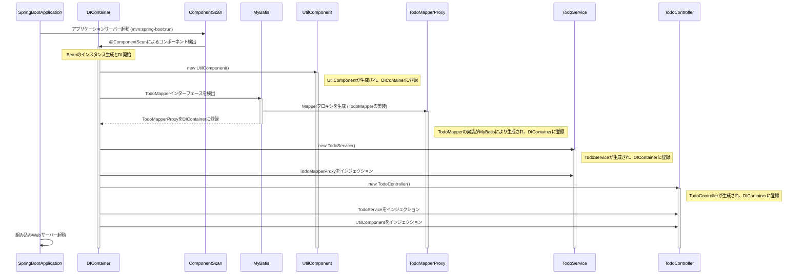

```mermaid
sequenceDiagram
    participant SpringBootApplication
    participant DIContainer
    participant ComponentScan
    participant MyBatis
    participant UtilComponent
    participant TodoMapperProxy
    participant TodoService
    participant TodoController

    SpringBootApplication->>ComponentScan: アプリケーションサーバー起動 (mvn:spring-boot:run)
    ComponentScan->>DIContainer: @ComponentScanによるコンポーネント検出

    activate DIContainer
    Note over DIContainer: Beanのインスタンス生成とDI開始

    DIContainer->>UtilComponent: new UtilComponent()
    activate UtilComponent
    Note right of UtilComponent: UtilComponentが生成され、DIContainerに登録

    DIContainer->>MyBatis: TodoMapperインターフェースを検出
    activate MyBatis
    MyBatis->>TodoMapperProxy: Mapperプロキシを生成 (TodoMapperの実装)
    activate TodoMapperProxy
    MyBatis-->>DIContainer: TodoMapperProxyをDIContainerに登録
    deactivate MyBatis
    Note right of TodoMapperProxy: TodoMapperの実装がMyBatisにより生成され、DIContainerに登録

    DIContainer->>TodoService: new TodoService()
    activate TodoService
    Note right of TodoService: TodoServiceが生成され、DIContainerに登録
    DIContainer->>TodoService: TodoMapperProxyをインジェクション

    DIContainer->>TodoController: new TodoController()
    activate TodoController
    Note right of TodoController: TodoControllerが生成され、DIContainerに登録
    DIContainer->>TodoController: TodoServiceをインジェクション
    DIContainer->>TodoController: UtilComponentをインジェクション


    SpringBootApplication->>SpringBootApplication: 組み込みWebサーバー起動
    deactivate DIContainer
    deactivate UtilComponent
    deactivate TodoMapperProxy
    deactivate TodoService
    deactivate TodoController

```
