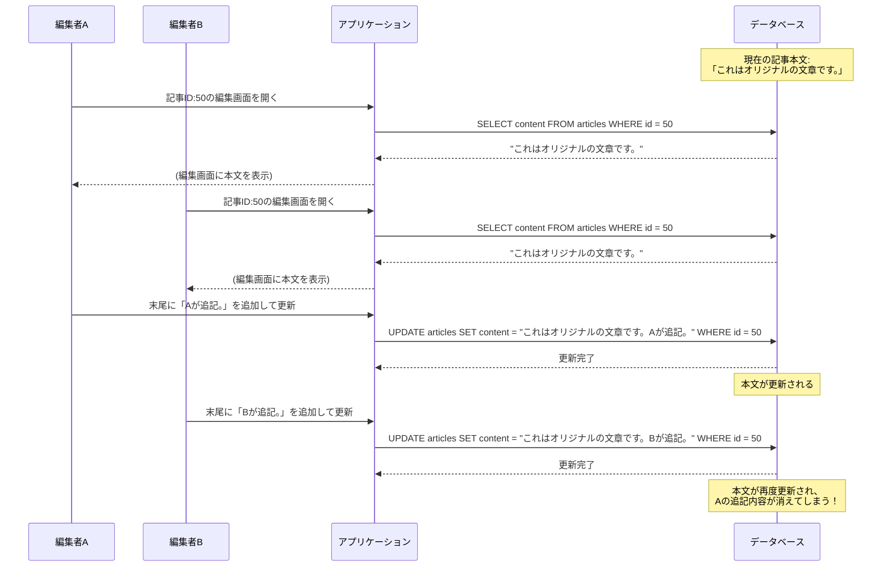

## Webアプリケーションにおける排他制御

### 1. なぜ排他制御が必要なのか？

現代のWebアプリケーションでは、複数のユーザーが同時に同じデータにアクセスし、更新するのが当たり前です。もし、このような同時更新に対して何の対策もしていない場合、「**更新消失**」という深刻な問題が発生する可能性があります。

#### 更新消失（Lost Update）とは？

あるユーザーが行った更新処理が、別のユーザーの更新処理によって意図せず上書きされ、消えてしまう現象です。

**シナリオ：** 複数の編集者が、同時に同じ記事を編集するCMS（コンテンツ管理システム）を考えます。

**【図解：記事編集における更新消失の発生例】**
記事ID: 50 の本文が **「これはオリジナルの文章です。」** という状態から始まります。



**結果：**
この場合、編集者Bは**自分が読み込んだ古いデータ（Aが更新する前のデータ）**を基準に編集を行ってしまいました。その結果、Bが保存したタイミングで、先行していた編集者Aの作業内容が完全に上書きされて消えてしまいます。これが**更新消失（Lost Update）**です。

**なぜこの問題が起きるのか？**

1.  **読み込みと書き込みの分離**: ユーザーが編集画面を開いてから（Read）、保存ボタンを押すまで（Write）に時間的なギャップがあります。
2.  **アプリケーション側の処理**: 文章の編集という処理は、データベース側では行えず、アプリケーション（ブラウザ）側で行われます。
3.  **ロックの不在**: データをただ読み込むだけ（`SELECT`）では、通常データベースはロックをかけません。そのため、誰かが編集中であっても、他の人が同じデータを読み込めてしまいます。

このようなシナリオにおいてこそ、後から更新しようとしたBさんに「ごめん！先にAさんが更新しちゃったから、最新の内容をもう一度読み込んでやり直して！」と伝える仕組み、すなわち**楽観ロック**が極めて有効になるのです。

このようなデータの不整合を防ぎ、データの整合性を保つために**排他制御**は不可欠です。

---

### 2. 排他制御の2つのアプローチ

排他制御には、大きく分けて「悲観ロック」と「楽観ロック」という2つの考え方があります。

| | 悲観ロック (Pessimistic Locking) | 楽観ロック (Optimistic Locking) |
| :--- | :--- | :--- |
| **考え方** | 「どうせ競合は起きるだろう」と悲観的に考え、**データを読み込む時点でロック**して他からの更新をブロックする。 | 「競合はめったに起きないだろう」と楽観的に考え、ロックはしない。**更新する時**に、誰かが更新していないかを確認する。 |
| **処理の流れ** | 1. `SELECT ... FOR UPDATE` で行をロック<br>2. アプリケーションで処理<br>3. `UPDATE` を実行<br>4. トランザクションをコミットしてロック解放 | 1. `version` 列と一緒にデータを読み込む<br>2. アプリケーションで処理<br>3. `UPDATE ... WHERE version = (読み込んだ時の値)` を実行<br>4. 更新件数が0なら競合と判断し、エラーにする |
| **メリット** | ・データの整合性を確実に保証できる<br>・競合発生時も処理を待てば良い | ・ロック待ちが発生せず、システムの応答性が高い（高スループット）<br>・実装が比較的シンプル |
| **デメリット** | ・ロック待ちで性能が低下しやすい<br>・ロックの範囲や時間を誤るとシステム全体に影響が出る<br>・デッドロックの可能性がある | ・競合が頻発するとエラーが多発し、ユーザーに再操作を強いることになる<br>・リトライ処理の実装が必要になる場合がある |
| **向いている場面** | ・**競合発生が頻繁**に予測される処理<br>・**お金が絡む**など、絶対に不整合が許されない処理<br>（例：銀行の振込、座席予約） | ・**競合発生が稀**な処理<br>・**読み込みから更新までに時間がかかる**処理<br>（例：Webの編集画面） |

---

### 3. Spring Boot + MyBatisによる実装例

ここでは、`products`テーブルに商品情報（価格など）を更新するWeb APIを例に、具体的な実装方法を解説します。

#### 3.1. 準備：テーブル定義 (PostgreSQL)

楽観ロックで利用する`version`カラムを追加しておきます。このカラムは更新のたびに1ずつ増加させます。

```sql
CREATE TABLE products (
    id BIGINT PRIMARY KEY,
    name VARCHAR(255) NOT NULL,
    price INT NOT NULL,
    stock INT NOT NULL,
    -- 楽観ロック用のバージョンカラム
    version INT NOT NULL DEFAULT 1
);
```

---

#### 3.2. 楽観ロックの実装

**シナリオ：商品の価格情報を更新する**
ユーザーが編集画面で価格を変更して「更新」ボタンを押す処理を想定します。

**1. Mapper (XML)**

更新時に`version`を条件に加え、同時にインクリメントします。

`ProductMapper.xml`
```xml
<mapper namespace="com.example.mapper.ProductMapper">
    <select id="findById" resultType="com.example.entity.Product">
        SELECT id, name, price, stock, version FROM products WHERE id = #{id}
    </select>

    <update id="update">
        UPDATE products
        SET
            name = #{name},
            price = #{price},
            stock = #{stock},
            version = version + 1 -- バージョンをインクリメント
        WHERE
            id = #{id}
            AND version = #{version} -- 取得時のバージョンと一致するかチェック
    </update>
</mapper>
```

**2. Serviceクラス**

`update`メソッドの戻り値（更新件数）をチェックし、0件だった場合は競合が発生したとみなし、カスタム例外をスローします。

`OptimisticLockingException.java` (カスタム例外)
```java
public class OptimisticLockingException extends RuntimeException {
    public OptimisticLockingException(String message) {
        super(message);
    }
}
```

`ProductService.java`
```java
@Service
@RequiredArgsConstructor
public class ProductService {

    private final ProductMapper productMapper;

    @Transactional
    public void updateProduct(Product product) {
        // 更新処理を実行
        int updatedCount = productMapper.update(product);

        // 更新件数が0件の場合、他の誰かが先に更新したと判断
        if (updatedCount == 0) {
            throw new OptimisticLockingException(
                "データが他で更新されたため、更新できませんでした。再度お試しください。"
            );
        }
    }
}
```


---

#### 3.3. 悲観ロックの実装

**シナリオ：絶対に二重発行してはいけないクーポンを発行する**
競合が許されない処理を想定します。

**1. Mapper (XML)**

`SELECT`文の末尾に `FOR UPDATE` を追記します。これにより、トランザクションが終了するまで対象の行がロックされます。

`CouponMapper.xml`
```xml
<mapper namespace="com.example.mapper.CouponMapper">
    <select id="findByIdForUpdate" resultType="com.example.entity.Coupon">
        SELECT id, code, is_issued, version FROM coupons
        WHERE id = #{id}
        FOR UPDATE -- 行をロックする
    </select>

    <update id="update">
        UPDATE coupons SET is_issued = #{isIssued}, ... WHERE id = #{id}
    </update>
</mapper>
```

**2. Serviceクラス**

`@Transactional`アノテーションを付けたメソッド内で、ロック取得から更新までの一連の処理を完結させます。**トランザクションの範囲がロックの有効範囲になる**ため、`@Transactional`は必須です。

`CouponService.java`
```java
@Service
@RequiredArgsConstructor
public class CouponService {

    private final CouponMapper couponMapper;

    @Transactional // トランザクション管理が必須
    public void issueCoupon(Long couponId) {
        // 1. まずSELECT ... FOR UPDATEでデータをロック
        Coupon coupon = couponMapper.findByIdForUpdate(couponId);

        // 2. 発行済みかどうかのチェック
        if (coupon.isIssued()) {
            throw new IllegalStateException("このクーポンは既に発行済みです。");
        }

        // 3. 発行処理（ステータス更新など）
        coupon.setIssued(true);
        couponMapper.update(coupon);

        // 4. メソッドが終了（コミット）するとロックが解放される
    }
}
```
この実装により、もし2つのリクエストが同時に `issueCoupon` メソッドを実行しても、先に `findByIdForUpdate` を実行した方が行ロックを取得します。もう一方は、ロックが解放されるまで待たされ、ロック解放後にはクーポンが発行済みになっているため、エラーとなり二重発行を防ぐことができます。

---

### 4.【発展】ECサイトの在庫更新 - より実践的なアプローチ

ECサイトの在庫更新のように、「現在の値から数値を引く」だけのシンプルな処理の場合、楽観ロックや悲観ロックよりも効率的な方法があります。それは**UPDATE文のWHERE句で在庫チェックまで完結させる**方法です。

```sql
UPDATE products
SET stock = stock - #{quantity} -- 購入数
WHERE
    id = #{productId}
    AND stock >= #{quantity}; -- 在庫が購入数以上あること
```
このSQLは、以下の利点があります。
*   **アトミック性**: 在庫チェックと更新が1つのSQLで完結するため、DBが行ロックを自動的にかけてくれ、安全性が保証されます。
*   **シンプルさ**: アプリケーション側で`SELECT`して在庫をチェックする必要がなく、コードがシンプルになります。
*   **高性能**: DB内で処理が完結するため、アプリケーションとDB間の通信オーバーヘッドが少なく、非常に高速です。

Serviceクラスでは、この`UPDATE`文の**更新件数**をチェックし、0件であれば「在庫不足」と判断するだけで済みます。

---

### まとめ

排他制御は、堅牢なWebアプリケーションを構築するために不可欠な技術です。

*   **基本方針**: まずは**楽観ロック**や**条件付きUPDATE**で対応できないか検討する。
*   **使い分け**:
    *   Webの編集画面など、ユーザーの操作が介在する場合は**楽観ロック**が最適。
    *   在庫更新のようにシンプルな減算処理は**条件付きUPDATE**が最も効率的。
    *   お金や座席予約など、競合が多く絶対に失敗が許されない場合に限り、性能影響を理解した上で**悲観ロック**の利用を検討する。

システムの特性に合わせて適切な排他制御を選択することが、性能とデータ整合性を両立させる鍵となります。