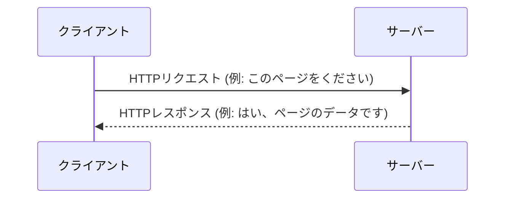

# HTTPプロトコルとパス

## **1\. HTTPプロトコルとは**

**HTTP (Hypertext Transfer Protocol)** は、**クライアント**（Webブラウザやアプリなど）と**サーバー**の間で情報をやり取りするための**通信規約**（ルール）です。

この通信は、クライアントがサーバーに「これをください」という**リクエスト**（要求）を送り、サーバーが「はい、どうぞ」と**レスポンス**（応答）を返すという、非常にシンプルなやり取りで成り立っています。

#### **【図解】クライアントとサーバーの基本的なやり取り**



## **2\. HTTPリクエストの構成要素**

HTTPリクエストは、主に以下の3つの部分から構成されます。この構造は、手紙に例えると「宛先や要件」「差出人の情報」「本文」のような関係になります。

#### **【図解】HTTPリクエストの構造**

```
+------------------------------------------------+
| リクエスト行 (Request Line)                     |  ← どんな方法で(GET)、何を(/users/123)、どのバージョンで(HTTP/1.1)
+------------------------------------------------+
| ヘッダー (Headers)                              |  ← どのサーバー宛か(Host)、どんなソフトを使っているか(User-Agent)など
+------------------------------------------------+
| (空行)                                         |  ← ヘッダーとボディの区切り
+------------------------------------------------+
| ボディ (Body) ※メソッドによってはない場合もある |  ← 送信したいデータ本体 (例: JSON形式のデータ)
+------------------------------------------------+
```

##### cmdでhttpリクエストを送ってみる

2か月目に作るAPI
```shell
curl -v http://localhost:8080/tags
```
google
```shell
curl -v http://www.google.com
```
### **2-1. リクエスト行**

リクエスト行は、サーバーに対する「要求」そのものを表し、**メソッド**、**URI**、**HTTPバージョン**の3つの要素で構成されます。

-   **メソッド (Method)**: サーバーに「何をしてほしいか」を伝える動詞です。
    -   `GET`: データの**取得**
    -   `POST`: 新しいデータの**作成**
    -   `PUT`: 既存データの**更新**
    -   `DELETE`: データの**削除**

-   **URI (Uniform Resource Identifier)**: URL は URI の一種です。URI がリソースを識別するための「識別子」の総称であるのに対し、URL はその中でもリソースの「場所（住所）」を指し示すものです。普段私たちがブラウザで使うものはほとんど URL であり、URI と呼ばれることも多いです。

#### **【図解】URL (URI) の構造**

URLは以下の要素で構成されており、それぞれが特定の意味を持っています。

```
 https  ://  example.com  :443  /users/123  ?limit=10&page=2  #profile
 ~~~~~~    ~~~~~~~~~~~~~  ~~~~  ~~~~~~~~~~  ~~~~~~~~~~~~~~~~  ~~~~~~~~
   |             |         |        |              |             |
1.スキーム   2.ホスト名   3.ポート  4.パス        5.クエリ     6.フラグメント
```

1.  **スキーム (Scheme)**: `https` や `http` など、通信のプロトコル（ルール）を示します。今回はhttpを使います。
2.  **ホスト名 (Host)**: サーバーの場所を示すドメイン名やIPアドレスです。
    -   **DNSの仕組み**: 人間が覚えやすい `example.com` (ドメイン名) を、コンピュータが通信に使う `192.0.2.1` (IPアドレス) に変換する仕組みが **DNS (Domain Name System)** です。
        ```mermaid
        graph TD
            A[あなた] -- "example.comにアクセス" --> B{ブラウザ};
            B -- "example.comのIPアドレスは？" --> C[DNSサーバー];
            C -- "192.0.2.1だよ" --> B;
            B -- "192.0.2.1のサーバーにアクセス" --> D[Webサーバー];
        ```
3.  **ポート番号 (Port)**: サーバーのどの「窓口」に接続するかを指定します。通常は省略されます（`http`は80番、`https`は443番がデフォルト）。
4.  **パス (Path)**: ホスト名以下の `/` から始まる部分で、サーバー上のリソースの具体的な場所を示します。
    -   <span style="color: red; ">パスパラメータ</span>: パスの一部を可変にすることで、特定のリソースを指定します。
        -   **例**: `/users/123` の `123` の部分。「IDが123のユーザー」という特定のリソースを指します。
5.  <span style="color: red; ">クエリパラメータ</span>: `?` 以降の `key=value` の形式で、並び替えや絞り込みなど、リソースに対する追加の条件を指定します。
6.  **（フラグメント (Fragment)）**: `#` 以降の部分で、ページ内の特定の位置を示します。この情報はサーバーには送信されません。

### **2-2. ヘッダー (Headers)**

リクエストに関する付加情報を `キー: 値` の形式で格納します。

#### **【具体例】リクエストヘッダー**

```
Host: example.com
User-Agent: Mozilla/5.0 (Windows NT 10.0; Win64; x64) AppleWebKit/537.36 (KHTML, like Gecko) Chrome/91.0.4472.124 Safari/537.36
Accept: application/json
Authorization: Bearer <token>
```

-   `Host`: リクエスト先のホスト名
-   `User-Agent`: リクエストを行っているクライアント（ブラウザなど）の情報
-   `Accept`: クライアントが受け取りたいデータの形式
-   `Authorization`: 認証情報

### **2-3. ボディ (Body)**

`POST` や `PUT` など、サーバーにデータを送信する際に使われる部分です。

-   <span style="color: red; ">ボディパラメータ</span>: リクエストボディに含まれるデータそのものです。JSON形式が最も一般的です。

### **【具体例】`POST /users` のリクエスト全体**

新しいユーザーを作成する際の、リクエストの完全な例です。

```http
POST /users HTTP/1.1
Host: api.example.com
Content-Type: application/json

{
  "name": "山田 太郎",
  "email": "yamada.taro@example.com",
  "password": "password123"
}
```

>[!IMPORTANT]
>パスパラメータ、クエリパラメータ、ボディパラメタータが何かは説明できるように
## **3\. HTTPレスポンスの構成要素**

サーバーはリクエストに対して必ずレスポンスを返します。レスポンスもリクエストと似た構造を持っています。

#### **【図解】HTTPレスポンスの構造**

```
+------------------------------------------------+
| ステータス行 (Status Line)                      |  ← 処理結果がどうだったか (HTTP/1.1 200 OK)
+------------------------------------------------+
| ヘッダー (Headers)                              |  ← データの種類(Content-Type)、サイズ(Content-Length)など
+------------------------------------------------+
| (空行)                                         |  ← ヘッダーとボディの区切り
+------------------------------------------------+
| ボディ (Body)                                  |  ← 要求されたデータ本体 (例: HTMLやJSON)
+------------------------------------------------+
```

-   **ステータスコード (Status Code)**: 3桁の数字で、リクエストの処理結果を示します。
    -   **2xx (成功) 😊**: `200 OK` (成功), `201 Created` (作成成功)
    -   **3xx (リダイレクト) ➡️**: `301 Moved Permanently` (恒久的な移動)
    -   **4xx (クライアントエラー) 🤔**: `400 Bad Request` (リクエスト不正), `404 Not Found` (リソースが見つからない)
    -   **5xx (サーバーエラー) 😨**: `500 Internal Server Error` (サーバー内部エラー)

>[!TIPS]
> 参考：IANA（RFC）
> https://www.iana.org/assignments/http-status-codes/http-status-codes.xhtml

-   **ヘッダー (Headers)**: レスポンスに関する付加情報です。リクエストで解説済みなので詳細は割愛。
-   **ボディ (Body)**: クライアントが要求したデータ本体です。WebサイトならHTML、APIならJSONなどが返されます。リクエストで解説済みなので詳細は割愛。

#### **【具体例】`GET /users/123` への成功レスポンス**

IDが123のユーザー情報を取得するリクエストに対する、サーバーからの応答例です。

```http
HTTP/1.1 200 OK
Content-Type: application/json
Content-Length: 54

{
 "id": 123,
 "name": "山田 太郎",
 "email": "yamada.taro@example.com"
}
```

## **補足：データ形式**

### csv 形式
```
ID, Name, Country
111, Mike, USA
222, Nancy, Canada
```

- Comma-Separated Values の略
- excel とかで開けるやつ
### json 形式

```
[
  {
    "ID": "111",
    "Name": "Mike",
    "Country": "USA"
  },
  {
    "ID": "222",
    "Name": "Nancy",
    "Country": "Canada"
  }
]
```

- JavaScript Object Notation の略
- javascript のオブジェクトの書き方

### xml 形式

```xml
<?xml version='1.0' encoding='utf-8'>
<root>
    <employee>
        <employ>
            <ID>111</ID>
            <Name>Mike</Name>
            <Country>USA</Country>
        </employ>
        <employ>
            <ID>222</ID>
            <Name>Nancy</Name>
            <Country>Canada</Country>
        </employ>
    </employee>
</root>
```

- Extensible Markup Language の略
- html に似ていて，タグでデータを囲み，入れ子構造にすることが可能


---

# REST API エンドポイント設計

## 1. 基本原則
REST APIの設計において最も重要なのは、**「エンドポイント（URI）は『リソース（モノ）』を表し、操作は『HTTPメソッド（動詞）』で表す」**という考え方です。

### HTTPメソッドの使い分け
| メソッド | 役割 | 冪等性(※1) | 安全性(※2) |
| :--- | :--- | :--- | :--- |
| **GET** | リソースの取得 | あり | あり |
| **POST** | 新しいリソースの作成 | なし | なし |
| **PUT** | 既存リソースの置換（全更新） | あり | なし |
| **PATCH** | 既存リソースの一部更新 | なし | なし |
| **DELETE** | リソースの削除 | あり | なし |

*(※1) 冪等性（べきとうせい）：何度実行しても結果が同じであること*  
*(※2) 安全性：実行してもリソースの状態が変化しないこと*

## 2. リソース命名規則（具体的ルール）

### ① 名詞の複数形を使用する
直感的で理解しやすいため、リソース名は常に複数形を使用するのが一般的です。
*   ⭕️ `GET /users`
*   ❌ `GET /user`
*   ❌ `GET /getUsers` (動詞を含めない)

### ② ケバブケース（kebab-case）を採用する
URIに単語を繋げる場合は、ハイフンで繋ぎます。
*   ⭕️ `GET /user-profiles`
*   ❌ `GET /user_profiles` (スネークケース)
*   ❌ `GET /userProfiles` (キャメルケース)

### ③ 階層構造で関係性を表す
リソースが別のリソースに属している場合、パスを繋げます。
*   ⭕️ `GET /users/{userId}/posts` (特定のユーザーの投稿一覧)
*   ⭕️ `GET /users/{userId}/posts/{postId}` (特定のユーザーの特定の投稿)

## 3. 具体的なエンドポイント設計例（ECサイトを想定）

| リソース     | メソッド   | エンドポイント                  | 説明                |
| :------- | :----- | :----------------------- | :---------------- |
| **商品**   | GET    | `/products`              | 商品一覧を取得（フィルタ・検索可） |
|          | POST   | `/products`              | 新しい商品を追加          |
|          | GET    | `/products/{id}`         | 特定の商品の詳細を取得       |
|          | PUT    | `/products/{id}`         | 商品情報を全て差し替える      |
|          | DELETE | `/products/{id}`         | 商品を削除する           |
| **注文**   | GET    | `/orders`                | 自分の注文履歴を取得        |
|          | POST   | `/orders`                | 注文を確定する           |
| **レビュー** | GET    | `/products/{id}/reviews` | 特定の商品のレビュー一覧を取得   |


>[!TIPS]
>参考：有名なサービスのエンドポイント
>https://zenn.dev/yu1ro/articles/4c73274383b676#twitter
## 4. 検索・フィルタリング・ページネーション
リソースの絞り込みや並び替えには **クエリパラメータ** を使用します。

### 例：商品検索
*   **フィルタリング**: `GET /products?category=electronics&status=available`
*   **ソート（並び替え）**: `GET /products?sort=price_desc`
*   **ページネーション**: `GET /products?page=2&limit=50`
*   **全文検索**: `GET /products?q=iphone`

## 5. 動詞を使わざるを得ない場合（アクション）
計算、変換、送信など「リソース」として表現しにくい操作は、例外的にパスの末尾に動詞を置くことが許容されます。

*   `POST /users/{id}/activate` (ユーザーの有効化)
*   `POST /convert?from=usd&to=jpy` (通貨換算)
*   `POST /search` (複雑な条件での検索。GETのURI長制限を避ける場合)

## 6. ステータスコードの適切な返却
レスポンスの成否はHTTPステータスコードで示します。

| コード | 分類 | 意味 | 使い所 |
| :--- | :--- | :--- | :--- |
| **200** | OK | 成功 | GET, PUT, PATCH の成功時 |
| **201** | Created | 作成完了 | POST でリソース作成成功時 |
| **204** | No Content | 内容なし | DELETE 成功時（返すデータがない場合） |
| **400** | Bad Request | リクエスト不正 | バリデーションエラーなど |
| **401** | Unauthorized | 認証エラー | ログインが必要な場合 |
| **403** | Forbidden | 認可エラー | 権限がないリソースへのアクセス |
| **404** | Not Found | 未検出 | 存在しないIDを指定した場合 |
| **500** | Internal Error | サーバーエラー | プログラムのバグ、DBダウン |
