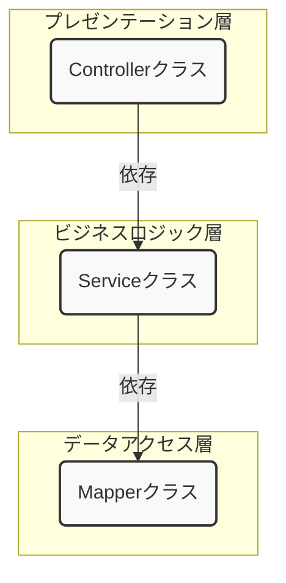

# Web API 設計思想入門：なぜクラスを分けるのか

Spring Boot + MyBatis で Web API を開発する前に、「なぜそのような作り方をするのか」という設計思想を学びます。  
この考え方を理解することが、単に「動くプログラム」から「保守しやすく、変更に強いプログラム」を作る第一歩です。
そこでまず、アーキテクチャという言葉を導入します。

> [!CAUTION] 注意
> **このセクションの内容は実装方法の話以外、現段階で覚える必要はありません。**
> **あくまで考え方の一つとして聞き流してください。**


---

## 1. アーキテクチャとは何か

### アーキテクチャ ＝ 「ひな形」

アーキテクチャとは、**システムをどのように構成するかの「ひな形（設計の骨格）」** です。  

毎回ゼロから「どう設計するか」を考えるのは大変ですし、人によってバラバラな構造になりがちです。  
アーキテクチャはそうした問題を解決するための「ひな形」です。

> [!hint]- 例え話：建築の間取り図  
> 「リビングはここ、寝室はここ、水回りはまとめてここ」という間取りのひな形があるように、  
> ソフトウェアにも「この機能はこの層に置く」という決まりごとを作っておきます。

今回使うのは **レイヤードアーキテクチャ（Layered Architecture）** です。

---

## 2. レイヤードアーキテクチャとは

システムを **役割ごとの「層（Layer）」** に分割し、それぞれの層の責任を明確にする考え方です。

今回は以下の3層構成を使います。





各層の役割はシンプルです。

| 層          | クラス        | 担当すること                |
| ---------- | ---------- | --------------------- |
| プレゼンテーション層 | Controller | HTTPリクエストの受付・レスポンスの返却 |
| ビジネスロジック層  | Service    | 業務処理・判断ロジック           |
| データアクセス層   | Mapper     | SQLの発行・DBとのやり取り       |

また、各層は **一方向の依存関係** を持ちます。

```
Controller → Service → Mapper
```

> [!TIPS]
> 依存関係とは「あるクラスが別のクラスを参照している状態」のことです。  
> 今回の文脈では、主に「メソッドを呼び出す」という形です。
> Controller は Service のメソッドを呼び出しますが、その逆はありません。

### データの流れ

リクエストからレスポンスまで、データは以下のように流れます。

```
クライアント
    │  (JSONリクエスト)
    ▼
 Controller   ← Form でリクエストの値を受け取り、Entityに詰め替える。
    │
    ▼
  Service     ← Entity を受け取り、業務ロジックを処理する
    │
    ▼
  Mapper      ← Entity でSQLを発行し、DBとやり取りする
    │
    ▼
   DB
```


![[プロジェクト構成の概略図（自分で作る分）.png | 300]]

ここで登場する **Form** と **Entity** は、データを運ぶための専用クラス（＝**データクラス**）です。

| クラス | 役割 |
|---|---|
| **Form** | クライアントから送られてくるリクエストの値を受け取る入れ物 |
| **Entity** | DBのテーブル構造と1対1に対応する入れ物 |

なぜ1つのクラスで済ませず分けるのかは、セクション6で詳しく説明します。  
まずは「層ごとに扱うデータクラスが切り替わる」という全体像を頭に入れておいてください。

---

## 3. クラスを分ける動機：分けない場合に何が起きるか

「分けなくても動くのでは？」と思うかもしれません。確かに動きます。  
しかし、**後から変更が必要になったとき**に深刻な問題が起きます。

### 3-1. 「全部入り」コードの例
下記、新規会員登録の処理とします。
```java
@RestController
public class UserController {

    @Autowired
    private SqlSession sqlSession;

    @PostMapping("/api/v1/users")
    public ResponseEntity<String> register(@RequestBody Map<String, Object> request) {

        // ① リクエストから値を取り出す（Web の都合）
        String userName = (String) request.get("user_name");
        String email    = (String) request.get("email_address");

        // ② 入力チェック（業務ロジック）
        if (userName == null || userName.isEmpty()) {
            return ResponseEntity.badRequest().body("ユーザー名は必須です");
        }
        if (!email.contains("@")) {
            return ResponseEntity.badRequest().body("メールアドレスの形式が不正です");
        }

        // ③ 重複チェック（業務ロジック × DB）
        Integer count = sqlSession.selectOne(
            "SELECT COUNT(*) FROM users WHERE email = #{email}", email
        );
        if (count > 0) {
            return ResponseEntity.badRequest().body("このメールアドレスはすでに登録されています");
        }

        // ④ DBへ保存（DB の都合）
        sqlSession.insert(
            "INSERT INTO users (user_name, email) VALUES (#{userName}, #{email})",
            Map.of("userName", userName, "email", email)
        );

        return ResponseEntity.ok("登録完了");
    }
}
```

動きます。でも、ここに潜む問題を見ていきましょう。

### 3-2. 問題① 変更のたびにテスト範囲が広がる
少し変更したいだけでも、他のコードに影響が出てないかテストしないといけません。

> [!info]- 具体例
> 上のコードに、ある日こんな変更依頼が来たとします。
> 
> > **変更依頼：フロントエンドの都合で、JSONのキー名を `user_name` → `username` に変えてほしい**
> 
> 変更自体は1行です。
> 
> ```java
> // 変更前
> String userName = (String) request.get("user_name");
> 
> // 変更後
> String userName = (String) request.get("username");  // ← ここだけ変えたい
> ```
> 
> しかし、**①〜④はすべて1つのメソッドの中に混在しています。**  
> 変数 `userName` は①で取り出された後、②③④でも参照されています。  
> 「①の取り出し方を変えた」という変更が、同じ変数を使っている②③④の動作に意図せず影響を与える可能性があります。
> 
> ```
> 変更した場所：① リクエストのキー名
> 影響を受けうる場所：② ③ ④（同じ変数・同じメソッドを共有しているため）
> 確認が必要な場所：① ② ③ ④ すべて ← テスト範囲が広い！
> ```
> 
> 「小さな変更のつもりが、気づかず他の部分を壊してしまった」状態を  
> **デグレ（デグレード＝品質の劣化）** と言います。  
> デグレを防ぐためのテスト（**リグレッションテスト / 回帰テスト**）も、影響範囲が広い分だけ工数がかかります。
> 
> **クラスを層に分けた場合との比較：**
> 
> ```
> 変更依頼：JSONのキー名を変えたい（Web の都合）
>   → 変更するのは Controller だけ
>   → Service / Mapper には触らない → テスト範囲が狭い
> 
> 変更依頼：テーブルのカラム名を変えたい（DB の都合）
>   → 変更するのは Mapper だけ
>   → Controller / Service には触らない → テスト範囲が狭い
> 
> 変更依頼：重複チェックのルールを変えたい（業務の都合）
>   → 変更するのは Service だけ
>   → Controller / Mapper には触らない → テスト範囲が狭い
> ```
> 
> **「変更の理由ごとに、修正場所が1つに決まる」** ——これが層を分ける最大の利点です。

### 3-3. 問題② 部品の再利用ができない
同じロジックを使いまわしたいときに、入力の方法や利用するDBに密結合していると、使いまわすことができません。

> [!info]- 具体例
> 後日、バッチ処理（定期実行の自動処理）からも「同じユーザー登録ロジック」を使いたくなったとします。
> 
> ```
> バッチ処理から使いたい
>   ↓
> UserController を見る
>   ↓
> HTTPリクエストや @RestController と密結合していて切り出せない
>   ↓
> 仕方なく同じロジックをコピペして書く → 同じロジックが2箇所に！
> ```
> 
> ロジックが2箇所に存在すると、片方を修正したときにもう片方を直し忘れるという問題が起きます。  
> 層を分けて Service にロジックを集めておけば、バッチ処理からも同じ Service を呼ぶだけで済みます。

>[!TIPS] 電卓プログラムで考えてみる
>電卓課題を思い出してみましょう。
>例えば、計算式の入力がコンソールのほかに、ファイル読み込みに対応することになったらどうでしょうか？
>**入力を受け付けるクラス**と**計算処理をするクラス**を分けてない状態だと、計算処理をするクラスを使いまわすことができません。
>結局、計算処理を、ファイル入力を受け付けるプログラムにコピペすることになります。
>今度、共通の計算処理がまとまってないと、例えば計算処理でバグが見つかったとして、ファイル入力を受け付けるクラス側にはその修正を反映し忘れるかもしれません。。。
>
>一方で、**入力を受け付けるクラス**と**計算処理をするクラス**を分けていれば、それをファイル入力を受け付けるクラスから計算処理をするクラスを呼び出すだけです。

![[Pasted image 20260508115311.png|700]]

<span style="background:#fdbfff">上記のような理由から、今回はレイヤードアーキテクチャに沿ってクラスを分け、作ってみましょう。</span>

---

## 4. クラスを分けただけでは不十分：凝集度を高める

クラスを分けても、関連するロジックがあちこちに散らばっていては**役割を決めて分けた意味がありません。**  
重要なのは **凝集度** を高めることです。

> [!important]
> **凝集度とは：** クラス内の要素（フィールドやメソッド）がどれだけ密接に関連し合っているかを表す指標です。  
> 関連するロジックが1箇所に集まっている状態を「凝集度が高い」と言います。

> [!note]- 悪い例
> ### 4-1. 凝集度が低い状態（悪い例）
> 
> Controller と Service をファイルとして分けたものの、業務的な判定ロジックをControllerで書いてしまってる例です。
> 
> ユーザー登録（API入力）
> ```java
> @RestController
> public class UserApiController {
>     @PostMapping("/api/users")
>     public void register(@RequestBody UserForm form) {
>         // ⚠️ 年齢制限のロジックがここに書かれている
>         if (form.getAge() < 18) {
>             throw new IllegalArgumentException("18歳未満は登録できません");
>         }
>         
> 	    // 業務ロジック呼び出し
> 	    service.doSomething();
>     }
> }
> ```
> ユーザー登録（ファイル入力）
> ```java
> public class UserFileImporter {
>     public void importFromCsv(File file) {
>     
>         // CSVを読み込む処理（省略）
>         
>         // ⚠️ 全く同じ年齢制限のロジックがここにも書かれている
>         if (ageFromCsv < 18) {
>             System.out.println("エラー：18歳未満の行はスキップします");
>             return;
>         }
>         
> 	    // 業務ロジック呼び出し
> 	    service.doSomething();
>     }
> }
> ```
> 
> #### ここに変更依頼が来たら？
> 
> > **変更依頼：登録可能年齢を「18歳以上」から「20歳以上」に変更してほしい**
> 
> ```java
> // 2箇所すべてを変更しなければならない
> if (form.getAge() < 18) { ... }  // register メソッド
> if (ageFromCsv < 18) { ... }  // importFromCsv メソッド
> ```
> 
> 今回は2箇所ですが、エンドポイントが増えるにつれてさらに散らばります。  
> 1箇所修正し忘れると、バグになります。  
> このような状態を **「ロジックが散在している」（低凝集）** と言います。

> [!note]- 良い例
> ### 4-2. 凝集度が高い状態（良い例）
> 
> 年齢チェックのロジックを **Service の1メソッドにだけ** 書きます。
> 
> ```java
> @Service
> public class UserService {
> 
>     // 年齢チェックのロジックはここだけに存在する（高凝集）
>     private void validateAge(Integer age) {
>         if (age < 18) {
>             throw new IllegalArgumentException("18歳未満は登録できません");
>         }
>     }
> 
>     public void register(UserForm form) {
>         validateAge(form.getAge());  // ← 呼び出すだけ
>         // ...
>     }
> 
>     public void update(Integer id, UserForm form) {
>         validateAge(form.getAge());  // ← 呼び出すだけ（ロジックはコピーしない）
>         // ...
>     }
> }
> ```
> 
> #### 変更依頼が来たら？
> 
> ```java
> // 変更するのは validateAge メソッドの1箇所だけ！
> private void validateAge(Integer age) {
>     if (age < 20) {  // ← ここだけ直す
>         throw new IllegalArgumentException("20歳未満は登録できません");
>     }
> }
> ```
> 
> **「修正はここだけ」という状態を作ることが、高凝集の目標です。**


<span style="background:#fdbfff">処理を書く際は、どのクラスに書けばいいだろうを考えるようにしましょう。</span>

---

## 5. クラスを分けただけでは不十分：結合度を下げる

凝集度と並んで重要なのが **結合度** を下げることです。

> [!important]
> **結合度とは：** クラス同士のつながりの強さを表す指標です。  
> あるクラスが別の具体的な実装クラスを直接知っている状態を「結合度が高い（密結合）」と言います。


結合度が高いと、部品の差し替えやテストが困難になります。

> [!note]- 悪い例
> ### 5-1. 結合度が高い状態（悪い例）
> ```java
> // 悪い例：Serviceクラス内で直接Mapperをnewしている
> public class UserService {
>     private final UserMapperImpl userMapper;
> 	
>     public UserService() {
>         this.userMapper = new UserMapperImpl(); // ← 密な結合！
>     }
> 	
>     public User findById(Integer id) {
>         return userMapper.findById(id);
>     }
> }
> ```
> 
> ```java
> // 本番用の実装：実際にDBへアクセスする
> public class UserMapperImpl {
>     public User findById(Integer id) {
>         // 実際のSQL処理
>     }
> }
> ```

> [!note]- 良い例
> ### 5-2. 結合度を下げる方法：インターフェースへの依存
> ```java
> // 良い例：DIパターンを使う
> public class UserService {
>     private final UserMapper userMapper; // インターフェース型で宣言
> 
>     // コンストラクタで外部からインスタンスを受け取る（注入してもらう）
>     public UserService(UserMapper userMapper) {
>         this.userMapper = userMapper;
>     }
> 
>     public User findById(Integer id) {
>         return userMapper.findById(id);
>     }
> }
> ```
> `UserMapper` をインターフェースとして定義し、実装の詳細を切り離します。
> 
> ```java
> // インターフェース：「何ができるか」だけを定義する
> public interface UserMapper {
>     User findById(Integer id);
> }
> ```
> 
> ```java
> // 本番用の実装：実際にDBへアクセスする
> // ※ MyBatis を使う場合、この実装クラスは MyBatis が自動で生成するため、
> //   開発者が自分で書く必要はありません（詳しくはハンズオンで扱います）
> public class UserMapperImpl implements UserMapper {
>     @Override
>     public User findById(Integer id) {
>         // 実際のSQL処理
>     }
> }
> 
> // テスト用の偽物（モック）：DBなしで動く
> public class MockUserMapper implements UserMapper {
>     @Override
>     public User findById(Integer id) {
>         // DB に接続せず、ダミーデータを返す
>         return new User(id, "テストユーザー");
>     }
> }
> ```
> 

---

### 凝集度・結合度のまとめ

|         | 望ましい状態            | ⚠️問題のある状態         |
| ------- | ----------------- | ----------------- |
| **凝集度** | 関連ロジックが1箇所に集まっている | ロジックがあちこちに散らばっている|
| **結合度** | インターフェース経由で疎につながる | 具体的な実装クラスに直接依存    |

> **目指すのは「高凝集・低結合」です。**
> クラス内の要素は密に関連し合い（高凝集）、クラス間のつながりは緩やかに（低結合）。

---
## 6. Spring Boot での実装方法：依存性注入（DI）

### 6-1. 依存性注入（DI）とは

先ほど「コンストラクタで外部から受け取る」と書きました。この考え方を **依存性注入（Dependency Injection, DI）** と言います。

> **「クラスが必要とするオブジェクトを、自分で生成するのではなく、外部から与えてもらう」**

「外部から与える」役割を担うのが、Spring Framework の **DIコンテナ（Spring コンテナ）** です。

### 6-2. Spring Boot での書き方

Spring Boot では、アノテーションを付けるだけで DIコンテナへの登録と注入が自動で行われます。

**① Bean として登録する**

Spring に管理してほしいクラスにアノテーションを付けます。このインスタンスを **Bean** と呼びます。

```java
@Service  // このクラスを Bean として登録する
public class UserService { ... }

@Mapper   // このインターフェースを Bean として登録する（実装は MyBatis が自動生成）
public interface UserMapper { ... }
```

**② コンストラクタで注入を受ける**

コンストラクタの引数に必要な型を書くだけで、Spring が自動的に対応する Bean を探して渡してくれます。  
**コンストラクタが1つだけの場合、アノテーションは不要です。** Spring Boot が自動で DI 対象とみなします。

```java
@RestController
public class UserController {

    private final UserService userService;

    // コンストラクタが1つだけなので、アノテーションなしで Spring が自動注入してくれる
    public UserController(UserService userService) {
        this.userService = userService;
    }

    @PostMapping("/api/v1/users")
    public ResponseEntity<String> register(@RequestBody UserForm form) {
        userService.register(form);
        return ResponseEntity.ok("登録完了");
    }
}
```

```java
@Service
public class UserService {

    private final UserMapper userMapper;

    public UserService(UserMapper userMapper) {
        this.userMapper = userMapper;
    }

    public void register(UserForm form) {
        User user = new User();
        user.setName(form.getUserName());
        user.setEmail(form.getEmail());
        userMapper.insert(user);
    }
}
```

```java
@Mapper
public interface UserMapper {
    void insert(User user);
}
```

> **`@Autowired` について**  
> コンストラクタに `@Autowired` アノテーションが付いている場合があります。  
> これは「このコンストラクタを DI に使う」と明示するためのものですが、  
> コンストラクタが1つだけの場合は省略できるため、現代の Spring Boot では省略するのが主流です。

### 6-3. データクラス：Form と Entity

セクション2で触れた Form と Entity について、改めて詳しく説明します。

```
クライアント → Controller → Service → Mapper → DB
                ↑Form使用    ↑Entity使用
```

| クラス | 役割 | 持つデータ |
|---|---|---|
| **Form** | クライアントからのリクエストデータを受け取る | 画面の入力項目 |
| **Entity** | DBのテーブル構造と1対1に対応する | DBのカラム |

**なぜ分けるのか？**

```java
// Form：クライアントが送ってくるデータ
public class UserForm {
    private String userName;
    private String email;
    private String password;        // ← 平文パスワード（DBには保存しない）
    private String passwordConfirm; // ← 確認用（DBには保存しない）
}

// Entity：DBのusersテーブルと対応
public class UserEntity {
    private Integer id;
    private String name;
    private String email;
    private String passwordHash;    // ← ハッシュ化済みパスワード（Formには含まれない）
    private LocalDateTime createdAt;
}
```

Form と Entity を分けることで、**API仕様の変更（画面項目の追加）がDBの構造に影響しない**、  
また **DBの構造変更（カラム追加）がAPIの仕様に影響しない** 設計になります。  
これも「変更の影響を層の中に閉じ込める」という考え方と同じです。

---

## 7. クラスを分けることのコスト

ここまで「クラスを分けることの利点」を見てきましたが、**分けることにはコストもあります。**

- ファイル数が増え、全体を把握するために追いかける場所が増える
- 小さな機能でも Controller / Service / Mapper の3ファイルが必要になる
- チームに設計の共通認識がないと、かえって混乱を招く

**「とにかく分ければ良い」わけではありません。**  
小規模なスクリプトや試作コードに無理にレイヤードアーキテクチャを当てはめると、  
コードが複雑になるだけです。

> **システムの規模・チームの人数・変更頻度に応じて、適切な粒度で設計することが重要です。**  
> 今回のハンズオンでは、実務でよく使われる3層構成を採用して「分けることの感覚」を掴むことを目的とします。

---

## 8. まとめ

```
目標：仕様変更時に、安全かつ迅速に対応できるシステム
       ↓
手段：レイヤードアーキテクチャ（3層）でクラスを分ける
       ↓
ポイント①：凝集度を高める
　　　関連するロジックは1箇所に集める
　　　→ 変更するべき場所が1箇所に決まる
       ↓
ポイント②：結合度を下げる
　　　インターフェースを通じて疎につなぐ
　　　→ 部品の差し替え・テストが容易になる
       ↓
実現手段：Spring Boot の DI（依存性注入）
　　　コンストラクタインジェクション＋アノテーション
```

| やること | なぜやるか |
|---|---|
| Controller / Service / Mapper に分ける | 変更の影響範囲を層の中に閉じ込めるため |
| ロジックをServiceに集める（高凝集） | 「修正はここだけ」という状態を作るため |
| インターフェース経由で依存（低結合） | 部品の差し替えやテストを容易にするため |
| DI（コンストラクタインジェクション）を使う | 疎結合を Spring に任せ、開発に集中するため |
| Form と Entity を分ける | API仕様とDB構造の変更を互いに影響させないため |
