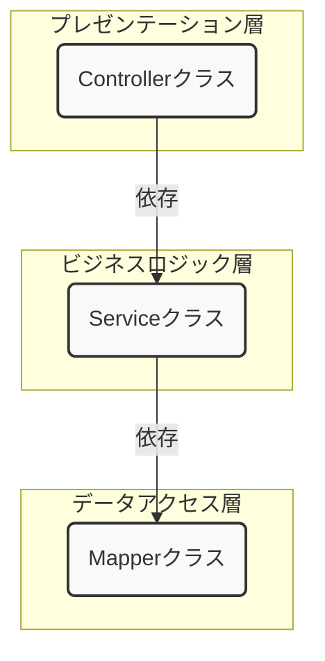

Spring BootとMyBatisを使ってWeb APIを開発するハンズオンを行いますが、その前に、なぜそのような作り方をするのか、という設計思想について学んでいきましょう。
この設計思想を理解することが、単に「動くプログラム」から「保守しやすく、変更に強いプログラム」を作るための第一歩となります。

### 1. 基本的な登場人物（クラス）の紹介

まず、今回作成するWeb APIで登場する主要なクラスの役割分担を説明します。

- **Controller**: 
	- APIのエンドポイント（URL）を定義し、外部からのリクエスト（要求）を受け取る窓口です。クライアントから送られてきたデータを後述の`Form`で受け取り、ビジネスロジックを担当する`Service`を呼び出します。処理結果をクライアントに返す（レスポンス）のも彼の仕事です。
- **Service**: 
	- アプリケーションの核となるビジネスロジック（業務処理）を担当します。例えば、「ユーザー情報を登録する」という処理であれば、関連するデータのチェックや、データベースへの保存指示などを行います。複数の`Mapper`を組み合わせて複雑な処理を実装することもあります。
- **Mapper**: 
	- データベースとのやり取り（SQLの実行）を専門に行うインターフェースです。MyBatisがこのインターフェースを元に、データベースアクセスのための具体的な処理を自動で実装してくれます。
- **Form (＝フィールドとgetter/setterだけの画面からの入力値を入れるデータクラス)**: 
	- クライアントから送られてくるリクエストのパラメータを格納するための専用クラスです。入力値のチェック（バリデーション）ルールを定義することもできます。
- **Entity(＝フィールドとgetter/setterだけのデータベースのレコードを入れるデータクラス)**: 
	- データベースのテーブル構造と一対一に対応するクラスです。`Service`や`Mapper`は主にこの`Entity`を使ってデータのやり取りを行います。

>[!TIPS]
>**なぜ`Form`と`Entity`を分けるのか？**
>Controllerでリクエストを受け取る際に、直接`Entity`を使わず、一度`Form`という専用のクラスを挟みます。これは、クライアントが要求するデータ構造と、データベースが持つデータ構造が必ずしも一致しないためです。例えば、パスワードのようにリクエストでは受け取るが、データベースの情報を返す際には含めたくない項目がある場合に、明確に役割を分離できます。
>これにより、APIの仕様変更（例：画面から受け取る値が新しく増えた）がデータベースの構造に、データベースの構造変更（例：テーブルの列が増えた）がAPIの仕様に直接影響しづらくなります。

### 2. なぜクラスを分けるのか？ — 変更の理由を整理し、影響を限定する

Javaの基本を学んだ皆さんが、次にWeb API開発の現場で求められるのは「ただ動く」ことではなく、「**変更が必要になった時に、安全かつ迅速に対応できること**」（**変更容易性**）です。システム開発に仕様変更はつきものです。
今回は、その第一歩として**レイヤードアーキテクチャ**という手法を使い、システムの「役割」ごとにクラスを切り分けていきます。

#### ① クラスを分けないことで起きる「実務的な不都合」
もし1つのクラスに「Webの受付」「処理の手順」「DB操作（SQL）」をすべて詰め込んでしまうと、以下のような問題に直面します。

*   **変更が他の無関係な部分に波及する**:
    フロントエンドの都合で「JSONの項目名を変えたい」、あるいはDBの都合で「カラム名を変えたい」といった変更は頻繁に起こります。これらが1つのクラスに混ざっていると、外部との接続部分を直しただけなのに、うっかりシステムの中核となるロジックまで書き換えてしまい、バグを生む（**デグレ**）原因になります。また、デグレしてないか確認するために**リグレッションテスト**（**回帰テスト**）の範囲も大きくなります。
*   **技術スタックの入れ替えや再利用が困難になる**:
    ロジックと特定の技術（例えばWeb用の機能や特定のDB操作コード）が同じクラスに書かれていると、
    例えばDBをpostgresqlからoracleに変更するのが難しくなります。
    例えば、**「同じ計算ロジックをWeb APIではなく、バッチ処理（コマンドライン実行）でも使いたい」**となった場合、Webの機能と密結合していると、ロジック部分を切り出して再利用することができず、結局同じコードをもう一度書くハメになります。

>[!TIPS]
>電卓課題を思い出してみましょう。
>例えば、計算式の入力がコンソールから、ファイル読み込みに変わったらどうでしょうか？
>**入力を受け付けるクラス**と**計算処理をするクラス**を分けてない状態だと、Mainクラスを修正することになります。
>もしかしたら、**入力方法が変えただけなのに関係のない計算処理がおかしくなってしまうかもしれません。**コードを修正する際に今までの機能に影響が出ないかヒヤヒヤしませんでしたか？
>
>一方で、入力を受け付けるクラスを分けていれば、それをファイル入力を受け付けるクラスに差し替えるだけです。

```java
@RestController
public class UserController {
    @Autowired
    private SqlSession sqlSession;

    @PostMapping("/api/v1/users")
    public String register(@RequestBody Map<String, Object> request) {
        // 1. 【Web/入力の都合】JSONのキー名に直接依存している
        String name = (String) request.get("user_name"); 

        // 2. 【ロジック】ユーザー名のチェックなど
        if (name == null) { ... }

        // 3. 【DBの都合】SQLやカラム名に直接依存している
        sqlSession.insert("INSERT INTO users (name) VALUES (#{name})", name);

        return "success";
    }
}
```

#### ② 今回の設計方針：技術的な関心事で境界線を引く

今回のハンズオンでは、レイヤードアーキテクチャを使い、**「システムの境界部分（WebやDB）」と「本来の処理（ロジック）」を切り離す**ことから始めます。
##### レイヤードアーキテクチャとは
<u>システムを役割ごとに「層（Layer）」に分割して、それぞれの層が持つ責任を明確にする考え方です。 今回の構成は、このアーキテクチャに基づいています。</u>
<u>また、各層は一方向の依存関係を持っています。</u>

>[!NOTE]
>ここでの依存関係とはメソッド呼び出しのことです。



*   **Controller（Webの窓口）**: 
    HTTPリクエストやJSONの形式など、**「外部とのやり取り」の都合**を吸収します。ここを分けることで、APIのURLが変わっても、それ以外の処理には一切影響しません。
*   **Service（ビジネスロジック）**: 
    「何を行うか」というシステムの中核を担います。今回は最小構成ですが、本来ここには「業務上のルール（ビジネス的な関心事）」が凝縮されます。
*   **Mapper（DBの窓口）**: 
    SQLの発行やテーブル構造など、**「データベース」の都合**を吸収します。ここを分けることで、DB構成が変わっても、ビジネスロジック層を修正する必要がなくなります。

**補足：データのバケツリレー**  
この3層構造をデータが流れていく際、1章で紹介した「Form」や「Entity」が使われます。  
Form(入力) → Controller → Service(加工/ロジック) → Entity(DB用) → Mapper  
層ごとに扱うデータクラス（Form/Entity）を分けるのも、この「境界線」を明確にし、外側の変化（DBの項目変更など）を層の境界で食い止めるためです。

#### ③ 「高凝集」で変更しやすいコードへ

クラスを分ける際は、単にファイルを増やすのではなく、「**凝集度**」を高めることを意識します。
凝集度とは、クラス内の要素がどれだけ関連のあるものが集まってるかという指標です。

*   **ロジックを一箇所に集める（高凝集）**:
    関連するロジックを1つのクラスにギュッと凝縮させることで、「この修正ならここを見ればいい」という場所が明確になります。逆に凝集度が低いと、あちこちに同じようなロジックが溢れたり、修正箇所を探すのが大変になります。
*   **変更の理由を分ける（SRP: 単一責任の原則）**:
    「Webの都合で変えるのか」「DBの都合で変えるのか」「業務ルールの都合で変えるのか」。**修正が必要になる理由（アクター）**ごとにクラスを分けることで、1つの変更が他の無関係な部分に波及するのを最小限に抑えます。

> [!TIPS]
> **ステップアップのために**
> 実際の複雑な開発では、この「Service」の中身も、ビジネス上の関心事（例えば、配送管理、在庫計算など）に合わせてさらに細かくクラスを分けていきます。
> 今回はまず、レイヤードアーキテクチャの基本である**「技術的な境界線を引いて、外部の変化に強い構造を作る」**という感覚を、実装を通して掴んでいきましょう。

>[!CAUTION]
>**注意点：**
>ただし、クラスをとにかく細かくすればいいわけではありません。
>クラスを分ければコード量が増え、管理が大変になります。システムの規模に合わせて拡張していくのがベストです。

### 3. クラス間の「つながり」を考える - 結合度

クラスを分けただけでは、まだ不十分です。次に、クラス同士の「つながり方」について考える必要があります。このつながりの強さを**結合度**と呼びます。
例えば、`Service`クラスが`Mapper`クラスを以下のように直接生成していたらどうでしょう。

```java
// 悪い例：Serviceクラス内で直接Mapperをnewしている
public class UserService {
    private final UserMapperImpl userMapperImpl;
	
    public UserService() {
        this.userMapper = new UserMapperImpl(); // ← 密な結合！
    }
	
    public User findById(Integer id) {
        return userMapperImpl.findById(id);
    }
}
```

このコードは、`UserServiceImpl`が`UserMapperImpl`という**具体的な実装クラス**を名指しで知ってしまっています。これを「**結合度が高い**（密結合）」状態と呼びます。
密結合には以下のような問題があります。

*   **差し替えが困難**: 
	* もしテストのために、データベースに接続しない偽物の`Mapper`（モック）を使いたくなっても、`UserServiceImpl`のコードを書き換えない限り差し替えられません。
	* 別の部品を差し替えて再利用がし辛くなります。
*   **修正の影響を受けやすい**: 
	* `UserMapperImpl`の作り方が変わったら（例えば、コンストラクタに引数が必要になったら）、`UserServiceImpl`も修正が必要になります。別に`UserServiceImpl`に変更の必要はないのに。

この問題を解決し、「**結合度を低く**（疎結合）」保つことが、変更への強さをさらに高める鍵となります。

>[!TIP]
>**高凝集で低結合を目指そう** :
>クラス内の要素の凝集度が高ければ、 **修正の影響範囲が限定され**、他とのクラス間の結合度が低ければ、**部品としての独立性が高まります**。
>そのため、クラスは高凝集で低結合であることが良いとされています。
>誰にも依存しない自立した部品を作ろう！

### 4. 解決策「依存性注入（DI）」の登場

疎結合を実現するための強力な手法が**依存性注入**（Dependency Injection, DI）です。
DIを一言でいうと、「**クラスが必要とするオブジェクト（依存オブジェクト）を、自分自身で生成するのではなく、外部から与えてもらう**」という考え方です。
先ほどの例をDIを使って書き換えてみましょう。

```java
// 良い例：DIパターンを使う
public class UserService {
    private final UserMapper userMapper; // インターフェース型で宣言

    // コンストラクタで外部からインスタンスを受け取る（注入してもらう）
    public UserServiceImpl(UserMapper userMapper) {
        this.userMapper = userMapper;
    }

    public User findById(Integer id) {
        return userMapper.findById(id);
    }
}
```

ポイントは以下の通りです。

*   `Service`は`Mapper`の**インターフェース**にのみ依存し、具体的な実装クラスを知らない。
*   `Mapper`のインスタンスは、`new`するのではなく、コンストラクタを通して**外部から渡されて**います。

これにより、`Service`は「`UserMapper`インターフェースの機能さえ満たしていれば、どんなクラスが来ても構わない」という状態になります。テスト時には本物の`Mapper`の代わりにテスト用のモックを簡単に渡す（注入する）ことができ、非常に柔軟な構造になります。

>[!TIPS]
>**変更されやすい具象クラス**ではなく、**変更されにくいインタフェース**に依存するようになったと整理するといいです。
### 5. Spring BootにおけるDIの実現方法

「では、その『外部から与える』というのは、一体誰がやってくれるのか？」
その役割を担うのが、Spring Frameworkの**springコンテナ**（ApplicationContext）です。 Spring Bootでは、簡単な設定（アノテーション）だけで、このDIの仕組みを利用できます。

1.  **Beanとして登録する**: Springに管理してほしいクラスに`@Service`や`@Mapper`といったアノテーションを付けます。これにより、DIコンテナがこれらのクラスのインスタンスを生成・管理してくれます（このインスタンスを**Bean**と呼びます）。

    ```java
    @Service // このクラスはServiceですよ、とSpringに教える
    public class UserServiceImpl implements UserService {
	 ... 
	}

    @Mapper // このインターフェースはMapperですよ、とMyBatis(とSpring)に教える
    public interface UserMapper {
     ... 
	}
    ```

2.  **注入してもらう**: 使いたいクラスのコンストラクタに、必要なインスタンスを引数として定義します。Springがその型に合うBeanを自動的に探し出し、インスタンス生成時に渡してくれます（**コンストラクタインジェクション**）。

    ```java
    @RestController
    public class UserController {
        private final UserService userService;

        // SpringがUserService型のBean（UserServiceImplのインスタンス）を自動で渡してくれる
        @Autowired
        public UserController(UserService userService) {
            this.userService = userService;
        }
        // ...
    }

    @Service
    public class UserServiceImpl implements UserService {
        private final UserMapper userMapper;

        // SpringがUserMapper型のBeanを自動で渡してくれる
        @Autowired
        public UserServiceImpl(UserMapper userMapper) {
            this.userMapper = userMapper;
        }
        // ...
    }
    ```

たったこれだけで、先ほど説明したDIが実現できます。私たちは面倒なインスタンス管理をSpringに任せ、ビジネスロジックの開発に集中できるのです！

#### まとめ

*   **変更に強いシステム**を作るには、**レイヤードアーキテクチャ**に基づきクラスの**責務を分離**することが重要です。
*   分離したクラス同士は、具体的な実装に依存しない**疎結合**な関係を目指します。
*   疎結合を実現する強力な手法が**依存性注入**（**DI**）です。
*   Spring Bootを使えば、`@Service`などのアノテーションを付けるだけで、DIの仕組みを簡単に利用できます。

この「責務の分離」と「DI」は、アプリケーション開発における非常に重要な考え方です。