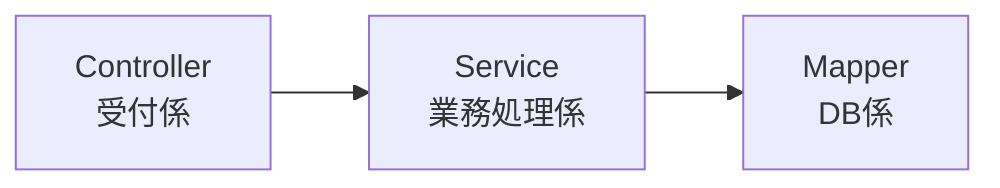

# クラス分割とアーキテクチャが必要な理由

## 1. 前提：なぜ私たちは「既存のコード」を触りたくないのか？

システム開発の現場において、プログラマーが最も恐れる言葉。それは「**デグレ（デグレード）**」です。
デグレとは、ある箇所の修正によって、これまで正常に動いていた別の機能が動かなくなってしまうことです。

これを防ぐために、現場には鉄の掟があります。

> **「コードを1行でも変更したら、その影響を受ける可能性のある機能はすべてテスト（動作確認）し直さなければならない」**

つまり、**「あらゆる処理が混在している大きなクラス」**を修正するということは、たとえ1行の変更であっても、**そのクラスに関わる全機能のテストをやり直す必要がある**ことを意味します。（厳密にはね。。。）これは膨大なコストと時間になります。

クラスを分ける最大の目的は、単にコードを綺麗にすることではありません。
**「修正の影響範囲を閉じ込め、テストしなければならない範囲を最小限にするため（＝楽をするため）」**であり、**「将来の変更要求に柔軟に対応するため」**です。

## 2. Step 1: 恐怖の「全部入りクラス」 (God Class)

まずは、クラス分割をしなかった場合の世界を見てみましょう。
Web APIのユーザー取得処理を、たった1つのクラスにすべて書いた`GodController.java`です。

```java
@RestController
public class GodController {

    // DB接続情報（本来は設定ファイルに書くべき）
    private final String DB_URL = "jdbc:mysql://localhost:3306/mydb";
    private final String DB_USER = "user";
    private final String DB_PASS = "password";

    @GetMapping("/users/{id}")
    public Map<String, Object> getUser(@PathVariable("id") int id) {
        
        Connection conn = null;
        PreparedStatement stmt = null;
        ResultSet rs = null;
        Map<String, Object> userMap = new HashMap<>();

        try {
            // ① DB接続処理
            conn = DriverManager.getConnection(DB_URL, DB_USER, DB_PASS);

            // ② SQL文の準備と実行
            String sql = "SELECT id, name, email FROM users WHERE id = ?";
            stmt = conn.prepareStatement(sql);
            stmt.setInt(1, id);
            rs = stmt.executeQuery();

            // ③ 結果の詰め替え
            if (rs.next()) {
                userMap.put("userId", rs.getInt("id"));
                userMap.put("userName", rs.getString("name"));
                userMap.put("userEmail", rs.getString("email"));
            }

        } catch (SQLException e) {
            throw new RuntimeException(e);
        } finally {
            // ④ DB切断処理（省略）
        }

        // ⑤ レスポンスの返却
        return userMap;
    }
}
```

このコードは「動く」システムですが、「生きた心地がしない」システムです。
DB接続、SQL、データの詰め替え、HTTPレスポンス……すべての責任をこの1つのクラスが負っています。

## 3. Step 2: 「責任」を分けるてみる

これを解決するために、「レイヤードアーキテクチャ」でクラスを分割します。



*   **Controller**: 「受付」と「返却」だけ担当。
*   **Service**: 「計算」や「判断」などのビジネスロジックだけ担当。
*   **Mapper**: 「SQLの発行」と「DB接続」だけ担当。

クラスを分けることで、実際の開発現場で遭遇する「3つの変更パターン」に対して、劇的なメリットが生まれます。

---

### ケースA：仕様変更への対応（テスト範囲の縮小）
**変更要求：「レスポンスに年齢(`age`)を追加してほしい」**

この変更でやることは以下の通りです。
1.  `Mapper`のSQLに`age`を追加。
2.  `Controller`の返却値に`age`を追加。

ここで重要なのは、**「Serviceクラスには一切触っていない」**という事実です。

*   **God Classの場合**: どこが壊れたかわからないので、DB接続からロジックまで全テストが必要。
*   **クラスを分けた場合**: 
    *   **Serviceの複雑な計算ロジックのテストは省略してOK**（リグレッションテスト不要）。
    *   データが画面に出るかどうかの確認だけで済む。

「修正したくない場所（Service）を安全に無視できる」ことは、テスト時間を劇的に減らします。

---

### ケースB：再利用性の向上（部品の使い回し）
**変更要求：「Web APIだけでなく、管理画面からも同じユーザー取得処理を使いたい」**

*   **God Classの場合**: 
    `GodController`のコードをコピー＆ペーストして、`AdminController`を作るしかありません。もしコピー元にバグが見つかったら、コピー先も全て修正が必要です。これは「バグの温床」になります。

*   **クラスを分けた場合**: 
    すでにテスト済みの`UserService`という部品が存在します。
    新しい`AdminController`からは、この`UserService`を呼ぶだけで済みます。
    
    > **メリット**：ロジックを1箇所（Service）に集約できるため、将来ロジックが変わっても1箇所の修正ですべての機能に反映されます。

---

### ケースC：技術的な交換の容易さ（部品の交換）
**変更要求：「データベースをMySQLからPostgreSQLに変えたい」**

*   **God Classの場合**:
    クラスの中に`jdbc:mysql://...`のような接続情報やSQLが埋め込まれているため、このクラスを修正する必要があります。もし似たようなクラスが100個あれば、100個すべて修正です。

*   **クラスを分けた場合**:
    `Controller`や`Service`は、データベースがMySQLなのかPostgreSQLなのかを知りません（関心がありません）。
    DB担当の`Mapper`（または設定ファイル）だけを修正・交換すれば、アプリ全体が新しいDBに対応します。
    
    > **メリット**：Webの画面周りや計算ロジックに一切影響を与えず、土台となる技術（DBなど）だけを安全に入れ替えることができます。

---

## まとめ：クラス分割は「未来の自分への保険」

| | クラス分割なし (God Class) | クラス分割あり (アーキテクチャ) |
| :--- | :--- | :--- |
| **修正の影響範囲** | **全体**。1行の修正で関係ない機能が壊れるリスク大。 | **局所**。修正した層以外は安全。 |
| **テスト範囲** | 不安だから**全部**やるしかない。 | **修正した層のみ**。触っていない層はテスト不要。 |
| **再利用 (Web/管理画面)** | コピー＆ペースト地獄。 | 部品(`Service`)を呼ぶだけで完了。 |
| **DB等の載せ替え** | 全機能を修正する必要がある。 | DB担当部品(`Mapper`)の交換だけで済む。 |
| **チーム開発** | 常に1つのファイルを奪い合い（コンフリクト）になる。 | 「画面担当」「DB担当」で分業できる。 |

一見、ファイルを分けることは「書くコードが増える」ように見え、遠回りに感じるかもしれません。
しかし実務では、**「コードを書く時間」よりも「コードを読み解き、変更の影響範囲を調査し、バグがないかテストする時間」の方が圧倒的に長い**のです。

この「最初のひと手間（クラス分割）」こそが、将来発生するあらゆる変更作業から私たちを救い、システムの寿命を延ばすための最も効果的な「投資」となります。