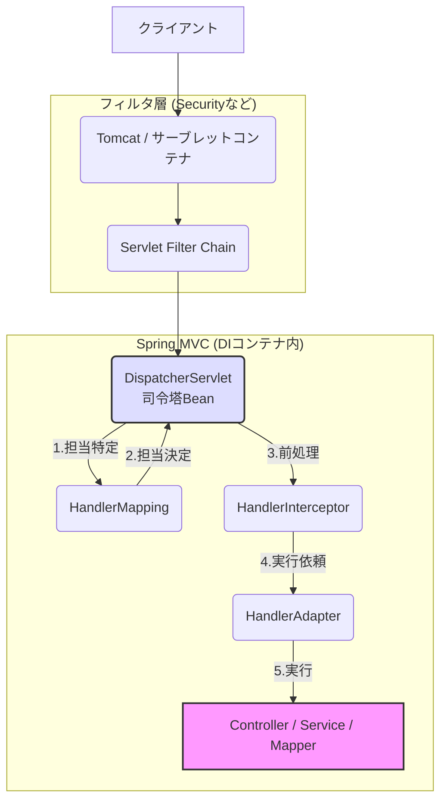

# Spring Boot アーキテクチャ・処理フローまとめ

このドキュメントでは、Spring Bootアプリケーションの「起動」「リクエスト処理」「例外処理」の裏側で動いている仕組みを整理しています。

## 1. 起動とBean登録の仕組み

アプリケーションが起動し、DIコンテナ（ApplicationContext）が構築されるまでの流れです。

### 1-1. 起動シーケンス
`main` メソッドの `SpringApplication.run(...)` が実行されると、以下のステップが進みます。

1.  **自動設定 (Auto-Configuration)**
    *   `@EnableAutoConfiguration` が依存ライブラリ（`pom.xml`など）をチェック。
    *   「WebアプリだからTomcatが必要」「DBドライバがあるからDataSourceが必要」といった設定を自動で行います。
2.  **コンポーネントスキャンとDIコンテナ構築**
    *   `@ComponentScan` がパッケージ配下をスキャン。
    *   `@Controller`, `@Service`, `@Repository` などをBeanとして生成し、依存関係（`@Autowired`）を解決して組み立てます。
3.  **Webサーバー起動**
    *   内蔵Tomcatなどが起動し、ポート（8080等）で待受を開始します。

### 1-2. MyBatis Mapperの検知と登録
MyBatisのインターフェースが `@Autowired` できる理由は、起動時に「プロキシ（実体）」が生成され、Beanとして登録されるからです。

| 方法 | 説明 |
| :--- | :--- |
| **1. @MapperScan (推奨)** | メインクラス等に付与。指定パッケージ以下の全インターフェースを自動検知してBean化します。 `@MapperScan("com.example.mapper")` |
| **2. @Mapper** | 個々のインターフェースに付与。`@ComponentScan` によって検知されBean化します。 |

---

## 2. リクエスト処理の全体像

クライアントからのリクエストが、どのようにしてコントローラーのメソッドに到達するか詳細なフローです。

### 2-1. 処理フロー（正常系）
1.  **Tomcat (Webサーバー)**
    *   リクエストを受信し、`HttpServletRequest` を生成。
2.  **Servlet Filter Chain**
    *   **DispatcherServletの手前**で動作。
    *   Spring Security（認証・認可）、CORS設定、エンコーディング処理などを実行。
3.  **DispatcherServlet (フロントコントローラー)**
    *   Spring MVCの「司令塔」。自身もBeanとして登録されており、他のBeanと連携します。
4.  **HandlerMapping**
    *   「このURLを担当するのはどのコントローラー？」を特定します。
5.  **HandlerInterceptor**
    *   コントローラー実行**直前・直後**の共通処理（ログ出力など）を行います。
6.  **HandlerAdapter**
    *   リクエスト情報をメソッドの引数に変換し、実際の**Controllerメソッド**を実行します。

### 2-2. コンポーネント間の連携イメージ
DispatcherServletは自身で処理するのではなく、DIコンテナ内の専門家Beanに指示を出します。

> **DispatcherServlet**: 「HandlerMappingくん、このURLの担当誰？」
> **HandlerMapping**: 「MyController Beanです」
> **DispatcherServlet**: 「HandlerAdapterさん、MyControllerを実行して」
> **HandlerAdapter**: (MyControllerを実行)

---

## 3. 例外処理のフロー

Service層などでエラーが発生した場合、どのように画面（またはJSON）が返されるかの流れです。

### 3-1. エラー伝播のステップ
1.  **例外発生**: Service層などで `throw Exception`。
2.  **Controller層**: キャッチされなければ、DispatcherServletへ伝播。
3.  **HandlerExceptionResolver**:
    *   `@ExceptionHandler` や `@ResponseStatus` による解決を試みます。
4.  **コンテナへのスロー**: 誰も処理しない場合、Tomcat（コンテナ）へ例外が投げられます。
5.  **エラーページへの転送 (Forward)**:
    *   Tomcatがエラーを検知すると、Spring Bootの設定により内部的に **`/error`** パスへリクエストを転送（フォワード）します。

### 3-2. BasicErrorControllerの出番
`/error` への転送は「新しいリクエスト」として扱われます。

1.  DispatcherServletが再度 `/error` リクエストを受け取る。
2.  **BasicErrorController**（Spring Boot標準のエラーコントローラー）が呼び出される。
3.  リクエスト属性からエラー情報を取得し、HTMLまたはJSONをレスポンスとして返す。

---

## 4. 処理フロー図 (Mermaid)

上記のリクエスト処理の流れを可視化した図です。

