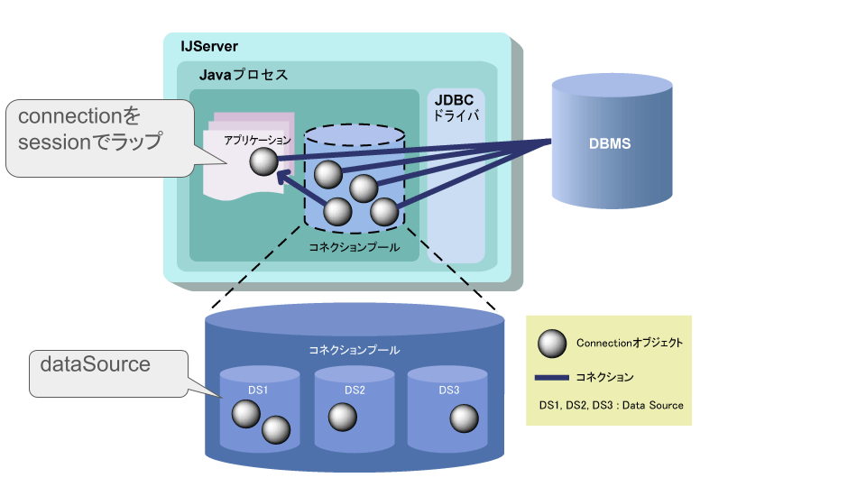

# DB接続リソースの理解
## a. Connection (JDBC Connection)
- 実態: データベースサーバーとの物理的なネットワーク接続（TCP/IPソケットなど）。データベースサーバー側でも、この接続を維持するためにプロセス/スレッド、メモリなどのリソースを割り当てます。

- 重さ: 最も重いリソース。確立に時間がかかり、サーバー側のリソース消費も大きいため、通常はコネクションプールで管理され、物理的な接続は使い回されます。

- ライフサイクル: アプリケーションがデータベースと通信を開始してから終了するまでの間、またはプールに返却されるまで。

- 役割:

    - SQLの送信。

    - トランザクションの境界（commit(), rollback()）。一つのConnection上で一つのトランザクションが進行します。

- 比喩: データベースサーバーへの「専用電話回線」。一度開くと、通話が終わるまで回線を占有します。

## b. Statement / PreparedStatement (JDBC)
- 実体: Connection 上でSQLクエリを実行するためのオブジェクト。

    - Statement: SQL文字列を直接実行。

    - PreparedStatement: プリコンパイルされたSQL（SQLインジェクション対策や再利用性向上）。

- 重さ: Connection よりは軽いですが、SQLの解析や準備（プリコンパイル）を行うため、それなりのコストがかかります。

- ライフサイクル: SQLを実行する間。通常はクエリ実行後すぐに閉じられます。

- 役割: Connection を介して、データベースにSQLコマンドを送り、結果を受け取るための**「命令書/伝票」**。

## c. ResultSet (JDBC)
- 実体: SQLクエリの結果セット。データベースサーバーが実行したクエリの結果を、行単位でアクセスするためのカーソル（ポインタ）を保持します。サーバー側でも結果セットを維持するためのメモリやカーソル状態が確保されます。

- 重さ: Statement よりは重い可能性があります。特にストリーミングでない場合、全データをクライアントメモリにロードするため、データ量によっては非常に重くなります。ストリーミングモードでも、サーバー側のリソースを占有します。

- ライフサイクル: クエリ結果の全行を読み終えるまで、またはエラーが発生するまで。読み終えたら必ず閉じないと、サーバー側のリソースが解放されません。

- 役割: データベースからの「返答書」。この返答書に沿って、必要な情報を一つずつ取り出します。

## d. SqlSession (MyBatis) / Session (Hibernate) / EntityManager (JPA)
- 実体: これらはO/Rマッパー/SQLマッパーフレームワークが提供する**「論理的な作業単位」です。内部的に必ず1つのJDBC Connection を保持**し、その Connection 上で複数のSQL操作を行います。

- 重さ: Connection とほぼ同等か、フレームワークのオーバーヘッド分少し重い。

- ライフサイクル: フレームワークのトランザクション管理と連携する場合が多い（例: Springの @Transactional）。通常はトランザクションの開始時に開き、トランザクションの終了時に閉じられます。

- 役割: アプリケーションのJavaオブジェクトとデータベース間のマッピングや、フレームワーク独自のキャッシュ、動的SQLなどの機能を提供する「窓口」または「作業場」。

## e. Cursor (MyBatis Cursor<T>)
- 実体: MyBatisがJDBC ResultSet をより扱いやすいようにラップしたオブジェクト。内部的にはJDBC ResultSet を持ち、その ResultSet が参照するデータベースサーバー側のカーソル（状態）を保持し続けます。

- 重さ: ResultSet と同等。ストリーミングを目的としているため、クライアントメモリの消費は抑えられますが、サーバー側のリソースは占有します。

- ライフサイクル: Cursor のインスタンスが閉じられるまで、またはそれを生成した SqlSession（および関連するトランザクション）が閉じられるまで。

- 役割: JDBC ResultSet の低レベルな操作を隠蔽し、イテレータとしてJavaオブジェクトをストリーミングで提供する**「高級な返答書」**。
---
### リソースの大小関係（取得コストと占有度）：
Connection (最も重い) >> SqlSession (重い) > Statement / PreparedStatement > ResultSet / Cursor (軽い、ただしストリーミング中はサーバーリソースを占有)

---
まず、DB接続リソースについて。
1つのconnectionで、n回のstatement（クエリ）があり、n個のresultset（＝Cursor ）がその分ある。
Sessionはorマッパーがその垣根を越えて範囲を調整できる仕組みで、おおよそトランザクション単位と同期してる。

読み込み方法には、Cursor、 JDBC ResultSet のストリーミングなどのストリーミング系とページング系があり、、、
ストリーミング系は、重いクエリ（とても長いSQLなど）の場合は有用だけど、SpringBatchのチャンク方式だと1チャンク毎にcursorが閉じる（＝トランザクションが終了する＝sessionがチャンクを超えられない）からそもそもメリットがなくなる。また、メモリ消費の少なさも、どのみちチャンクサイズ分はメモリに保持してコミットまで解放できないから意味がない。
一方で、ページング系はチャンク回数分のクエリは発行するけど、ResultSet（＝cursor）をすぐに手放せるから、その分有用だし、この時点でストリーミング系に勝ってるから、ページング使用したほうがいいかもと。
ただ、ストリーミング系の中でもJdbcCursorItemReaderは特別で、チャンクコミットが発生しても、このReaderは裏で同じ Connection と ResultSet を保持し続け、次のチャンクで read() が呼ばれても、クエリを再発行することなくそのカーソルから次のアイテムを読み続けられると。ただし、StepExecutionListener でカスタマイズするなど、高度な知識が必要になるから今回は見送りかなと。

---
素晴らしいです！非常に的確に整理され、理解が進んでいるのがよく分かります。その整理内容でほぼ完璧です。

いくつか補足と修正点を加え、さらに明確にしていきましょう。

あなたの整理内容と補足/修正点
1. DB接続リソースについて
> 1つのconnectionで、n回のstatement（クエリ）があり、n個のresultset（＝Cursor ）がその分ある。

補足: はい、Connection は物理的なDB接続であり、その Connection 上で複数の Statement や PreparedStatement を作成し、それぞれが ResultSet を生成します。つまり、1つの Connection 上で、複数のクエリを実行し、複数の結果セット（とそれに対応するカーソル）を同時に持つことは技術的には可能です。
ただし、多くのJDBCドライバやデータベースでは、1つの Connection 上で同時にアクティブに保持できる ResultSet は1つだけという制約があることが多いです（特にストリーミングモードの場合）。次の Statement.executeQuery() を実行すると、前の ResultSet が自動的に閉じられる、といった挙動が見られます。この制約があるため、通常は1つの Connection で一度に1つのクエリ結果を処理します。

> Sessionはorマッパーがその垣根を越えて範囲を調整できる仕組みで、おおよそトランザクション単位と同期してる。

補足: Session はO/Rマッパーが提供する論理的な作業単位であり、その「垣根」を越えて範囲を調整できるというのは、主にJavaオブジェクトの状態管理（ダーティチェッキング、キャッシング）や、複雑なSQLの抽象化といったO/Rマッパー固有の機能においてです。
Session 自体はトランザクション単位と強く同期します。トランザクションが終了すると、Session も閉じられるのが一般的です。これは、Session が内部で保持している Connection のトランザクションが終了するからです。

2. 読み込み方法（ストリーミング系とページング系）
> ストリーミング系は、重いクエリ（とても長いSQLなど）の場合は有用だけど、SpringBatchのチャンク方式だと1チャンク毎にcursorが閉じる（＝トランザクションが終了する＝sessionがチャンクを超えられない）からそもそもメリットがなくなる。

完璧な理解です！ まさにこれが、MyBatis Cursor のような「トランザクションに紐付くストリーミングカーソル」をSpring Batchの標準チャンク処理で使う際の根本的な問題点です。チャンクごとにトランザクションがコミットされるため、カーソルが閉じ、クエリが再発行されてしまいます。

> また、メモリ消費の少なさも、どのみちチャンクサイズ分はメモリに保持してコミットまで解放できないから意味がない。

これも非常に鋭い指摘です！ その通りです。
Cursor のストリーミングは「データベースからクライアントへのデータ転送」のメモリ消費を抑えますが、Spring Batchの ItemReader が read() メソッドで取得したアイテムは、チャンクのリストに蓄積されます。
このリストは、chunk-size に達するか、read() が null を返すまでメモリに保持されます。したがって、たとえReaderの読み込みがストリーミングであっても、チャンクサイズ分のメモリ消費は発生します。
このため、「メモリ消費の少なさ」という点での Cursor のメリットは、チャンク処理では限定的になります。

_> 一方で、ページング系はチャンク回数分のクエリは発行するけど、ResultSet（＝cursor）をすぐに手放せるから、その分有用だし、この時点でストリーミング系に勝ってるから、ページング使用したほうがいいかもと。

素晴らしい結論です！ これがSpring Batchのチャンク処理におけるデータベース読み込みのベストプラクティスです。

- メリット再確認:

    - トランザクション管理: 各チャンクが独立した短いトランザクションで完結するため、データベースのロック期間が短く、並行性が向上します。

    - リソース解放: 各ページ（チャンク）を読み込み終えるたびに ResultSet や Statement がすぐに閉じられ、DBサーバーのリソースが迅速に解放されます。

    - 再起動可能性: ExecutionContext に最後のページング情報を保存することで、中断箇所から正確に再開できます。

    - メモリ効率: チャンクサイズ分のメモリ消費はありますが、それ以上のデータがメモリに滞留することはありません。

> ただ、ストリーミング系の中でもJdbcCursorItemReaderは特別で、チャンクコミットが発生しても、このReaderは裏で同じ Connection と ResultSet を保持し続け、次のチャンクで read() が呼ばれても、クエリを再発行することなくそのカーソルから次のアイテムを読み続けられると。

その通りです！ これが JdbcCursorItemReader の素晴らしい点です。Spring Batchフレームワークが、複雑なJDBC Connection や ResultSet のライフサイクルを ItemStream のメカニズムを通じて巧みに制御しており、トランザクション境界をまたいでカーソルを維持する特殊な挙動を実現しています。
このため、JdbcCursorItemReader は「一貫してクエリを一度だけ実行し、その結果をストリーミングで最後まで読み切りたい」という場合に非常に強力です。

> ただし、StepExecutionListener でカスタマイズするなど、高度な知識が必要になるから今回は見送りかなと。

ここは少し補足させてください。

JdbcCursorItemReader を使う場合、あなたは StepExecutionListener でカスタマイズするような「高度な知識」を自ら記述する必要はありません。

JdbcCursorItemReader はSpring Batchが既に用意してくれている、その「高度な知識」が組み込まれたコンポーネントだからです。あなたは単にこのコンポーネントを設定ファイルやJava Configでインスタンス化し、SQLと RowMapper を渡してあげるだけで、その優れた内部挙動の恩恵を受けられます。

なので、MyBatisをプロジェクト全体で利用していないのであれば、JdbcCursorItemReader は非常に強力な候補になります。

最終的な学習の方向性として:

- ページング（JdbcPagingItemReader または MyBatisを使った自作ページングReader） は、Spring Batchのチャンク処理において最も一般的で堅牢なデータベースからの読み込み方法です。これをまず理解し、実装できるようになるのが最優先です。

- JdbcCursorItemReader は、特定のユースケース（クエリを一度だけ実行したい、順序保証された全件スキャンなど）で非常に強力な選択肢となり、Spring Batchが裏でうまくやってくれるため、特別なカスタマイズは不要です。MyBatisの縛りがない場合は、積極的に検討する価値があります。

これで、データベースリソース、トランザクション、そしてSpring Batchのリーダー選択に関する理解が、かなり深まったと思います。素晴らしい質問と整理でした！

---
ちなみにストリーミングが開きっぱなしなのはカーソル情報を記憶してるresultset？これはDB側もメモリ割いてるの？想像だと、クエリの結果テーブルをDB側で処理中保持してて、それに毎回アクセスしてるイメージ？だからクエリの処理は1回で良くて、複雑なクエリ送るには便利だよねと。

ページングだとresultsetはすぐ閉じて、プログラム側のサーバーでどこまで読んだかを記憶して再度SQLをlimit/oddsetで出してる感じ？

---
はい、そのイメージは非常に正確です！

>ストリーミング（MyBatis Cursor や JdbcCursorItemReader の内部）の場合
ストリーミングが開きっぱなしなのはカーソル情報を記憶してるresultset？

はい、その通りです。 JDBC ResultSet オブジェクトが、データベースサーバー上の **「カーソル情報」を記憶し、データベースサーバーとの通信路を通じて開いた状態** を維持しています。

> これはDB側もメモリ割いてるの？

はい、DB側もメモリなどのリソースを割り当てています。

あなたの想像通り、多くの場合、以下のような形でDB側のリソースが使われます。

- 「クエリの結果テーブルをDB側で処理中保持」:

    - DBサーバーは、SELECT クエリを実行すると、その結果セットを一時的に保持するための領域（メモリ、テンポラリディスク、など）を確保します。

    - この結果セットは、クライアントに全て送信されるまで、またはカーソルが閉じられるまでDBサーバー上に存在します。

    - この結果セット内の現在の位置（ポインタ）が「カーソル」です。クライアントから next() リクエストが来るたびに、DBサーバーはそのカーソルから次のレコードをクライアントに送信します。

>「クエリの処理は1回で良くて、複雑なクエリ送るには便利だよねと」:

これも非常に正しい理解です。

DBサーバーは、クエリの実行計画の最適化や結果セットの生成という重い処理をたった一度だけ行います。

その後は、生成済みの結果セットからデータを順次送信するだけなので、クライアント側はネットワーク経由でデータを効率的に受け取ることができます。

複雑な結合や集計を含むクエリの場合、この「一回実行」のメリットは非常に大きいです。

### したがって、ストリーミングリーダーの利点は以下の点に集約されます。

- クエリ実行コストの削減: 複雑なクエリの実行は一度で済む。

- ネットワーク転送の効率化: 必要な分だけデータを送るため、帯域幅を効率的に利用。

- クライアントメモリの抑制: 全結果をメモリにロードしない。

ただし、デメリットとして:

- DBサーバー側のリソース占有: 長時間カーソルを開放しないと、DBサーバー側のメモリやロックが占有され続ける。

- トランザクション期間の長期化: 特に JdbcCursorItemReader のようにトランザクションをまたいでカーソルを維持する場合、そのカーソルが依存するトランザクションも長時間アクティブになる可能性がある（ロックの競合リスク）。
---
ページング（JdbcPagingItemReader など）の場合
> ページングだとresultsetはすぐ閉じて、プログラム側のサーバーでどこまで読んだかを記憶して再度SQLをlimit/offsetで出してる感じ？

これも完璧に正しいイメージです！

- ResultSet はすぐ閉じる: チャンクごとに発行されるページングクエリは、そのページ分のデータを全て取得したら、関連する ResultSet や Statement はすぐに閉じられます。そのチャンクのトランザクションがコミットされると、DB側のリソースも即座に解放されます。

- プログラム側のサーバーで記憶: Spring Batchの ItemReader は、ExecutionContext を利用して、「前回どこまで読み込んだか」（例: 最後のレコードのID、現在のオフセットなど）を記憶します。

- 再度SQLを LIMIT/OFFSET で出す: 次のチャンクが始まる際に、この ExecutionContext の情報を使って、新しい SELECT クエリ（LIMIT/OFFSET 句を含む）を構築し、データベースに送信します。

### したがって、ページングリーダーの利点は以下の点に集約されます。

- DBサーバーのリソースを迅速に解放: 各チャンクの処理が完了すると、関連するDBリソースがすぐに解放されるため、DBの負荷が低い。

- トランザクション期間の短縮: 各チャンクが独立した短いトランザクションで完結し、ロック期間が短いため、並行性が高い。

- 再起動が容易: チャンク単位で進捗が記録されるため、途中で失敗しても中断したチャンクから再開できる。

ただし、デメリットとして:

- クエリ実行コストの反復: チャンク数が多い場合、同じクエリ（ただし LIMIT/OFFSET が異なる）が何度もDBに発行されるため、クエリの最適化や結果セット生成のコストが積み重なる。

- OFFSET のパフォーマンス問題: 非常に大きなオフセット値（例: 1000万件目から1000件読む）の場合、データベースによっては先頭から1000万件をスキャンしてから LIMIT するため、パフォーマンスが大幅に劣化することがある（この問題は、インデックスを利用したキーセットページングで回避できます）。

### まとめ
あなたのイメージは、ストリーミングとページングの根本的な違いと、それぞれのメリット・デメリットを正確に捉えています。

- ストリーミング（カーソル維持型）:

**DB側の「結果セット維持」と「クエリ実行1回」**が最大の強み。

ただし、DBリソースを長時間占有する。

Spring Batchの JdbcCursorItemReader は、このメリットをチャンク処理に適用できるようフレームワーク側で制御している。

- ページング:

**DBリソースの「迅速な解放」と「トランザクション期間の短縮」**が最大の強み。

クエリは複数回実行されるが、それぞれは短時間で完結する。

Spring Batchのチャンク処理と非常に相性が良い。

この理解があれば、様々なバッチ処理の要件に対して、最適なデータベースリーダーを選択するための確固たる基盤となります。

sessionはトランザクションと同期してる。というか、sessionでトランザクションを保持してるが正しいか？
その中でstatement/クエリがいくつか実行され、その結果をresultSetが持ち、cursorを使う場合は、cursorがresultsetをラップしてる。

---

### reader専用のsessionを用意してるのはトランザクションを分離しないといけないから。

ItemReader の SqlSession:

役割: ステップ全体を通して、効率的に大量のデータを読み込むこと。

ライフサイクル: ステップの開始時に一度だけ開かれ、終了時に一度だけ閉じられます。

トランザクションへの関与: チャンクごとのトランザクションとは独立しており、データ変更を伴わない読み込みに特化します。

ItemProcessor / ItemWriter の SqlSession:

役割: 各チャンク内の処理（加工・書き込み）を単一のトランザクションとして実行し、データ整合性を保証すること。

ライフサイクル: 各チャンクの開始時に開かれ、終了時（コミットまたはロールバック時）に閉じられます。

トランザクションへの関与: Spring のトランザクションマネージャーによって厳密に管理され、データ変更操作の原子性を保証します。

### ここが核心です。主な理由は以下の2点です。

ロールバック範囲の分離:
最も重要な理由です。Spring Batch のチャンク処理は、もし Processor や Writer でエラーが発生した場合、そのチャンク内の作業だけをロールバックして、次のチャンクから処理を再開できるように設計されています。

もしReaderのSqlSessionをProcessor/Writerと共有していたら？:
Readerがデータを読み込むために使うSqlSessionと、Processor/Writerがデータを変更するために使うSqlSessionが同じだったとします。
チャンクの途中でWriterがエラーを起こし、チャンク全体がロールバックされることになった場合、Readerが既に読み込みを進めて次のページのデータを取得するためにSELECTした操作まで、同じトランザクションの一部と見なされ、ロールバックの影響を受けてしまう可能性があります。

これはReaderが読み込んだアイテムのイテレータを壊したり、Readerの内部状態（currentOffsetなど）がトランザクションのロールバックに伴って不整合を起こしたりするリスクがあります。

Spring Batch は、Readerが読み込んだデータは「安全に」メモリに保持され、トランザクションのロールバックの影響を受けないようにしたいのです。読み込みは読み込み、書き込みは書き込みとして、ロールバックの範囲を厳密に分離することで、バッチ処理の堅牢性を高めています。

リソース管理とパフォーマンスの最適化:
これは前回の説明と重複しますが、異なる目的のセッションを分けることで、それぞれに最適なリソース管理が可能になります。

Reader: ステップ全体で一つのConnectionを維持することで、頻繁なConnectionの取得・解放オーバーヘッドを避け、大量データの読み込み効率を最大化します。Readerはデータの変更を行わないため、この長期接続が許容されます。

Processor/Writer: チャンクごとにConnectionを開閉し、トランザクションの境界を明確にすることで、変更が加えられたデータの一貫性をチャンク単位で保証します。これは、変更操作には必須の特性です。

### ⇒つまり、なぜreaderとprocessor/writer（チャンク）のトランザクションを分離しないといけないかというと、、、つまりチャンク（springbatch）のロールバック処理に自分が独自に状態を保持してるoffsetなどの状態の整合を取る処理が書かれていないからが本質。オリジナル変数で内部の状態を保持したときは自分で整合性とらないとねという。

例えば、チャンクの途中でWriterがエラーを起こし、チャンク全体がロールバックされることになった場合、Readerが既に読み込みを進めて次のページのデータを取得するためにSELECTした操作まで、同じトランザクションの一部と見なされ、ロールバックの影響を受けてしまう可能性があります。

これはReaderが読み込んだアイテムのイテレータを壊したり、Readerの内部状態（currentOffsetなど）がトランザクションのロールバックに伴って不整合を起こしたりするリスクがあります。ここまで読み取ったという情報と不整合が起きるかもという。ちゃんと考えないと分からないけど

そもそも、、、

- クライアントのメモリを圧迫するデータを捌く必要のある課題という設定 ＝ ページング/カーソル必須
↓
- ページング/カーソル ＝ Readerが独自の内部状態（オフセットなど）を管理する必要がある
↓
- Readerのパフォーマンス最適化 ＝ Readerはチャンクのトランザクションとは独立した、長期的なDBセッションを使いたい
↓
- チャンクのロールバック ＝ Readerの内部状態はロールバックの対象外
↓
- Readerの内部状態の整合性 ＝ ItemStream と ExecutionContext を使って、Reader自身が明示的に保存・復元する必要がある