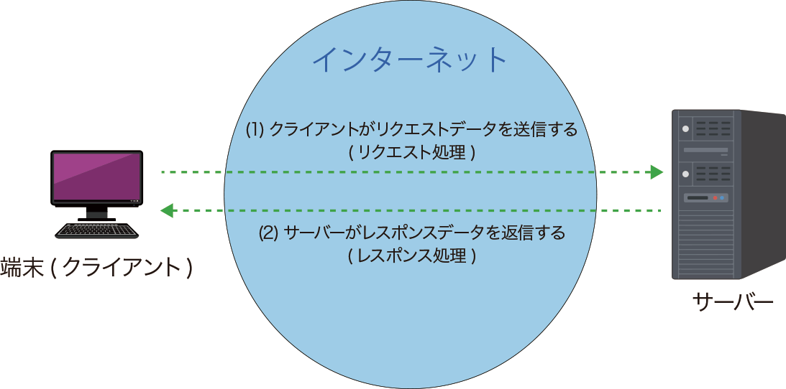

# **Web サイトの仕組みと用語解説**

## **1\. Web サイトの役割分担**

Web サイトは、大きく「**フロントエンド**」と「**バックエンド**」という 2 つの部分から成り立っています。この 2 つが連携することで、私たちが普段見ているウェブページは表示されています。

 
参照元：https://iwatani.tv/programming/php-what-is-server/

- **フロントエンド (Frontend)**: ユーザーが直接見て操作する部分。Web ブラウザ上で動作します。
  - 担当者：**フロントエンドエンジニア**
  - 主な技術：**HTML**、**CSS**、**JavaScript**
- **バックエンド (Backend)**: データの処理や保存など、ユーザーの目に見えない部分。サーバー上で動作します。
  - 担当者：**バックエンドエンジニア**
  - 主な技術：Python、Ruby、PHP、Java など

## **2\. サーバーとは？クライアントとは？**

**サーバー**とは、「**サービスを提供するコンピューター**」のことです。\
Web サイトの世界では、Web ページのデータや、データベースに保存された情報などを管理し、リクエストに応じてクライアントに提供する役割を担います。

**クライアント**とは、「**サービスを受けるコンピューター**」のことです。

**フロントエンド**はサーバーからデータを受け取って表示する「お店のホール係」のようなもので、**バックエンド**はデータを用意する「お店の厨房係」のようなものだと考えると、役割が分かりやすいでしょう。

## **3\. Web サイトの構成要素**

ウェブサイトは、主に以下の 3 つの言語で作られています。これらはウェブブラウザが解釈できる共通言語です。

 

### **(1) HTML (HyperText Markup Language)**

Web ページの**骨組み**や**構造**を定義する言語です。見出し、段落、画像、リンクなど、ページの「何があるか」を記述します。

- **例**: \<h1\>は見出し、\<p\>は段落、\は画像を表します。

### **(2) CSS (Cascading Style Sheets)**

HTML で作成したページの**見た目**や**デザイン**を定義する言語です。色、フォント、レイアウト、余白などを設定し、ページを美しく見せます。

- **例**: 文字の色を青にしたり、画像の角を丸くしたりすることができます。

### **(3) JavaScript**

Web ページに**動き**や**インタラクション**（相互作用）を加えるためのプログラミング言語です。ユーザーの操作に応じて、表示内容を変えたり、アニメーションをつけたりすることができます。

- **例**: スライドショー、ポップアップ表示、フォーム入力内容のチェックなど。

 

### ⇒ 実際に demo を見せながら、html 弄ってみたり、style 消してみたり、して説明

## **4\. Web サイトの動作の流れ**

ブラウザで URL を入力してからページが表示されるまでの流れを見てみましょう。

 

1. **クライアント (ブラウザ) からのリクエスト**
   - 「ウェブサイトが見たい！」というユーザーの要求を受け取り、Web ブラウザ（クライアント）が「このページの HTML、CSS、JavaScript をください」という**HTTP リクエスト**をサーバーに送ります。
2. **サーバーの役割**
   - リクエストを受け取ったサーバーは、要求されたデータ（HTML ファイル、画像ファイルなど）を探します。
3. **サーバーからレスポンス**
   - サーバーは、探してきたデータをブラウザに返します。これが**HTTP レスポンス**です。
4. **ブラウザの役割**
   - ブラウザは受け取ったレスポンス（HTML、CSS、JavaScript のデータ）を解釈し、指定された通りにページを組み立てて画面に表示します。

## **5\. 静的な Web サイトと動的な Web サイト**

Web サイトは、その内容がいつ、どこで作られるかによって「静的」と「動的」に分けられます。

### **(1) 静的な Web サイト**

- **特徴**: **サーバーに置かれたファイルがそのままの状態でユーザーに表示される**タイプです。
- **仕組み**: サーバーは、リクエストを受け取ると、あらかじめ用意しておいた HTML、CSS、JavaScript ファイルをそのままブラウザに返します。
- **用途**: 内容が頻繁に変わらない企業サイト、ポートフォリオ、ブログなどに適しています。
- **例**: シンプルな会社概要ページ、イベントの告知サイトなど

### ⇒ 阿部寛の HP をみてみよう（今回こちらは扱いません

### **(2) 動的な Web サイト**

- **特徴**: ユーザーのリクエストや状況に応じて、**サーバーがその場で Web ページを生成して返す**タイプです。
- **仕組み**: サーバーは、リクエストを受け取ると、データベースから必要な情報を取得し、その情報をもとに HTML を組み立ててブラウザに返します。
- **用途**: 内容が常に更新される EC サイト、SNS、ニュースサイトなどに適しています。
- **例**: Twitter のタイムライン、EC サイトの商品一覧ページなど。
- **（※補足）**：また動的なサイトの中でもより機能的なものを web アプリケーションと呼んだりします。(slack など)

### ⇒AMAZON を見てみよう

---

### **動的な Web サイトの 2 つの主要な構成方式**

動的な Web サイトには、主に以下の 2 つの作り方があります。

参考：https://qiita.com/manabito76/items/fe91eefe11a74dcf5126

#### **a. サーバーでページを組み立てる方式（従来方式）**

- **仕組み**: サーバーがすべての処理を行います。データベースからデータを取得し、**サーバー側で HTML ファイルを完成させてから**ブラウザに送信します。
- **特徴**:
  - サーバーがすべての HTML を生成するため、初期表示が速く、検索エンジンにも優しいというメリットがあります。
  - ページの切り替えごとに、サーバーから新しい HTML を受け取って再読み込みが必要です。
- **例**: 昔ながらのブログやニュースサイトなど。

#### **b. クライアントでページを組み立てる方式（クライアントサイドレンダリング（CSR）方式（Web API を利用））**

- **仕組み**: サーバーは、最初は最小限の HTML（骨組み）だけをブラウザに送信します。その後、ブラウザ上の JavaScript が、Web API を使って**必要なデータだけ**をサーバーから取得し、そのデータを JavaScript で加工してページを動的に組み立てます。
- **特徴**:
  - 一度ページが表示された後、データの更新やページの切り替えが高速に行われ、スムーズなユーザー体験を提供できます。
  - Web API を利用するため、ウェブサイトだけでなく、モバイルアプリや他のサービスとのデータの共有が容易になります。
- **例**: **SPA (Single Page Application)** と呼ばれる、Google マップや Gmail、Twitter のような、ページを遷移せずにコンテンツが切り替わるアプリケーション。

#### **c. 他にも昨今は サーバーサイドレンダリング（SSR）方式や SSG 方式など、、、**

---

### ⇒demo で dev ツールのネットワークタブを開いて、リクエストに乗せる payload（body）の中身を見てみる、帰ってくる payload を見てみる

### ⇒**API は web サイトの裏側で使われている**
