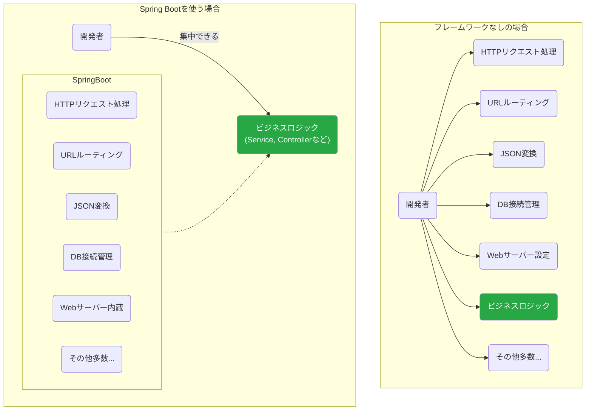
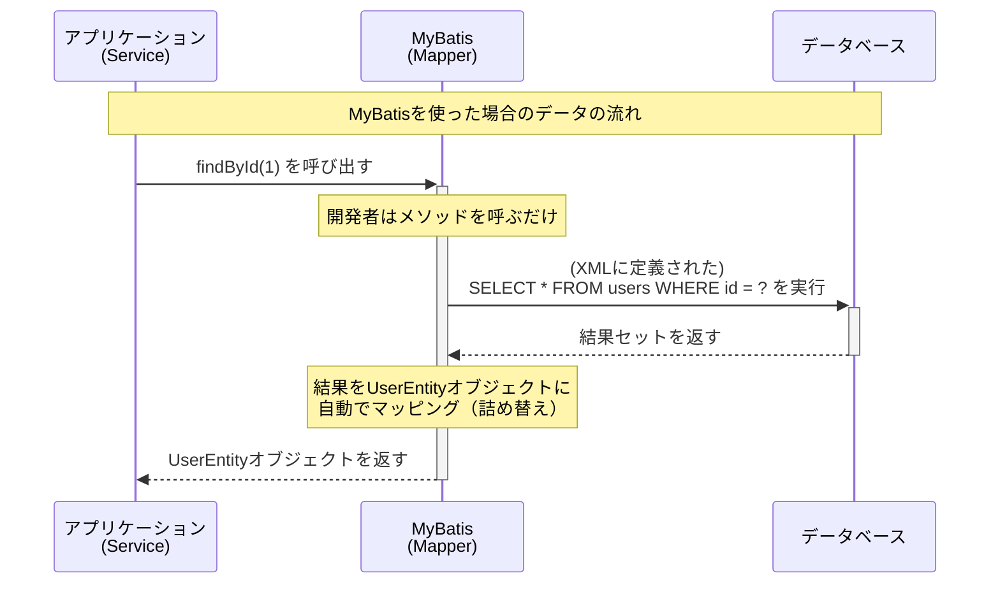

# フレームワークとO/Rマッパーの役割

spring bootとmybatisを使ったwebAPI開発をします。
フレームワークとORマッパーについての説明資料の作成をお願い致します。
何をしてくれるものなのか、使わない場合との対比を具体例で示すと分かりやすいかもしれません。
また、自分で書くプログラムとの位置関係というかどのような仕組みで利用できるかのイメージ図などあれば分かりやすいかもしれません。
md形式でほしいので、mermaidで図は書いてくれるといいと思います。

Web APIを開発するにあたり、私たちは**Spring Boot**という「フレームワーク」と、**MyBatis**という「O/Rマッパー」を利用します。これらは現代のJava開発において広く使われているツールです。

## 1. フレームワークとは？ 〜開発の「骨組み」と「ルール」〜

家を建てる時、多くの場合は設計図があり、基礎工事が済んだ土地に、規格化された建材を使って建てていきます。ゼロから木を切り出し、釘を作って家を建てる人はいません。

プログラミングにおける**フレームワーク** (**Framework**) とは、この「**設計図**」や「**基礎工事**」にあたるものです。アプリケーションを開発する上で必要となる基本的な機能や構造（骨組み）をあらかじめ提供してくれます。

私たちは、その骨組みの上で、本当に作りたい部分（家具を置いたり、壁紙を貼ったりするような部分）のプログラミングに集中できます。

### Spring Boot

**Spring Boot**は、Javaで広く使われている「Spring Framework」を、より簡単かつ迅速に使えるようにしたフレームワークです。

**もしフレームワークがなかったら…**
Web APIを作るためには、以下のようなことを全て自分で実装または設定する必要があります。
*   HTTPリクエストを受け付けるためのWebサーバーの起動と設定
*   特定のURLとプログラムの処理を紐付ける仕組み
*   受け取ったJSONデータをJavaオブジェクトに変換する処理
*   データベース接続の管理
*   その他、セキュリティ対策など膨大な数の機能

**Spring Bootを使うと…**
これらの面倒な定型処理のほとんどを、Spring Bootが自動的に設定し、肩代わりしてくれます。

Spring Bootという強力な土台があるおかげで、私たちはビジネスロジックの実装という、アプリケーションの**本質的な価値**を生み出す作業に集中できるのです。

## 2. O/Rマッパーとは？ 〜Javaとデータベースの「翻訳家」〜

Javaのプログラムは「オブジェクト」という単位でデータを扱いますが、リレーショナルデータベースは「テーブル（表）」という形式でデータを管理します。この両者のデータ構造の考え方の違いは**「インピーダンスミスマッチ」**と呼ばれ、プログラマが手作業で変換するには手間がかかり、バグを生みやすい部分でした。

**O/Rマッパー (Object-Relational Mapper)** は、このギャップを埋め、Javaのオブジェクトとデータベースのテーブルを自動的に対応付け（マッピング）してくれるツールです。まるで、優秀な**「翻訳家」**のように振る舞います。

### MyBatis：SQLの力を最大限に活かす翻訳家

**MyBatis**は、数あるO/Rマッパーの中でも、特にSQLを自分で書きたい開発者に人気のあるライブラリです。

**もしO/Rマッパーがなかったら… (JDBCプログラミング)**
データベースからデータを取得するためには、以下のような定型的なコードを毎回書く必要があります。

1.  データベースに接続する
2.  SQL文（ただの文字列）を用意する
3.  SQLを実行する
4.  実行結果（ResultSet）を一行ずつループで取り出す
5.  取り出した各列のデータを、Javaオブジェクトのフィールドに手動で一つずつセットする
6.  データベースとの接続を閉じる（リソース解放）

この方法はコードが長くなり、ほんの少しカラムが増えただけでも修正箇所が多く、非常に面倒です。

**MyBatisを使うと…**
これらの定型処理をすべてMyBatisが裏側で実行してくれます。開発者がやるべきことは、主に以下の2つだけです。

1.  **Mapperインターフェース**に、実行したい処理のメソッドを定義する。（例：`User findById(int id);`）
2.  **XMLファイル**に、そのメソッドに対応するSQL文を書く。

MyBatisが「接続」「実行」「データ詰め替え」「切断」といった面倒な作業をすべて隠蔽してくれるおかげで、アプリケーションのコードは非常にシンプルになり、開発者はSQLそのものとビジネスロジックに集中できます。

## 3. まとめ

-   **Spring Boot (フレームワーク)**
    -   アプリケーションの**骨組み**を提供し、面倒な定型処理や設定を自動化してくれる。
    -   私たちは、決められた**ルール** (`@Controller`など) に従って部品を作るだけでよい。

-   **MyBatis (O/Rマッパー)**
    -   Javaオブジェクトとデータベースのテーブルの間の**翻訳**をしてくれる。
    -   退屈なDB連携コードをなくし、SQLの記述に集中させてくれる。

これらのツールを使いこなすことは、変更に強く、生産性の高い開発を行うための基本スキルです。まずは「お作法」として受け入れ、その便利さを実感しながら学習を進めていきましょう。

承知いたしました。Web API開発において、Spring Bootフレームワークが「何を肩代わりしてくれるか」そして「開発者が実装したコードがどのように呼び出されるか」に焦点を当て、フレームワークを使わない場合と比較した図と説明を作成します。

---

### フレームワークの役割とコード呼び出しの対比

Spring Bootのようなフレームワークを使用する最大のメリットの一つは、Webアプリケーションにおける「お決まりの処理」の多くをフレームワーク自身が担当してくれる点です。これにより、開発者はアプリケーション固有のビジネスロジックの実装に集中できます。

以下のMermaid図は、HTTPリクエストを受け取ってからレスポンスを返すまでの一連の流れを、「フレームワークを使わない場合」と「Spring Bootを使う場合」で比較したものです。

**図の凡例**
*   **白いノード**: 主に開発者が実装・設定する部分
*   **青いノード**: フレームワークが提供・自動実行する部分

```mermaid
graph TD
    subgraph フレームワークを使わない場合_手動で連携
        A0[HTTPリクエスト] --> A1[Webサーバー];
        A1 -- 設定に基づき転送 --> A2;
        A2[web.xml<br/><b>開発者が設定</b>];
        A2 -- URLに対応するクラスを指定 --> A3;
        A3[Servletクラス<br/><b>開発者が実装</b>];
        A3 -- 手動で呼び出し --> A4;
        A4[JSON↔オブジェクト変換コード<br/><b>開発者が実装</b>];
        A3 -- 手動で呼び出し --> A5;
        A5[ビジネスロジック<br/><b>開発者が実装</b>];
        A5 -- 手動で呼び出し --> A6;
        A6[JDBCによるDBアクセスコード<br/><b>開発者が実装</b>];
        A3 -- レスポンスを手動で構築 --> A7[HTTPレスポンス];
    end

    subgraph Spring Bootを使う場合_フレームワークが自動で連携
        B0[HTTPリクエスト] --> B1[組み込みWebサーバー<br/><b>FWが提供</b>];
        B1 -- リクエストを一元管理 --> B2;
        B2[DispatcherServlet<br/>フロントコントローラー<br/><b>FWが提供</b>];
        B2 -- URLとアノテーションを解析 --> B4;
        B4[Controllerクラスのメソッド<br/><b>開発者が実装</b>];
        B2 -- 引数を自動でオブジェクトに変換 --> B4;
        B4 -- 開発者が呼び出し --> B5;
        B5[Serviceクラス ビジネスロジック<br/><b>開発者が実装</b>];
        B5 -- 開発者が呼び出し --> B6;
        B6[Repositoryインタフェース<br/><b>開発者が実装</b>];
        B6 -- 実装を自動生成 --> B7;
        B7[Spring Data JPA<br/>DBアクセスを抽象化<br/><b>FWが提供</b>];
        B4 -- 戻り値を自動でJSONに変換 --> B8[HTTPレスポンス];
    end
```

---

### 図の解説

#### フレームワークを使わない場合（左側）

このアプローチでは、HTTPリクエストの入り口から出口まで、ほぼ全ての処理を開発者が明示的に実装し、それらを「手動で」連携させる必要があります。

1.  **リクエストの振り分け**: Webサーバーは、`web.xml`という設定ファイルの内容に基づき、どのURLへのリクエストをどのJavaクラス（Servlet）に渡すかを判断します。この設定は開発者が記述します。
2.  **リクエスト処理の起点**: 呼び出されたServletクラスが処理の起点です。開発者はこのクラス内に、リクエスト情報の解析、ビジネスロジックの呼び出し、レスポンスの生成といった一連の処理を記述します。
3.  **データ変換**: リクエストに含まれるJSONデータをJavaオブジェクトに変換したり、その逆を行ったりする処理は、専用のライブラリを使いつつも、開発者が自分で実装する必要があります。
4.  **DBアクセス**: JDBC APIを直接利用し、データベース接続の確立、SQL文の実行、結果セットからオブジェクトへのマッピング、接続の解放といった、定型的で注意を要するコードを開発者が記述します。

つまり、**アプリケーションの骨格となる部分から、部品同士の連携、定型的な処理まで、そのほとんどを開発者が担当します。**

#### Spring Bootを使う場合（右側）

Spring Bootは、あらかじめ用意された仕組みの上で、開発者が実装したコードを適切なタイミングで呼び出してくれます。

1.  **リクエストの受付と振り分け**: `DispatcherServlet`という部品が全てのHTTPリクエストを最初に受け取ります（フロントコントローラー）。そして、リクエストのURLやHTTPメソッドと、開発者が作成したControllerクラスのメソッドに付けられたアノテーション（`@GetMapping`など）を照合し、**呼び出すべきメソッドを自動的に判断して実行します。** 開発者は`web.xml`のような設定ファイルを書く必要がありません。
2.  **データ変換の自動化**: Controllerのメソッドが呼び出される際、フレームワークは**リクエストのJSONボディを解析し、メソッドの引数で指定されたJavaオブジェクトへ自動的に変換して渡してくれます。** 逆に、メソッドがJavaオブジェクトを返すと、それを**自動でJSONに変換し、HTTPレスポンスとして返却します。** 開発者はデータ変換のコードをほとんど書く必要がありません。
3.  **DBアクセスの抽象化**: `Spring Data JPA`という機能により、開発者は`Repository`というインタフェース（メソッドの宣言のみ）を定義するだけで、**フレームワークがデータベースの基本的なCRUD（作成、読取、更新、削除）操作の実装を自動的に生成します。** これにより、JDBCで行っていたような煩雑な定型コードが不要になります。
4.  **ビジネスロジックへの集中**: フレームワークが上記のような多くの処理を「肩代わり」してくれる結果、開発者は`Controller`, `Service` (ビジネスロジック), `Repository` といった各層で、**アプリケーション固有のロジックの実装に集中することができます。**

このように、Spring Bootを使うと、多くの定型処理が自動化され、開発者のコードはフレームワークによって必要なタイミングで呼び出される構造になります。これにより、開発者はより本質的な価値創造に時間を費やすことができ、コードの記述量が減り、アプリケーション全体の生産性と保守性が向上します。