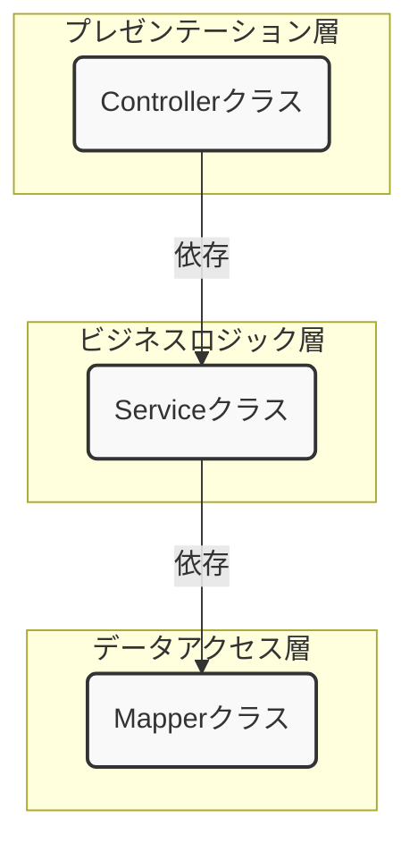
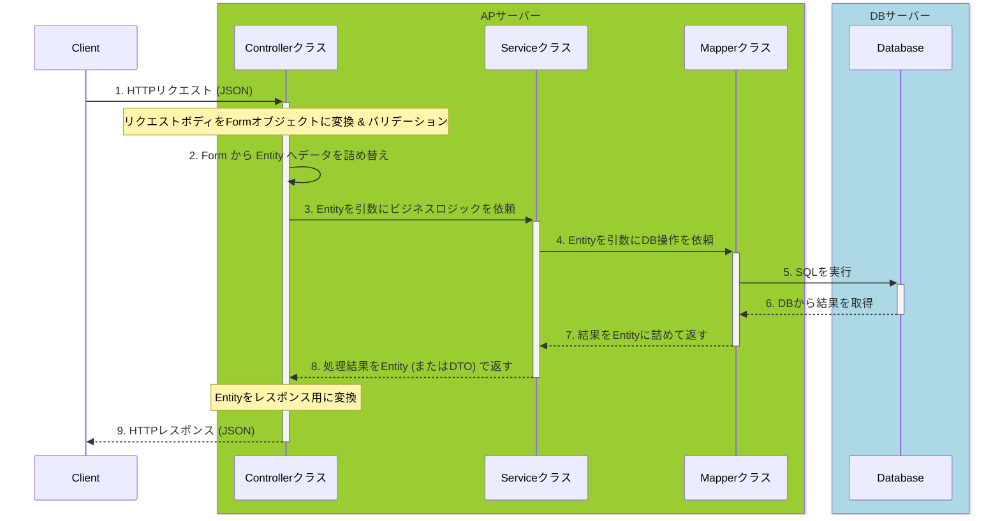

# Spring Boot Web API 開発の前提知識：なぜクラスを分割するのか？

これから実装するWeb APIが、なぜ「Controller」「Service」「Mapper」といった複数のクラスに分割されているのか、その設計思想と実装上のルールを解説するものです。これを理解することが、保守性が高く、チームで開発しやすいアプリケーションを作るための第一歩となります。

## 1. アーキテクチャ全体像：責務の分離

高品質なソフトウェアを設計する上で「**関心事の分離** (Separation of Concerns)」は非常に重要な原則です。これは「異なる役割や機能は、それぞれ別の場所にまとめて管理しましょう」という考え方です。分離することで変更に強くなります。⇒**SRP** (**単一責任の原則**)

今回のプロジェクトでは、この原則に基づき、アプリケーションを以下の3つの層（レイヤー）に分割します。⇒**レイヤードアーキテクチャ**

-   **プレゼンテーション層 (Controller)**: クライアント（ブラウザやアプリ）とのやり取りを担当
-   **ビジネスロジック層 (Service)**: アプリケーションの核となる業務処理を担当
-   **データアクセス層 (Mapper)**: データベースとのやり取りを担当（今回はmapperですが、repositoryなどの方が一般的かもしれません）

### ■ リクエストからレスポンスまでの流れ

クライアントからのリクエストが処理され、レスポンスが返されるまでの基本的な流れは以下のようになります。各クラスが自分の責任範囲の仕事だけを行い、次のクラスへ処理を委譲していきます。

## 2. 各コンポーネントの責務

### Controller
-   **役割**: HTTPリクエストを受け付けるシステムの「受付窓口」。
-   **責任**:
    -   **エンドポイントの定義**: URLとHTTPメソッド（GET, POST等）を紐付ける。
    -   **リクエストの検証**: クライアントからの入力データが正しい形式か検証（バリデーション）する。
    -   **データの変換と委譲**: 入力データを格納する`Form`から、DBと連携するための`Entity`へデータを詰め替え、Serviceを呼び出す。
    -   **レスポンスの生成**: Serviceからの処理結果を、クライアントが要求する形式（JSON等）に変換して返す。
-   **ポイント**: Controllerは「どうやってビジネス要件を実現するか」を知る必要はありません。ただ、リクエストを適切に捌き、Serviceに仕事を依頼することに専念します。

### Service
-   **役割**: アプリケーションのビジネスルールを実装する「司令塔」。
-   **責任**:
    -   **ビジネスロジックの実行**: アプリケーション固有の要件や手順を実装します。例えば、「ユーザーが重複していないか確認し、パスワードを暗号化して登録する」といった一連の処理がこれにあたります。
    -   **トランザクション管理**: 複数のデータベース更新が絡む処理を、一つのまとまりとして扱う（すべて成功 or すべて失敗）ことを保証します。
    -   **複数Mapperの統括**: 一つのビジネス要件を満たすために、複数のMapperを適切な順序で呼び出します。
-   **ポイント**: Serviceは「HTTP」や「SQL」といった技術的な詳細を知るべきではありません。純粋なビジネス上のルールに専念します。

### Mapper
-   **役割**: データベースとのやり取りを行う「データアクセス専門家」。
-   **責任**:
    -   **SQLの定義と実行**: データに対するCRUD（作成, 読み取り, 更新, 削除）操作を行うSQL文を管理します。
    -   **オブジェクトマッピング**: `Entity`オブジェクトとデータベースのレコードを相互に変換します。
-   **ポイント**: Mapperはビジネスロジックを知る必要はありません。依頼されたSQLを実行し、結果を返すことだけに専念します。

## 3. DTOの責務分離：なぜ `Form` と `Entity` を分けるのか？

`Form`も`Entity`もデータを格納する入れ物であり、広義には**DTO (Data Transfer Object)** と呼ばれます。しかし、その利用目的と責任が明確に異なるため、今回のプロジェクトでは厳密に使い分けます。

-   **Entity**: **データベースのテーブル構造を反映する**オブジェクト。データアクセス層の関心事を表現します。
-   **Form**: **クライアントからの入力を受け取る**オブジェクト。プレゼンテーション層の関心事を表現します。

### ■ 分離の必然性：「クライアントの要求」と「DBの構造」は一致しない

もし`Entity`をクライアントとのやり取りに使い回すと、クラスの責任が曖昧になり、多くの問題を引き起こします。

**例：ユーザー登録API**

| クライアントの要求（JSON）              | DBの`users`テーブル構造        | 違い         |
| :--------------------------- | :---------------------- | ---------- |
| なし                           | `id` (自動採番)             | 片方にしかない    |
| `username`                   | `name`                  | 管理してる名前が違う |
| `email`                      | `email`                 |            |
| `password`                   | `password_hash` (暗号化済み) | 状態が違う      |
| `passwordConfirm` (パスワード確認用) | なし                      | 片方にしかない    |
| `agreeTerms` (利用規約同意フラグ)     | なし                      | 片方にしかない    |
| なし                           | `created_at` (登録日時)     | 片方にしかない    |

`Form`と`Entity`を分離することで、`Entity`は純粋にデータベースの構造だけを反映し、`Form`はバリデーションルールや画面固有の項目を持つことができます。これにより、互いの仕様変更から影響を受けにくくなります。

