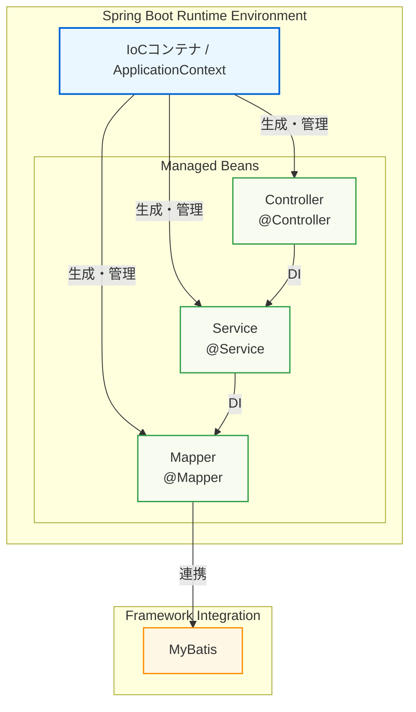
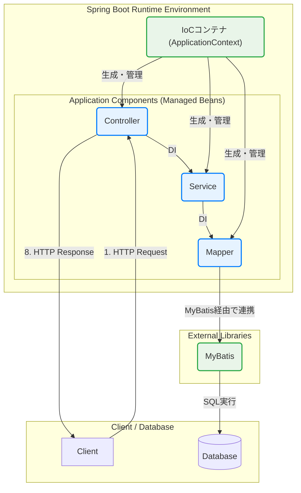
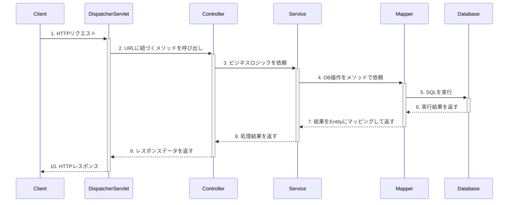
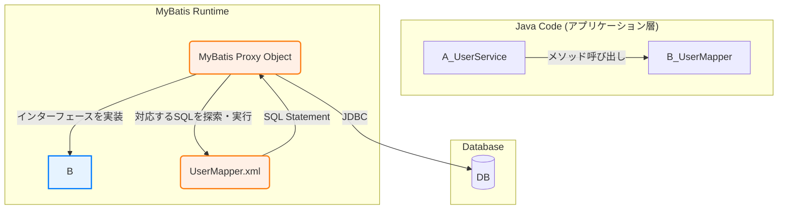
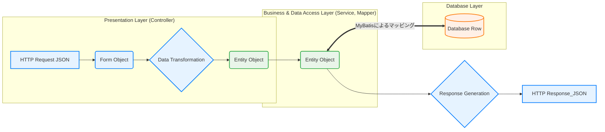

## Spring BootとMyBatisにおけるコンポーネント関係図

この資料は、Spring Bootアプリケーションの内部で、各コンポーネント（Controller, Service, Mapperなど）やフレームワークが、どのように連携して動作するのか、その技術的な関係性を示したものです。

### 1. 全体アーキテクチャと制御の流れ

アプリケーション全体の構造は、Spring Bootの**IoCコンテナ**を中心に構成されます。IoCコンテナが各コンポーネント（Bean）の生成と管理を行い、必要に応じてそれらを結合（依存性の注入）します。

-   **IoCコンテナ (Inversion of Control Container)**:
    -   アプリケーションの骨格となる中心的な存在。
    -   `@Controller`, `@Service`, `@Component`などのアノテーションが付いたクラスのインスタンス（**Bean**）を、起動時に自動で生成し、管理します。
-   **依存性の注入 (Dependency Injection - DI)**:
    -   あるコンポーネントが別のコンポーネントを必要とする場合（例：ControllerがServiceを利用する）、IoCコンテナが適切なBeanを自動的に割り当てます。開発者は`new`を使ってインスタンスを生成する必要がありません。



### 2. リクエスト処理のシーケンス図

クライアントからリクエストが送られてから、レスポンスが返されるまでの一連の流れです。各コンポーネントは、上位層から下位層へと一方向に処理を依頼します。



### 3. MyBatisの役割とMapperの動作原理

`Mapper`はJavaの`interface`（インターフェース）として定義しますが、その実装クラスを開発者が書くことはありません。MyBatisがアプリケーション起動時に、このインターフェースを実装したプロキシ（代理）オブジェクトを動的に生成し、IoCコンテナにBeanとして登録します。

-   `Mapper`インターフェースのメソッドが呼び出されると、プロキシオブジェクトがその呼び出しを検知します。
-   プロキシは、メソッド名に対応するSQL文をXMLファイルから探し出し、引数をSQLのパラメータに設定して実行します。



### 4. データオブジェクトの変換フロー

各層で扱われるデータオブジェクト（DTO）は、その層の責務に応じて定義されます。層をまたぐ際には、責務に応じたオブジェクトへの変換が行われます。

-   **Form**: プレゼンテーション層の責務。クライアントからの入力形式とバリデーションルールを定義します。
-   **Entity**: データアクセス層の責務。データベースのテーブル構造を忠実に反映します。




```mermaid
graph TD
    subgraph クライアント
        A[ブラウザ/モバイルアプリ]
    end

    subgraph "Spring Bootアプリケーション"
        subgraph "フレームワークが提供"
            B[組み込みTomcat]
            C{DispatcherServlet}
            G[MyBatisエンジン]
            H[Mapper XML]
        end

        subgraph "開発者が実装するプログラム"
            D[Controllerクラス<br>@RestController]
            E[Serviceクラス<br>@Service]
            F[Mapperインターフェース<br>@Mapper]
        end
        
        %% リクエストフロー
        B --> C;
        C -- URLに応じて振り分け --> D;
        D -- ビジネスロジックを依頼 --> E;
        E -- DB操作を依頼 --> F;
        F -- 連携 --> G;
        H -- SQL定義を読み込み --> G;
        G -- SQLを実行 --> I[(データベース)];
        
        %% レスポンスフロー
        I -- 実行結果 --> G;
        G -- 結果をオブジェクトにマッピング --> F;
        F -- 結果を返す --> E;
        E -- 結果を返す --> D;
        D -- 結果(Javaオブジェクト)を返す --> C;
        C -- HTTPレスポンス<br>(JSON等に変換) --> A;
    end
    
    subgraph データベース
        I
    end

    A -- HTTPリクエスト --> B;

    style D fill:#cde4ff
    style E fill:#cde4ff
    style F fill:#cde4ff
```