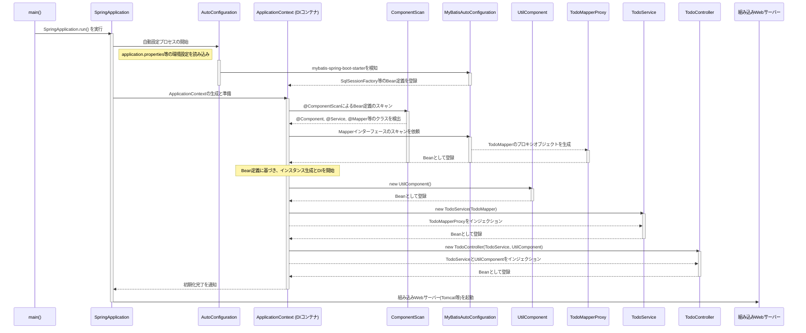
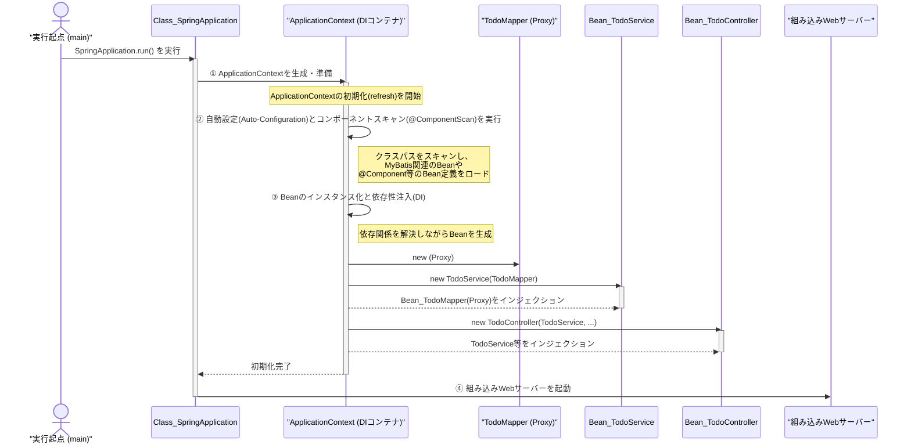

ご提示いただいたSpring Bootの起動シーケンス図、DIコンテナ（アプリケーションコンテキスト）の役割に焦点が当てられており、非常によくまとまっていると思います。MyBatisのMapperプロキシが生成され、ServiceやControllerにインジェクションされていく流れは、その通りです。

その上で、Spring Bootの起動プロセスをより深く理解するために、いくつか抑えておくべき重要な処理と、既存の図をより正確にするための修正点を追記したものを以下に提案します。

### 修正・追記のポイント

1.  **起動の起点 `SpringApplication.run()`**: すべてのプロセスは、mainメソッド内の `SpringApplication.run()` から始まります。この中でコンテキストの準備やBeanの生成などが行われます。
2.  **自動設定 (Auto-Configuration)**: Spring Bootの心臓部とも言える機能です。クラスパス上にあるライブラリ（例えば `mybatis-spring-boot-starter`）を検知し、関連するBean（`SqlSessionFactory`など）を自動的に設定・生成してDIコンテナに登録します。図にこの概念を追加することで、なぜ手動設定が少なく済むのかが明確になります。
3.  **DIコンテナの名称**: 一般的に「DIコンテナ」と呼ばれますが、Springでは具体的に `ApplicationContext` と呼ばれるオブジェクトがその役割を担います。図でもこの名称を使うと、よりSpringの世界観に沿った表現になります。

これらの点を踏まえて、既存の図を拡張したものが以下になります。

### 【修正・追記版】Spring Boot 起動シーケンス図



### 各ステップの解説

1.  **`SpringApplication.run()` の実行**: アプリケーションのエントリーポイントであるmainメソッドから `SpringApplication.run()` が呼び出され、全体の起動プロセスが始まります。

2.  **自動設定 (Auto-Configuration)**: Spring Bootは、クラスパスに含まれるライブラリを基に、必要となるであろう設定を自動で行います。
    *   `mybatis-spring-boot-starter` が存在するため、`MyBatisAutoConfiguration` が有効になります。
    *   この自動設定クラスが、データベース接続に必要な `DataSource` や、MyBatisの中核である `SqlSessionFactory` といったBeanを `ApplicationContext` に登録する準備をします。

3.  **ApplicationContextの準備とスキャン**:
    *   DIコンテナの実体である `ApplicationContext` が作成されます。
    *   `@ComponentScan` が実行され、`@Component`, `@Service`, `@RestController`, `@Mapper` などのアノテーションが付与されたクラスがスキャンされ、Bean定義として `ApplicationContext` に登録されます。

4.  **Mapperプロキシの生成**:
    *   `@Mapper` アノテーションが付いた `TodoMapper` インターフェースが検出されると、MyBatisの機能によって、このインターフェースを実装したプロキシ（代理）オブジェクトが動的に生成されます。
    *   このプロキシオブジェクトが、実際にSQLを実行する役割を担い、Beanとして `ApplicationContext` に登録されます。これにより、他のBeanから `TodoMapper` をインジェクションできるようになります。

5.  **Beanのインスタンス化と依存性注入(DI)**:
    *   `ApplicationContext` は、登録された全てのBean定義を基に、依存関係を解決しながらインスタンスを生成していきます。
    *   例えば `TodoService` のインスタンスが作られる際には、コンストラクタやフィールドで要求されている `TodoMapper` (実際にはそのプロキシ)が `ApplicationContext` から取得され、インジェクション（注入）されます。
    *   同様に `TodoController` には `TodoService` や `UtilComponent` がインジェクションされます。

6.  **組み込みWebサーバーの起動**:
    *   `ApplicationContext` の初期化がすべて完了し、アプリケーションの準備が整うと、最後に組み込みのWebサーバー（デフォルトではTomcat）が起動します。
    *   サーバーが起動して初めて、外部からのHTTPリクエストを受け付けられる状態になります。

この流れを理解することで、なぜ少ない設定でデータベースアクセスやWebアプリケーションが機能するのか、その裏側の仕組みをより深く把握できるかと思います。

---

各 participant が何者であるかを明確にするために、UMLのステレオタイプ（`<< >>`で囲む表記）を使って役割を明示し、凡例（説明）を追加する形で修正しました。これにより、図の可読性が格段に向上するはずです。

### 【改善版】Spring Boot 起動シーケンス図（役割明示）

```mermaid
sequenceDiagram
    actor User as "実行起点 (main)"
    participant "<<Class>> SpringApplication"
    participant "<<Process>> AutoConfiguration"
    participant "<<Interface>> ApplicationContext" as "ApplicationContext (DIコンテナ)"
    participant "<<Process>> ComponentScan"
    participant "<<Class>> MyBatisAutoConfiguration"
    participant "<<Bean>> UtilComponent"
    participant "<<Proxy Bean>> TodoMapperProxy"
    participant "<<Bean>> TodoService"
    participant "<<Bean>> TodoController"
    participant "<<Component>> EmbeddedWebServer" as "組み込みWebサーバー"

    User->>SpringApplication: SpringApplication.run() を実行

    activate SpringApplication
    SpringApplication->>AutoConfiguration: 自動設定プロセスを開始
    note right of SpringApplication: application.properties等の環境設定を読み込み

    activate AutoConfiguration
    AutoConfiguration->>MyBatisAutoConfiguration: mybatis-spring-boot-starterを検知
    activate MyBatisAutoConfiguration
    MyBatisAutoConfiguration-->>ApplicationContext: SqlSessionFactory等のBean定義を登録
    deactivate MyBatisAutoConfiguration
    deactivate AutoConfiguration

    SpringApplication->>ApplicationContext: ApplicationContextの生成と準備

    activate ApplicationContext
    ApplicationContext->>ComponentScan: @ComponentScanによるBean定義のスキャン
    activate ComponentScan
    ComponentScan-->>ApplicationContext: @Component, @Service, @Mapper等のクラスを検出

    ApplicationContext->>MyBatisAutoConfiguration: Mapperインターフェースのスキャンを依頼
    activate MyBatisAutoConfiguration
    MyBatisAutoConfiguration-->>TodoMapperProxy: TodoMapperのプロキシオブジェクトを生成
    activate TodoMapperProxy
    TodoMapperProxy-->>ApplicationContext: Beanとして登録
    deactivate TodoMapperProxy
    deactivate MyBatisAutoConfiguration
    deactivate ComponentScan

    note over ApplicationContext: Bean定義に基づき、インスタンス生成とDIを開始

    ApplicationContext->>UtilComponent: new UtilComponent()
    activate UtilComponent
    UtilComponent-->>ApplicationContext: Beanとして登録
    deactivate UtilComponent

    ApplicationContext->>TodoService: new TodoService(TodoMapper)
    activate TodoService
    ApplicationContext-->>TodoService: TodoMapperProxyをインジェクション
    TodoService-->>ApplicationContext: Beanとして登録
    deactivate TodoService

    ApplicationContext->>TodoController: new TodoController(TodoService, UtilComponent)
    activate TodoController
    ApplicationContext-->>TodoController: TodoServiceとUtilComponentをインジェクション
    TodoController-->>ApplicationContext: Beanとして登録
    deactivate TodoController

    ApplicationContext-->>SpringApplication: 初期化完了を通知
    deactivate ApplicationContext

    SpringApplication->>EmbeddedWebServer: 組み込みWebサーバー(Tomcat等)を起動
    deactivate SpringApplication
```

### 凡例：登場要素の解説

図に登場する各要素が何を表しているのかを以下に示します。

| Participant (登場要素)                       | 説明                                                                                      |
| :--------------------------------------- | :-------------------------------------------------------------------------------------- |
| **実行起点 (main)**                          | `main`メソッドを実行するユーザーや開発者を表す**アクタ**。ここから全てが始まります。                                         |
| **`<<Class>> SpringApplication`**        | Spring Bootアプリケーションを起動するための主要な**クラス**です。`run()`メソッドが全体の処理を制御します。                        |
| **`<<Process>> AutoConfiguration`**      | Spring Bootの自動設定という**プロセス（仕組み）**を表します。特定のクラスではなく、一連の動作の概念です。                            |
| **`<<Interface>> ApplicationContext`**   | DIコンテナの本体です。Springにおいては `ApplicationContext` という**インターフェース**で表現されます。Beanのライフサイクルを管理します。 |
| **`<<Process>> ComponentScan`**          | `@Component`などのアノテーションがついたクラスを探し出し、Bean定義としてDIコンテナに登録する**プロセス（仕組み）**です。                 |
| **`<<Class>> MyBatisAutoConfiguration`** | `mybatis-spring-boot-starter`ライブラリに含まれる、MyBatisの自動設定を行う具体的な**クラス**です。                   |
| **`<<Bean>> UtilComponent` など**          | DIコンテナによって生成・管理されている**インスタンス（オブジェクト）**です。これらはシングルトンとして扱われることが多いです。                      |
| **`<<Proxy Bean>> TodoMapperProxy`**     | MyBatisが `TodoMapper` インターフェースを実装するために動的に生成した**プロキシオブジェクト**です。これもDIコンテナで管理されるBeanの一種です。 |
| **`<<Component>> EmbeddedWebServer`**    | TomcatやJettyといった、アプリケーションに組み込まれたWebサーバーの**コンポーネント（構成要素）**です。                            |

このように役割を明記することで、「`AutoConfiguration` は特定のクラスというより仕組みのことなんだな」「`TodoService` はDIコンテナに管理されているインスタンスなんだな」といった区別がつきやすくなり、全体の流れがより直感的に理解できるようになったかと思います。

---

### 結論：UMLの厳密なルールと実用的な表現

結論から申し上げますと、**「プロセス」や「概念」をシーケンス図のparticipant（ライフライン）として描くのは、UMLの厳密な定義からは少し外れます。しかし、複雑なソフトウェアの振る舞いを分かりやすく伝えるための、実用的な表現テクニックとして非常によく使われます。**

*   **UMLの厳密なルール**: シーケンス図のライフラインは、本来、特定の**オブジェクト（インスタンス）**や、相互作用における**役割（ロール）**を表すものです。静的メソッドの呼び出しなどを表現するためにクラスそのものを描くこともあります。

*   **今回の図の意図**: `AutoConfiguration` や `ComponentScan` は、単一のクラスやオブジェクトの働きというより、多数の内部コンポーネントが連携して実現される**一連の「仕組み」や「プロセス」**です。これを無理に一つのクラスで表現しようとすると、かえって実態から離れてしまいます。そこで、あえてこれらの「仕組み」を擬人化してparticipantとして描くことで、**内部の複雑な実装を隠蔽し、全体としてどのような役割がどの順序で実行されるのかを直感的に理解できるようになる**というメリットがあります。

ソフトウェアの設計ドキュメントでは、このように厳密なUMLのルールを少し拡張・応用して、コミュニケーションの円滑化を優先することがよくあります。

### よりUMLのルールに準拠した表現

もし、より厳密なUMLのルールに則って表現したい場合は、以下のようなアプローチが考えられます。このアプローチでは、**プロセスを中心的なオブジェクトの「責務（処理）」として表現します。**

この場合、Spring Boot起動の中心的役割を担うのは `SpringApplication` と、それが生成する `ApplicationContext` です。したがって、この2つを主要なparticipantとし、他の処理はそれらの内部的な振る舞いとして描きます。

以下に、その考え方で修正したシーケンス図を提案します。

### 【UML準拠度を高めた版】Spring Boot 起動シーケンス図

こちらの図では、「プロセス」を独立したparticipantとして描く代わりに、`ApplicationContext` が自身の初期化処理の中でそれらを実行する、という流れを自己メッセージ（自分自身への矢印）とノートで表現しています。



### どちらの表現が良いか？

*   **最初の図（プロセスをparticipantにする）**
    *   **メリット**: 各「役割」が独立して見えるため、**処理の大きなフェーズ**が直感的に分かりやすい。Spring Bootの内部構造に詳しくなくても、何が起きているか概要を掴みやすい。
    *   **デメリット**: UMLの厳密な定義とは少し異なる。

*   **こちらの図（中心オブジェクトの責務として描く）**
    *   **メリット**: **「誰が」**その処理を実行するのかという主体が明確になり、UMLのルールに準拠している。
    *   **デメリット**: 多くの処理が `ApplicationContext` の自己完結した処理として描かれるため、処理の大きな区切りが少し見えにくくなる可能性がある。

**結論として、どちらの図も一長一短があります。**
ドキュメントを読む相手や、伝えたい情報の粒度に応じて使い分けるのが良いでしょう。

*   **初心者向けの説明や、全体像のハイレベルな共有**が目的なら、最初の「プロセスを擬人化した図」が非常に有効です。
*   **より詳細な設計の議論や、UMLに詳しいメンバーとの共通認識**を作りたい場合は、後者の「UML準拠度を高めた図」の方が適していると言えます。


---

### コンテナの名称について

実際にServiceなどのインスタンス（Bean）が格納され、管理されているコンテナを指す最も一般的で正確な用語は **`ApplicationContext` (アプリケーションコンテキスト)** です。

*   **DIコンテナ**: これは「Dependency Injection（依存性注入）を行うコンテナ」という**役割や機能**を指す一般的な言葉です。
*   **IoCコンテナ**: 「Inversion of Control（制御の反転）を実現するコンテナ」という、より広い**設計思想**を指す言葉です。DIはIoCを実現する具体的な手法の一つです。
*   **`ApplicationContext`**: Spring Frameworkにおける、DIコンテナ/IoCコンテナの**具体的な実装（インターフェース）名**です。

会話の中では「DIコンテナ」でも十分に意味は通じますが、Springの文脈で正確に指し示す場合は **`ApplicationContext`** と呼ぶのがベストです。

---

### `ApplicationContext` の内部構造のイメージ

> mapみたいなオブジェクトと思ってますが、。

ご認識の通り、**「Mapのようなオブジェクト」というイメージは、理解の第一歩として非常に的確です。** 中核的な機能は、名前（ID）をキーにして、インスタンス（Bean）を管理する点にあります。

しかし、`ApplicationContext` は単なる `Map<String, Object>` よりもはるかに高機能です。これを「**超高機能なMap**」または「**インテリジェントな部品管理庫**」と考えると、イメージがより鮮明になります。

#### Step 1: 基本的なMapとしての構造

まず、基本はKey-Valueストアです。

*   **Key**: **Bean名** (Bean ID) という文字列。
    *   `@Service` のように明示的に名前を指定しなければ、通常はクラス名をキャメルケースにしたもの（例: `TodoService` → `todoService`）がキーになります。
*   **Value**: **Beanインスタンス** (シングルトンBeanのインスタンス)
    *   実際に `new` されて生成されたオブジェクトそのものです。

**もし手動で同じことをするなら... (単純なMapのイメージ)**
```java
// ApplicationContextの内部をすごく単純化したイメージ
Map<String, Object> beanStorage = new HashMap<>();

// 起動時にBeanを生成して登録していく
TodoMapper mapperProxy = ...; // MyBatisが生成
UtilComponent util = new UtilComponent();
TodoService todoService = new TodoService(mapperProxy); // ★手動で依存性を注入
TodoController todoController = new TodoController(todoService, util); // ★手動で依存性を注入

beanStorage.put("todoMapper", mapperProxy);
beanStorage.put("utilComponent", util);
beanStorage.put("todoService", todoService);
beanStorage.put("todoController", todoController);

// どこかでBeanを使いたいとき
TodoController controller = (TodoController) beanStorage.get("todoController");
controller.someMethod();
```

#### Step 2: 「超高機能なMap」にする追加機能

ここからが `ApplicationContext` の真骨頂です。単純なMapとの違いは以下の点にあります。

1.  **インスタンスの自動生成**:
    *   単純なMapは、外から `put` されないと何も持てません。
    *   `ApplicationContext` は、`@Component` や `@Service` などのアノテーションをスキャンし、**自ら `new` してインスタンスを生成し、Mapに登録します。**

2.  **依存関係の自動解決と注入 (DI)**:
    *   これが最も重要な機能です。`TodoService` を生成する際、コンストラクタが `TodoMapper` を必要としていることを検知します。
    *   すると `ApplicationContext` は、**自身のMapの中から `todoMapper` というキーでBeanを探し出し、それを `TodoService` のコンストラクタに渡してインスタンスを生成します。**
    *   私たちは `new TodoService(mapper)` のように手動で依存オブジェクトを渡す必要が一切ありません。

3.  **ライフサイクル管理**:
    *   Beanの生成から破棄まで、その一生を管理します。
    *   例えば、`@PostConstruct` アノテーションが付いたメソッドがあれば、インスタンス生成とDIが終わった直後にそのメソッドを呼び出して初期化処理を行ってくれます。

4.  **スコープの管理**:
    *   デフォルト（シングルトン）では、`get("todoService")` を何回呼び出しても、必ず**最初の一回だけ生成された同じインスタンス**を返します。
    *   設定によっては、`get` するたびに新しいインスタンスを生成する（プロトタイプ）ことも可能です。

### まとめ：全体像の比喩

`ApplicationContext` を **「優秀な執事が管理する、全自動の部品倉庫」** に例えることができます。

1.  **部品リストの読み込み (スキャン)**
    *   執事（`ApplicationContext`）は、まずアプリケーション全体の設計図（`@Component` 等のアノテーション）をすべて読み込み、「どの部品が必要か」をリストアップします。

2.  **部品の組み立てと保管 (インスタンス生成とDI)**
    *   執事はリストに基づき、部品（Bean）を一つずつ組み立て（`new`）ます。
    *   「コントローラーにはサービスが必要」「サービスにはマッパーが必要」といった依存関係を理解しているので、**必要な部品を正しく組み合わせて（DI）**完成品にし、倉庫（内部のMap）に保管します。

3.  **部品の提供 (インジェクション)**
    *   他の部品が「サービス部品をください (`@Autowired`)」と要求すると、執事は倉庫から完成済みのサービス部品を取り出して渡してくれます。

この「執事」がすべて自動でやってくれるおかげで、開発者は「どの部品が必要か」を宣言するだけでよく、部品の生成順序や組み合わせといった面倒な管理から解放されるのです。