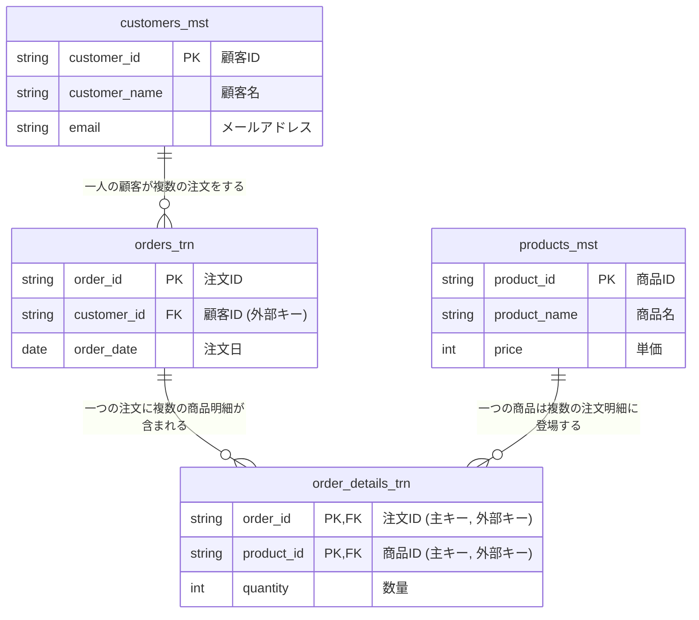

---
tags:
  - SQL/補足
---
# データベース設計入門：なぜテーブルを分けて管理するのか？

## 1. はじめに：なぜデータの「整理整頓」が必要？

皆さんが業務でデータを扱う際、例えばExcelで顧客リストや売上記録を管理する場面を想像してみてください。
もし、すべてを一つの巨大なシートにまとめて入力していたら、どうなるでしょうか？

- 同じお客様の情報を、注文のたびに何度も入力する
- 情報の修正箇所を探すのが大変
- 表がどんどん横に長くなり、何がどこにあるか分かりにくい

このような問題は、データベースの世界でも同様に起こり得ます。
データベース設計における「テーブルを分ける」という作業は、こうした問題を未然に防ぎ、データを効率的かつ安全に管理するための「情報の整理整頓術」なのです。

## 2. もし、すべての情報を「一つの巨大なテーブル」で管理したら？

ここでは例として、お店の販売記録をすべて一つのテーブルで管理するケースを考えてみましょう。

**【例】ごちゃまぜの「販売記録」テーブル**

| 注文ID | 注文日        | **顧客ID** | **顧客名** | **メールアドレス**        | **商品ID** | **商品名** | **単価** | 数量  |
| :--- | :--------- | :------- | :------ | :----------------- | :------- | :------ | :----- | :-- |
| O001 | 2023-01-15 | C001     | 山田太郎    | yamada@example.com | P001     | テレビ     | 50000  | 1   |
| O001 | 2023-01-15 | C001     | 山田太郎    | yamada@example.com | P002     | マグカップ   | 1000   | 2   |
| O002 | 2023-01-16 | C002     | 佐藤花子    | sato@example.com   | P001     | テレビ     | 50000  | 1   |
| O003 | 2023-01-17 | C001     | 山田太郎    | yamada@example.com | P003     | SQL入門   | 3000   | 1   |

ぱっと見は分かりやすいですが、この管理方法にはいくつかの重大な問題が潜んでいます。

### 問題点①：情報の「ムダ」が多い（データの冗長性）

上の表を見ると、山田太郎さんの名前やメールアドレスが、注文のたびに何度も記録されています。これはデータの**ムダ**（**冗長性**）です。データ量が増えるだけでなく、入力ミスの原因にもなります。

### 問題点②：情報の「更新」が大変で、間違いやすい

もし、山田太郎さんがメールアドレスを変更したらどうなるでしょう？
山田さんの過去の注文記録をすべて探し出し、一つひとつ修正しなければなりません。一行でも修正を忘れると、古い情報と新しい情報が混在してしまい、**データの不整合**が発生します。

### 問題点③：消したくない情報まで「削除」してしまう危険性

仮に、佐藤花子さんの注文（注文ID: O002）がキャンセルになったとします。
この行を削除すると、**「佐藤花子さん」という顧客情報そのものも一緒に消えてしまいます**。まだ他に注文がなければ、大切なお客様の情報を失ってしまうことになるのです。

## 3. 解決策：情報の種類ごとに「専用テーブル」に整理しよう！

これらの問題を解決するのが、**テーブルの分割**（**正規化**）です。
関係のある情報ごとにテーブルを分け、それぞれをIDで関連付けます。

先ほどの「ごちゃまぜテーブル」を、以下の4つの専用テーブルに整理整頓してみましょう。

**① 顧客テーブル (customers_mst)**
**顧客に関する情報だけ**をまとめます。

| 顧客ID     | 顧客名  | メールアドレス            |
| :------- | :--- | :----------------- |
| **C001** | 山田太郎 | yamada@example.com |
| **C002** | 佐藤花子 | sato@example.com   |

**② 商品テーブル (products_mst)**
**商品に関する情報だけ**をまとめます。

| 商品ID | 商品名 | 単価 |
| :--- | :--- | :--- |
| **P001** | テレビ | 50000 |
| **P002** | マグカップ | 1000 |
| **P003** | SQL入門 | 3000 |

**③ 注文テーブル (orders_trn)**
**「いつ」　「誰が」注文したか**という情報だけをまとめます。

| 注文ID | 注文日 | 顧客ID |
| :--- | :--- | :--- |
| **O001** | 2023-01-15 | **C001** |
| **O002** | 2023-01-16 | **C002** |
| **O003** | 2023-01-17 | **C001** |

**④ 注文明細テーブル (order_details_trn)**
**「どの注文で」　「どの商品を」　「いくつ」買ったか**という情報だけをまとめます。

| 注文ID | 商品ID | 数量 |
| :--- | :--- | :- |
| **O001** | **P001** | 1 |
| **O001** | **P002** | 2 |
| **O002** | **P001** | 1 |
| **O003** | **P003** | 1 |

このように、それぞれのテーブルが特定の役割を持つことで、データが非常にスッキリしました。
各テーブルは「顧客ID」　「商品ID」　「注文ID」といったキーを使って、互いに連携します。

## 4. テーブルを分けることの大きなメリット

テーブルを分割することで、先ほどの問題はすべて解決します。

##### メリット①：データのムダがなくなり、スッキリ！

顧客や商品の情報は、それぞれの専用テーブルに**一度だけ**登録すればOKです。同じ情報を何度も入力する必要はなくなります。

##### メリット②：情報の更新が「１回」で済み、安全・確実！

山田太郎さんがメールアドレスを変更した場合、**「顧客テーブル」の1行を更新するだけ**で完了です。これにより、更新漏れがなくなり、データの正確性（整合性）が保たれます。

##### メリット③：データの追加や削除が安全に！

佐藤花子さんの注文（注文ID: O002）がキャンセルになった場合、「注文テーブル」と「注文明細テーブル」から該当の行を削除するだけです。「顧客テーブル」にある佐藤さんの情報はそのまま残るため、顧客情報を失う心配がありません。

## 5. ここまでのまとめ（正規化）

テーブルの分割（正規化）は、一見するとテーブル数が増えて複雑に感じるかもしれません。
しかし、長期的な視点で見れば、以下のような非常に重要なメリットをもたらします。

- **データの整合性**：データが矛盾なく、常に正しい状態に保たれる。
- **保守性の向上**：データの追加・更新・削除が簡単かつ安全に行える。
- **拡張性の確保**：将来、新しい情報（例：顧客の住所など）を追加したくなった場合も、対応するテーブルに列を追加するだけで柔軟に対応できる。


## 6. テーブル同士の「つながり」をルールで守る（外部キー制約）

テーブルを分割しただけでは、まだ完璧ではありません。
例えば、「注文テーブル」に、まだ登録されていない「顧客ID: C999」の注文を誤って入力できてしまったらどうでしょう？ 誰の注文か分からなくなり、データの信頼性が揺らいでしまいます。

そこで、テーブル同士のつながりに**明確なルール**を設ける必要があります。
これが**制約**、特に**外部キー制約**と呼ばれるものです。

**外部キー制約とは？**
「このテーブルのこの列には、**必ずあちらのテーブルに存在する値しか入れてはいけません**」という、テーブル間の「親子関係」を定義するルールです。

**【例】テーブル間のつながりとルール**

下の図のように、子テーブルのIDは、必ず親テーブルに存在するIDを参照するように設定します。



- **注文テーブル (子) の `顧客ID`** は、必ず **顧客テーブル (親) の `顧客ID`** に存在する値でなければならない。
- **注文明細テーブル (子) の `注文ID`** は、必ず **注文テーブル (親) の `注文ID`** に存在する値でなければならない。
- **注文明細テーブル (子) の `商品ID`** は、必ず **商品テーブル (親) の `商品ID`** に存在する値でなければならない。

このルールを設定することで、データベースシステムがデータの番人となり、**存在しない顧客からの注文**や、**存在しない商品を含む注文**といった、あり得ないデータの登録を自動的に防いでくれます。これにより、データの整合性が強力に保たれるのです。

## 7. 整理されたテーブルから情報を取り出すには？（JOIN句）

さて、データはきれいに整理されました。
しかし、実際に私たちが見たいのは、「山田太郎さんが、2023年1月15日に、テレビを1つとマグカップを2つ買った」といった、**関係する情報が一つにまとまった一覧**ですよね。

バラバラに保管された情報を、必要な形に組み合わせて取り出す。そのための構文が、SQLの`JOIN`（**結合**）です。

`JOIN`は、テーブル同士の共通のID（キー）を使って、複数のテーブルを一時的に横につなぎ合わせる機能です。

**【SQL実行イメージ】**

例えば、「注文ID: O001」の詳細情報を取得したい場合、SQLは以下のように動作します。

```sql
SELECT
    o.order_date,       -- 注文テーブルから「注文日」
    c.customer_name,    -- 顧客テーブルから「顧客名」
    p.product_name,     -- 商品テーブルから「商品名」
    od.quantity         -- 注文明細テーブルから「数量」
FROM
    orders_trn AS o
JOIN
    customers_mst AS c ON o.customer_id = c.customer_id
JOIN
    order_details_trn AS od ON o.order_id = od.order_id
JOIN
    products_mst AS p ON od.product_id = p.product_id
WHERE
    o.order_id = 'O001';
```

1.  まず**注文トラン**(orders_trn)テーブルを見に行く。
2.  `顧客ID`をキーに、**顧客マスタ**(customers_mst)テーブルを結合し、顧客名を取得する。
3.  `注文ID`をキーに、**注文明細トラン**(order_details_trn)テーブルを結合する。
4.  `商品ID`をキーに、**商品マスタ**(products_mst)テーブルを結合し、商品名を取得する。

**【実行結果】**
このSQLを実行すると、まるで最初の一枚岩テーブルのように、必要な情報が組み合わさった結果が返ってきます。

| 注文日 | 顧客名 | 商品名 | 数量 |
| :--- | :--- | :--- | :- |
| 2023-01-15 | 山田太郎 | テレビ | 1 |
| 2023-01-15 | 山田太郎 | マグカップ | 2 |

このように、データは整理整頓して保管しつつ、見たいときには`JOIN`を使って自由な形で取り出す。これが、RDBMSのデータの保存と使い方になります。


## 8. まとめ

- **なぜテーブルを分けるのか？**
    - データの**ムダをなくし（冗長性の排除）**、**更新時のミスを防ぎ（整合性の維持）**、**安全にデータを管理する**ため。

- **テーブルのつながりはどう守る？**
    - **外部キー制約**というルールを設けることで、不正なデータが登録されるのを防ぎ、データの信頼性を保証する。

- **分けたテーブルはどうやって使う？**
    - **`JOIN`句**を使い、必要なテーブル同士をIDでつなぎ合わせることで、柔軟に情報を取り出すことができる。

テーブルの「**分割**（**正規化**）」、関係性を守る「**制約**」、そしてデータを自在に取り出す「**結合**（`JOIN`）」。この3つは、堅牢で効率的なシステムを構築するための根幹となる考え方です。

一見、遠回りに見えるかもしれませんが、この「急がば回れ」の設計こそが、将来のシステムの保守性や拡張性を大きく向上させます。