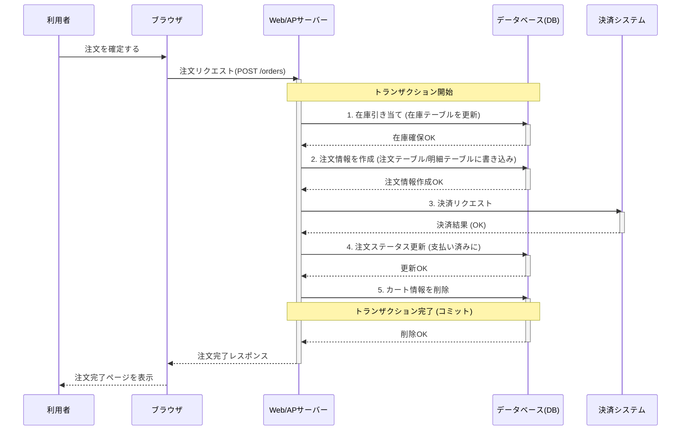
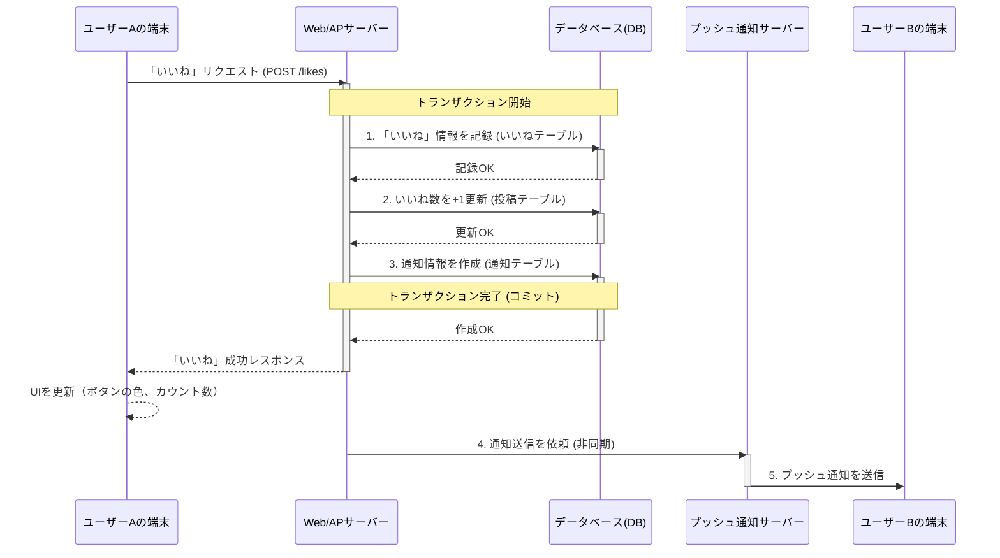
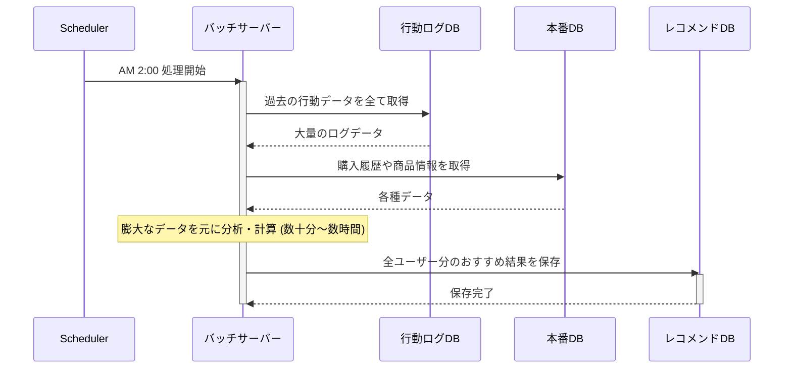
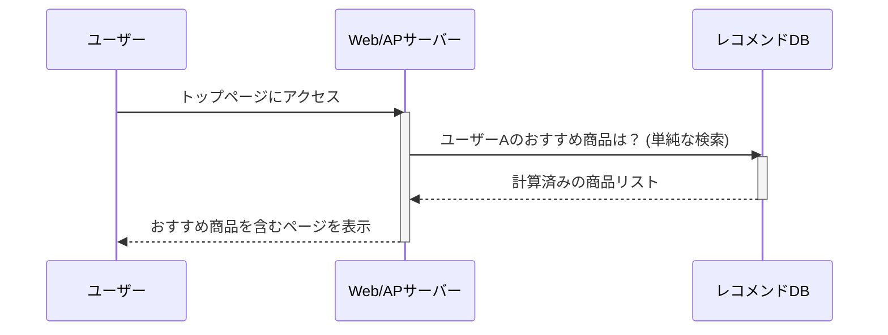

### ECサイトにおける「商品注文」の具体的な処理の流れ

ここでは、利用者が商品を注文する際の裏側（バックエンド）の動きに焦点を当てます。

**【登場人物とシステム】**
*   **利用者**: 商品を購入するお客様。
*   **ブラウザ**: 利用者が操作するPCやスマートフォンの画面。
*   **Web/APサーバー**: Webサイトのプログラムが動いているコンピュータ。利用者からの要求に応じて様々な処理を実行します。
*   **データベース(DB)**: 商品、顧客、在庫、注文などの情報をすべて保管している場所。

**【データベース内の主なテーブル】**
この処理では、主に以下のテーブル（情報の表）が関連します。
*   `商品テーブル`: 商品名、価格、商品説明など
*   `在庫テーブル`: 商品ごとの在庫数
*   `カートテーブル`: 誰がどの商品をカートに入れているかの一時的な情報
*   `顧客テーブル`: 会員情報（氏名、住所、メールアドレスなど）
*   `注文テーブル`: 注文全体の情報（注文番号、注文日時、顧客ID、合計金額など）
*   `注文明細テーブル`: どの注文でどの商品が何個売れたかの詳細情報

#### ■ 処理フローのステップ解説

**ステップ1：商品をカートに入れる**
1.  **利用者**: 商品詳細ページで「カートに入れる」ボタンをクリックします。
2.  **ブラウザ**: 「商品ID: A001を1個カートに追加せよ」というリクエストをサーバーに送信します。
3.  **Web/APサーバー**: リクエストを受け取ります。
4.  **Web/APサーバー → DB**:
    *   **【読み取り】**: `商品テーブル`から商品A001の価格や情報を取得します。
    *   **【読み取り】**: `在庫テーブル`を参照し、商品A001の在庫が1個以上あるか確認します。
    *   **【書き込み】**: 在庫があれば、`カートテーブル`に「（この利用者）が商品A001を1個」という情報を記録します。
5.  **Web/APサーバー**: 処理が成功したことをブラウザに返します。
6.  **ブラウザ**: 「カートに商品を追加しました」と表示し、画面右上のカートアイコンの数字を更新します。

**ステップ2：注文を確定する**
1.  **利用者**: カート画面で送付先や支払い方法を選び、「注文を確定する」ボタンをクリックします。
2.  **ブラウザ**: カート内の商品情報、顧客情報、配送先情報などをまとめてサーバーに送信します。
3.  **Web/APサーバー**: 注文確定処理を開始します。ここからはデータの不整合が起きないよう、非常に重要な**トランザクション処理**が開始されます。
    > **※トランザクション処理とは？**
    > 在庫を減らして、注文履歴を作り、カートを空にする、といった一連の処理を「全部成功」か「全部失敗（元に戻す）」のどちらかにする仕組み。これにより「在庫は減ったのに注文履歴がない」といった矛盾を防ぎます。

4.  **Web/APサーバー → DB (トランザクション開始)**:
    *   **【ロックと更新】 (在庫引き当て)**: `在庫テーブル`にある商品の在庫数を、注文された個数分だけ減らします。この時、他の人が同時に同じ商品を買おうとしても問題が起きないよう、一時的にその商品の在庫データをロック（他から変更できないように）します。
    *   **【書き込み】**: `注文テーブル`に、今回の注文情報（誰が、いつ、合計いくらで注文したか）を新しく記録します。ここで「注文番号: 20251105-001」などが自動で採番されます。
    *   **【書き込み】**: `注文明細テーブル`に、注文番号と紐づけて「どの商品を」「何個」「いくらで」注文したかの詳細を記録します。カートに3つの商品があれば、3行分のデータが記録されます。
5.  **Web/APサーバー**: 決済代行システムと通信し、クレジットカード決済などの処理を実行します。
6.  **Web/APサーバー → DB**: 決済が成功したら、以下の処理を行います。
    *   **【書き込み】**: `注文テーブル`のステータスを「支払い済み」に更新します。
    *   **【削除】**: `カートテーブル`から、今回注文が完了した商品の情報を削除します（カートを空にする）。
    *   **(トランザクション完了)**: ここまでの処理がすべて無事に成功したため、データベースに**変更を確定（コミット）**させます。もし途中で何かエラーが起きた場合は、すべての変更を取り消し（ロールバック）、注文前の状態に戻します。
7.  **Web/APサーバー**: 利用者と店舗運営者それぞれに注文完了メールを送信します。
8.  **Web/APサーバー**: 処理がすべて成功したことをブラウザに返します。
9.  **ブラウザ**: 「ご注文ありがとうございました」という完了ページを表示します。

#### ■ 処理の流れ（シーケンス図）

上記の「注文確定」の複雑なやり取りを、シーケンス図で表すと以下のようになります。

![[よくあるECサイトの注文確定処理図.png]]

このように、ECサイトの注文処理一つをとっても、サーバーはデータベースに対して何度も情報の照会・書き込み・更新・削除を行い、データの整合性を保ちながら処理を進めています。データベースは、ECサイトの心臓部と言えるほど重要な役割を担っているのです。

---

### SNSにおける「いいね！」の具体的な処理の流れ

**【登場人物とシステム】**
*   **ユーザーA (操作者)**: 「いいね！」ボタンを押す人。
*   **ユーザーB (投稿者)**: 「いいね！」をされる投稿をした人。
*   **ブラウザ/アプリ**: ユーザーが操作するインターフェース。
*   **Web/APサーバー**: SNSのプログラムが動いているコンピュータ。
*   **データベース(DB)**: ユーザー、投稿、いいね、通知などの情報をすべて保管している場所。
*   **プッシュ通知サーバー**: ユーザーのスマートフォンにリアルタイムで通知を送るための専門サーバー。

**【データベース内の主なテーブル】**
この処理では、主に以下のテーブルが関連します。
*   `ユーザーテーブル`: ユーザーID、ユーザー名、アイコン画像URLなど
*   `投稿テーブル`: 投稿ID、投稿者ユーザーID、本文、画像URL、**いいね数**など
*   `いいねテーブル`: **誰が (ユーザーID) 、どの投稿に (投稿ID)** いいねをしたかを記録する関係テーブル。
*   `通知テーブル`: 誰に、誰が、何をしたか（「ユーザーBさんへ、ユーザーAさんがあなたの投稿にいいねしました」）を記録するテーブル。

#### ■ 処理フローのステップ解説

**ステップ1：「いいね！」ボタンのクリック**
1.  **ユーザーA**: ユーザーBの投稿を見て、「いいね！」ボタンをタップ（クリック）します。
2.  **ブラウザ/アプリ**: 「（ユーザーAが）投稿ID: P123に『いいね』しました」というリクエストを、自身の認証情報と共にサーバーに送信します。

**ステップ2：サーバーでのメイン処理**
3.  **Web/APサーバー**: リクエストを受け取ります。まず、ユーザーAが本当に存在する正規のユーザーか、投稿P123が存在するかなどを確認します。
4.  **Web/APサーバー → DB**: データの整合性を保つため、**トランザクション処理**を開始します。
    *   **【確認（読み取り）】**: まず`いいねテーブル`を検索し、「ユーザーAが投稿P123に既にいいねをしていないか」を確認します。（もし既にいいねをしていたら、今回は「いいねの取り消し」処理になりますが、ここでは新規の「いいね」として進めます）
    *   **【書き込み①】**: `いいねテーブル`に、「ユーザーID: (ユーザーAのID), 投稿ID: P123」という新しいレコードを1行追加します。これが「誰が何にいいねしたか」の事実を記録する最も重要なデータです。
    *   **【更新】**: `投稿テーブル`にある投稿P123のレコードの「**いいね数**」カラムの数字を**1つ増やします**。
        > **なぜわざわざ「いいね数」を持つのか？**
        > 投稿が表示されるたびに`いいねテーブル`から毎回いいねの数を数えるのは、特に何万ものいいねが付く投稿では非常に負荷が高くなります。そのため、あらかじめ`投稿テーブル`に合計数を持たせておくことで、表示を高速化しています。
    *   **【書き込み②】**: `通知テーブル`に、「受信者: (ユーザーBのID), 送信者: (ユーザーAのID), アクション: 'いいね', 対象: 投稿P123」という通知データを作成します。
5.  **Web/APサーバー**: 上記のDB処理がすべて成功したら、**トランザクションを確定（コミット）**します。

**ステップ3：リアルタイムな反映と通知**
6.  **Web/APサーバー → ブラウザ/アプリ**: 「いいね成功」のレスポンスをユーザーAの端末に返します。
7.  **ブラウザ/アプリ**: レスポンスを受け取り、ユーザーAの画面で「いいね！」ボタンの色を変えたり、いいねの数を即座に「1」増やして表示したりします。（ページを再読み込みしなくても画面が変わるのはこのためです）
8.  **Web/APサーバー → プッシュ通知サーバー (非同期処理)**:
    *   メイン処理とは別に、「ユーザーBに通知を送って」という依頼をプッシュ通知サーバーに投げます。ユーザーAを待たせないように、この通知処理は裏側で非同期に行われるのが一般的です。
9.  **プッシュ通知サーバー**: 依頼を受け取り、AppleやGoogleの通知サービスを経由して、ユーザーBのスマートフォンに「〇〇さんがあなたの投稿に『いいね！』しました」というプッシュ通知を送信します。

#### ■ 処理の流れ（シーケンス図）

上記の流れを、システムのやり取りに注目してシーケンス図で表すと以下のようになります。

このように、SNSの「いいね！」という単純なアクションの裏では、複数のテーブルにまたがるデータを矛盾なく、かつ高速に処理するためのデータベースの仕組みが動いています。データベースが、SNSにおける膨大なコミュニケーションとリアルタイム性を支える基盤となっているのです。

---

### ECサイトにおける「おすすめ商品算出」の具体的な処理の流れ

多くのECサイトで見る「おすすめ商品」や「この商品を買った人はこんな商品も見ています」といった表示は、あなたがサイトを訪れた瞬間にゼロから計算しているわけではありません。多くの場合、**夜間などサイト利用者が少ない時間帯に、前日までの膨大なデータを分析して事前に計算**されています。

**【なぜ非リアルタイム（バッチ処理）で行うのか？】**
*   **計算量が膨大**: 全ユーザーの閲覧履歴、購入履歴、カート投入履歴など、膨大なデータを組み合わせて分析するため、非常に時間がかかり、サーバーに高い負荷がかかります。
*   **即時性が不要**: おすすめ商品は、1秒ごとに更新される必要はありません。1日1回更新されれば、ユーザー体験として十分な場合がほとんどです。
*   **サーバー負荷の平準化**: 負荷の高い重い処理を、利用者が少ない深夜帯に行うことで、日中のサイトの快適な動作を妨げないようにするためです。

**【登場人物とシステム】**
*   **ユーザー**: ECサイトの利用者。
*   **Web/APサーバー**: 通常のWebサイトの動きを処理するサーバー。
*   **バッチサーバー**: 定期的に重い計算処理を実行するための専用サーバー。
*   **データベース群**:
    *   `行動ログDB`: ユーザーの全行動（どのページを見たか、何を検索したか等）の生データがリアルタイムで蓄積される場所。
    *   `本番DB`: 商品情報、顧客情報、購入履歴などが格納されているメインのデータベース。
    *   `レコメンドDB`: バッチ処理によって計算された「おすすめ商品の結果」だけを格納しておく専用の場所。

#### ■ 処理フローのステップ解説

この処理は、大きく3つのフェーズに分かれています。

#### フェーズ1：【日中】行動データの蓄積 (リアルタイム)
1.  **ユーザー**: 日中、ECサイトで様々な商品を閲覧したり、検索したり、購入したりします。
2.  **Web/APサーバー**: ユーザーのアクションがあるたびに、その内容を**`行動ログDB`にひたすら記録**していきます。
    *   例：「10:15, ユーザーA, 商品P123を閲覧」
    *   例：「10:17, ユーザーA, キーワード『キャンプ』で検索」
    *   例：「10:20, ユーザーA, 商品Q456を購入」
    この時点では、まだおすすめの計算は行われません。データが溜まっていくだけです。

#### フェーズ2：【深夜】おすすめ商品の算出 (非リアルタイム・バッチ処理)
1.  **起動**: 深夜2時など、あらかじめ設定された時刻になると、**バッチサーバー**が自動的に処理を開始します。
2.  **データ収集**: バッチサーバーは、分析に必要なデータを各データベースから大量に読み込みます。
    *   `行動ログDB`から、過去1週間分の全ユーザーの行動履歴を取得。
    *   `本番DB`から、全商品の情報や、全ユーザーの過去の購入履歴を取得。
3.  **分析・計算**: バッチサーバーは、収集した膨大なデータを元に、複雑な計算（レコメンドアルゴリズムの実行）を開始します。
    *   **ユーザー間の類似度計算**: 「ユーザーAと似たような商品を見ているのは、ユーザーXとユーザーYだな」といった計算を行います。
    *   **商品間の関連度計算**: 「商品P123を買った人は、商品R789も一緒に買う傾向が高い」といった計算を行います。
    *   **おすすめリストの生成**: 上記の分析結果を元に、**全ユーザー一人ひとりに対して**、「この人にはこの5つの商品を推薦しよう」というおすすめ商品のリストを作成します。
4.  **結果の保存**: 計算が完了したら、その結果（例：「ユーザーAへのおすすめは、商品R789, S111, T222」）を**`レコメンドDB`に書き込み**、この日のバッチ処理は終了します。この処理には数十分〜数時間かかることもあります。

#### フェーズ3：【翌日】おすすめ商品の表示 (リアルタイム)
1.  **ユーザー**: 翌日、再びECサイトにアクセスします。
2.  **Web/APサーバー**: ユーザーAからのアクセスだと認識すると、`レコメンドDB`に問い合わせます。
3.  **Web/APサーバー → レコメンドDB**: 「ユーザーAさんへのおすすめ商品は？」という非常に単純なクエリを投げます。
4.  **レコメンドDB**: **既に計算済み**の「商品R789, S111, T222」という結果を**即座に**返します。
5.  **Web/APサーバー**: 受け取った商品情報を元にページを生成し、ブラウザに表示します。
6.  **ブラウザ**: 「あなたへのおすすめ」欄に、3つの商品が表示されます。

#### ■ 処理の流れ（シーケンス図）

この非リアルタイム処理の流れを、シーケンス図で見てみましょう。

**【フェーズ2：深夜のバッチ処理】**

**【フェーズ3：翌日の表示処理】**

このように、ユーザーに見える部分（表示）は高速なリアルタイム処理ですが、その裏側では、負荷の高い複雑な処理を非リアルタイムのバッチ処理で実行し、両者をうまく組み合わせることで、快適なサービスと高度な機能の両立を実現しているのです。

