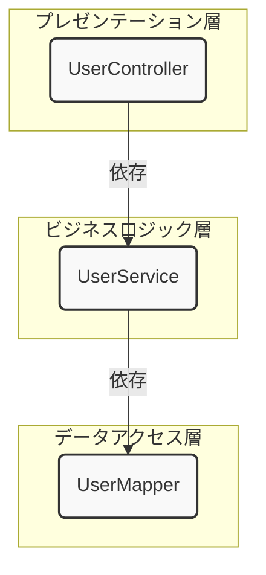

# なぜ変更に強いシステムを作るのか？
## 〜クラス分割とアーキテクチャの必然性〜

### はじめに：ソフトウェア開発の現実

私たちが作るシステムは、一度作ったら終わりではありません。リリース後には、必ず以下のような「変更」が要求されます。

*   **機能追加**: 「新しい項目をAPIに追加してほしい」
*   **仕様変更**: 「ユーザー登録のルールを少し変えたい」
*   **技術的な変更**: 「データベースを新しいものに移行したい」
*   **バグ修正**: 「特定の条件下でデータが正しく表示されない」

この避けられない「変更」に対して、柔軟に対応できるかどうかが、そのシステムの寿命と価値を決めます。変更に弱いシステムは、修正に膨大な時間がかかったり、修正したことで別の箇所にバグ（デグレード）が生まれたりして、やがて誰にも触れない「レガシーコード」となってしまいます。変更に弱いシステムとは、「1箇所を直すと別の箇所が壊れる」「修正するたびにデグレが起きる」といった状態を指します。これは“密結合”な設計によって引き起こされます。

この資料では、未来の自分たちを助ける「**変更に強い設計**」を実現するために、なぜクラスを分け、アーキテクチャというルールに従う必要があるのかを、具体例を交えて解説します。

### Step 1: もし、すべての処理を1つのクラスに書いたら？

まずは、クラス分割をしなかった場合の世界を見てみましょう。
例えば、「ユーザーIDを指定してユーザー情報を取得するAPI」を、たった一つの`UserController`クラスにすべて書いたとします。

**【アンチパターン】 GodController.java**
```java
@RestController
public class GodController {

    // DB接続情報（本来は設定ファイルに書くべき）
    private final String DB_URL = "jdbc:mysql://localhost:3306/mydb";
    private final String DB_USER = "user";
    private final String DB_PASS = "password";

    @GetMapping("/users/{id}")
    public Map<String, Object> getUser(@PathVariable("id") int id) {
        
        Connection conn = null;
        PreparedStatement stmt = null;
        ResultSet rs = null;
        Map<String, Object> userMap = new HashMap<>();

        try {
            // ① DB接続処理
            conn = DriverManager.getConnection(DB_URL, DB_USER, DB_PASS);

            // ② SQL文の準備と実行
            String sql = "SELECT id, name, email FROM users WHERE id = ?";
            stmt = conn.prepareStatement(sql);
            stmt.setInt(1, id);
            rs = stmt.executeQuery();

            // ③ 結果の詰め替え
            if (rs.next()) {
                userMap.put("userId", rs.getInt("id"));
                userMap.put("userName", rs.getString("name"));
                userMap.put("userEmail", rs.getString("email"));
            }

        } catch (SQLException e) {
            // エラー処理...
            throw new RuntimeException(e);
        } finally {
            // ④ DB切断処理
            // ... rs, stmt, conn をクローズする処理 ...
        }

        // ⑤ レスポンスの返却
        return userMap;
    }
}
```
このコードは短く、一見わかりやすいかもしれません。しかし、このコードには様々な「役割」が混在しており、変更に対して非常にもろい状態です。短くて一見わかりやすいコードほど、後から変更するときに脆さが露呈します。

*   **HTTPリクエストの受付** (`@GetMapping`)
*   **DB接続情報の管理** (`DB_URL`など)
*   **SQLの組み立てと実行** (`SELECT ...`)
*   **データ構造の変換** (ResultSet → Map)
*   **HTTPレスポンスの作成** (`return userMap;`)

#### このコードに「変更」を加えてみる

**変更要求1：「レスポンスに、年齢(`age`)も追加してほしい」**
1.  SQL文を修正 (`SELECT id, name, email, age ...`)
2.  結果の詰め替え処理を修正 (`userMap.put("userAge", ...)` )
3.  **問題点**: たった一つの変更のために、SQLとJavaのロジックという異なる種類のコードを同時に修正する必要があります。関係のないDB接続処理なども目に入り、修正箇所を探すのが大変です。

**変更要求2：「Web APIだけでなく、管理画面からも同じユーザー取得処理を使いたい」**
*   **問題点**: このロジックは「`@GetMapping("/users/{id}")`」というWeb APIの処理と密結合しているため、他の場所から簡単に再利用できません。結局、管理画面用のクラスに**似たようなコードをコピー＆ペースト**することになり、バグの温床となります。

**変更要求3：「データベースをMySQLからPostgreSQLに変えたい」**
*   **問題点**: DB接続のコードや、場合によってはSQL文法も修正する必要があり、このクラスに手を入れる必要があります。もし同じようなクラスが100個あったら、100個すべてを修正しなければなりません。

これらの問題はすべて、「**一つのクラスが多くの責任を持ちすぎている**」ことに起因します。

### Step 2: 解決策としての「クラス分割」と「アーキテクチャ」

この問題を解決するのが、「**クラス分割**」と「**アーキテクチャ**」**です。

1.  **クラス分割**: 責任（役割）ごとにクラスを分けることで、変更の影響範囲を限定する。
2.  **アーキテクチャ**: 分割したクラス間の関係性にルールを設けることで、システム全体の構造を整え、見通しを良くする。

先ほどの`GodController`を、私たちが採用する**レイヤードアーキテクチャ**に基づいて分割してみましょう。


*   `UserController`: HTTPリクエストとレスポンス**だけ**に責任を持つ。
*   `UserService`: ビジネス上のルール**だけ**に責任を持つ。（今回は単純な取得なのでロジックは少ない）
*   `UserMapper`: データベースとのやりとり**だけ**に責任を持つ。

#### 再び、「変更」を加えてみる

**変更要求1：「レスポンスに、年齢(`age`)も追加してほしい」**
1.  `UserMapper`のSQLを修正。
2.  `Entity`クラスに`age`フィールドを追加。
3.  `UserController`でレスポンスに`age`を含めるように修正。
*   **改善点**: `UserService`は一切変更する必要がありません。DB担当者とUI担当者が、それぞれ自分の責任範囲だけを修正すれば完了します。

**変更要求2：「Web APIだけでなく、管理画面からも同じユーザー取得処理を使いたい」**
1.  新しい`AdminController`を作成する。
2.  その`AdminController`から、既存の`UserService`を呼び出す。
*   **改善点**: ユーザー取得のロジックが`UserService`として独立しているため、**コードを一行もコピーすることなく再利用できます。** これにより、将来ロジックに修正が入っても、`UserService`を直すだけで全ての呼び出し元に修正が反映されます。

**変更要求3：「データベースをMySQLからPostgreSQLに変えたい」**
1.  DB接続設定を変更する。
2.  もしSQLの修正が必要なら、`UserMapper`だけを修正する。
*   **改善点**: **`UserController`と`UserService`は、データベースが何であるかを全く知りません。** そのため、データアクセス層の変更が、アプリケーションの他の部分に影響を与えることはありません。

**また、責任を分けたことで、単体テストも簡単になります。**  
例：`UserService`を単体でテストできるようになり、DBを使わないテスト（モック）も可能です。

### まとめ：なぜ私たちは設計するのか

| 設計手法 | 目的 | 具体的な効果 |
| :--- | :--- | :--- |
| **クラス分割** | **責任の分離** | 変更箇所が限定され、修正が容易になる。コードが読みやすくなる。 |
| **アーキテクチャ** | **依存関係の整理** | 再利用性が高まり、柔軟な機能追加が可能になる。システム全体の構造が堅牢になる。 |

「変更に強いシステム」とは、「**変更の影響範囲が、その変更内容に直接関係するクラスだけに限定されるシステム**」と言い換えることができます。

一見、クラスを分けることは遠回りに見えるかもしれません。しかし、この最初の「ひと手間」が、将来発生するであろう数々の変更作業から私たちを救ってくれます。これは、未来の開発を楽にするための、最も効果的な「**投資**」なのです。