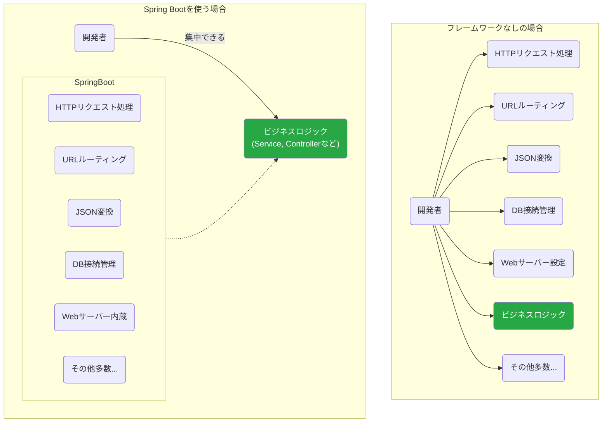
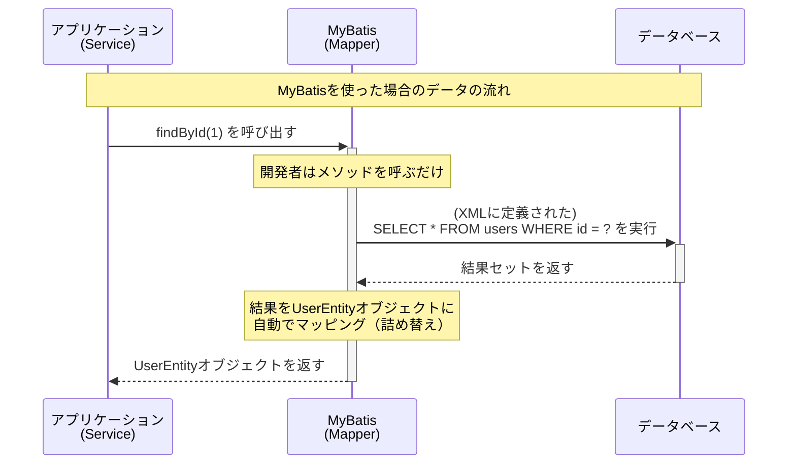

# フレームワークとO/Rマッパーの役割

Web APIを開発するにあたり、私たちは**Spring Boot**という「フレームワーク」と、**MyBatis**という「O/Rマッパー」を利用します。これらは現代のJava開発において広く使われているツールです。

この資料では、これらが一体何者で、なぜ使う必要があるのかを解説します。これらのツールは、私たちが本当に集中すべき「アプリケーションの価値」を生み出すための、強力なサポーターです。

## 1. フレームワークとは？ 〜開発の「骨組み」と「ルール」〜

家を建てる時、多くの場合は設計図があり、基礎工事が済んだ土地に、規格化された建材を使って建てていきます。ゼロから木を切り出し、釘を作って家を建てる人はいません。

プログラミングにおける**フレームワーク (Framework)** とは、この**「設計図」や「基礎工事」**にあたるものです。アプリケーションを開発する上で必要となる基本的な機能や構造（骨組み）をあらかじめ提供してくれます。

私たちは、その骨組みの上で、本当に作りたい部分（家具を置いたり、壁紙を貼ったりするような部分）のプログラミングに集中できます。

### Spring Boot：すぐに走り出せる高性能な骨組み

**Spring Boot**は、Javaで広く使われている「Spring Framework」を、より簡単かつ迅速に使えるようにしたフレームワークです。

**もしフレームワークがなかったら…**
Web APIを作るためには、以下のようなことを全て自分で実装または設定する必要があります。
*   HTTPリクエストを受け付けるためのWebサーバーの起動と設定
*   特定のURLとプログラムの処理を紐付ける仕組み
*   受け取ったJSONデータをJavaオブジェクトに変換する処理
*   データベース接続の管理
*   その他、セキュリティ対策など膨大な数の機能

**Spring Bootを使うと…**
これらの面倒な定型処理のほとんどを、Spring Bootが自動的に設定し、肩代わりしてくれます。

Spring Bootという強力な土台があるおかげで、私たちはビジネスロジックの実装という、アプリケーションの**本質的な価値**を生み出す作業に集中できるのです。

## 2. O/Rマッパーとは？ 〜Javaとデータベースの「翻訳家」〜

Javaのプログラムは「オブジェクト」という単位でデータを扱いますが、リレーショナルデータベースは「テーブル（表）」という形式でデータを管理します。この両者のデータ構造の考え方の違いは**「インピーダンスミスマッチ」**と呼ばれ、プログラマが手作業で変換するには手間がかかり、バグを生みやすい部分でした。

**O/Rマッパー (Object-Relational Mapper)** は、このギャップを埋め、Javaのオブジェクトとデータベースのテーブルを自動的に対応付け（マッピング）してくれるツールです。まるで、優秀な**「翻訳家」**のように振る舞います。

### MyBatis：SQLの力を最大限に活かす翻訳家

**MyBatis**は、数あるO/Rマッパーの中でも、特にSQLを自分で書きたい開発者に人気のあるライブラリです。

**もしO/Rマッパーがなかったら… (JDBCプログラミング)**
データベースからデータを取得するためには、以下のような定型的なコードを毎回書く必要があります。

1.  データベースに接続する
2.  SQL文（ただの文字列）を用意する
3.  SQLを実行する
4.  実行結果（ResultSet）を一行ずつループで取り出す
5.  取り出した各列のデータを、Javaオブジェクトのフィールドに手動で一つずつセットする
6.  データベースとの接続を閉じる（リソース解放）

この方法はコードが長くなり、ほんの少しカラムが増えただけでも修正箇所が多く、非常に面倒です。

**MyBatisを使うと…**
これらの定型処理をすべてMyBatisが裏側で実行してくれます。開発者がやるべきことは、主に以下の2つだけです。

1.  **Mapperインターフェース**に、実行したい処理のメソッドを定義する。（例：`User findById(int id);`）
2.  **XMLファイル**に、そのメソッドに対応するSQL文を書く。

MyBatisが「接続」「実行」「データ詰め替え」「切断」といった面倒な作業をすべて隠蔽してくれるおかげで、アプリケーションのコードは非常にシンプルになり、開発者はSQLそのものとビジネスロジックに集中できます。

## 3. まとめ

-   **Spring Boot (フレームワーク)**
    -   アプリケーションの**骨組み**を提供し、面倒な定型処理や設定を自動化してくれる。
    -   私たちは、決められた**ルール** (`@Controller`など) に従って部品を作るだけでよい。

-   **MyBatis (O/Rマッパー)**
    -   Javaオブジェクトとデータベースのテーブルの間の**翻訳**をしてくれる。
    -   退屈なDB連携コードをなくし、SQLの記述に集中させてくれる。

これらのツールを使いこなすことは、変更に強く、生産性の高い開発を行うための基本スキルです。まずは「お作法」として受け入れ、その便利さを実感しながら学習を進めていきましょう。