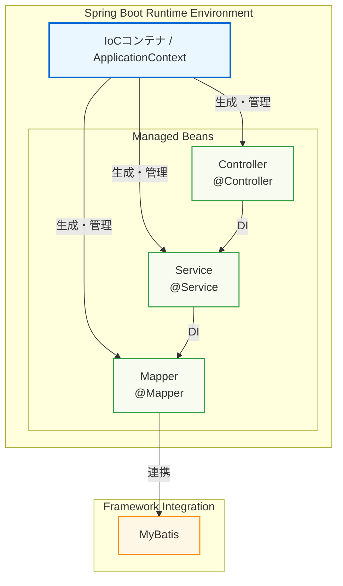
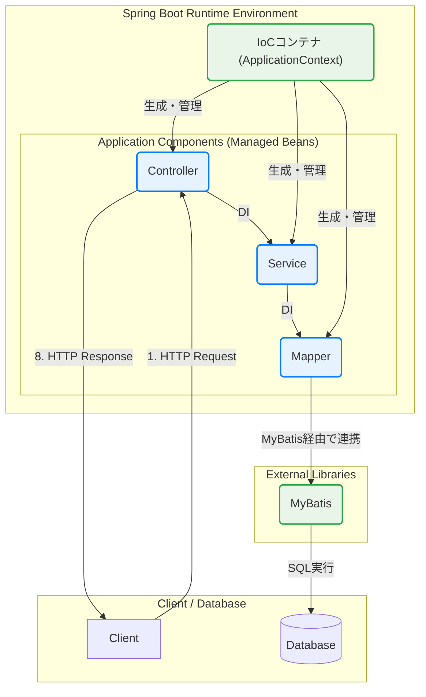
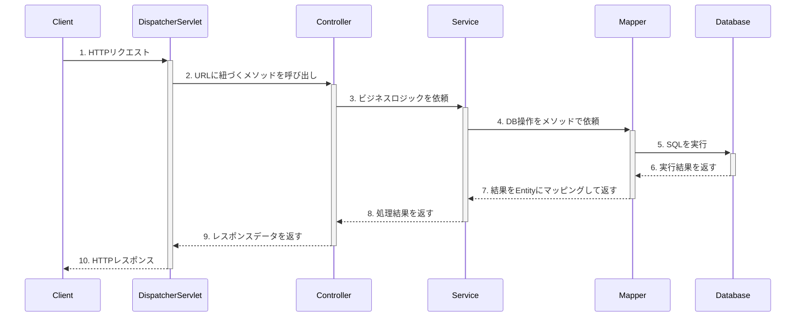
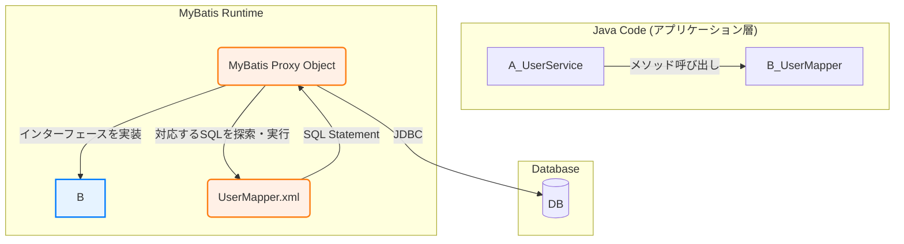
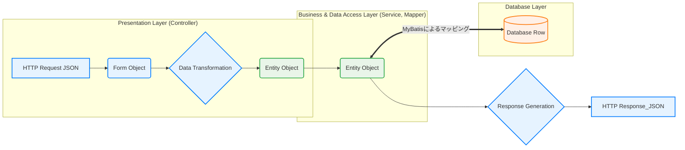

## Spring BootとMyBatisにおけるコンポーネント関係図

この資料は、Spring Bootアプリケーションの内部で、各コンポーネント（Controller, Service, Mapperなど）やフレームワークが、どのように連携して動作するのか、その技術的な関係性を示したものです。

### 1. 全体アーキテクチャと制御の流れ

アプリケーション全体の構造は、Spring Bootの**IoCコンテナ**を中心に構成されます。IoCコンテナが各コンポーネント（Bean）の生成と管理を行い、必要に応じてそれらを結合（依存性の注入）します。

-   **IoCコンテナ (Inversion of Control Container)**:
    -   アプリケーションの骨格となる中心的な存在。
    -   `@Controller`, `@Service`, `@Component`などのアノテーションが付いたクラスのインスタンス（**Bean**）を、起動時に自動で生成し、管理します。
-   **依存性の注入 (Dependency Injection - DI)**:
    -   あるコンポーネントが別のコンポーネントを必要とする場合（例：ControllerがServiceを利用する）、IoCコンテナが適切なBeanを自動的に割り当てます。開発者は`new`を使ってインスタンスを生成する必要がありません。

### 2. リクエスト処理のシーケンス図

クライアントからリクエストが送られてから、レスポンスが返されるまでの一連の流れです。各コンポーネントは、上位層から下位層へと一方向に処理を依頼します。

### 3. MyBatisの役割とMapperの動作原理

`Mapper`はJavaの`interface`（インターフェース）として定義しますが、その実装クラスを開発者が書くことはありません。MyBatisがアプリケーション起動時に、このインターフェースを実装したプロキシ（代理）オブジェクトを動的に生成し、IoCコンテナにBeanとして登録します。

-   `Mapper`インターフェースのメソッドが呼び出されると、プロキシオブジェクトがその呼び出しを検知します。
-   プロキシは、メソッド名に対応するSQL文をXMLファイルから探し出し、引数をSQLのパラメータに設定して実行します。

### 4. データオブジェクトの変換フロー

各層で扱われるデータオブジェクト（DTO）は、その層の責務に応じて定義されます。層をまたぐ際には、責務に応じたオブジェクトへの変換が行われます。

-   **Form**: プレゼンテーション層の責務。クライアントからの入力形式とバリデーションルールを定義します。
-   **Entity**: データアクセス層の責務。データベースのテーブル構造を忠実に反映します。

