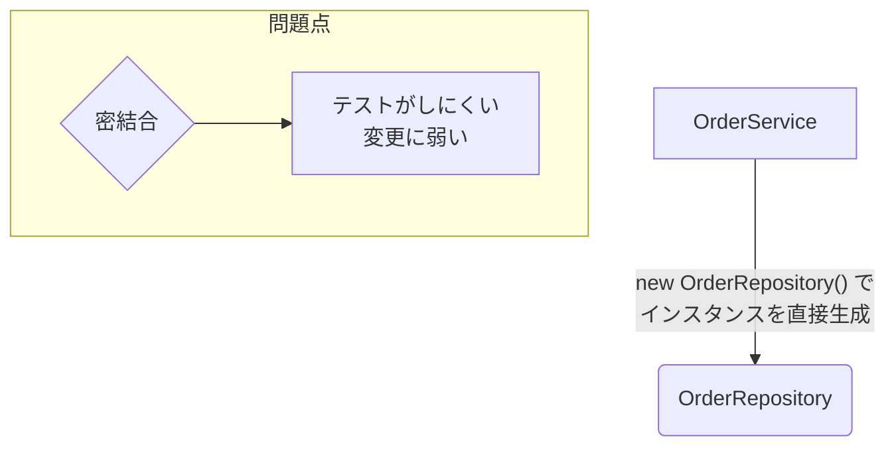
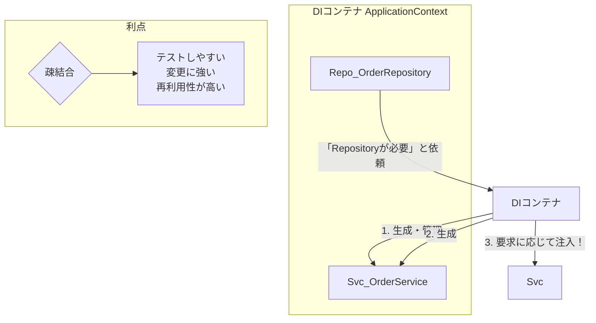
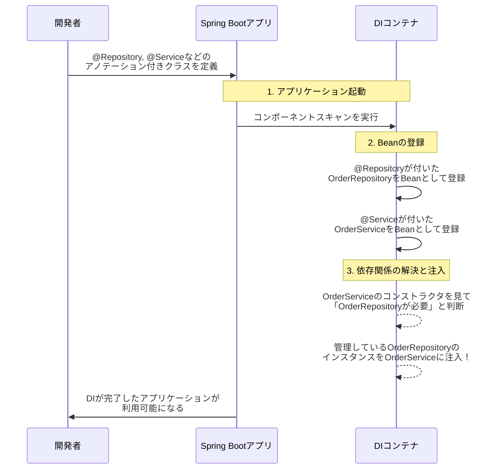

はい、承知いたしました。Mermaidで図を作成し、依存性注入（DI）の概念をより視覚的で分かりやすく資料にまとめます。

---

## Spring Bootにおける依存性注入（Dependency Injection）のご紹介【図解あり】

### 1. 依存性注入（DI）とは？

依存性注入（DI）は、クラス間の依存関係をプログラムのコード内（クラス内部）で直接解決するのではなく、**外部の仕組み（DIコンテナ）によって設定（注入）する**設計手法です。これにより、クラス同士が緩やかにつながる**「疎結合」**な設計を実現でき、柔軟でテストしやすいアプリケーションを構築できます。

#### a. DIがない場合の問題点（密結合）

DIがない場合、あるクラス（`OrderService`）は、自身が必要とする別のクラス（`OrderRepository`）のインスタンスを内部で直接生成します。これにより、両者は強く結びついてしまいます（**密結合**）。



*   **変更に弱い:** `OrderRepository`の実装を差し替えるには、`OrderService`のコードを修正する必要があります。
*   **テストがしにくい:** `OrderService`だけをテストしたいのに、本物の`OrderRepository`も一緒に動作してしまいます。

---

### 2. DIがある場合の仕組み（疎結合）

DIを利用する場合、**DIコンテナ**（Springでは`ApplicationContext`）が仲介役となります。DIコンテナがすべてのオブジェクト（Bean）の生成と管理を一手に引き受け、必要な場所へ適切なオブジェクトを「注入」します。

`OrderService`はもはや`OrderRepository`を直接知る必要がなくなり、DIコンテナに「`OrderRepository`を使いたいです」と依頼するだけになります。



`OrderService`と`OrderRepository`は直接的な関係がなくなり、DIコンテナを介して連携する**「疎結合」**な関係になります。

---

### 3. Spring BootにおけるDIのプロセス

Spring Bootでは、開発者がアノテーション（`@Service`, `@Repository`など）を付けるだけで、DIコンテナが自動的に依存関係を解決してくれます。その流れを時系列で見てみましょう。



### 4. Spring BootでのDIの実現方法（コード例）

図で示したプロセスは、コード上では非常にシンプルに記述できます。

#### Step 1: Beanとしてコンテナに登録する
DIコンテナに管理してもらいたいクラスに、役割を示すアノテーションを付与します。

```java
import org.springframework.stereotype.Repository;

@Repository // このクラスをBeanとしてDIコンテナに登録する
public class OrderRepository {
    public void save(Order order) {
        // ... データベースへの保存処理 ...
        System.out.println("注文を保存しました。");
    }
}
```

#### Step 2: Beanを注入して利用する（コンストラクタインジェクション）
Beanを利用したいクラスのコンストラクタで、必要なBeanを引数として受け取ります。Spring Bootがこれを見て、適切なBeanを自動で注入してくれます。

```java
import org.springframework.stereotype.Service;

@Service // このクラスもBeanとして登録し、依存性の注入対象とする
public class OrderService {

    // 注入されるインスタンスを保持するフィールド (finalにするのが推奨)
    private final OrderRepository orderRepository;

    // コンストラクタで依存オブジェクトを受け取る
    // DIコンテナが、管理しているOrderRepositoryのBeanをここに渡してくれる
    public OrderService(OrderRepository orderRepository) {
        this.orderRepository = orderRepository;
    }

    public void processOrder(Order order) {
        // 注入されたorderRepositoryのメソッドを呼び出す
        orderRepository.save(order);
    }
}
```

このように、開発者は「どのクラスが必要か」を宣言するだけでよく、インスタンスの生成や管理といった複雑な処理はすべてSpring BootのDIコンテナに任せることができます。

![[Pasted image 20251112000618.png]]